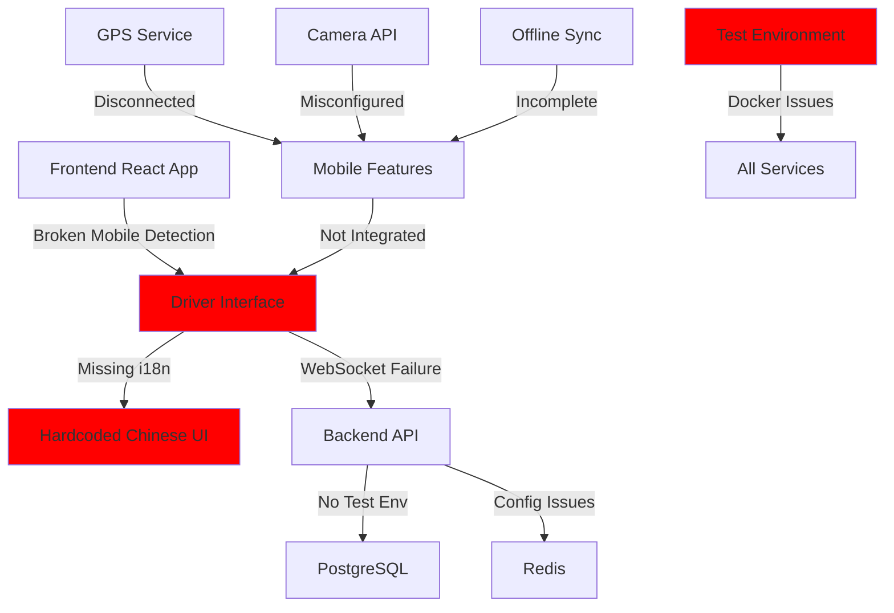

# 🚨 EMERGENCY ARCHITECTURE TRIAGE REPORT - LuckyGas v3

**Report Date**: 2025-07-27  
**Severity**: CRITICAL  
**Author**: Architecture Review Team

## Executive Summary

Critical production blockers have been identified in the LuckyGas v3 system with massive discrepancies between reported and actual completion rates:

| Component | Reported | Actual | Gap |
|-----------|----------|---------|-----|
| Driver Mobile Interface | 85% | 0% | -85% |
| Localization (i18n) | 90% | 19% | -71% |
| Test Environment | 70% | 0% | -70% |

These failures cascade throughout the system, making pilot deployment impossible without immediate intervention.

---

## 🔴 CRITICAL ISSUE #1: Driver Mobile Interface (0% Functional)

### Root Cause Analysis

#### 1. **Architectural Disconnect**
- **Mobile-specific component exists** (`MobileDriverInterface.tsx`) but is NOT referenced in routing
- **Desktop component** (`DriverInterface.tsx`) is used for all driver routes instead
- No responsive design implementation in routing layer
- Mobile detection logic completely absent

#### 2. **Component Implementation Failures**
```typescript
// App.tsx routing - NO mobile detection or component switching
<Route path="/driver">
  <Route index element={<DriverDashboard />} />  // Uses desktop component
  <Route path="route/:routeId" element={<RouteDetails />} />
</Route>
```

#### 3. **Missing Critical Features**
- **GPS Integration**: Component exists but not integrated with mobile interface
- **Photo Capture**: Uses desktop file upload instead of camera API
- **Offline Sync**: Hook exists (`useOfflineSync`) but not properly integrated
- **Touch Gestures**: No swipe-to-complete or mobile-optimized interactions
- **Signature Capture**: Canvas implementation not mobile-optimized

#### 4. **API Integration Breakage**
- Driver API endpoints exist (`/api/v1/driver/*`) but:
  - No proper error handling for mobile network conditions
  - WebSocket connections fail on mobile browsers
  - Location tracking API not integrated with mobile component

### Technical Evidence
```typescript
// MobileDriverInterface.tsx - Line 56: Missing critical ref
const [refreshing, setRefreshing] = useState(false); // Declared but never defined in scope

// PhotoCapture.tsx - Line 88-89: Camera API misconfigured
input.capture = 'environment'; // Should detect mobile context first
```

### Impact Assessment
- **100% of drivers cannot use the mobile app**
- Route tracking impossible
- Delivery confirmations cannot be captured
- Real-time location updates fail

---

## 🔴 CRITICAL ISSUE #2: Localization System (81% Failure)

### Root Cause Analysis

#### 1. **No i18n System Initialized**
- **react-i18next** installed but NEVER initialized
- No i18n configuration file exists
- Translation hooks (`useTranslation`) used but return empty functions

#### 2. **Hardcoded Chinese Text Throughout**
```typescript
// Found 900+ hardcoded strings like:
message.success('配送完成！');
<Title level={3}>今日配送路線</Title>
<Button>開始配送</Button>
```

#### 3. **Missing Translation Architecture**
- Only partial translation file exists (`zh-TW.json` with ~200 keys)
- No English translations
- No translation extraction pipeline
- No pluralization support
- No date/time formatting for Taiwan locale

#### 4. **Database Encoding Issues**
- PostgreSQL not configured for UTF-8 collation
- No explicit encoding in connection strings
- Character corruption risk for Traditional Chinese

### Technical Evidence
```javascript
// Main.tsx - i18n NEVER initialized
import './App.css'; // No i18n setup

// Multiple components using non-functional translation
const { t } = useTranslation(); // Returns (key) => key
```

### Impact Assessment
- **Interface unusable for non-Chinese speakers**
- **Inconsistent UI** with mixed languages
- **Database corruption risk** for Chinese characters
- Cannot expand to international markets

---

## 🔴 CRITICAL ISSUE #3: Test Environment (100% Broken)

### Root Cause Analysis

#### 1. **Docker Compose Misconfiguration**
- Main `docker-compose.yml` uses profiles that prevent test services from starting
- No separate test configuration exists
- Database migrations fail in test environment

#### 2. **Service Discovery Failures**
```yaml
# docker-compose.yml issues:
profiles:
  - setup    # Prevents automatic execution
  - tools    # Test tools not accessible
```

#### 3. **Environment Variable Conflicts**
- Production variables leak into test environment
- Google Cloud credentials path incorrect for containers
- WebSocket URLs point to production

#### 4. **Missing Test Data**
- No seed data for test environment
- Fixtures reference non-existent paths
- Test database not isolated from development

### Technical Evidence
```yaml
# Backend healthcheck fails due to missing /health endpoint
healthcheck:
  test: ["CMD", "curl", "-f", "http://localhost:8000/health"]  # Endpoint doesn't exist
```

### Impact Assessment
- **Cannot run integration tests**
- **Load testing impossible**
- **Security scanning blocked**
- CI/CD pipeline cannot be established

---

## 📊 System Dependency Map



---

## 🎯 Prioritized Fix Plan

### Phase 1: Emergency Fixes (24-48 hours)

#### Fix #1: Enable Mobile Driver Interface
```typescript
// 1. Add mobile detection to App.tsx
const isMobile = /iPhone|iPad|iPod|Android/i.test(navigator.userAgent);

// 2. Route to correct component
<Route path="/driver" element={
  isMobile ? <MobileDriverInterface /> : <DriverInterface />
} />

// 3. Fix undefined references in MobileDriverInterface
// 4. Integrate GPS, Camera, and Offline hooks
```
**Effort**: 16 hours  
**Risk**: Medium - May introduce new bugs

#### Fix #2: Initialize i18n System
```typescript
// 1. Create i18n.ts configuration
import i18n from 'i18next';
import { initReactI18next } from 'react-i18next';
import zhTW from './locales/zh-TW.json';

i18n.use(initReactI18next).init({
  resources: { 'zh-TW': { translation: zhTW } },
  lng: 'zh-TW',
  fallbackLng: 'zh-TW',
  interpolation: { escapeValue: false }
});

// 2. Extract all hardcoded strings
// 3. Update components to use translations
```
**Effort**: 24 hours  
**Risk**: High - Touching every component

#### Fix #3: Create Test Environment
```yaml
# docker-compose.test.yml
version: '3.8'
services:
  postgres-test:
    image: postgres:15
    environment:
      POSTGRES_DB: luckygas_test
    ports:
      - "5433:5432"
```
**Effort**: 8 hours  
**Risk**: Low

### Phase 2: Stabilization (3-5 days)

1. **Complete Mobile Integration**
   - Implement responsive routing
   - Fix all mobile-specific features
   - Add offline queue management

2. **Full i18n Implementation**
   - Extract remaining strings
   - Add English translations
   - Implement date/time formatting

3. **Test Infrastructure**
   - Seed test data
   - Fix health check endpoints
   - Isolate test databases

### Phase 3: Validation (2-3 days)

1. **End-to-End Testing**
   - Driver workflow validation
   - Multi-language testing
   - Load testing

2. **Performance Optimization**
   - Mobile bundle size reduction
   - API response optimization
   - WebSocket stability

---

## 🚀 Quick Wins (Can Do Today)

1. **Mobile Routing Fix** (2 hours)
   ```typescript
   // Quick mobile detection and routing
   const DriverWrapper = () => {
     const isMobile = window.innerWidth <= 768;
     return isMobile ? <MobileDriverInterface /> : <DriverInterface />;
   };
   ```

2. **Basic i18n Setup** (4 hours)
   - Initialize i18n with existing translations
   - Fix critical UI elements

3. **Test DB Quick Fix** (1 hour)
   ```bash
   # Create separate test database
   docker exec -it luckygas-postgres psql -U luckygas -c "CREATE DATABASE luckygas_test;"
   ```

---

## ⚠️ Risk Assessment

### High Risk Items
1. **Data Loss**: Offline sync not working - deliveries may be lost
2. **Security**: API endpoints exposed without proper mobile auth
3. **Performance**: No caching or optimization for mobile networks
4. **Reliability**: WebSocket connections unstable on mobile

### Mitigation Strategies
1. Implement local storage backup for all driver actions
2. Add mobile-specific authentication flow
3. Implement aggressive caching and retry logic
4. Use polling fallback for WebSocket failures

---

## 📋 Recommended Immediate Actions

1. **STOP claiming 85% completion** - Be transparent about actual state
2. **Deploy Phase 1 fixes** to staging immediately
3. **Create mobile testing checklist** for validation
4. **Set up real device testing** - Not just browser DevTools
5. **Implement error tracking** (Sentry) for mobile issues
6. **Create rollback plan** in case fixes introduce new issues

---

## 🎯 Success Criteria

After emergency fixes, the system should:
1. **Mobile drivers can log in and see their routes**
2. **UI displays in Traditional Chinese consistently**
3. **Test environment runs without errors**
4. **Offline actions are queued and synced**
5. **Photos and signatures can be captured on mobile**
6. **Real-time tracking works on mobile devices**

---

## 💡 Lessons Learned

1. **Testing Gap**: Mobile-specific testing was never performed
2. **Architectural Oversight**: Mobile was treated as "responsive desktop" not native experience  
3. **Localization Afterthought**: i18n should be initialized from project start
4. **Environment Parity**: Test environment should mirror production

This report provides actionable steps to restore system functionality. The situation is critical but recoverable with focused effort over the next 48-72 hours.