# 🚀 LuckyGas Launch Control Dashboard

**Status**: 🔵 PRE-LAUNCH  
**Last Updated**: 2025-01-29 00:00:00 TST  
**Launch Coordinator**: [Name]  
**Emergency Contact**: [Phone]

---

## 🎯 System Readiness Checklist

### Infrastructure
- [ ] ⏳ Kubernetes cluster scaled (target: 10 nodes)
- [ ] ⏳ Load balancers configured
- [ ] ⏳ CDN cache cleared
- [ ] ⏳ SSL certificates valid (expires: TBD)
- [ ] ⏳ DNS propagation complete

### Database
- [ ] ⏳ Production backup completed
- [ ] ⏳ Migration scripts tested
- [ ] ⏳ 預定配送日期 field validated
- [ ] ⏳ Connection pool configured
- [ ] ⏳ Read replicas synced

### Application
- [ ] ⏳ Backend health check passing
- [ ] ⏳ Frontend build optimized
- [ ] ⏳ Environment variables set
- [ ] ⏳ Feature flags configured
- [ ] ⏳ API keys validated

### External Services
- [ ] ⏳ Google Maps API active
- [ ] ⏳ SMS gateway connected
- [ ] ⏳ Email service verified
- [ ] ⏳ Payment gateway ready
- [ ] ⏳ Analytics tracking enabled

### Monitoring
- [ ] ⏳ Prometheus scraping
- [ ] ⏳ Grafana dashboards loaded
- [ ] ⏳ PagerDuty configured
- [ ] ⏳ Log aggregation active
- [ ] ⏳ Alerts configured

---

## 📊 Current Deployment Stage

```mermaid
graph LR
    A[Pre-Launch] -->|Ready| B[Data Migration]
    B -->|Complete| C[Blue Deployment]
    C -->|Healthy| D[Traffic Migration]
    D -->|5%| E[25%]
    E -->|1hr| F[50%]
    F -->|2hr| G[100%]
    G -->|Success| H[Production]
    
    style A fill:#3498db
    style B fill:#95a5a6
    style C fill:#95a5a6
    style D fill:#95a5a6
    style E fill:#95a5a6
    style F fill:#95a5a6
    style G fill:#95a5a6
    style H fill:#95a5a6
```



**Current Stage**: Pre-Launch Validation  
**Next Stage**: Data Migration (ETA: T-0)

---

## 📈 Live Metrics from Staging

| Metric | Current | Target | Status |
|--------|---------|--------|--------|
| Response Time (p95) | -- ms | < 200ms | ⏳ |
| Error Rate | --% | < 1% | ⏳ |
| Requests/sec | -- | 1000+ | ⏳ |
| CPU Usage | --% | < 70% | ⏳ |
| Memory Usage | --% | < 80% | ⏳ |
| Active Users | -- | -- | ⏳ |

**Last Refresh**: Not started

---

## 🚦 Go/No-Go Decision Criteria

### 🟢 GO Criteria (All must be met)
- [ ] All E2E tests passing (100+ scenarios)
- [ ] Error rate < 1% on staging
- [ ] Response time < 2s under load
- [ ] All external services connected
- [ ] Rollback tested successfully
- [ ] Team fully staffed
- [ ] No P1/P2 incidents in last 24h

### 🔴 NO-GO Criteria (Any triggers abort)
- [ ] Critical security vulnerability
- [ ] Database migration failures
- [ ] External service outage
- [ ] Team availability issues
- [ ] Infrastructure problems
- [ ] Rollback mechanism failure

**Decision Status**: ⏳ PENDING  
**Decision Time**: T-1 Hour  
**Decision Maker**: [CTO Name]

---

## 🔄 Rollback Readiness

| Component | Rollback Ready | Time to Rollback | Test Status |
|-----------|----------------|------------------|-------------|
| Database | ⏳ | < 30 sec | Not Tested |
| Backend | ⏳ | < 1 min | Not Tested |
| Frontend | ⏳ | < 30 sec | Not Tested |
| Traffic | ⏳ | < 10 sec | Not Tested |
| **Total** | **⏳** | **< 2 min** | **Not Tested** |

**Rollback Script**: `./deploy/rollback.sh`  
**Last Tested**: Never  
**Test Result**: N/A

---

## 📡 Traffic Migration Status

### Current Traffic Distribution
```
Production (Blue):  100% ████████████████████
Canary (Green):       0% 
```

### Migration Schedule
| Phase | Traffic | Duration | Start Time | Status |
|-------|---------|----------|------------|--------|
| Phase 1 | 5% | 30 min | T+0 | ⏳ Pending |
| Phase 2 | 25% | 60 min | T+30min | ⏳ Pending |
| Phase 3 | 50% | 120 min | T+90min | ⏳ Pending |
| Phase 4 | 100% | ∞ | T+210min | ⏳ Pending |

---

## 🚨 Active Alerts

| Severity | Alert | Time | Assignee | Status |
|----------|-------|------|----------|--------|
| - | No active alerts | - | - | ✅ |

---

## 📝 Launch Log

| Time | Event | Status | Notes |
|------|-------|--------|-------|
| -- | Launch sequence not started | -- | Awaiting initiation |

---

## 🏃 Team Status

| Role | Primary | Status | Location |
|------|---------|--------|----------|
| Launch Commander | [Name] | ⏳ Standby | Remote |
| Backend Lead | [Name] | ⏳ Standby | Remote |
| Frontend Lead | [Name] | ⏳ Standby | Remote |
| Database Admin | [Name] | ⏳ Standby | Remote |
| DevOps Lead | [Name] | ⏳ Standby | Remote |
| QA Lead | [Name] | ⏳ Standby | Remote |
| Security Lead | [Name] | ⏳ Standby | Remote |

**War Room**: [Slack #luckygas-launch](https://luckygas.slack.com/channels/luckygas-launch)  
**Video Bridge**: [Google Meet](https://meet.google.com/luckygas-launch)

---

## 🔗 Quick Links

### Monitoring
- [Grafana Dashboard](https://grafana.luckygas.com.tw/d/luckygas-overview)
- [Prometheus](https://prometheus.luckygas.com.tw)
- [Application Logs](https://console.cloud.google.com/logs)
- [Status Page](https://status.luckygas.com.tw)

### Documentation
- [Launch Runbook](./LAUNCH_DAY_RUNBOOK.md)
- [Rollback Procedures](./ROLLBACK_PROCEDURES.md)
- [Incident Response](./INCIDENT_RESPONSE.md)
- [Architecture Docs](./PLANNING.md)

### Tools
- [Kubernetes Dashboard](https://k8s.luckygas.com.tw)
- [Google Cloud Console](https://console.cloud.google.com)
- [PagerDuty](https://luckygas.pagerduty.com)
- [GitHub Repo](https://github.com/luckygas/luckygas-v3)

---

## ⚡ Emergency Procedures

### Abort Launch
```bash
# Stop launch sequence
Ctrl+C on launch terminal

# Revert any changes
./deploy/rollback.sh --full
```

### Emergency Contacts
1. **On-Call**: PagerDuty
2. **Team Lead**: [Phone]
3. **CTO**: [Phone]
4. **Google Cloud Support**: [Case #]

### War Room Protocol
1. All hands join Slack #luckygas-launch
2. Launch Commander takes control
3. Follow INCIDENT_RESPONSE.md procedures
4. No side conversations
5. Document everything

---

**Auto-refresh**: This dashboard should be refreshed every 60 seconds during launch  
**Manual refresh**: `./scripts/update-launch-dashboard.sh`

---

🍀 **Good luck! You've prepared well. Trust the process.** 🍀