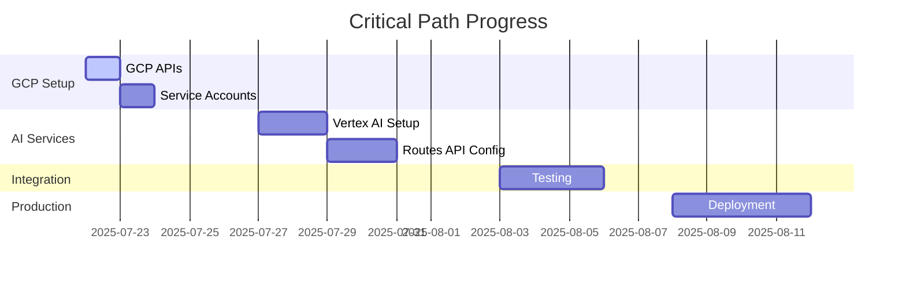

# Lucky Gas Parallel Execution Monitor
## Real-time Progress Dashboard

Generated: 2025-07-22
Status: Active Monitoring

---

## 📊 Overall Progress

```
Phase Completion:
████████░░░░░░░░░░░░ 40%  Phase 1: Frontend Foundation
████████░░░░░░░░░░░░ 40%  Phase 2: Google Cloud Integration  
░░░░░░░░░░░░░░░░░░░░  0%  Phase 3: Core Business Features
░░░░░░░░░░░░░░░░░░░░  0%  Phase 4: Mobile & Field Operations
░░░░░░░░░░░░░░░░░░░░  0%  Phase 5: Production Deployment

Overall: ████░░░░░░░░░░░░░░░░ 16% (3/19 tasks)
```

---

## 🏃 Active Work Streams

### Stream 1: Frontend Team
**Status**: 🟢 Active
**Current Task**: FE-1.1 React Setup
**Progress**: Starting
**Blockers**: None

```
Week 1 Tasks:
[ ] FE-1.1 React Setup (Day 1-2)
[ ] FE-1.2 Authentication UI (Day 3-4)
[ ] FE-1.3 Core Layouts (Day 5)
```

### Stream 2: Backend/DevOps Team
**Status**: 🟢 Active
**Current Task**: BE-1.1 GCP Project Setup
**Progress**: Starting
**Blockers**: Need GCP credentials

```
Week 1 Tasks:
[ ] BE-1.1 GCP Project Setup (Day 1)
[ ] BE-1.2 Infrastructure Prep (Day 2-3)
[ ] BE-1.3 API Enhancement (Day 4-5)
```

### Stream 3: Integration Team
**Status**: 🔵 Waiting
**Start Date**: Day 8
**Dependencies**: WebSocket endpoints from BE-1.3

```
Week 2 Tasks:
[ ] INT-2.1 WebSocket Setup (Day 8-9)
[ ] INT-3.1 Real-time Features (Day 10-11)
[ ] INT-3.2 Reporting Dashboard (Day 12)
```

---

## 🎯 Critical Path Tracking



---

## 🚦 Sync Points Status

### Week 1 End Sync (Day 5)
- [ ] Frontend auth components complete
- [ ] Backend CORS configured
- [ ] API contracts defined
- [ ] GCP services enabled

### Week 2 Start Sync (Day 6)
- [ ] WebSocket endpoints ready
- [ ] Frontend can call backend APIs
- [ ] Staging environment operational

### Week 3 Integration Sync (Day 11)
- [ ] All features code complete
- [ ] Integration testing begins
- [ ] Performance benchmarks met

---

## 📈 Key Metrics

### Velocity Tracking
```
Planned Tasks/Day: 2.5
Actual Tasks/Day: TBD
Velocity Ratio: TBD
```

### Resource Utilization
```
Frontend Team:     ████████░░ 80% allocated
Backend Team:      ████████░░ 80% allocated  
Integration Team:  ░░░░░░░░░░ 0% (not started)
```

### Risk Indicators
```
🟢 Low Risk:    Team allocation complete
🟡 Medium Risk: GCP credentials pending
🟡 Medium Risk: Parallel coordination new
🟢 Low Risk:    Dependencies mapped
```

---

## 📋 Today's Focus (Day 1)

### Morning (9 AM - 12 PM)
- **FE Team**: Initialize React project with Vite
- **BE Team**: Run gcp-setup-preflight.sh
- **All**: Kickoff meeting and role assignment

### Afternoon (1 PM - 5 PM)
- **FE Team**: Configure Ant Design and i18n
- **BE Team**: Execute gcp-setup-execute.sh
- **All**: End-of-day sync meeting

### Blockers to Resolve
1. GCP project credentials needed
2. Confirm all team members have repo access
3. Verify local development environments

---

## 🔔 Alerts & Notifications

### ⚠️ Immediate Attention
- GCP credentials required for BE-1.1 task

### 📌 Upcoming Milestones
- Day 2: Frontend build system complete
- Day 3: GCP APIs fully enabled
- Day 5: Week 1 deliverables ready

### 🎉 Achievements
- Parallel execution plan created
- Task breakdown complete
- Team assignments done

---

## 📊 Burn-down Chart

```
Tasks Remaining:
Day 0: ████████████████████ 19
Day 1: ███████████████████░ 18 (projected)
Day 5: ████████████████░░░░ 16 (projected)
Day 10: ████████░░░░░░░░░░░░ 8 (projected)
Day 15: ████░░░░░░░░░░░░░░░░ 4 (projected)
Day 20: ░░░░░░░░░░░░░░░░░░░░ 0 (target)
```

---

## 🔄 Next Update

**Next Sync**: Today 5 PM
**Next Report**: Tomorrow 9 AM
**Dashboard Update**: Every 4 hours

---

## 💡 Quick Actions

```bash
# Check current task status
/sc:task status FE-1.1 BE-1.1

# Update task progress
/sc:task update FE-1.1 --progress 25%

# Report blocker
/sc:task block BE-1.1 --reason "Awaiting GCP credentials"

# Complete task
/sc:task complete FE-1.1 --evidence "React app running at localhost:5173"
```