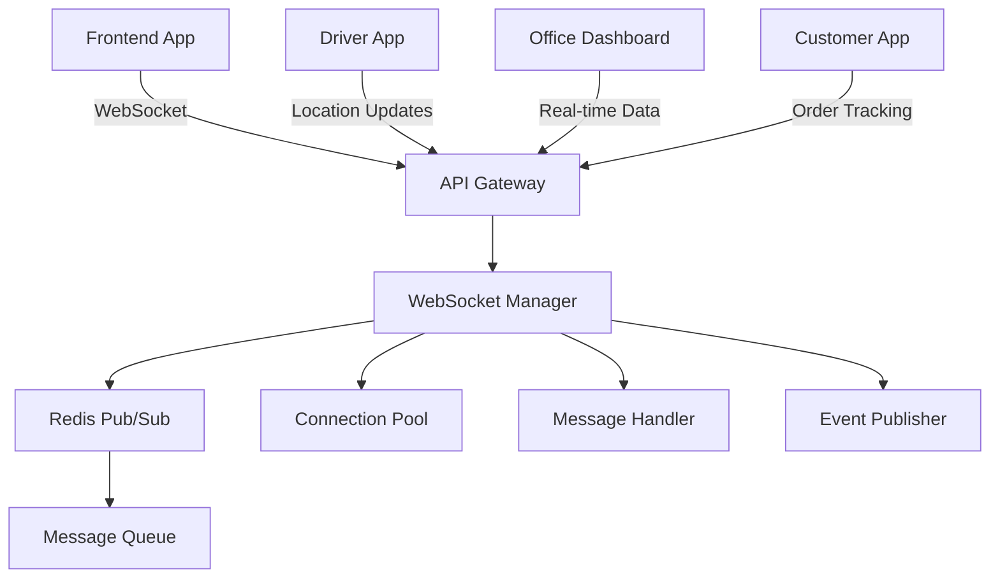

# 🔌 Lucky Gas WebSocket Real-time Features Guide

## 📋 Overview

Lucky Gas uses WebSocket connections for real-time features including order tracking, driver location updates, and instant notifications.

## 🏗️ Architecture



## 🔗 Connection Endpoints

### General WebSocket
```
ws://api.luckygas.com.tw/api/v1/websocket/ws?token=<JWT_TOKEN>
```

### Driver-specific WebSocket
```
ws://api.luckygas.com.tw/api/v1/websocket/ws/driver?token=<JWT_TOKEN>
```

### Office Staff WebSocket
```
ws://api.luckygas.com.tw/api/v1/websocket/ws/office?token=<JWT_TOKEN>
```

## 🔐 Authentication

WebSocket connections require JWT token authentication via query parameter:

```javascript
const token = localStorage.getItem('token');
const ws = new WebSocket(`wss://api.luckygas.com.tw/api/v1/websocket/ws?token=${token}`);
```

## 📨 Message Types

### Client → Server Messages

#### 1. Heartbeat
```json
{
  "type": "heartbeat"
}
```

#### 2. Subscribe to Channel
```json
{
  "type": "subscribe",
  "channel": "orders"
}
```

Available channels:
- `orders` - Order updates
- `drivers` - Driver locations
- `routes` - Route updates
- `customers` - Customer notifications
- `system` - System-wide messages

#### 3. Location Update (Drivers)
```json
{
  "type": "location_update",
  "latitude": 25.0330,
  "longitude": 121.5654,
  "speed": 30,
  "heading": 45,
  "accuracy": 10,
  "timestamp": "2025-01-20T10:30:00Z"
}
```

#### 4. Order Status Update
```json
{
  "type": "order_update",
  "order_id": "ORDER123",
  "status": "delivering",
  "details": {
    "notes": "On the way",
    "eta": "2025-01-20T11:00:00Z"
  }
}
```

#### 5. Delivery Confirmation
```json
{
  "type": "delivery.confirmed",
  "order_id": "ORDER123",
  "customer_id": "CUST456",
  "confirmed_at": "2025-01-20T10:45:00Z",
  "confirmation_type": "qr_code",
  "cylinder_serial": "CYL789"
}
```

### Server → Client Messages

#### 1. Connection Acknowledgment
```json
{
  "type": "connection",
  "status": "connected",
  "connection_id": "conn-123-456",
  "timestamp": "2025-01-20T10:00:00Z"
}
```

#### 2. Order Events
```json
{
  "type": "order.created",
  "order_id": "ORDER123",
  "customer_id": "CUST456",
  "customer_name": "王小明",
  "products": [
    {"name": "20kg 瓦斯桶", "quantity": 1}
  ],
  "delivery_date": "2025-01-20",
  "address": "台北市大安區信義路100號"
}
```

#### 3. Driver Location Update
```json
{
  "type": "driver.location",
  "driver_id": "DRIVER789",
  "latitude": 25.0330,
  "longitude": 121.5654,
  "speed": 30,
  "heading": 45,
  "timestamp": "2025-01-20T10:30:00Z"
}
```

#### 4. Notifications
```json
{
  "type": "notification",
  "title": "新訂單",
  "message": "您有新的配送任務",
  "severity": "info",
  "action": {
    "type": "view_order",
    "order_id": "ORDER123"
  }
}
```

#### 5. Delivery Updates (Customer)
```json
{
  "type": "delivery.update",
  "status": "driver_arrived",
  "message": "司機已到達，請準備接收瓦斯",
  "order_id": "ORDER123",
  "timestamp": "2025-01-20T10:45:00Z"
}
```

## 💻 Frontend Implementation

### React Hook Usage

```typescript
import { useWebSocket } from './hooks/useWebSocket';

function OrderTracking({ orderId }) {
  const { isConnected, lastMessage, sendMessage, subscribe } = useWebSocket({
    onMessage: (message) => {
      if (message.type === 'order.updated' && message.order_id === orderId) {
        // Update order status
        setOrderStatus(message.status);
      }
    }
  });

  useEffect(() => {
    if (isConnected) {
      // Subscribe to order updates
      subscribe(`order:${orderId}`);
    }
  }, [isConnected, orderId]);

  return (
    <div>
      {isConnected ? '即時更新中' : '連線已斷開'}
      {/* Order tracking UI */}
    </div>
  );
}
```

### Driver Location Tracking

```typescript
function DriverTracking() {
  const { sendLocation } = useWebSocket();
  
  useEffect(() => {
    // Send location every 10 seconds
    const interval = setInterval(() => {
      navigator.geolocation.getCurrentPosition((position) => {
        sendLocation(
          position.coords.latitude,
          position.coords.longitude,
          {
            speed: position.coords.speed,
            heading: position.coords.heading,
            accuracy: position.coords.accuracy
          }
        );
      });
    }, 10000);
    
    return () => clearInterval(interval);
  }, []);
}
```

## 🔧 Backend Implementation

### WebSocket Hooks Integration

```python
from app.services.websocket_hooks import websocket_hooks

# When order is created
async def create_order(order_data: OrderCreate):
    order = await crud_order.create(db, order_data)
    
    # Send real-time notification
    await websocket_hooks.on_order_created({
        "id": order.id,
        "customer_id": order.customer_id,
        "customer_name": order.customer.name,
        "products": order.products,
        "delivery_date": order.delivery_date,
    })
    
    return order
```

### Custom Event Publishing

```python
from app.services.websocket_service import websocket_manager

# Send custom notification
await websocket_manager.publish_event(
    "system",
    {
        "type": "maintenance.alert",
        "message": "系統將於今晚 10 點進行維護",
        "severity": "warning"
    }
)

# Send to specific user
await websocket_manager.send_to_user(
    "user123",
    {
        "type": "personal_message",
        "content": "您的訂單已準備完成"
    }
)
```

## 📊 Message Queue Integration

For critical messages that must be delivered:

```python
from app.services.message_queue_service import QueuePriority

# Critical order update with guaranteed delivery
await websocket_manager.publish_event(
    "orders",
    event_data,
    priority=QueuePriority.HIGH,
    use_queue=True,
    target_user_id=customer_id
)
```

## 🔄 Reconnection Strategy

The frontend implements automatic reconnection:

```typescript
const { isConnected, connect, disconnect } = useWebSocket({
  autoReconnect: true,
  reconnectInterval: 5000,  // 5 seconds
  maxReconnectAttempts: 5
});
```

## 🧪 Testing WebSocket

### Manual Testing

1. Open the test page: http://localhost:8000/api/v1/websocket/ws/test
2. Enter your JWT token
3. Connect and test various message types

### Automated Testing

```python
# Test WebSocket connection
async def test_websocket_connection():
    async with websockets.connect(
        f"ws://localhost:8000/api/v1/websocket/ws?token={token}"
    ) as websocket:
        # Wait for connection message
        message = await websocket.recv()
        data = json.loads(message)
        assert data["type"] == "connection"
        
        # Send heartbeat
        await websocket.send(json.dumps({"type": "heartbeat"}))
        
        # Receive pong
        message = await websocket.recv()
        data = json.loads(message)
        assert data["type"] == "heartbeat"
```

## 🚀 Performance Considerations

### Connection Limits
- Max connections per user: 5
- Connection timeout: 60 seconds idle
- Message size limit: 64KB
- Heartbeat interval: 30 seconds

### Scaling
- Redis Pub/Sub for multi-instance support
- Connection pooling
- Message queue for reliability
- Load balancing with sticky sessions

### Best Practices

1. **Batch Updates**: Send location updates in batches to reduce message frequency
2. **Debounce**: Debounce rapid state changes before sending
3. **Compression**: Use message compression for large payloads
4. **Cleanup**: Always close connections properly
5. **Error Handling**: Implement exponential backoff for reconnections

## 🔍 Monitoring

### Metrics to Track
- Active connections count
- Messages per second
- Connection duration
- Reconnection rate
- Error rate

### Logging
```python
# All WebSocket events are logged
logger.info(f"WebSocket connected: {connection_id} (user: {user_id})")
logger.error(f"WebSocket error for user {user_id}: {error}")
```

## 🐛 Troubleshooting

### Common Issues

1. **Connection Refused**
   - Check JWT token validity
   - Verify WebSocket endpoint URL
   - Check CORS configuration

2. **Messages Not Received**
   - Verify channel subscription
   - Check Redis connectivity
   - Review message filtering logic

3. **Frequent Disconnections**
   - Check network stability
   - Verify heartbeat implementation
   - Review server timeout settings

4. **High Latency**
   - Monitor Redis performance
   - Check message queue backlog
   - Review connection pool settings