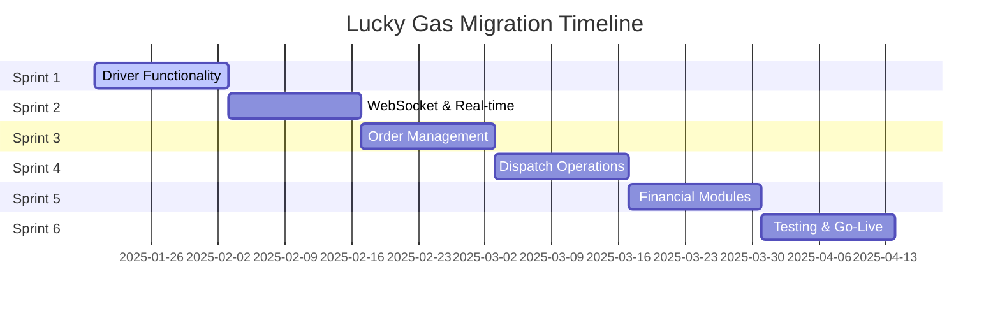

# Lucky Gas Migration Sprint Planning

**Generated**: 2025-07-25  
**Objective**: Achieve production-ready system in 6 sprints (12 weeks)

## 🚀 Sprint Overview

---

## 📅 Sprint 1: Driver Functionality (Current - Week 1-2)

**Goal**: Complete driver mobile interface for delivery operations

### Must Complete:
- [ ] Driver dashboard component architecture
- [ ] Route list view (mobile optimized)
- [ ] Delivery status updates
- [ ] GPS tracking integration
- [ ] Signature capture
- [ ] Offline mode support

### Dependencies:
- Customer data available ✅
- Order data structure defined ✅
- Authentication working ✅

### Acceptance Criteria:
- Driver can view assigned routes on mobile
- Driver can update delivery status
- Manager can track driver location
- Works offline and syncs when connected

---

## 📅 Sprint 2: WebSocket & Real-time (Week 3-4)

**Goal**: Enable real-time communication across the system

### Must Complete:
- [ ] WebSocket infrastructure setup
- [ ] Real-time order status updates
- [ ] Driver location broadcasting
- [ ] Notification system
- [ ] WebSocket reconnection logic
- [ ] Message queuing for reliability

### Dependencies:
- Driver functionality complete
- Server infrastructure ready

### Acceptance Criteria:
- Office sees driver location in real-time
- Customers receive SMS on delivery
- All status changes broadcast immediately
- Handles disconnections gracefully

---

## 📅 Sprint 3: Order Management (Week 5-6)

**Goal**: Complete order lifecycle management

### Must Complete:
- [ ] Order modification workflow
- [ ] Order cancellation with reasons
- [ ] Bulk order processing
- [ ] Credit limit checking
- [ ] Order history and search
- [ ] Recurring order templates

### Dependencies:
- Customer management complete ✅
- Product catalog defined
- Pricing rules implemented

### Acceptance Criteria:
- Can process 50+ orders in batch
- Credit limits enforced automatically
- Complete order audit trail
- Historical orders searchable

---

## 📅 Sprint 4: Dispatch Operations (Week 7-8) ✅ COMPLETED

**Goal**: Intelligent route planning and dispatch

### Must Complete:
- [x] Route planning interface
- [x] Drag-drop driver assignment
- [x] Google Routes API integration
- [x] Emergency dispatch handling
- [x] Dispatch dashboard
- [x] Route optimization algorithm

### Dependencies:
- Order management complete ✅
- Driver app functional ✅
- Maps API access ✅

### Acceptance Criteria:
- Routes optimized for efficiency ✅
- Emergency orders prioritized ✅
- Dispatchers can reassign routes ✅
- Real-time dispatch visibility ✅

---

## 📅 Sprint 5: Financial & Compliance (Week 9-10)

**Goal**: Invoice, payments, and government compliance

### Must Complete:
- [ ] Invoice generation (Taiwan format)
- [ ] E-invoice government API
- [ ] Payment processing
- [ ] Credit note management
- [ ] Financial reports
- [ ] Account reconciliation

### Dependencies:
- Order completion data
- Government API access
- Tax calculation rules

### Acceptance Criteria:
- E-invoices auto-submitted
- Payments tracked accurately
- Reports match legacy system
- Full audit trail

---

## 📅 Sprint 6: Testing & Migration (Week 11-12)

**Goal**: Production readiness and go-live

### Must Complete:
- [ ] Full system integration testing
- [ ] Load testing (100+ users)
- [ ] Security audit
- [ ] Data migration dry runs
- [ ] User acceptance testing
- [ ] Training completion
- [ ] Go-live execution

### Dependencies:
- All features complete
- Test environment ready
- Training materials prepared

### Acceptance Criteria:
- Zero critical bugs
- Performance SLAs met
- Users trained and confident
- Rollback plan tested

---

## 🔄 Parallel Tracks (Throughout All Sprints)

### Data Migration Track
- Week 1-2: Field mapping
- Week 3-4: Transformation scripts
- Week 5-6: Validation scripts
- Week 7-8: Dry run #1
- Week 9-10: Dry run #2
- Week 11-12: Final migration

### Testing Track
- Week 1-2: Unit test coverage
- Week 3-4: Integration tests
- Week 5-6: E2E test automation
- Week 7-8: Performance testing
- Week 9-10: Security testing
- Week 11-12: UAT & sign-off

### Training Track
- Week 1-4: Documentation creation
- Week 5-6: Video tutorials
- Week 7-8: Train the trainers
- Week 9-10: Department training
- Week 11-12: Go-live support

---

## 🎯 Critical Path Items

These items block go-live if not completed:

1. **Government E-Invoice Integration** (Sprint 5)
   - Legal requirement for operation
   
2. **Data Migration Success** (Sprint 6)
   - Zero data loss tolerance
   
3. **User Training Completion** (Sprint 6)
   - All users must be trained
   
4. **Security Audit Pass** (Sprint 6)
   - No critical vulnerabilities

5. **Performance Requirements** (Sprint 6)
   - Must match or exceed legacy system

---

## 📊 Risk Mitigation

### High Risk Items:
1. **E-Invoice API Changes**
   - Mitigation: Early integration testing
   - Contingency: Manual submission process

2. **Data Migration Complexity**
   - Mitigation: Multiple dry runs
   - Contingency: Phased migration

3. **User Adoption**
   - Mitigation: Familiar UI, extensive training
   - Contingency: Extended parallel running

4. **Third-party Integrations**
   - Mitigation: Early vendor engagement
   - Contingency: Manual processes

---

## ✅ Definition of Done

Each sprint is complete when:
- All features implemented and tested
- Code review completed
- Documentation updated
- Integration tests passing
- Performance benchmarks met
- Security scan clean
- Stakeholder sign-off received

---

## 📈 Success Metrics

### Sprint Velocity
- Target: 95% sprint completion
- Measure: Story points completed

### Quality Metrics
- Target: <2% defect rate
- Measure: Bugs found in production

### Performance Metrics
- Target: <3s page load
- Measure: 95th percentile response time

### User Satisfaction
- Target: >85% satisfaction
- Measure: Post-training survey

---

**Next Review**: End of Sprint 1 (Week 2)  
**Sprint Duration**: 2 weeks each  
**Total Timeline**: 12 weeks to production