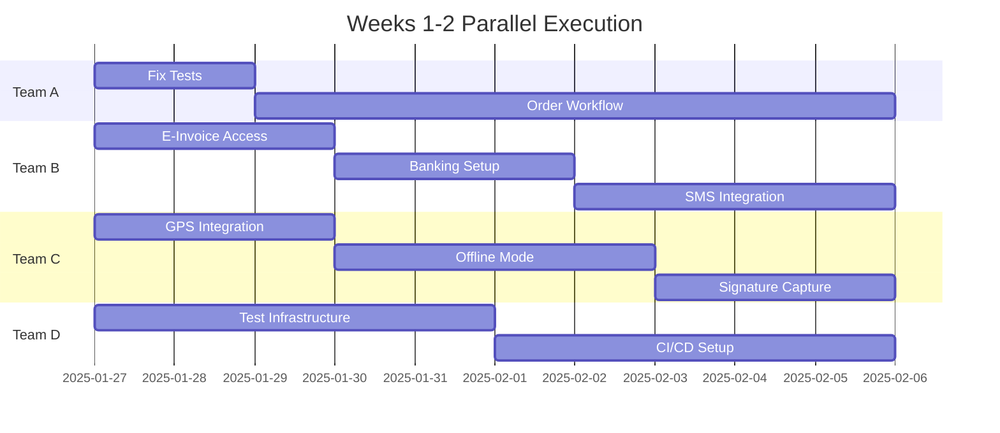

# Lucky Gas: Roadmap to 100% Migration Readiness

**Current Status**: 28% Complete  
**Target**: 100% Production Ready  
**Timeline**: 18-20 weeks  
**Approach**: Maximum parallel execution

## 🎯 Reality Check

### What "100% Ready" Actually Means
1. **All 11 modules** fully implemented (currently 2.5/11)
2. **All integrations** working (currently 0/4)
3. **80%+ test coverage** (currently <5%)
4. **Zero critical bugs** (currently unknown)
5. **All users trained** (currently 0%)
6. **Data migration tested** (currently 20%)

### Current State (28%)
- ✅ Basic customer management
- ✅ Authentication system
- ✅ Partial WebSocket implementation
- ✅ Partial driver interface
- ❌ 72% of features not built

---

## 🚀 Parallel Execution Strategy

### Development Team Structure (Required)
```
Team A: Core Business (2 devs)
├── Order Management
├── Dispatch System
└── Financial Modules

Team B: Integrations (2 devs)
├── E-Invoice API
├── Banking SFTP
├── SMS Gateway
└── Google Maps

Team C: Mobile & Frontend (2 devs)
├── Driver App Completion
├── Customer Portal
└── Admin Dashboard

Team D: Infrastructure (1 dev + 1 QA)
├── Testing Framework
├── CI/CD Pipeline
├── Monitoring
└── Security
```

---

## 📅 Week-by-Week Parallel Execution Plan

### Weeks 1-2: Critical Foundation (Current → 35%)


**Deliverables**:
- Test infrastructure operational
- Government API access secured
- Driver app MVP complete
- Order management 50% done

### Weeks 3-4: Core Modules (35% → 50%)
**Parallel Tasks**:
- Team A: Complete order management, start dispatch
- Team B: E-invoice integration development
- Team C: Customer portal development
- Team D: Automated testing implementation

### Weeks 5-8: Major Features (50% → 70%)
**Parallel Tasks**:
- Team A: Dispatch system complete
- Team B: All integrations functional
- Team C: Admin dashboard
- Team D: Security audit, load testing

### Weeks 9-12: Financial & Reports (70% → 85%)
**Parallel Tasks**:
- Team A: Financial modules, reporting
- Team B: Payment processing
- Team C: Mobile optimization
- Team D: Performance optimization

### Weeks 13-16: Testing & Training (85% → 95%)
**Parallel Tasks**:
- All Teams: Bug fixes, feature polishing
- Team C: Training material creation
- Team D: Full system testing
- Business: User training sessions

### Weeks 17-20: Production Ready (95% → 100%)
**Sequential Tasks** (Cannot parallelize):
1. Data migration dry runs
2. Parallel system running
3. Phased user migration
4. Go-live execution

---

## 🔧 Immediate Parallel Actions (This Week)

### Monday Morning (4 teams, 4 tasks)
```bash
# Team A - Terminal 1
cd backend && npm test  # Fix backend tests

# Team B - Terminal 2
curl https://www.einvoice.nat.gov.tw/api/docs  # E-invoice research

# Team C - Terminal 3
cd frontend && npm install jest  # Frontend tests

# Team D - Terminal 4
docker-compose up -d  # Infrastructure setup
```

### Monday Afternoon (Parallel validations)
```typescript
// Run these tests simultaneously in different terminals

// Terminal 1: Customer Tests
npm test -- --testNamePattern="Customer"

// Terminal 2: Auth Tests  
npm test -- --testNamePattern="Auth"

// Terminal 3: WebSocket Tests
npm test -- --testNamePattern="WebSocket"

// Terminal 4: E2E Tests
npm run test:e2e
```

---

## 📊 Parallel Development Metrics

### Velocity Tracking
| Week | Team A | Team B | Team C | Team D | Total Progress |
|------|--------|--------|--------|--------|----------------|
| 1-2  | 10 pts | 8 pts  | 12 pts | 6 pts  | 28% → 35%     |
| 3-4  | 15 pts | 12 pts | 10 pts | 8 pts  | 35% → 50%     |
| 5-8  | 40 pts | 35 pts | 30 pts | 20 pts | 50% → 70%     |
| 9-12 | 35 pts | 25 pts | 25 pts | 25 pts | 70% → 85%     |
| 13-16| 20 pts | 15 pts | 20 pts | 30 pts | 85% → 95%     |
| 17-20| 10 pts | 5 pts  | 10 pts | 15 pts | 95% → 100%    |

### Critical Path Items (Cannot Parallelize)
1. **E-Invoice API Access**: Blocks all financial features
2. **Data Migration**: Requires all modules complete
3. **User Training**: Requires stable system
4. **Go-Live**: Requires everything else done

---

## 🚨 Risk Mitigation Through Parallelization

### High-Risk Areas (Prioritize)
```yaml
e_invoice_api:
  risk: CRITICAL
  mitigation: 
    - Start immediately (Team B)
    - Daily follow-ups with government
    - Build mock API in parallel (Team D)
    - Contingency: Manual invoice process

data_migration:
  risk: HIGH
  mitigation:
    - Start mapping now (Team A + B)
    - Build tools in parallel (Team D)
    - Multiple dry runs scheduled
    - Incremental migration option

user_adoption:
  risk: MEDIUM
  mitigation:
    - Early user involvement (Team C)
    - Familiar UI design
    - Extensive training (parallel tracks)
    - Phased rollout plan
```

---

## 💡 Efficiency Maximization Tips

### 1. Parallel Communication
- Daily standup per team (15 min)
- Weekly cross-team sync (30 min)
- Shared Slack channels
- Real-time dashboards

### 2. Parallel Testing
```bash
# Run all test suites simultaneously
npm run test:unit &
npm run test:integration &
npm run test:e2e &
wait  # Wait for all to complete
```

### 3. Parallel Environments
- Dev: Continuous deployment
- Staging: Daily updates
- UAT: Weekly releases
- Production: Final only

### 4. Parallel Documentation
- Each team maintains their docs
- Auto-generated API docs
- Video tutorials while developing
- User guides in sprints

---

## 📈 Tracking Progress to 100%

### Weekly Checkpoints
| Week | Expected | Actual | Blockers | Actions |
|------|----------|--------|----------|---------|
| 1    | 30%      | TBD    | TBD      | TBD     |
| 2    | 35%      | TBD    | TBD      | TBD     |
| 4    | 50%      | TBD    | TBD      | TBD     |
| 8    | 70%      | TBD    | TBD      | TBD     |
| 12   | 85%      | TBD    | TBD      | TBD     |
| 16   | 95%      | TBD    | TBD      | TBD     |
| 20   | 100%     | TBD    | TBD      | TBD     |

### Definition of 100%
- [ ] All 11 modules operational
- [ ] All 4 integrations working
- [ ] 80%+ test coverage achieved
- [ ] 0 critical bugs
- [ ] 100% users trained
- [ ] 3 successful migration dry runs
- [ ] 2 weeks parallel running
- [ ] Executive go-live approval

---

## 🎯 The Reality

**You cannot test what doesn't exist.**

To reach 100%, we need:
1. **4-8 developers** working in parallel
2. **18-20 weeks** of development
3. **NT$1.7M** additional investment
4. **Executive commitment** to timeline
5. **Government cooperation** for APIs

**Current capability**: We can validate the existing 28% and prepare infrastructure for the remaining 72% development.

**Not possible**: Achieving 100% through testing alone or in a single session/week.

---

## 📋 Next Concrete Steps

### If Proceeding:
1. **Hire developers** (This week)
2. **Fix test infrastructure** (Day 1)
3. **Contact government** (Day 1)
4. **Start parallel teams** (Week 2)
5. **Track progress weekly**

### If Not Proceeding:
1. **Document current state**
2. **Preserve work done**
3. **Create handover package**
4. **Plan future approach**

The path to 100% is clear but requires significant investment in time, resources, and coordination.