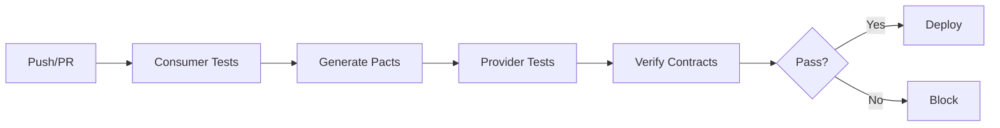

# Contract Testing Quick Reference

## 🚀 Quick Start

```bash
# Install dependencies
cd backend
uv pip install pact-python

# Run all contract tests
python tests/contracts/run_contract_tests.py

# Run only consumer tests (generate contracts)
python tests/contracts/run_contract_tests.py --consumer-only

# Run only provider tests (verify contracts)
python tests/contracts/run_contract_tests.py --provider-only
```

## 📁 File Structure

```
tests/contracts/
├── consumer/                    # Frontend expectations
│   ├── test_customer_api_contract.py
│   ├── test_order_api_contract.py
│   ├── test_auth_api_contract.py
│   └── test_prediction_api_contract.py
├── provider/                    # Backend verification
│   └── test_provider_verification.py
├── pacts/                       # Generated contracts
├── conftest.py                  # Shared configuration
├── run_contract_tests.py        # Test runner
└── CONTRACT_TESTING_GUIDE.md    # Full documentation
```

## ✅ Checklist for New Endpoints

When adding a new API endpoint:

1. **Write Consumer Test**
   ```python
   # In tests/contracts/consumer/test_<domain>_api_contract.py
   def test_new_endpoint(self, pact, mock_provider_url):
       (pact
        .given("precondition")
        .upon_receiving("request description")
        .with_request(method="GET", path="/api/v1/new")
        .will_respond_with(status=200, body={"data": "value"}))
   ```

2. **Add Provider State**
   ```python
   # In tests/contracts/provider/test_provider_verification.py
   @self.verifier.provider_state("precondition")
   async def setup_state():
       # Set up test data
   ```

3. **Run Tests**
   ```bash
   python tests/contracts/run_contract_tests.py
   ```

4. **Update CI/CD**
   - Tests run automatically on PR
   - No manual updates needed

## 🔍 Common Patterns

### Authentication Headers
```python
from tests.contracts.conftest import auth_headers

# Use in all authenticated requests
headers=auth_headers()
```

### Test Data Generators
```python
from tests.contracts.conftest import (
    generate_customer_data,
    generate_order_data,
    generate_auth_token_response,
    generate_prediction_data
)

# Use for consistent test data
customer = generate_customer_data("CUST0001")
```

### Pagination Parameters
```python
query={
    "skip": ["0"],
    "limit": ["100"]
}
```

## 🐛 Troubleshooting

| Issue | Solution |
|-------|----------|
| Port 8888 in use | `lsof -ti:8888 \| xargs kill -9` |
| Pact file not found | Run consumer tests first |
| Provider state missing | Add state handler in provider tests |
| Test fails in CI | Check database setup and migrations |

## 📊 CI/CD Pipeline



## 🎯 Key Commands

```bash
# Check if safe to deploy
python tests/contracts/run_contract_tests.py --check-deploy

# Skip Pact Broker publish
python tests/contracts/run_contract_tests.py --skip-publish

# Run specific test file
pytest tests/contracts/consumer/test_auth_api_contract.py -v

# Debug mode
PACT_LOG_LEVEL=DEBUG python tests/contracts/run_contract_tests.py
```

## 📝 Environment Variables

```bash
# Optional Pact Broker configuration
export PACT_BROKER_URL=https://your-broker.com
export PACT_BROKER_USERNAME=username
export PACT_BROKER_PASSWORD=password
```

## 🚨 Important Notes

1. **Always run consumer tests before provider tests**
2. **Keep provider states simple and focused**
3. **Use exact matching for critical fields**
4. **Test both success and error scenarios**
5. **Version your contracts with semantic versioning**

## 🔗 Links

- [Full Guide](./CONTRACT_TESTING_GUIDE.md)
- [Pact Docs](https://docs.pact.io/)
- [Test Examples](./consumer/)