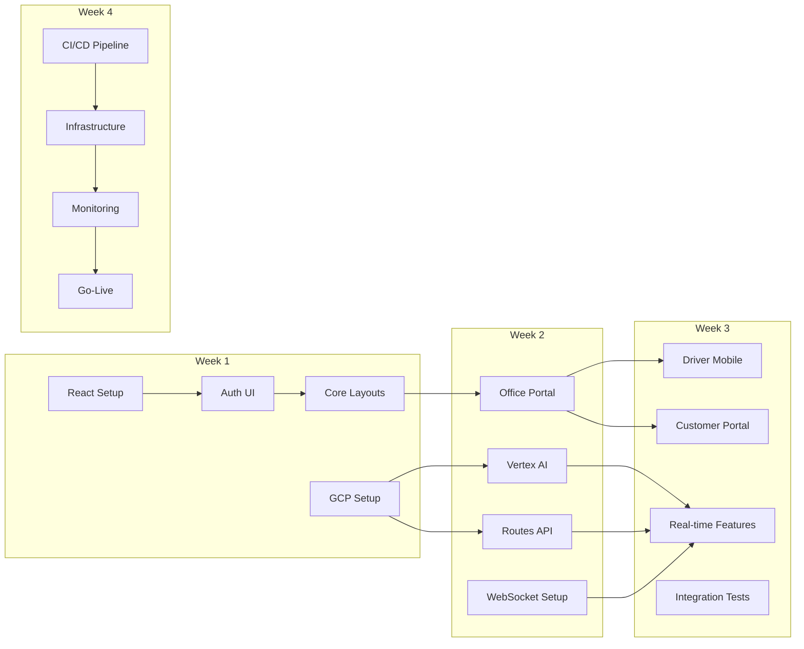

# Lucky Gas Parallel Execution Plan
## Based on POST_GOOGLE_API_ROADMAP.md

Generated: 2025-07-22
Execution Mode: Parallel Work Streams

---

## 🚀 Parallel Work Streams Overview

### Stream 1: Frontend Team (FE)
**Resources**: 2 Frontend Developers
**Duration**: 4 weeks
**Dependencies**: Backend APIs (existing)

### Stream 2: Backend/DevOps Team (BE)
**Resources**: 1 Backend Dev + 1 DevOps Engineer
**Duration**: 4 weeks
**Dependencies**: GCP credentials

### Stream 3: Integration Team (INT)
**Resources**: 1 Full-stack Developer
**Duration**: 3 weeks (starts Week 2)
**Dependencies**: FE + BE progress

---

## 📊 Dependency Matrix



---

## 🔄 Parallel Execution Schedule

### Week 1: Foundation Sprint

#### Stream 1 - Frontend Team
```
Day 1-2: FE-1.1 React Setup
├── Initialize TypeScript React with Vite
├── Configure Ant Design + Taiwan locale
├── Setup React Router
└── Implement i18n for Traditional Chinese

Day 3-4: FE-1.2 Authentication UI
├── Login/logout components
├── JWT token management
├── Protected routes
└── Session timeout

Day 5: FE-1.3 Core Layouts
├── Main dashboard layout
├── Role-based navigation
└── Responsive design
```

#### Stream 2 - Backend/DevOps Team
```
Day 1: BE-1.1 GCP Project Setup
├── Run gcp-setup-preflight.sh
├── Execute gcp-setup-execute.sh
├── Enable APIs (Routes, Vertex AI, Maps)
├── Create service accounts
└── Generate API keys

Day 2-3: BE-1.2 Infrastructure Prep
├── Setup staging environment
├── Configure secrets management
├── Initialize Terraform configs
└── Setup monitoring baseline

Day 4-5: BE-1.3 API Enhancement
├── Add CORS configuration
├── Implement rate limiting
├── Setup API versioning
└── Prepare WebSocket endpoints
```

### Week 2: Core Features Sprint

#### Stream 1 - Frontend Team
```
Day 6-8: FE-2.1 Office Portal
├── Customer management UI
│   ├── Search/filter interface
│   ├── CRUD operations
│   └── Cylinder tracking
├── Order management UI
│   ├── Create/edit forms
│   ├── Route assignment
│   └── Payment tracking
└── Route planning dashboard
    ├── Visual route builder
    ├── Drag-drop optimization
    └── Driver assignment
```

#### Stream 2 - Backend/DevOps Team
```
Day 6-7: BE-2.1 Vertex AI Configuration
├── Deploy prediction model
├── Setup AutoML Tables
├── Configure batch pipeline
└── Implement prediction endpoints

Day 8-9: BE-2.2 Routes API Integration
├── Configure OR-Tools
├── Implement route endpoints
├── Add traffic routing
└── Test Taiwan addresses
```

#### Stream 3 - Integration Team (Starts)
```
Day 8-9: INT-2.1 WebSocket Foundation
├── Socket.io server setup
├── Redis pub/sub config
├── Connection management
└── Event architecture
```

### Week 3: Advanced Features Sprint

#### Stream 1 - Frontend Team
```
Day 11-13: FE-3.1 Driver Mobile UI
├── PWA setup
├── Route navigation
├── Delivery workflow
├── Signature/photo capture
└── Offline sync

Day 14-15: FE-3.2 Customer Portal
├── Order tracking UI
├── Delivery notifications
├── Payment history
└── Usage analytics
```

#### Stream 2 - Backend/DevOps Team
```
Day 11-12: BE-3.1 Performance Optimization
├── Database indexing
├── Query optimization
├── Caching strategy
└── Load testing

Day 13-15: BE-3.2 Security Hardening
├── API security audit
├── Penetration testing
├── SSL/TLS configuration
└── WAF setup
```

#### Stream 3 - Integration Team
```
Day 10-11: INT-3.1 Real-time Features
├── Live order updates
├── Driver tracking
├── Push notifications
└── Event broadcasting

Day 12: INT-3.2 Reporting Dashboard
├── Daily summaries
├── Analytics integration
├── Revenue tracking
└── Performance metrics

Day 13-15: INT-3.3 Integration Testing
├── E2E test suites
├── Cross-browser testing
├── Performance testing
└── Mobile testing
```

### Week 4: Production Sprint

#### All Teams Converge
```
Day 16-17: PROD-4.1 CI/CD Pipeline
├── GitHub Actions setup
├── Test automation
├── Docker builds
└── Deployment automation

Day 18: PROD-4.2 Infrastructure
├── Cloud Run config
├── Load balancer
├── CDN setup
└── Database pooling

Day 19: PROD-4.3 Monitoring
├── APM setup
├── Sentry integration
├── Custom dashboards
└── Alert rules

Day 20: PROD-4.4 Go-Live
├── Data validation
├── User training
├── Rollback plan
└── Production deploy
```

---

## 📌 Critical Path & Sync Points

### Critical Path
```
GCP Setup (Day 1) → Vertex AI (Day 6-7) → Integration Testing (Day 13-15) → Production (Day 16-20)
```

### Sync Points
1. **End of Week 1**: Frontend auth must sync with backend CORS
2. **Start of Week 2**: Integration team needs WebSocket endpoints ready
3. **Mid Week 2**: Frontend needs prediction/route APIs functional
4. **End of Week 3**: All features freeze for testing
5. **Start of Week 4**: All teams merge for production push

---

## 🎯 Task Assignments

### Frontend Team (2 developers)
- **Dev 1**: React setup, Auth UI, Office Portal, Driver Mobile
- **Dev 2**: Core Layouts, Customer Portal, Testing support

### Backend/DevOps Team (2 engineers)
- **Backend Dev**: API enhancements, Vertex AI, Routes API
- **DevOps Eng**: GCP setup, Infrastructure, CI/CD, Monitoring

### Integration Team (1 full-stack)
- **Full-stack Dev**: WebSocket, Real-time, Dashboards, E2E tests

---

## 📊 Progress Tracking

### Daily Standups
- 9:00 AM: Quick sync (15 min)
- Focus on blockers and dependencies
- Update shared progress board

### Weekly Checkpoints
- Monday: Week planning and task assignment
- Wednesday: Mid-week sync and adjustments
- Friday: Demo and retrospective

### Success Metrics
- **Week 1**: Frontend login working, GCP APIs enabled
- **Week 2**: Office portal demo, AI predictions live
- **Week 3**: Mobile app functional, real-time working
- **Week 4**: Production deployed, monitoring active

---

## 🚨 Risk Mitigation

### Parallel Execution Risks
1. **API Contract Mismatches**
   - Mitigation: Define OpenAPI specs first
   - Weekly API contract reviews

2. **Integration Delays**
   - Mitigation: Integration team starts Week 2
   - Daily integration tests from Week 2

3. **Resource Conflicts**
   - Mitigation: Clear ownership matrix
   - Shared slack channel for coordination

4. **Dependency Blocks**
   - Mitigation: Mock services for development
   - Fallback to sequential if needed

---

## 📋 Immediate Actions

### Today (Day 0)
1. **Team Assignment**: Confirm resource allocation
2. **Environment Setup**: All developers setup local env
3. **Access Provisioning**: GCP credentials, GitHub access
4. **Kickoff Meeting**: Review this plan with all teams

### Tomorrow (Day 1)
1. **Frontend Team**: Start React setup (FE-1.1)
2. **Backend Team**: Execute GCP setup scripts (BE-1.1)
3. **Integration Team**: Review WebSocket architecture
4. **Daily Standup**: 9:00 AM first sync

---

## 🎯 Definition of Success

Each sprint delivers working software:
- **Week 1**: Authenticated frontend + Enabled GCP services
- **Week 2**: Office portal + AI/Route APIs
- **Week 3**: Mobile apps + Real-time features
- **Week 4**: Production system with monitoring

**Final Success**: All 5 phases complete with parallel efficiency gains of 40-50% over sequential execution.