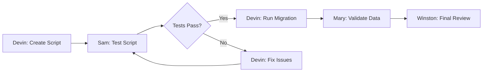

# Data Migration Coordination Script
## Team Execution Plan for Lucky Gas Data Migration

### 🎯 Mission
Migrate 350K+ records from Excel/SQLite to PostgreSQL with zero data loss and full business rule preservation.

## 👥 Active Team

### Primary Team
- **Devin** (Lead) - Data migration scripts and ETL processes
- **Mary** (Support) - Business rule validation and data quality
- **Sam** (Quality) - Migration testing and validation

### Support Team
- **Winston** (Review) - Architecture and schema approval
- **Nigel** (Implementation) - API updates for migrated data

## 📋 Execution Timeline

### Day 1: Analysis & Preparation (COMPLETED ✅)
```yaml
Morning (Devin):
  - ✅ Analyzed all raw data files
  - ✅ Created migration analysis report
  - ✅ Built Taiwan date converter utility
  - ✅ Created client migration script

Afternoon (Mary):
  - ✅ Reviewed business rules
  - ✅ Created validation documentation
  - ✅ Identified edge cases
  - ✅ Listed clarifications needed
```

### Day 2: Client Migration (CURRENT 🔄)
```yaml
Morning:
  Agent: Devin
  Tasks:
    - [ ] Test client migration script (dry run)
    - [ ] Fix any validation errors
    - [ ] Create migration metrics report
    - [ ] Hand off to Sam for testing

Afternoon:
  Agent: Sam
  Tasks:
    - [ ] Create migration test suite
    - [ ] Validate data integrity
    - [ ] Test rollback procedures
    - [ ] Approve for production run

Evening:
  Agent: Devin
  Tasks:
    - [ ] Execute production migration
    - [ ] Generate migration report
    - [ ] Document any issues
```

### Day 3: Delivery History Migration
```yaml
Morning:
  Agent: Devin
  Tasks:
    - [ ] Create delivery history migration script
    - [ ] Handle date conversions (Taiwan calendar)
    - [ ] Map client codes to IDs
    - [ ] Implement batch processing

Afternoon:
  Agent: Mary
  Tasks:
    - [ ] Validate delivery patterns
    - [ ] Check business rule compliance
    - [ ] Identify data anomalies
    - [ ] Create exception report

Evening:
  Agent: Sam
  Tasks:
    - [ ] Test delivery migration
    - [ ] Verify foreign key integrity
    - [ ] Performance testing
    - [ ] Approve for production
```

### Day 4: Integration & Validation
```yaml
Morning:
  Agent: Winston
  Tasks:
    - [ ] Review migrated schema
    - [ ] Validate architecture compliance
    - [ ] Check performance metrics
    - [ ] Approve data model

Afternoon:
  Agent: Nigel
  Tasks:
    - [ ] Update API endpoints
    - [ ] Test with migrated data
    - [ ] Fix any integration issues
    - [ ] Update API documentation

Evening:
  Agent: Sam
  Tasks:
    - [ ] Full system integration tests
    - [ ] End-to-end validation
    - [ ] Performance benchmarks
    - [ ] Final approval
```

## 🔄 Handoff Procedures

### Standard Handoff Flow


### Emergency Handoff
If any agent encounters a critical issue:
1. **STOP** all migration activities
2. **Document** the exact issue and state
3. **Tag** @Winston for architectural issues
4. **Tag** @Mary for business logic issues
5. **Create** rollback plan if needed

## 📊 Success Metrics

### Per Migration Phase
```yaml
clients:
  total_records: 1,267
  success_target: 100%
  validation_checks: 15
  rollback_time: < 5 minutes

deliveries:
  total_records: 349,920
  success_target: 99.9%
  batch_size: 10,000
  processing_time: < 2 hours

validation:
  data_integrity: 100%
  business_rules: 100%
  performance_impact: < 10%
  downtime: 0
```

## 🚦 Go/No-Go Checkpoints

### Before Each Migration
- [ ] Backup completed
- [ ] Test environment validated
- [ ] Rollback script tested
- [ ] Team availability confirmed
- [ ] Customer notification sent

### After Each Migration
- [ ] Record counts match
- [ ] Validation tests pass
- [ ] Performance acceptable
- [ ] No data corruption
- [ ] Business rules preserved

## 🛠️ Agent-Specific Commands

### For Devin (Data Migration)
```bash
# Test migration
cd backend/migrations/data_migration
uv run python 001_migrate_clients.py --dry-run

# Production migration
uv run python 001_migrate_clients.py --production

# Check migration status
uv run python check_migration_status.py
```

### For Mary (Business Validation)
```sql
-- Validate customer counts by type
SELECT business_type, COUNT(*) 
FROM customers 
GROUP BY business_type;

-- Check data integrity
SELECT * FROM customers 
WHERE client_code IS NULL 
   OR address IS NULL;
```

### For Sam (Testing)
```bash
# Run migration tests
cd backend
PYTHONPATH=. uv run pytest tests/migration/ -v

# Validate data integrity
uv run python tests/migration/validate_integrity.py
```

## 📝 Communication Protocol

### Status Updates
Every 2 hours, active agent posts:
```markdown
## [Agent] Status Update - [Time]
- Current Task: [Description]
- Progress: [X]% complete
- Next Handoff: [Agent] at [Time]
- Blockers: [None/Description]
```

### Handoff Message
```markdown
## 🤝 Handoff: [From] → [To]
**Task**: [Specific task]
**Status**: [Current state]
**Key Files**:
- `path/to/file1.py`
- `path/to/file2.sql`
**Next Actions**:
1. [Action 1]
2. [Action 2]
**Warnings**: [Any issues to watch]
```

## 🚨 Escalation Path

1. **Data Issues** → Mary → Devin → Winston
2. **Technical Issues** → Nigel → Winston → BMad Master
3. **Business Logic** → Mary → Customer → Phil
4. **Timeline Issues** → Phil → Customer → Team

## ✅ Completion Criteria

### Phase Complete When:
- [ ] All data migrated successfully
- [ ] All validation tests passing
- [ ] Performance benchmarks met
- [ ] Documentation updated
- [ ] Customer sign-off received
- [ ] No critical issues pending

---

**Script Version**: 1.0
**Last Updated**: 2024-01-21
**Next Review**: After Day 2 completion