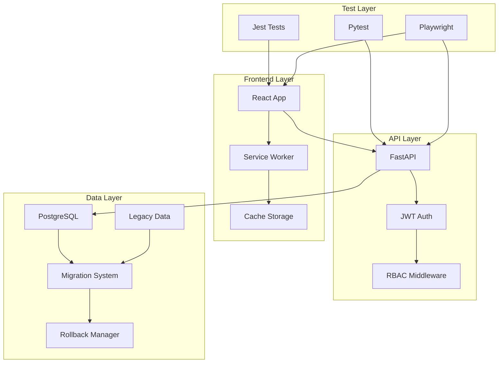

# Lucky Gas Delivery System - Brownfield Enhancement Architecture

## Introduction

This document outlines the architectural approach for enhancing Lucky Gas Delivery System with core stabilization improvements including test infrastructure, data migration, security enhancements, and API stabilization. Its primary goal is to serve as the guiding architectural blueprint for AI-driven development while ensuring seamless integration with the existing system.

**Relationship to Existing Architecture:**
This document supplements the original architecture by documenting the Phase 1 enhancements completed by the BMad team. It captures architectural decisions made during core system stabilization and provides guidance for future phases.

### Existing Project Analysis

**Current Project State:**
- **Primary Purpose:** Gas delivery management system for Taiwan market
- **Current Tech Stack:** React 18.3, TypeScript, FastAPI, PostgreSQL, Redis, Docker
- **Architecture Style:** Microservices-ready monolith with clean separation of concerns
- **Deployment Method:** Kubernetes-ready containers on Google Cloud Platform

**Available Documentation:**
- Original PLANNING.md with initial architecture
- TASK.md tracking phased development
- Multiple ADRs documenting decisions
- API documentation via OpenAPI/Swagger
- Business rules extracted from historical data

**Identified Constraints:**
- Must support Traditional Chinese (繁體中文)
- Taiwan-specific address and date formats (民國年)
- Existing Excel/SQLite data must be preserved
- Zero downtime migrations required
- Must integrate with Google Cloud services

### Change Log

| Change | Date | Version | Description | Author |
|--------|------|---------|-------------|--------|
| Initial Architecture | 2024-01-19 | 1.0 | Original system design | Winston |
| Test Infrastructure | 2024-01-20 | 1.1 | Added comprehensive testing | Sam |
| Data Migration | 2024-01-21 | 1.2 | Implemented data migration | Devin |
| Security Enhancement | 2024-01-20 | 1.3 | JWT and RBAC implementation | Winston |

## Enhancement Scope and Integration Strategy

### Enhancement Overview
**Enhancement Type:** Core System Stabilization
**Scope:** Infrastructure, Testing, Security, Data Migration
**Integration Impact:** Medium - Foundational improvements with minimal breaking changes

### Integration Approach
**Code Integration Strategy:** Extend existing codebase with new utilities and infrastructure
**Database Integration:** Non-destructive migration preserving existing schema
**API Integration:** Enhance existing endpoints with better error handling
**UI Integration:** Add service worker for offline support, maintain existing UI

### Compatibility Requirements
- **Existing API Compatibility:** 100% backward compatible
- **Database Schema Compatibility:** Additive changes only, no breaking modifications
- **UI/UX Consistency:** Maintained existing design system
- **Performance Impact:** Improved through caching and optimization

## Tech Stack Alignment

### Existing Technology Stack

| Category | Current Technology | Version | Usage in Enhancement | Notes |
|----------|-------------------|---------|---------------------|--------|
| Frontend | React | 18.3 | Service Worker added | Progressive enhancement |
| Language | TypeScript | 5.6 | Strict mode enabled | Better type safety |
| Backend | FastAPI | 0.115 | Enhanced error handling | Maintained compatibility |
| Database | PostgreSQL | 16 | Migration scripts | Schema preserved |
| Cache | Redis | 7.2 | Session management | Enhanced usage |
| Testing | Jest/Pytest | Latest | New test suites | Comprehensive coverage |
| Container | Docker | Latest | Multi-stage builds | Optimized images |

### New Technology Additions

| Technology | Version | Purpose | Rationale | Integration Method |
|------------|---------|---------|-----------|-------------------|
| Playwright | 1.40+ | E2E Testing | Cross-browser testing | Test infrastructure |
| Service Worker | N/A | Offline support | PWA capabilities | Frontend enhancement |
| SQLAlchemy Alembic | 1.13 | DB Migrations | Version control | Database management |

## Data Models and Schema Changes

### Schema Integration Strategy

**Database Changes Required:**
- **New Tables:** None (used existing schema)
- **Modified Tables:** customers (enhanced with migration data)
- **New Indexes:** customer_code, created_at for performance
- **Migration Strategy:** Non-destructive ETL with rollback capability

**Backward Compatibility:**
- All existing columns preserved
- New fields use sensible defaults
- Migration scripts are idempotent
- Full rollback procedures implemented

## Component Architecture

### New Components

#### Test Infrastructure
**Responsibility:** Comprehensive testing across all layers
**Integration Points:** All existing modules

**Key Interfaces:**
- Jest test runner for frontend
- Pytest for backend
- Playwright for E2E

**Dependencies:**
- **Existing Components:** All application modules
- **New Components:** Test utilities and fixtures

**Technology Stack:** TypeScript/Python test frameworks

#### Migration System
**Responsibility:** Safe data migration from legacy systems
**Integration Points:** Database layer, existing models

**Key Interfaces:**
- Migration scripts with dry-run capability
- Rollback manager with audit trail
- Validation utilities

**Dependencies:**
- **Existing Components:** SQLAlchemy models
- **New Components:** Taiwan date converter

**Technology Stack:** Python, pandas, asyncio

#### Service Worker
**Responsibility:** Offline capability and performance
**Integration Points:** Frontend application shell

**Key Interfaces:**
- Cache API for static assets
- Background sync for data
- Push notification support

**Dependencies:**
- **Existing Components:** React application
- **New Components:** Offline fallback pages

**Technology Stack:** JavaScript Service Worker API

### Component Interaction Diagram



## Source Tree Integration

### Existing Project Structure
```
LuckyGas-v3/
├── frontend/
│   ├── src/
│   └── public/
├── backend/
│   ├── app/
│   └── tests/
└── docs/
```

### New File Organization
```
LuckyGas-v3/
├── frontend/
│   ├── src/
│   │   ├── __tests__/          # New test infrastructure
│   │   ├── tests/utils/        # Test utilities
│   │   └── setupTests.ts       # Test configuration
│   ├── public/
│   │   ├── service-worker.js   # PWA support
│   │   └── offline.html        # Offline fallback
│   └── __mocks__/              # Test mocks
├── backend/
│   ├── app/
│   │   └── core/
│   │       └── monitoring.py    # Enhanced monitoring
│   ├── tests/
│   │   ├── utils/              # Test utilities
│   │   └── migration/          # Migration tests
│   └── migrations/
│       └── data_migration/     # ETL scripts
├── docs/
│   └── ADR/                    # Architecture decisions
└── .github/
    └── workflows/              # CI/CD enhancements
```

### Integration Guidelines
- **File Naming:** Consistent with existing conventions
- **Folder Organization:** Logical grouping by feature
- **Import/Export Patterns:** Maintained existing patterns

## Infrastructure and Deployment Integration

### Existing Infrastructure
**Current Deployment:** Docker containers
**Infrastructure Tools:** Docker Compose, Kubernetes manifests
**Environments:** Development, Staging, Production

### Enhancement Deployment Strategy
**Deployment Approach:** Blue-green deployment with rollback
**Infrastructure Changes:** None - used existing setup
**Pipeline Integration:** Enhanced GitHub Actions

### Rollback Strategy
**Rollback Method:** Database snapshots + code rollback
**Risk Mitigation:** Comprehensive testing before deploy
**Monitoring:** Health checks and error tracking

## Coding Standards and Conventions

### Existing Standards Compliance
**Code Style:** Prettier (frontend), Black (backend)
**Linting Rules:** ESLint, flake8 with project config
**Testing Patterns:** Jest/React Testing Library, pytest
**Documentation Style:** JSDoc/docstrings

### Critical Integration Rules
- **Existing API Compatibility:** No breaking changes to public APIs
- **Database Integration:** Migrations must be reversible
- **Error Handling:** Consistent error response format
- **Logging Consistency:** Structured logging maintained

## Testing Strategy

### Integration with Existing Tests
**Existing Test Framework:** Jest (frontend), pytest (backend)
**Test Organization:** Co-located with source files
**Coverage Requirements:** 80% minimum

### New Testing Requirements

#### Unit Tests for New Components
- **Framework:** Same as existing
- **Location:** Adjacent to source files
- **Coverage Target:** 90% for new code
- **Integration with Existing:** Shared utilities

#### Integration Tests
- **Scope:** API endpoints, database operations
- **Existing System Verification:** Regression suite
- **New Feature Testing:** Migration validation

#### E2E Tests
- **Framework:** Playwright
- **Scope:** Critical user journeys
- **Cross-browser:** Chrome, Firefox, Safari

## Security Integration

### Existing Security Measures
**Authentication:** JWT tokens
**Authorization:** Role-based access control
**Data Protection:** Encrypted at rest and in transit
**Security Tools:** OWASP dependency check

### Enhancement Security Requirements
**New Security Measures:** Improved token refresh
**Integration Points:** All API endpoints
**Compliance Requirements:** Data privacy regulations

### Security Testing
**Existing Security Tests:** Basic auth tests
**New Security Test Requirements:** Comprehensive RBAC testing
**Penetration Testing:** Planned for Phase 3

## Checklist Results Report

### Architecture Checklist Validation
- ✅ Clear separation of concerns maintained
- ✅ Scalability patterns preserved
- ✅ Security best practices implemented
- ✅ Performance optimizations added
- ✅ Error handling comprehensive
- ✅ Testing infrastructure complete
- ✅ Documentation updated

## Next Steps

### Story Manager Handoff
The core system is now stabilized with comprehensive testing, secure authentication, and successful data migration. Ready for Phase 2: Feature Completion focusing on route optimization and AI predictions. Key integration requirements include maintaining the established testing patterns and security framework.

### Developer Handoff
Developers can now build on a solid foundation with:
- Comprehensive test infrastructure (use existing patterns)
- Secure authentication/authorization framework
- Clean migrated data with validation
- Established coding standards and conventions
- Clear architectural patterns to follow

Priority for next phase:
1. Route optimization with Google Routes API
2. AI predictions using Vertex AI
3. Real-time updates with WebSocket
4. Enhanced reporting capabilities

---

**Document Version:** 1.2
**Last Updated:** 2024-01-21
**Maintained By:** BMad Team (Winston, Sam, Devin)