# System Integration Points & Data Flow

## 🔄 Core Business Process Flows

### 1. Order-to-Delivery Flow

```mermaid
graph LR
    subgraph Customer Service
        A[Customer<br/>Call/APP] --> B[查詢客戶<br/>Customer Search]
        B --> C[新增訂單<br/>Create Order]
    end
    
    subgraph Dispatch
        C --> D[路線規劃<br/>Route Planning]
        D --> E[司機指派<br/>Driver Assignment]
        E --> F[配送確認<br/>Delivery Confirmation]
    end
    
    subgraph Financial
        F --> G[開立發票<br/>Generate Invoice]
        G --> H[收款作業<br/>Payment Collection]
        H --> I[帳務結算<br/>Account Settlement]
    end
    
    style A fill:#f9f,stroke:#333,stroke-width:2px
    style F fill:#9f9,stroke:#333,stroke-width:2px
    style I fill:#99f,stroke:#333,stroke-width:2px
```


### 2. Data Synchronization Points

| Source Module | Target Module | Data Type | Frequency | Method |
|--------------|---------------|-----------|-----------|---------|
| 會員作業 | 訂單銷售 | Customer Data | Real-time | Database |
| 訂單銷售 | 派遣作業 | Order Details | Real-time | Database |
| 派遣作業 | 訂單銷售 | Delivery Status | On Update | PostBack |
| 訂單銷售 | 發票作業 | Billing Info | On Completion | Trigger |
| 發票作業 | 帳務管理 | Invoice Data | Real-time | Database |
| All Modules | 報表作業 | Transaction Data | On Demand | Query |
| 資料維護 | All Modules | Master Data | Real-time | Database |

### 3. Critical Data Dependencies

```yaml
customer_dependencies:
  required_for:
    - order_creation: "Customer ID, delivery address, payment terms"
    - invoice_generation: "Tax ID, billing address, invoice preferences"
    - route_planning: "Delivery zone, special instructions"
    - credit_check: "Credit limit, payment history"
  
order_dependencies:
  requires:
    - customer: "Valid customer record"
    - product: "Available inventory"
    - pricing: "Current price list"
  provides_to:
    - dispatch: "Delivery requirements"
    - invoice: "Billing details"
    - inventory: "Stock allocation"

dispatch_dependencies:
  requires:
    - orders: "Pending deliveries"
    - drivers: "Available drivers"
    - vehicles: "Vehicle capacity"
  updates:
    - order_status: "Delivered, failed, rescheduled"
    - customer_notification: "Delivery time, delays"
```

## 📊 Database Integration Schema

### Core Table Relationships


## 🔌 External System Integrations

### 1. Government e-Invoice System
```yaml
endpoint: https://www.einvoice.nat.gov.tw/
protocol: HTTPS POST
format: XML
authentication: Certificate-based
operations:
  - upload_invoice:
      frequency: "Every 2 hours"
      batch_size: "Up to 1000 invoices"
      retry_policy: "3 attempts with exponential backoff"
  - query_status:
      frequency: "Every 30 minutes"
  - download_receipt:
      trigger: "On status change"
      
xml_structure: |
  <Invoice>
    <Main>
      <InvoiceNumber>AB12345678</InvoiceNumber>
      <InvoiceDate>20250125</InvoiceDate>
      <Seller>
        <Identifier>97420648</Identifier>
      </Seller>
      <Buyer>
        <Identifier>Customer TaxID</Identifier>
      </Buyer>
    </Main>
    <Details>
      <ProductItem>
        <Description>瓦斯 20kg</Description>
        <Quantity>1</Quantity>
        <UnitPrice>800</UnitPrice>
      </ProductItem>
    </Details>
  </Invoice>
```

### 2. Banking Integration
```yaml
bank_systems:
  - name: "Taiwan Cooperative Bank"
    integration_type: "File-based"
    file_format: "Fixed-width text"
    encoding: "Big5"
    transfer_method: "SFTP"
    schedule: "Daily at 3:00 PM"
    
  - name: "Line Pay / Street Pay"
    integration_type: "API"
    protocol: "REST/JSON"
    authentication: "OAuth 2.0"
    webhook: "Payment confirmation"
    
payment_file_format: |
  HEADER|20250125|97420648|TCB001
  DETAIL|0001|1234567890|20250125|800.00|PAID
  DETAIL|0002|0987654321|20250125|1600.00|PAID
  FOOTER|2|2400.00
```

### 3. SMS Notification Gateway
```yaml
provider: "Taiwan Mobile"
api_endpoint: "https://api.twsms.com/send"
authentication: "API Key"
rate_limit: "100 msgs/minute"

message_templates:
  delivery_notice: |
    親愛的${CustomerName}您好，
    您的瓦斯訂單將於${DeliveryTime}送達。
    司機：${DriverName} ${DriverPhone}
    
  payment_reminder: |
    ${CustomerName}您好，
    您有一筆${Amount}元款項待繳。
    請於${DueDate}前完成付款。
```

## 🔄 Module Communication Patterns

### 1. Synchronous Communications (PostBack)
```
User Action → ViewState → Server Processing → Database Update → Page Refresh
```

Examples:
- Creating new order
- Updating customer info
- Generating reports

### 2. Batch Processing
```
Scheduled Job → Collect Data → Process → Update Status → Send Notifications
```

Examples:
- Daily route optimization (3:00 AM)
- Invoice batch upload (Every 2 hours)
- Monthly billing run (1st of month)

### 3. Event Triggers (Database)
```sql
-- Example: Order completion trigger
CREATE TRIGGER trg_OrderComplete
ON Orders
AFTER UPDATE
AS
BEGIN
    IF UPDATE(Status) AND EXISTS (
        SELECT 1 FROM inserted WHERE Status = 'Delivered'
    )
    BEGIN
        -- Create invoice record
        INSERT INTO Invoices (OrderID, CreateDate)
        SELECT OrderID, GETDATE() FROM inserted
        
        -- Update customer last delivery
        UPDATE Customers SET LastDeliveryDate = GETDATE()
        WHERE CustomerID IN (SELECT CustomerID FROM inserted)
    END
END
```

## 📈 Data Volume Patterns

### Transaction Volumes (Daily Average)
```yaml
customers:
  total_active: 5000
  new_per_day: 5-10
  
orders:
  daily_average: 200-300
  peak_day: 500 (before holidays)
  items_per_order: 1.2
  
deliveries:
  routes_per_day: 15-20
  stops_per_route: 15-20
  success_rate: 95%
  
invoices:
  generated_daily: 200-300
  payment_methods:
    cash: 60%
    transfer: 30%
    check: 10%
```

### Peak Load Patterns


## 🚨 Integration Failure Points

### Critical Integration Risks
1. **Government e-Invoice**
   - Risk: System unavailable during upload window
   - Impact: Legal compliance violation
   - Mitigation: Queue for retry, manual backup process

2. **Bank Payment Files**
   - Risk: SFTP connection failure
   - Impact: Payment reconciliation delays
   - Mitigation: Email backup, manual upload option

3. **Database Triggers**
   - Risk: Trigger failure blocks transactions
   - Impact: Data inconsistency
   - Mitigation: Error handling, audit logs

### Data Consistency Checkpoints
```sql
-- Daily consistency checks
-- 1. Orders without dispatch
SELECT * FROM Orders 
WHERE Status = 'Confirmed' 
AND OrderID NOT IN (SELECT OrderID FROM Dispatch)
AND OrderDate < DATEADD(day, -1, GETDATE())

-- 2. Delivered orders without invoice
SELECT * FROM Orders o
WHERE Status = 'Delivered'
AND NOT EXISTS (SELECT 1 FROM Invoices WHERE OrderID = o.OrderID)
AND DeliveryDate < DATEADD(day, -2, GETDATE())

-- 3. Invoices without payment after 30 days
SELECT * FROM Invoices
WHERE PaymentStatus = 'Pending'
AND InvoiceDate < DATEADD(day, -30, GETDATE())
```

## 🔐 Security Integration Points

### Authentication Flow


### Data Access Patterns
- **Read Access**: Through Views with row-level filtering
- **Write Access**: Through stored procedures only
- **Audit Trail**: Triggers log all changes
- **Sensitive Data**: No encryption (major issue)

---

This integration documentation provides the blueprint for understanding data flow and system dependencies in the Lucky Gas legacy system.