# Lucky Gas System Architecture Overview

## 🏗️ Technical Architecture

### Technology Stack
- **Framework**: ASP.NET WebForms (.NET Framework 4.x)
- **Language**: C# (server-side), JavaScript (client-side)
- **Database**: SQL Server (assumed based on ASP.NET patterns)
- **Authentication**: Forms-based authentication
- **Session Management**: ASP.NET Session State
- **UI Framework**: Traditional HTML with ASP.NET controls

### Application Structure
```
┌─────────────────────────────────────────────────────────┐
│                    Browser Client                        │
├─────────────────────────────────────────────────────────┤
│  ┌─────────────┬──────────────────┬─────────────────┐  │
│  │   Banner    │                  │                  │  │
│  │   Frame     │    Main Frame    │                  │  │
│  ├─────────────┤   (main.aspx)    │                  │  │
│  │ Navigation  │                  │                  │  │
│  │   Frame     │   Content Area   │                  │  │
│  │ (Left.aspx) │                  │                  │  │
│  └─────────────┴──────────────────┴─────────────────┘  │
└─────────────────────────────────────────────────────────┘
                              │
                              ▼
┌─────────────────────────────────────────────────────────┐
│                    Web Server (IIS)                      │
├─────────────────────────────────────────────────────────┤
│                 ASP.NET WebForms Engine                  │
├─────────────────────────────────────────────────────────┤
│  ViewState │ Session State │ Authentication │ PostBack  │
└─────────────────────────────────────────────────────────┘
                              │
                              ▼
┌─────────────────────────────────────────────────────────┐
│                 Business Logic Layer                     │
├─────────────────────────────────────────────────────────┤
│  Customer  │  Orders  │  Dispatch  │  Reports  │  ...   │
└─────────────────────────────────────────────────────────┘
                              │
                              ▼
┌─────────────────────────────────────────────────────────┐
│                  Data Access Layer                       │
├─────────────────────────────────────────────────────────┤
│              SQL Server Database                         │
└─────────────────────────────────────────────────────────┘
```

## 🔐 Authentication & Authorization

### Login Flow
1. User accesses `/index.aspx`
2. Enters credentials: Tax ID, Customer ID, Password
3. System validates against database
4. Creates ASP.NET Forms Authentication ticket
5. Redirects to main frameset

### Session Management
- **Session Timeout**: 20 minutes (standard ASP.NET)
- **Session Storage**: InProc (server memory)
- **Cookie**: ASP.NET_SessionId
- **Authentication Cookie**: .ASPXAUTH

### User Roles (Inferred)
```
Admin
├── Full system access
├── All reports
└── System configuration

Manager
├── Reports access
├── Dispatch management
└── Override capabilities

Staff
├── Order entry
├── Customer management
└── Basic operations

Driver
├── Limited access
└── Delivery updates only
```

## 🔄 Page Lifecycle & PostBack Pattern

### Typical Page Flow


### ViewState Management
- **Size**: Large (often 50KB+ per page)
- **Encryption**: Base64 encoded
- **Validation**: MAC enabled
- **Storage**: Hidden field in HTML

## 🎨 UI Patterns & Components

### Common Controls
1. **TreeView** (Navigation)
   - Expanding/collapsing nodes
   - PostBack on selection
   - Path-based navigation

2. **GridView** (Data Display)
   - Sorting capabilities
   - Paging (10/20/50 rows)
   - Inline editing
   - Row selection

3. **FormView** (Data Entry)
   - Multi-tab interfaces
   - Validation controls
   - Required field validators
   - Regular expression validators

4. **Calendar** (Date Selection)
   - PopUp calendar control
   - Date range validation
   - Taiwan calendar support

### Validation Patterns
```javascript
// Client-side validation
function ValidateForm() {
    // Required field validation
    if (document.getElementById('txtCustomerName').value == '') {
        alert('請輸入客戶名稱');
        return false;
    }
    
    // Format validation (Taiwan phone)
    var phone = document.getElementById('txtPhone').value;
    if (!phone.match(/^09\d{8}$/)) {
        alert('請輸入正確的手機號碼格式');
        return false;
    }
    
    return true;
}
```

## 📊 Data Flow Architecture

### Module Integration Map

```mermaid
graph TB
    subgraph Core Modules
        CM[Customer Management<br/>會員作業]
        OS[Order Sales<br/>訂單銷售]
        DO[Dispatch Operations<br/>派遣作業]
    end
    
    subgraph Financial Modules
        IO[Invoice Operations<br/>發票作業]
        AM[Account Management<br/>帳務管理]
    end
    
    subgraph Support Modules
        DM[Data Maintenance<br/>資料維護]
        RP[Reports<br/>報表作業]
        NO[Notifications<br/>通報作業]
    end
    
    CM --> OS
    OS --> DO
    OS --> IO
    IO --> AM
    DO --> NO
    
    DM -.-> CM
    DM -.-> OS
    
    CM --> RP
    OS --> RP
    DO --> RP
    AM --> RP
```


### Data Dependencies
- **Customer** → Required for Orders
- **Orders** → Required for Dispatch, Invoices
- **Products** → Required for Orders, Pricing
- **Dispatch** → Updates Order status
- **Invoices** → Creates Account entries
- **All Modules** → Feed into Reports

## 🗄️ Database Schema Pattern

### Naming Conventions
```sql
-- Tables: PREFIX_TABLENAME
CUST_CUSTOMER     -- Customer master
CUST_ADDRESS      -- Customer addresses
ORD_ORDER         -- Order header
ORD_DETAIL        -- Order lines
INV_INVOICE       -- Invoice header
DISP_ROUTE        -- Dispatch routes

-- Fields: Hungarian notation
strCustomerName   -- String fields
intOrderID        -- Integer fields
dtmOrderDate      -- DateTime fields
blnActive         -- Boolean fields
```

### Common Fields Pattern
```sql
-- Audit fields on every table
CREATE_USER       -- Created by user ID
CREATE_DATE       -- Creation timestamp
UPDATE_USER       -- Last modified by
UPDATE_DATE       -- Last modification
DELETE_FLAG       -- Soft delete (Y/N)
```

## 🔌 Integration Points

### External Systems
1. **Government Tax System**
   - Electronic invoice submission
   - Format: XML via HTTPS POST
   - Frequency: Daily batch

2. **Banking System**
   - Payment verification
   - Format: Fixed-width text file
   - Method: SFTP

3. **SMS Gateway**
   - Delivery notifications
   - Protocol: HTTP API
   - Provider: Local telecom

### File Import/Export
- **Customer Import**: Excel/CSV
- **Order Export**: CSV with headers
- **Reports**: Excel, PDF, CSV
- **Invoices**: Government XML format

## ⚡ Performance Characteristics

### Bottlenecks Identified
1. **TreeView Loading**: Full tree loads on each page
2. **ViewState Size**: Large forms slow page loads
3. **GridView Paging**: Server-side paging only
4. **Report Generation**: Synchronous, blocking

### Current Limitations
- No caching implemented
- No AJAX/partial updates
- Full page PostBack for all actions
- No connection pooling visible
- Single-threaded report generation

## 🛡️ Security Patterns

### Authentication
- Plain text passwords (major vulnerability)
- No password complexity requirements
- No account lockout mechanism
- Session fixation vulnerable

### Authorization
- Role-based (assumed from menu hiding)
- No row-level security
- No audit trail visible
- No encryption for sensitive data

### Recommendations for New System
1. Implement proper password hashing
2. Add multi-factor authentication
3. Use JWT tokens instead of sessions
4. Implement row-level security
5. Add comprehensive audit logging
6. Encrypt sensitive data at rest

## 📱 Browser Compatibility

### Supported Browsers (Current System)
- Internet Explorer 11 (primary)
- Chrome (partial support)
- Firefox (partial support)
- Edge (legacy version)

### Not Supported
- Mobile browsers (any)
- Safari
- Modern Edge (Chromium)

## 🚨 Critical Migration Considerations

1. **Frame-Based Navigation**: Must be converted to SPA routing
2. **ViewState Dependency**: Need alternative state management
3. **PostBack Pattern**: Convert to REST API calls
4. **Session State**: Migrate to stateless architecture
5. **Character Encoding**: Big5 to UTF-8 conversion needed
6. **Date Formats**: Taiwan calendar considerations
7. **Phone Formats**: Taiwan-specific validation rules

---

This architecture documentation provides the foundation for understanding how the Lucky Gas system operates and what needs to be considered during migration to a modern architecture.