# Customer Management Module (會員作業)

**Module Code**: C000  
**Total Leaf Nodes**: 11  
**Primary Users**: Office Staff, Customer Service, Management  
**Business Critical**: ⭐⭐⭐⭐⭐ (Core module - all operations depend on customer data)

## 📋 Module Purpose

The Customer Management module is the foundational component of the Lucky Gas system, managing all customer-related data and operations. It serves as the master data source for all other modules and maintains critical business relationships.

## 🎯 Key Business Functions

1. **Customer Registration** (客戶登記)
   - New customer onboarding
   - KYC (Know Your Customer) compliance
   - Credit limit establishment
   - Delivery preference setup

2. **Customer Data Maintenance** (客戶資料維護)
   - Profile updates
   - Address management (multiple delivery locations)
   - Contact information updates
   - Payment method management

3. **Customer Search & Inquiry** (客戶查詢)
   - Quick lookup by phone/ID
   - Advanced search with multiple criteria
   - Customer history viewing
   - Outstanding balance checking

4. **Customer Reporting** (客戶報表)
   - Customer listings by area/type
   - Transaction history reports
   - Statistical analysis for business decisions
   - Export capabilities for external use

## 👥 User Roles & Permissions

| Role | Create | Read | Update | Delete | Reports |
|------|--------|------|--------|--------|---------|
| Admin | ✅ | ✅ | ✅ | ✅ | ✅ |
| Manager | ✅ | ✅ | ✅ | ❌ | ✅ |
| Staff | ✅ | ✅ | ✅ | ❌ | Limited |
| Driver | ❌ | Limited | ❌ | ❌ | ❌ |

## 🔄 Integration Points

### Upstream Dependencies
- None (Master data source)

### Downstream Consumers
1. **Order Sales** (訂單銷售)
   - Customer selection for orders
   - Delivery address retrieval
   - Credit limit validation
   - Payment terms

2. **Invoice Operations** (發票作業) 
   - Tax ID for e-invoice
   - Billing address
   - Invoice delivery preferences

3. **Dispatch Operations** (派遣作業)
   - Delivery locations
   - Special delivery instructions
   - Contact information for drivers

4. **Account Management** (帳務管理)
   - Credit limits
   - Payment history
   - Collection status

5. **Reports** (報表作業)
   - All customer-related analytics
   - Business intelligence data

## 📊 Data Volume & Performance

- **Total Active Customers**: ~5,000
- **New Registrations**: 5-10 per day
- **Daily Queries**: 500-1,000
- **Peak Hours**: 9 AM - 11 AM (order entry time)
- **Data Retention**: Indefinite (no purging observed)

## 🚨 Critical Business Rules

1. **Unique Identifiers**
   - Tax ID (統一編號) must be unique for business customers
   - Phone number serves as primary lookup key
   - Customer code auto-generated (C + 6 digits)

2. **Required Fields**
   - Customer name (客戶名稱)
   - Phone number (電話)
   - Delivery address (送貨地址)
   - Customer type (客戶類型)

3. **Credit Management**
   - Default credit limit: NT$ 10,000
   - Manager approval required for > NT$ 50,000
   - Automatic hold if overdue > 30 days

4. **Address Validation**
   - Must be within service areas
   - Postal code validation (5 digits)
   - Multiple addresses allowed per customer

## 🌏 Taiwan-Specific Features

1. **Tax ID Format** (統一編號)
   - 8 digits for companies
   - Optional for individuals
   - Validation algorithm implemented

2. **Phone Formats**
   - Mobile: 09XX-XXX-XXX
   - Landline: 0X-XXXX-XXXX
   - International: +886-X-XXXX-XXXX

3. **Address Format**
   - Postal code (郵遞區號) - 3 or 5 digits
   - City/County (縣市)
   - District (區/鄉/鎮)
   - Road/Street (路/街)
   - Number (號)
   - Floor/Room (樓/室) - optional

4. **Name Handling**
   - Supports Chinese characters
   - Company names with CO., LTD. suffixes
   - Contact person separate from company name

## 📋 Module Sections Overview

### 1. Customer Data Maintenance (客戶資料維護)
Primary CRUD operations for customer records

### 2. Customer Search (客戶查詢)
Flexible search capabilities for finding customers

### 3. Customer Reports (客戶報表)
Analytics and export functions for business intelligence

## ⚠️ Known Issues & Limitations

1. **No Data Validation on Client Side**
   - All validation happens on server PostBack
   - Poor user experience with form errors

2. **No Duplicate Prevention**
   - System allows duplicate phone numbers
   - Manual checking required

3. **Limited Search Capabilities**
   - No fuzzy search
   - Exact match only for most fields

4. **No Audit Trail**
   - Changes not tracked
   - No history of modifications

5. **Performance Issues**
   - Slow loading with large customer lists
   - No pagination in some views

## 🔄 Typical User Workflows

### New Customer Registration

```mermaid
graph TD
    A[Receive Customer Call] --> B[Search Existing Customer]
    B --> C{Found?}
    C -->|No| D[Click 新增客戶]
    C -->|Yes| E[Update if Needed]
    D --> F[Fill Basic Info]
    F --> G[Fill Contact Info]
    G --> H[Fill Delivery Info]
    H --> I[Set Payment Terms]
    I --> J[Save Customer]
    J --> K[Generate Customer Code]
    K --> L[Ready for Order]
```

### Customer Inquiry Flow

## 💾 Data Retention & Archival

- **Active Status**: No automatic deactivation
- **Soft Delete**: Flag-based (DELETE_FLAG = 'Y')
- **Archive Policy**: None observed
- **Backup**: Assumed daily (not visible in UI)

## 🔐 Security Considerations

1. **Data Access**
   - Role-based viewing restrictions
   - No field-level security
   - All staff can view all customer data

2. **Sensitive Information**
   - Tax IDs visible to all users
   - No encryption observed
   - Payment information in plain text

3. **Audit Requirements**
   - Need to implement change tracking
   - User action logging required
   - Compliance with privacy regulations

## 📈 Business Metrics

Key performance indicators tracked:
- New customer acquisition rate
- Customer retention rate
- Average order value by customer
- Payment delinquency rate
- Geographic distribution

## 🚀 Migration Priorities

1. **High Priority**
   - Data model standardization
   - Duplicate detection/prevention
   - Client-side validation
   - Search improvements
   - Audit trail implementation

2. **Medium Priority**
   - Performance optimization
   - Bulk import capabilities
   - API for external systems
   - Mobile-friendly interface

3. **Low Priority**
   - Advanced analytics
   - Customer portal
   - Self-service features

---

This module serves as the foundation for all business operations in the Lucky Gas system. Accurate and complete customer data is essential for order processing, delivery, billing, and business analytics.