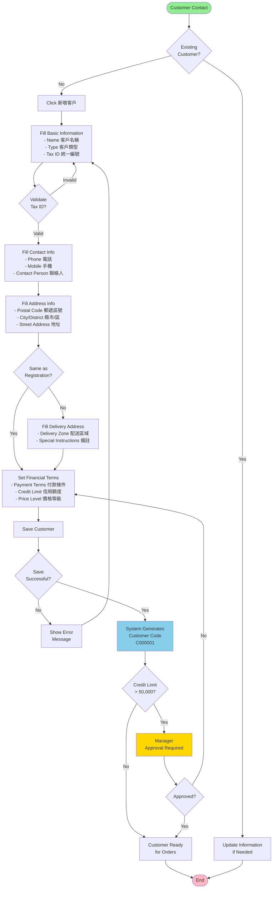
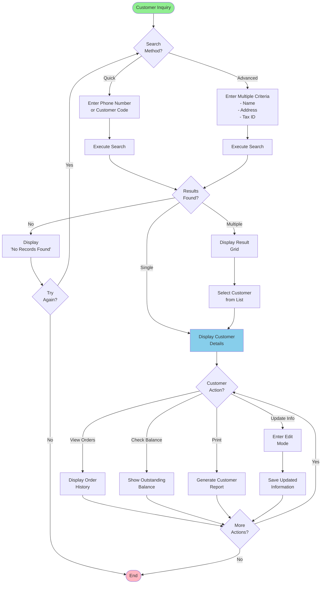
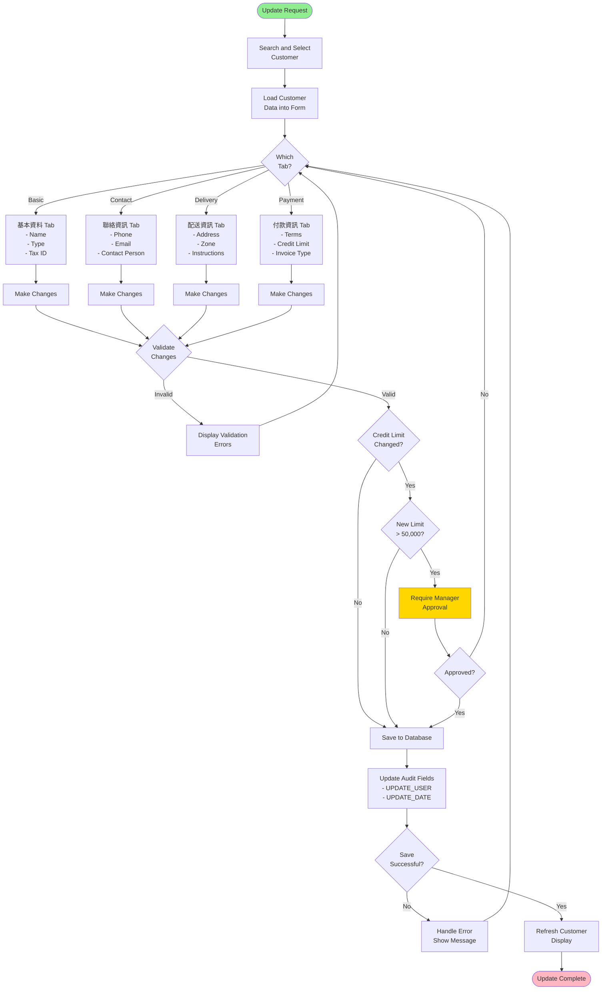
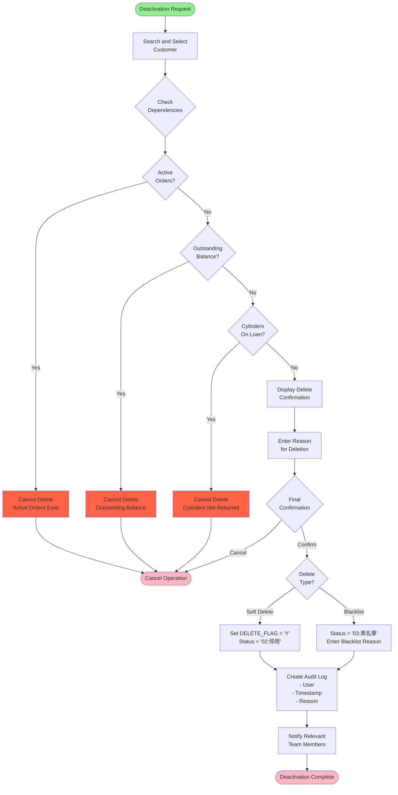
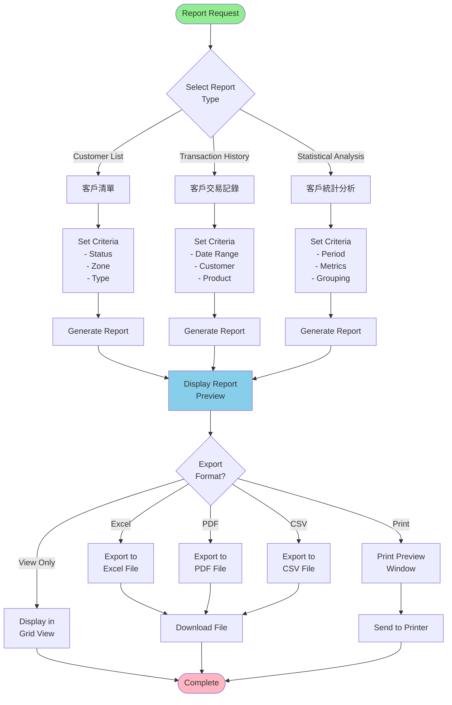

# Customer Management Workflows

## 🔄 Core Business Workflows

### 1. New Customer Registration Workflow



### 2. Customer Search and Inquiry Workflow



### 3. Customer Update Workflow



### 4. Customer Deactivation/Deletion Workflow



## 📊 Reporting Workflows

### 5. Customer Report Generation Workflow



## 🔐 Validation Rules

### Field Validation Matrix

| Field | Validation Rule | Error Message |
|-------|----------------|---------------|
| Tax ID (統一編號) | 8 digits, checksum validation | "統一編號格式錯誤" |
| Phone (電話) | Taiwan landline format | "電話號碼格式錯誤" |
| Mobile (手機) | 09XX-XXX-XXX format | "手機號碼格式錯誤" |
| Email | Standard email regex | "Email格式錯誤" |
| Postal Code | 3 or 5 digits | "郵遞區號格式錯誤" |
| Credit Limit | Numeric, > 0 | "信用額度必須大於0" |

### Business Rule Validations

1. **Duplicate Prevention**
   - Check Tax ID uniqueness (business customers)
   - Warning on duplicate phone numbers
   - Check for similar names (fuzzy match)

2. **Credit Management**
   - Default limit: NT$ 10,000
   - Limits > NT$ 50,000 require manager approval
   - Cannot exceed limit on new orders

3. **Address Validation**
   - Postal code must match city/district
   - Delivery zone must be active service area
   - Multiple addresses allowed per customer

4. **Status Management**
   - Cannot delete with active orders
   - Cannot delete with outstanding balance
   - Blacklist prevents all transactions

## 🚨 Exception Handling

### Common Exceptions and Resolutions

```mermaid
flowchart TD
    Error[Exception Occurs] --> ErrorType{Error Type}
    
    ErrorType -->|Duplicate Tax ID| Dup1[Show "統一編號已存在"<br/>Display Existing Customer]
    ErrorType -->|Invalid Format| Format1[Show Field-Specific<br/>Error Message]
    ErrorType -->|Credit Limit| Credit1[Route to Manager<br/>Approval Workflow]
    ErrorType -->|System Error| System1[Log Error<br/>Show Generic Message]
    
    Dup1 --> Resolution1[Option to Update<br/>Existing Record]
    Format1 --> Resolution2[Highlight Field<br/>Show Correct Format]
    Credit1 --> Resolution3[Wait for Approval<br/>or Reduce Limit]
    System1 --> Resolution4[Retry Operation<br/>or Contact IT]
    
    Resolution1 --> Continue[Continue Process]
    Resolution2 --> Continue
    Resolution3 --> Continue
    Resolution4 --> Continue
    
    style Error fill:#FF6347
    style Continue fill:#90EE90
```

## 💡 Best Practices

### For Customer Service Staff

1. **Always Search First**
   - Prevents duplicate records
   - Finds existing customer quickly
   - Updates are better than new records

2. **Complete Information**
   - Fill all required fields
   - Verify phone numbers
   - Confirm delivery addresses

3. **Notes Are Important**
   - Document special requirements
   - Record customer preferences
   - Note any issues or concerns

### For Managers

1. **Regular Reviews**
   - Check credit limit utilization
   - Review blacklisted customers
   - Monitor inactive accounts

2. **Approval Workflows**
   - Respond to credit approvals promptly
   - Document approval reasons
   - Review patterns for policy updates

3. **Report Analysis**
   - Weekly customer acquisition reports
   - Monthly retention analysis
   - Quarterly business reviews

---

These workflows represent the current state of the Lucky Gas customer management system. Each workflow includes validation points, error handling, and business rule enforcement as implemented in the legacy system.