# Data Maintenance Integration Points - Lucky Gas Legacy System

## 🎯 Integration Overview

The Data Maintenance module serves as the master data foundation for the entire Lucky Gas system. It provides critical reference data to all other modules and integrates with external systems for compliance, validation, and synchronization purposes.

## 🔄 Integration Architecture

```mermaid
graph TB
    DM[Data Maintenance Module]
    
    %% Internal Module Integration
    CM[Customer Management]
    OS[Order Sales]
    DO[Dispatch Operations]
    IO[Invoice Operations]
    AM[Account Management]
    RP[Reports]
    
    %% External System Integration
    GOV[Government Systems]
    BANK[Banking Systems]
    SMS[SMS Gateway]
    MAP[Map Services]
    TAX[Tax Authority]
    HR[HR/Payroll System]
    
    %% Data Flow - Outbound from Data Maintenance
    DM -->|Product Catalog| OS
    DM -->|Pricing Data| OS
    DM -->|Customer Categories| CM
    DM -->|Payment Terms| CM
    DM -->|Employee Data| DO
    DM -->|Zone Config| DO
    DM -->|Tax Rates| IO
    DM -->|Holiday Calendar| DO
    DM -->|Reference Data| RP
    DM -->|Credit Limits| AM
    
    %% Data Flow - Inbound to Data Maintenance
    OS -->|Product Usage| DM
    CM -->|Category Updates| DM
    DO -->|Zone Performance| DM
    AM -->|Payment History| DM
    
    %% External Integration
    DM <-->|Employee Verification| GOV
    DM <-->|Account Validation| BANK
    DM -->|Notifications| SMS
    DM <-->|Zone Mapping| MAP
    DM <-->|Tax Compliance| TAX
    DM <-->|Payroll Sync| HR
    
    %% Styling
    classDef internalModule fill:#4dabf7,stroke:#1864ab,stroke-width:2px,color:#fff
    classDef externalSystem fill:#ffd43b,stroke:#fab005,stroke-width:2px
    classDef mainModule fill:#51cf66,stroke:#2f9e44,stroke-width:3px,color:#fff
    
    class DM mainModule
    class CM,OS,DO,IO,AM,RP internalModule
    class GOV,BANK,SMS,MAP,TAX,HR externalSystem
```



---

## 📊 Internal Module Integration

### 1. Customer Management Module

#### **Data Provided TO Customer Management**
```yaml
Reference Data:
  - customer_categories:
      purpose: "Customer classification"
      fields: ["category_code", "category_name", "credit_default"]
      update_frequency: "Monthly"
      
  - payment_terms:
      purpose: "Credit term assignment"
      fields: ["term_code", "payment_days", "credit_limit"]
      update_frequency: "Quarterly"
      
  - delivery_zones:
      purpose: "Service area assignment"
      fields: ["zone_id", "zone_name", "service_level"]
      update_frequency: "Real-time"
```

#### **Data Received FROM Customer Management**
```yaml
Usage Feedback:
  - category_usage_stats:
      purpose: "Category optimization"
      metrics: ["customer_count", "revenue_contribution"]
      frequency: "Monthly"
      
  - payment_performance:
      purpose: "Credit limit adjustment"
      metrics: ["on_time_rate", "average_days"]
      frequency: "Weekly"
```

#### **Integration Methods**
- **Real-time API**: Zone lookups, category validation
- **Batch Sync**: Monthly category updates
- **Event Stream**: Payment term changes

#### **Error Handling**
```yaml
Scenarios:
  - Missing Category:
      action: "Use default category"
      notification: "Alert data team"
      
  - Invalid Zone:
      action: "Reject assignment"
      message: "區域代碼不存在"
```

---

### 2. Order Sales Module

#### **Data Provided TO Order Sales**
```yaml
Product Information:
  - product_master:
      critical_fields: ["product_id", "active_flag", "standard_price"]
      includes: ["inventory_settings", "deposit_requirements"]
      cache_ttl: "5 minutes"
      
  - pricing_tiers:
      includes: ["special_prices", "promotional_prices", "volume_discounts"]
      real_time: true
      validation: "Effective date checking"
      
  - business_parameters:
      includes: ["min_order_amount", "max_cylinders", "cutoff_times"]
      cache_ttl: "1 hour"
      
  - holiday_calendar:
      purpose: "Delivery date validation"
      lookahead: "30 days"
      includes: ["surcharges", "service_levels"]
```

#### **Data Received FROM Order Sales**
```yaml
Product Performance:
  - sales_velocity:
      metrics: ["daily_sales", "peak_times", "seasonal_patterns"]
      update: "Hourly aggregation"
      
  - pricing_effectiveness:
      metrics: ["discount_usage", "margin_impact"]
      update: "Daily"
      
  - inventory_consumption:
      metrics: ["usage_rate", "stockout_incidents"]
      update: "Real-time"
```

#### **Critical Integration Points**
1. **Price Calculation Service**
   ```yaml
   endpoint: "/api/v1/pricing/calculate"
   input:
     - product_id
     - customer_id
     - quantity
     - order_date
   output:
     - unit_price
     - total_price
     - applied_discounts
     - price_tier_used
   ```

2. **Product Availability Check**
   ```yaml
   endpoint: "/api/v1/products/availability"
   real_time: true
   fallback: "Last known state"
   ```

3. **Order Validation Rules**
   ```yaml
   validations:
     - Product active status
     - Minimum order quantity
     - Customer-product eligibility
     - Zone service availability
   ```

---

### 3. Dispatch Operations Module

#### **Data Provided TO Dispatch Operations**
```yaml
Driver Information:
  - driver_master:
      includes: ["license_status", "medical_status", "zone_authorization"]
      real_time_sync: ["availability", "location"]
      validation: ["license_expiry", "medical_clearance"]
      
  - vehicle_capacity:
      includes: ["max_cylinders", "weight_limit"]
      by_vehicle_type: true
      
  - zone_configuration:
      includes: ["boundaries", "service_hours", "capacity_limits"]
      with_optimization: ["travel_times", "traffic_patterns"]
      
  - holiday_schedule:
      impact: ["driver_availability", "delivery_windows"]
      surcharge_rules: true
```

#### **Data Received FROM Dispatch Operations**
```yaml
Operational Feedback:
  - zone_performance:
      metrics: ["delivery_times", "success_rates", "customer_satisfaction"]
      frequency: "Daily"
      
  - driver_performance:
      metrics: ["deliveries_completed", "on_time_rate", "incidents"]
      frequency: "Weekly"
      
  - capacity_utilization:
      metrics: ["peak_usage", "idle_time", "overflow_incidents"]
      frequency: "Real-time"
```

#### **Real-time Integration**
```yaml
WebSocket Events:
  - driver.status.changed
  - zone.capacity.updated
  - holiday.service.modified
  
Notifications:
  - License expiry warnings
  - Zone boundary changes
  - Service hour modifications
```

---

### 4. Invoice Operations Module

#### **Data Provided TO Invoice Operations**
```yaml
Financial Data:
  - tax_configurations:
      includes: ["tax_rates", "invoice_types", "exemptions"]
      by_customer_type: true
      effective_dates: true
      
  - product_descriptions:
      includes: ["invoice_name", "tax_category", "unit_of_measure"]
      multi_language: ["zh-TW", "en"]
      
  - payment_terms:
      for_invoice: ["due_date_calculation", "late_charges"]
      discounts: ["early_payment_terms"]
```

#### **Integration Requirements**
```yaml
Compliance:
  - Government invoice format
  - Tax calculation accuracy
  - Audit trail maintenance
  
Timing:
  - Real-time tax lookups
  - Immediate price updates
  - Synchronized payment terms
```

---

### 5. Account Management Module

#### **Data Provided TO Account Management**
```yaml
Credit Management:
  - credit_limits:
      by_customer_type: true
      default_values: true
      override_authority: "Manager"
      
  - payment_terms:
      for_aging: ["payment_days", "grace_period"]
      for_interest: ["late_charge_percent"]
      
  - customer_categories:
      credit_policies: true
      risk_levels: true
```

#### **Data Received FROM Account Management**
```yaml
Payment Behavior:
  - payment_patterns:
      metrics: ["average_days_to_pay", "default_rate"]
      by_category: true
      
  - credit_utilization:
      metrics: ["average_usage", "peak_usage", "exceeded_incidents"]
      frequency: "Daily"
```

---

### 6. Reports Module

#### **Data Provided TO Reports**
```yaml
All Reference Data:
  - Complete lookups:
      purpose: "Report dimension tables"
      includes: ["all_categories", "all_codes", "descriptions"]
      
  - Historical snapshots:
      purpose: "Trend analysis"
      includes: ["price_history", "parameter_changes"]
      retention: "2 years"
      
  - Hierarchies:
      includes: ["product_categories", "employee_org_chart", "zone_regions"]
      for_aggregation: true
```

#### **Report Integration**
```yaml
Scheduled Extracts:
  - Daily: "Active master data"
  - Weekly: "Change summaries"
  - Monthly: "Full snapshots"
  
On-demand Access:
  - Direct database views
  - Cached aggregates
  - Real-time queries
```

---

## 🌐 External System Integration

### 1. Government Systems

#### **National ID Verification (內政部)**
```yaml
Integration Type: "REST API"
Purpose: "Employee identity verification"
Endpoint: "https://api.gov.tw/identity/verify"
Authentication: "OAuth 2.0"

Operations:
  - verify_national_id:
      input: ["national_id", "name", "birth_date"]
      output: ["valid", "match_score"]
      cache: "30 days"
      
Error Handling:
  - Service unavailable: "Queue for retry"
  - Invalid ID: "Reject with reason"
  - Timeout: "Allow manual override"
```

#### **Business Registration (經濟部)**
```yaml
Integration Type: "SOAP Web Service"
Purpose: "Company verification for B2B"
Frequency: "On customer creation"

Data Exchange:
  - Unified Business Number validation
  - Company name verification
  - Registration status check
```

---

### 2. Banking Systems

#### **Account Verification**
```yaml
Banks Integrated:
  - "中國信託 (CTBC)"
  - "台灣銀行 (BOT)"
  - "國泰世華 (CUB)"
  
Integration Method: "File-based (SFTP)"
Schedule: "Daily batch at 2 AM"
Format: "Fixed-width text"

Validation Process:
  1. Export employee bank details
  2. Bank validates overnight
  3. Import validation results
  4. Update invalid accounts
```

#### **Salary Transfer Interface**
```yaml
Format: "ACH file format"
Schedule: "Monthly on 25th"
Validation: "Pre-transfer verification"
Reconciliation: "Post-transfer matching"
```

---

### 3. SMS Gateway (簡訊服務)**

#### **SMS Provider Integration**
```yaml
Provider: "三竹資訊 (MITAKE)"
Protocol: "HTTPS POST"
Encoding: "UTF-8"
Rate Limit: "100 msgs/second"

Message Types:
  - employee_notifications:
      events: ["schedule_change", "license_expiry"]
      template: "Parameterized"
      
  - system_alerts:
      events: ["password_reset", "access_granted"]
      priority: "High"
      
Error Handling:
  - Delivery failure: "Retry 3 times"
  - Invalid number: "Log and notify HR"
```

---

### 4. Map Services

#### **Google Maps Integration**
```yaml
API Key Management:
  - Environment-based keys
  - Usage monitoring
  - Cost alerts
  
Zone Services:
  - geocoding:
      purpose: "Address to coordinates"
      cache: "Permanent"
      
  - reverse_geocoding:
      purpose: "Coordinates to address"
      validation: "Taiwan format"
      
  - distance_matrix:
      purpose: "Zone travel times"
      update: "Weekly"
      
  - places_autocomplete:
      purpose: "Address entry assistance"
      region: "TW"
```

#### **Zone Boundary Management**
```yaml
Storage: "PostGIS polygons"
Visualization: "Leaflet.js"
Updates: "Quarterly review"
Validation: "No gaps or overlaps"
```

---

### 5. Tax Authority (財政部)

#### **e-Invoice Platform**
```yaml
Platform: "電子發票整合服務平台"
Environment:
  - Testing: "https://wwwtest.einvoice.nat.gov.tw"
  - Production: "https://www.einvoice.nat.gov.tw"
  
Integration Points:
  - tax_rate_updates:
      method: "Pull latest rates"
      frequency: "Monthly"
      
  - business_number_validation:
      real_time: true
      cache: "7 days"
      
  - invoice_number_allocation:
      method: "Batch request"
      timing: "Bi-monthly"
```

---

### 6. HR/Payroll System

#### **Payroll Synchronization**
```yaml
System: "External Payroll Provider"
Integration: "Bi-directional sync"
Protocol: "REST API + Webhooks"

Data Sync:
  From Data Maintenance:
    - employee_master: ["id", "name", "bank_details", "salary"]
    - attendance_records: ["dates", "hours", "overtime"]
    - leave_balances: ["earned", "taken", "remaining"]
    
  To Data Maintenance:
    - payroll_results: ["gross", "deductions", "net"]
    - tax_withholdings: ["amounts", "categories"]
    - year_end_bonus: ["calculations", "payments"]
    
Frequency: "Real-time + Daily batch"
```

---

## 🔄 Integration Patterns

### 1. Synchronization Strategies

#### **Real-time Sync**
```yaml
Used For:
  - Product availability
  - Zone configurations
  - Employee status
  - Parameter updates
  
Technology: "WebSockets + REST callbacks"
Fallback: "Polling every 30 seconds"
```

#### **Batch Sync**
```yaml
Used For:
  - Bank validations
  - Payroll data
  - Report extracts
  - Historical data
  
Schedule:
  - Critical: "Every 4 hours"
  - Standard: "Daily at 2 AM"
  - Historical: "Weekly Sunday"
  
Error Recovery: "Automatic retry with exponential backoff"
```

#### **Event-Driven Sync**
```yaml
Event Bus: "Redis Pub/Sub"
Topics:
  - maintenance.product.updated
  - maintenance.employee.status_changed
  - maintenance.zone.modified
  - maintenance.parameter.changed
  
Subscribers: "All dependent modules"
Guarantee: "At-least-once delivery"
```

### 2. Data Consistency Patterns

#### **Master Data Authority**
```yaml
Principle: "Data Maintenance is single source of truth"
Enforcement:
  - No local copies in other modules
  - Cache invalidation on updates
  - Referential integrity checks
  - Version tracking for changes
```

#### **Distributed Transaction Management**
```yaml
Pattern: "Saga with compensating transactions"
Example Flow:
  1. Update product price
  2. Notify Order module
  3. Update active orders
  4. If failure: Rollback price
  5. Log transaction outcome
```

### 3. Performance Optimization

#### **Caching Strategy**
```yaml
Cache Layers:
  1. Application (Redis):
     - Product catalog: 5 minutes
     - Employee data: 1 hour
     - Parameters: Until changed
     
  2. Database (Materialized Views):
     - Zone aggregates
     - Pricing matrices
     - Reference lookups
     
  3. CDN (Static Data):
     - Holiday calendars
     - Tax tables
     - Zone maps
```

#### **Bulk Operation Handling**
```yaml
Patterns:
  - Batch imports: "Queue-based processing"
  - Mass updates: "Stored procedures"
  - Large exports: "Streaming with pagination"
  
Limits:
  - Import: "10,000 records/batch"
  - Update: "1,000 records/transaction"
  - Export: "100,000 records/file"
```

---

## 🚨 Integration Monitoring

### Health Checks
```yaml
Internal Modules:
  - Endpoint: "/health/dependencies"
  - Frequency: "Every 30 seconds"
  - Alerts: "If 2 consecutive failures"
  
External Systems:
  - Method: "Synthetic transactions"
  - Frequency: "Every 5 minutes"
  - Escalation: "Progressive notification"
```

### Performance Metrics
```yaml
Tracked Metrics:
  - API response times
  - Sync lag times
  - Cache hit rates
  - Error rates
  - Queue depths
  
Thresholds:
  - Response time: "<200ms p95"
  - Sync lag: "<5 minutes"
  - Cache hit: ">90%"
  - Error rate: "<0.1%"
  - Queue depth: "<1000"
```

### Integration Dashboards
```yaml
Real-time Monitoring:
  - System dependencies map
  - Data flow visualization
  - Error hot spots
  - Performance trends
  
Tools:
  - Grafana dashboards
  - ELK stack for logs
  - Prometheus metrics
  - PagerDuty alerts
```

---

## 📋 Integration Testing

### Test Scenarios
```yaml
Module Integration Tests:
  - Product update propagation
  - Zone change impact
  - Employee status sync
  - Parameter cascade effects
  
External Integration Tests:
  - Government API availability
  - Bank file processing
  - SMS delivery rates
  - Map service accuracy
  
End-to-End Tests:
  - New employee onboarding
  - Product lifecycle
  - Zone reconfiguration
  - Holiday impact analysis
```

### Test Data Management
```yaml
Test Environments:
  - Isolated test database
  - Mock external services
  - Synthetic test data
  - Production-like volumes
  
Data Refresh:
  - Daily from production
  - Anonymized sensitive data
  - Maintain relationships
  - Include edge cases
```

---

## 🔐 Security Considerations

### API Security
```yaml
Internal APIs:
  - JWT authentication
  - Role-based access
  - Rate limiting
  - Request signing
  
External APIs:
  - API key rotation
  - IP whitelisting
  - SSL/TLS only
  - Audit logging
```

### Data Protection
```yaml
In Transit:
  - TLS 1.2+ required
  - Certificate pinning
  - VPN for batch transfers
  
At Rest:
  - Encryption for sensitive fields
  - Key management service
  - Access audit trails
  
PII Handling:
  - Masking in logs
  - Tokenization
  - Retention policies
  - Right to deletion
```

---

## 📈 Integration Success Metrics

### KPIs
- **System Availability**: 99.9% uptime
- **Data Accuracy**: 99.99% consistency
- **Sync Latency**: <5 minutes average
- **API Performance**: <200ms p95
- **Integration Errors**: <0.1% of transactions

### Business Impact
- **Operational Efficiency**: 30% reduction in manual updates
- **Data Quality**: 50% fewer data discrepancies
- **User Satisfaction**: 90% positive feedback
- **Cost Savings**: 25% reduction in integration maintenance