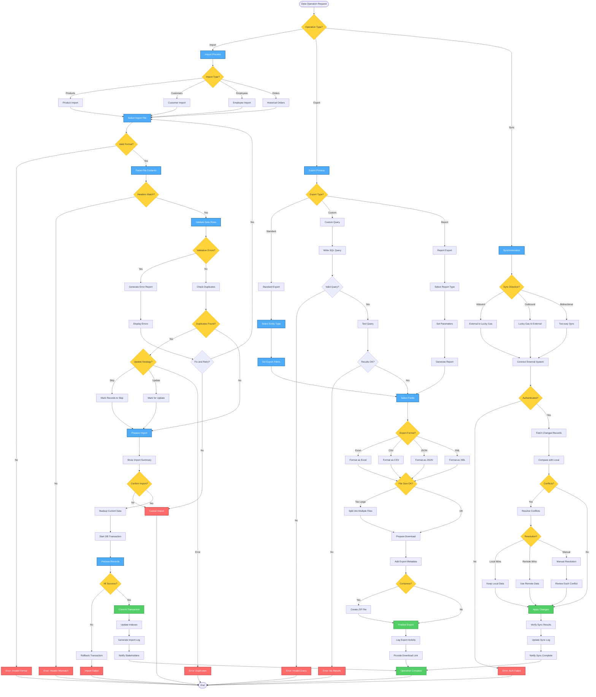

# Data Import/Export Workflow - Lucky Gas Legacy System

## 🎯 Workflow Purpose

The Data Import/Export workflow facilitates bulk data operations for system maintenance, migration, integration with external systems, and regulatory reporting. This workflow is critical for maintaining data consistency across systems and enabling efficient bulk updates.

## 📊 Workflow Overview



## 🔄 Process Steps

### 1. Data Import Process

**Step 1.1: File Format Specifications**
```yaml
Supported Formats:
  - Excel (.xlsx, .xls): With headers
  - CSV: UTF-8 encoded, comma-delimited
  - JSON: Array of objects
  - XML: Structured with schema
  
File Size Limits:
  - Maximum: 50MB per file
  - Row Limit: 100,000 records
  - Timeout: 30 minutes processing
```

**Step 1.2: Import Templates**
```yaml
Product Import Columns:
  - product_code*: 產品代碼
  - product_name*: 產品名稱
  - product_category*: 類別代碼
  - product_size*: 規格
  - standard_price*: 標準價格
  - min_order_qty: 最小訂購量
  - requires_deposit: Y/N
  - deposit_amount: 押金金額
  - active_flag: Y/N
  
Customer Import Columns:
  - customer_code*: 客戶代碼
  - customer_name*: 客戶名稱
  - customer_type*: 客戶類型
  - contact_phone*: 聯絡電話
  - delivery_address*: 送貨地址
  - postal_code: 郵遞區號
  - credit_limit: 信用額度
  - payment_terms: 付款條件
  
Employee Import Columns:
  - employee_code*: 員工代碼
  - national_id*: 身分證字號
  - employee_name*: 姓名
  - employee_type*: 員工類型
  - department*: 部門
  - phone_mobile*: 手機號碼
  - hire_date*: 入職日期
  - base_salary: 基本薪資
```

**Step 1.3: Validation Rules**
```yaml
Data Validation:
  Required Fields:
    - Check not null/empty
    - Verify data types
    - Validate formats
  
  Business Rules:
    - Code uniqueness
    - Reference integrity
    - Value ranges
    - Date logic
  
  Taiwan-Specific:
    - National ID checksum
    - Phone number format
    - Postal code validity
    - Address structure
```

**Step 1.4: Duplicate Handling**
```yaml
Duplicate Strategies:
  Skip:
    - Ignore duplicate records
    - Continue with unique records
    - Log skipped records
    
  Update:
    - Update existing records
    - Preserve certain fields
    - Track changes made
    
  Error:
    - Stop on first duplicate
    - Report all duplicates
    - Require resolution
```

**Step 1.5: Transaction Management**
```yaml
Import Process:
  1. Begin transaction
  2. Disable triggers/constraints
  3. Insert/Update records
  4. Re-enable constraints
  5. Validate referential integrity
  6. Commit or rollback
  7. Update indexes/statistics
```

### 2. Data Export Process

**Step 2.1: Export Types**
```yaml
Standard Exports:
  - All Products
  - Active Customers
  - Employee List
  - Order History
  - Inventory Status
  
Custom Exports:
  - SQL-based queries
  - Complex joins
  - Aggregations
  - Date ranges
  
Report Exports:
  - Monthly sales
  - Customer statements
  - Inventory reports
  - Financial summaries
```

**Step 2.2: Export Formats**
```yaml
Excel Format:
  - Multiple sheets supported
  - Formatting preserved
  - Formulas included
  - Charts/graphs optional
  
CSV Format:
  - Plain text
  - Configurable delimiter
  - Header row included
  - UTF-8 encoding
  
JSON Format:
  - Nested objects
  - Array structure
  - Metadata included
  - Pretty print option
  
XML Format:
  - Schema included
  - Namespace support
  - CDATA for text
  - Validation available
```

**Step 2.3: Field Selection**
```yaml
Field Options:
  - Select all fields
  - Choose specific fields
  - Rename field headers
  - Add calculated fields
  - Apply formatting
  
Sensitive Data:
  - Mask personal IDs
  - Hide salary info
  - Exclude passwords
  - Anonymize option
```

**Step 2.4: Large Data Handling**
```yaml
Size Management:
  Thresholds:
    - <10MB: Direct download
    - 10-50MB: Compressed download
    - >50MB: Split files
    - >100MB: Background job
  
  Splitting Strategy:
    - By record count
    - By date range
    - By category
    - By file size
```

### 3. Data Synchronization

**Step 3.1: Sync Configuration**
```yaml
Sync Partners:
  - Accounting System
  - Payroll System
  - Government Portal
  - Bank Systems
  
Sync Frequency:
  - Real-time: Critical data
  - Hourly: Operational data
  - Daily: Reference data
  - Weekly: Historical data
```

**Step 3.2: Conflict Resolution**
```yaml
Conflict Types:
  - Update-Update: Both sides changed
  - Delete-Update: One side deleted
  - Schema mismatch: Structure changed
  - Business rule: Validation conflict
  
Resolution Strategies:
  - Timestamp-based: Latest wins
  - Priority-based: Source system wins
  - Field-level: Merge changes
  - Manual: User decides
```

**Step 3.3: Sync Monitoring**
```yaml
Monitoring Points:
  - Connection status
  - Records processed
  - Errors encountered
  - Performance metrics
  - Data quality scores
  
Alerts:
  - Connection failures
  - High error rates
  - Performance degradation
  - Data inconsistencies
```

## 📋 Business Rules

### Import Rules
1. **Batch Size**: Maximum 10,000 records per batch
2. **Validation**: All records validated before import
3. **Rollback**: All-or-nothing transaction
4. **Logging**: Every import logged with details
5. **Approval**: Large imports need approval

### Export Rules
1. **Permission**: Role-based export access
2. **Audit**: All exports logged
3. **Retention**: Export files retained 7 days
4. **Scheduling**: Recurring exports supported
5. **Limits**: Max records per export

### Sync Rules
1. **Priority**: Real-time > Batch sync
2. **Retry**: 3 attempts on failure
3. **Throttling**: Rate limits applied
4. **Validation**: Two-way validation
5. **Recovery**: Automatic recovery

## 🔐 Security & Compliance

### Access Control
| Operation | View | Import | Export | Sync | Approve |
|-----------|------|--------|--------|------|---------|
| Products | All | Manager+ | Manager+ | Admin | Manager |
| Customers | Sales+ | Manager+ | Manager+ | Admin | Manager |
| Employees | HR+ | HR | HR | Admin | HR Manager |
| Financial | Finance+ | Finance | Finance | Admin | CFO |

### Data Protection
```yaml
Security Measures:
  - Encryption in transit
  - Temporary file cleanup
  - Access logging
  - Data masking options
  - Retention policies
  
Compliance:
  - GDPR compliance
  - Personal data protection
  - Export restrictions
  - Audit trail requirements
  - Right to deletion
```

### File Handling
```yaml
Upload Security:
  - Virus scanning
  - File type validation
  - Size limits enforced
  - Sandbox processing
  - Secure storage
  
Download Security:
  - Temporary URLs
  - Access tokens
  - Download limits
  - Watermarking
  - Activity logging
```

## 🔄 Integration Points

### Internal Systems
1. **Validation Services**: Data quality checks
2. **Notification Service**: Import/export alerts
3. **Audit System**: Activity logging
4. **Queue System**: Background processing
5. **Storage Service**: File management

### External Systems
1. **Cloud Storage**: Backup and archive
2. **Email Service**: Result delivery
3. **FTP/SFTP**: Automated transfers
4. **API Gateway**: REST endpoints
5. **Message Queue**: Event streaming

## ⚡ Performance Considerations

### Import Performance
- Batch processing: 1000 records/batch
- Parallel validation: 4 threads
- Index updates: Deferred
- Constraint checks: Bulk mode
- Memory usage: Streaming for large files

### Export Performance
- Query optimization: Indexed fields
- Pagination: 10000 records/page
- Compression: On-the-fly
- Caching: Frequent exports
- Async processing: Large exports

### Sync Performance
- Delta sync: Changed records only
- Compression: Network traffic
- Connection pooling: Reuse connections
- Batch updates: Group changes
- Circuit breaker: Failure protection

## 🚨 Error Handling

### Import Errors
1. **Format Errors**: Show line numbers
2. **Validation Errors**: Detailed messages
3. **Duplicate Errors**: List all duplicates
4. **System Errors**: Rollback and notify
5. **Timeout Errors**: Resume capability

### Export Errors
1. **Query Errors**: SQL error details
2. **Memory Errors**: Suggest smaller export
3. **Format Errors**: Fallback to CSV
4. **Permission Errors**: Show required role
5. **System Errors**: Retry option

### Sync Errors
1. **Connection Errors**: Retry with backoff
2. **Data Errors**: Quarantine bad records
3. **Conflict Errors**: Manual resolution
4. **Timeout Errors**: Checkpoint resume
5. **Schema Errors**: Version mismatch alert

## 📊 Success Metrics

### Import Metrics
- Success rate: >99%
- Processing speed: 1000 records/minute
- Error rate: <1%
- User satisfaction: >90%

### Export Metrics
- Completion rate: 99.9%
- Average time: <30 seconds
- Format accuracy: 100%
- Delivery success: 99.5%

### Sync Metrics
- Sync accuracy: 99.99%
- Latency: <5 minutes
- Conflict rate: <0.1%
- Uptime: 99.9%