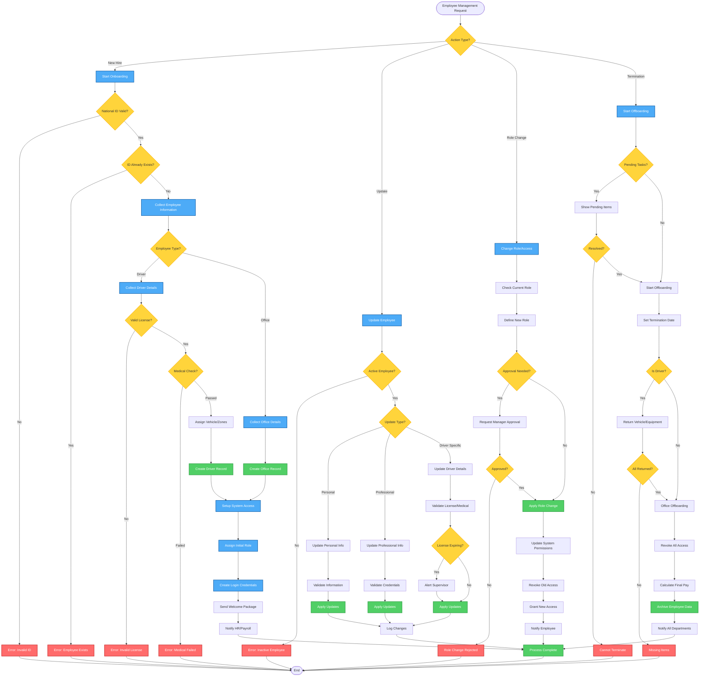

# Employee Management Workflow - Lucky Gas Legacy System

## 🎯 Workflow Purpose

The Employee Management workflow handles the complete employee lifecycle from onboarding to offboarding, including role assignments, license management, and performance tracking. This workflow is critical for maintaining proper access control and ensuring only qualified personnel handle gas deliveries.

## 📊 Workflow Overview



## 🔄 Process Steps

### 1. Employee Onboarding Process

**Step 1.1: Identity Verification**
```yaml
Required Documents:
  - National ID (身分證)
  - Health Insurance Card (健保卡)
  - Bank Account Details
  - Emergency Contact Info
  
Driver Additional:
  - Driving License (駕照)
  - Medical Certificate (體檢證明)
  - Vehicle Registration (行照)
  - Insurance Policy (保險證明)
```

**Step 1.2: Data Collection**
```yaml
Personal Information:
  - Full name (Chinese & English)
  - National ID number
  - Birth date (age verification)
  - Gender
  - Contact numbers
  - Home address
  - Emergency contact

Professional Information:
  - Department assignment
  - Position/title
  - Hire date
  - Salary type & amount
  - Bank details
  - Previous experience
```

**Step 1.3: Driver-Specific Requirements**
```yaml
License Validation:
  - License type (minimum required)
  - Expiry date (>6 months)
  - Traffic violation check
  - Previous accidents

Medical Requirements:
  - Physical examination
  - Vision test
  - Drug screening
  - Annual renewal

Zone Assignment:
  - Familiar areas
  - Vehicle capacity
  - Customer density
  - Experience level
```

**Step 1.4: System Access Setup**
```yaml
Access Provisioning:
  - Employee ID generation
  - Login credentials
  - Email account (if applicable)
  - Role-based permissions
  - Module access rights
  - Mobile app access (drivers)
```

### 2. Employee Update Process

**Step 2.1: Personal Information Updates**
```yaml
Self-Service Updates:
  - Phone numbers
  - Emergency contact
  - Home address
  - Bank account

HR Approval Required:
  - Name changes
  - National ID corrections
  - Marital status
  - Dependent information
```

**Step 2.2: Professional Updates**
```yaml
Supervisor Initiated:
  - Performance scores
  - Training records
  - Certifications
  - Zone assignments

HR Initiated:
  - Salary changes
  - Position changes
  - Department transfers
  - Leave records
```

**Step 2.3: License & Certification Management**
```yaml
Tracking Requirements:
  - License expiry alerts (60 days)
  - Medical check reminders (30 days)
  - Insurance renewal notices
  - Training certification updates

Automatic Actions:
  - Suspend driving privileges on expiry
  - Alert supervisors
  - Block vehicle assignments
  - Require renewal proof
```

### 3. Role & Permission Management

**Step 3.1: Role Hierarchy**
```yaml
System Roles:
  SUPER_ADMIN:
    - Full system access
    - All modules
    - All data
    
  MANAGER:
    - Department data
    - Approval workflows
    - Report access
    
  SUPERVISOR:
    - Team management
    - Basic reports
    - Operation access
    
  OPERATOR:
    - Transaction entry
    - Basic queries
    - Own data access
    
  DRIVER:
    - Delivery app
    - Route information
    - Customer details
```

**Step 3.2: Permission Matrix**
| Module | Admin | Manager | Supervisor | Operator | Driver |
|--------|-------|---------|------------|----------|--------|
| Employee Mgmt | CRUD | CRU | RU | R | - |
| Order Mgmt | CRUD | CRUD | CRU | CRU | R |
| Customer Data | CRUD | CRUD | RU | RU | R |
| Financial | CRUD | R | - | - | - |
| Reports | All | Dept | Basic | - | - |

**Step 3.3: Role Change Process**
```yaml
Approval Requirements:
  - Promotion: Manager approval
  - Dept Transfer: Both managers
  - Access Upgrade: Security review
  - Admin Rights: GM approval

Implementation:
  - Effective date setting
  - Previous role archival
  - Permission migration
  - Access card update
  - System notification
```

### 4. Employee Offboarding Process

**Step 4.1: Pre-Termination Checklist**
```yaml
Driver Checklist:
  - Pending deliveries
  - Vehicle return
  - Uniform return
  - Equipment return
  - Customer handover
  - Route documentation

Office Staff:
  - Pending tasks
  - Document handover
  - System access list
  - Project transfer
  - Knowledge transfer
```

**Step 4.2: Access Revocation**
```yaml
Immediate Actions:
  - Disable login
  - Revoke building access
  - Email deactivation
  - VPN removal
  
Scheduled Actions:
  - Data archival
  - Account deletion
  - License return
  - Final settlement
```

**Step 4.3: Final Processing**
```yaml
HR Tasks:
  - Final pay calculation
  - Leave encashment
  - Tax documents
  - Experience certificate
  - Reference letter

System Tasks:
  - Data anonymization
  - Audit log retention
  - Report exclusion
  - Backup creation
```

## 📋 Business Rules

### Hiring Rules
1. **Age Requirement**: Minimum 18 years, drivers min 20
2. **License Requirements**: Valid for role, 1+ year experience
3. **Medical Standards**: Pass health check for drivers
4. **Background Check**: No serious criminal record
5. **Probation Period**: 3 months standard

### Update Rules
1. **Change Frequency**: Personal info monthly limit
2. **Verification Required**: ID/license changes
3. **Approval Hierarchy**: Based on data sensitivity
4. **Audit Trail**: All changes logged
5. **Notification**: Relevant parties informed

### Termination Rules
1. **Notice Period**: 30 days standard, immediate for cause
2. **Exit Interview**: Required for voluntary
3. **Asset Return**: Within 3 days
4. **Data Retention**: 7 years for records
5. **Reference**: Based on performance

## 🔐 Security & Compliance

### Data Protection
```yaml
Sensitive Fields:
  - National ID (masked display)
  - Salary information (restricted)
  - Medical records (HR only)
  - Performance data (manager+)
  - Personal contact (self/HR)
```

### Access Control
- Role-based access enforced
- Field-level security
- Audit logging mandatory
- Regular access reviews
- Segregation of duties

### Compliance Requirements
- Labor law compliance
- Privacy regulations
- Tax reporting requirements
- Insurance obligations
- Safety certifications

## 🔄 Integration Points

### Internal Systems
1. **Payroll System**: Employee master sync
2. **Access Control**: Badge management
3. **Vehicle Management**: Driver assignments
4. **Training System**: Certification tracking
5. **Order System**: Delivery assignments

### External Systems
1. **Government**: Labor insurance reporting
2. **Banks**: Salary transfers
3. **Insurance**: Policy management
4. **Background Check**: Verification services

## ⚡ Performance Considerations

### Response Times
- Employee search: < 1 second
- Onboarding process: < 30 minutes
- Role changes: < 5 minutes
- Report generation: < 10 seconds

### Data Volumes
- Active employees: ~50-100
- Historical records: ~500
- Monthly updates: ~100
- Daily logins: ~80

## 🚨 Error Handling

### Common Errors
1. **Duplicate ID**: Check existing records
2. **Invalid License**: Verify with authority
3. **Expired Documents**: Alert and suspend
4. **Missing Approvals**: Route to approver
5. **Access Conflicts**: Review permissions

### Recovery Procedures
- Rollback capabilities
- Approval override process
- Emergency access procedures
- Data correction workflows
- Audit trail for investigation

## 📊 Success Metrics

### Operational Metrics
- Onboarding time: < 1 day
- Document accuracy: 99%
- System availability: 99.5%
- Update processing: < 1 hour

### Business Metrics
- Employee satisfaction: > 80%
- Compliance rate: 100%
- Document completeness: 95%
- Training compliance: 100%