# System Parameter Update Workflow - Lucky Gas Legacy System

## 🎯 Workflow Purpose

The System Parameter Update workflow manages critical system configurations that control business operations, including delivery zones, payment terms, holiday calendars, and operational settings. These parameters directly impact order processing, pricing, and service delivery across the entire Lucky Gas system.

## 📊 Workflow Overview

```mermaid
graph TB
    Start([Parameter Update Request]) --> ParamType{Parameter Type?}
    
    ParamType -->|System Settings| SystemParam[System Parameters]
    ParamType -->|Zone Config| ZoneConfig[Delivery Zones]
    ParamType -->|Payment Terms| PaymentConfig[Payment Terms]
    ParamType -->|Holiday Calendar| HolidayConfig[Holiday Calendar]
    ParamType -->|Tax Settings| TaxConfig[Tax Configuration]
    
    %% System Parameter Flow
    SystemParam --> CheckCategory{Parameter Category?}
    CheckCategory -->|Business Rules| BizRules[Business Rule Update]
    CheckCategory -->|System Settings| SysSettings[System Setting Update]
    CheckCategory -->|Integration| Integration[Integration Config]
    
    BizRules --> ValidateBizRule[Validate Business Impact]
    SysSettings --> CheckRestart{Requires Restart?}
    Integration --> CheckConnectivity[Test Connectivity]
    
    ValidateBizRule --> BizApproval{Manager Approval?}
    BizApproval -->|No| Error1[Update Rejected]
    BizApproval -->|Yes| ScheduleBizUpdate[Schedule Update]
    
    CheckRestart -->|Yes| ScheduleMaintenance[Schedule Maintenance Window]
    CheckRestart -->|No| ApplySysImmediate[Apply Immediately]
    
    CheckConnectivity -->|Failed| Error2[Connection Error]
    CheckConnectivity -->|Success| ApplyIntegration[Update Integration]
    
    %% Zone Configuration Flow
    ZoneConfig --> ZoneAction{Zone Action?}
    ZoneAction -->|New Zone| CreateZone[Create New Zone]
    ZoneAction -->|Update Zone| UpdateZone[Update Existing]
    ZoneAction -->|Deactivate| DeactivateZone[Deactivate Zone]
    
    CreateZone --> ValidatePostal[Validate Postal Codes]
    ValidatePostal -->|Invalid| Error3[Invalid Postal Codes]
    ValidatePostal -->|Valid| CheckOverlap{Zone Overlap?}
    CheckOverlap -->|Yes| Error4[Zone Overlap Detected]
    CheckOverlap -->|No| SetZoneFees[Set Delivery Fees]
    SetZoneFees --> SetServiceHours[Set Service Hours]
    SetServiceHours --> CreateZoneRecord[Create Zone Record]
    
    UpdateZone --> CheckActiveOrders{Active Orders in Zone?}
    CheckActiveOrders -->|Yes| WarnOrders[Warning: Active Orders]
    CheckActiveOrders -->|No| ApplyZoneUpdate[Apply Zone Updates]
    WarnOrders --> ConfirmUpdate{Confirm Update?}
    ConfirmUpdate -->|No| Error5[Update Cancelled]
    ConfirmUpdate -->|Yes| ApplyZoneUpdate
    
    DeactivateZone --> CheckZoneOrders{Orders Exist?}
    CheckZoneOrders -->|Yes| Error6[Cannot Deactivate]
    CheckZoneOrders -->|No| ConfirmDeactivate[Confirm Deactivation]
    ConfirmDeactivate --> MigrateCustomers[Migrate Customers]
    MigrateCustomers --> DeactivateRecord[Deactivate Zone]
    
    %% Payment Terms Flow
    PaymentConfig --> PaymentAction{Payment Action?}
    PaymentAction -->|New Terms| CreateTerms[Create Payment Terms]
    PaymentAction -->|Update Terms| UpdateTerms[Update Terms]
    
    CreateTerms --> ValidateTerms[Validate Term Logic]
    ValidateTerms --> CheckCustomerType[Check Customer Types]
    CheckCustomerType --> SetCreditDefaults[Set Credit Defaults]
    SetCreditDefaults --> CreateTermRecord[Create Terms Record]
    
    UpdateTerms --> CheckTermUsage{Terms In Use?}
    CheckTermUsage -->|Yes| ShowAffected[Show Affected Customers]
    CheckTermUsage -->|No| ApplyTermUpdate[Apply Updates]
    ShowAffected --> TermApproval{Approve Changes?}
    TermApproval -->|No| Error7[Terms Update Rejected]
    TermApproval -->|Yes| ApplyTermUpdate
    
    %% Holiday Calendar Flow
    HolidayConfig --> CalendarYear[Select Calendar Year]
    CalendarYear --> HolidayAction{Action Type?}
    HolidayAction -->|Add Holiday| AddHoliday[Add Holiday Date]
    HolidayAction -->|Modify| ModifyHoliday[Modify Holiday]
    HolidayAction -->|Import| ImportHolidays[Import Gov Calendar]
    
    AddHoliday --> CheckDuplicate{Date Exists?}
    CheckDuplicate -->|Yes| Error8[Duplicate Holiday]
    CheckDuplicate -->|No| SetHolidayType[Set Holiday Type]
    SetHolidayType --> SetServiceLevel[Set Service Level]
    SetServiceLevel --> SetSurcharge[Set Holiday Surcharge]
    SetSurcharge --> CreateHoliday[Create Holiday Record]
    
    ModifyHoliday --> CheckOrdersOnDate{Orders on Date?}
    CheckOrdersOnDate -->|Yes| WarnDateOrders[Show Affected Orders]
    CheckOrdersOnDate -->|No| ApplyHolidayUpdate[Apply Updates]
    WarnDateOrders --> ConfirmHoliday{Proceed?}
    ConfirmHoliday -->|No| Error9[Holiday Update Cancelled]
    ConfirmHoliday -->|Yes| NotifyCustomers[Notify Customers]
    NotifyCustomers --> ApplyHolidayUpdate
    
    ImportHolidays --> ValidateFormat[Validate Import Format]
    ValidateFormat -->|Invalid| Error10[Invalid Format]
    ValidateFormat -->|Valid| MergeCalendar[Merge with Existing]
    MergeCalendar --> ReviewChanges[Review All Changes]
    ReviewChanges --> BulkApproval{Approve Import?}
    BulkApproval -->|No| Error11[Import Cancelled]
    BulkApproval -->|Yes| ApplyBulkHolidays[Apply All Holidays]
    
    %% Tax Configuration Flow
    TaxConfig --> TaxAction{Tax Action?}
    TaxAction -->|Update Rate| UpdateTaxRate[Update Tax Rate]
    TaxAction -->|New Category| CreateTaxCategory[Create Tax Category]
    
    UpdateTaxRate --> ValidateRate[Validate Tax Rate]
    ValidateRate --> SetTaxEffective[Set Effective Date]
    SetTaxEffective --> TaxApproval{Finance Approval?}
    TaxApproval -->|No| Error12[Tax Update Rejected]
    TaxApproval -->|Yes| NotifyAccounting[Notify Accounting]
    NotifyAccounting --> ApplyTaxUpdate[Apply Tax Update]
    
    CreateTaxCategory --> DefineTaxRules[Define Tax Rules]
    DefineTaxRules --> LinkProducts[Link to Products]
    LinkProducts --> CreateTaxRecord[Create Tax Record]
    
    %% Convergence Points
    ScheduleBizUpdate --> NotifyUsers[Notify All Users]
    ApplySysImmediate --> LogUpdate[Log Parameter Change]
    ScheduleMaintenance --> NotifyMaintenance[Send Maintenance Notice]
    ApplyIntegration --> TestIntegration[Test Integration]
    
    CreateZoneRecord --> NotifyDrivers[Notify Drivers]
    ApplyZoneUpdate --> NotifyDrivers
    DeactivateRecord --> NotifyDrivers
    
    CreateTermRecord --> NotifySales[Notify Sales Team]
    ApplyTermUpdate --> NotifySales
    
    CreateHoliday --> UpdateSchedule[Update Delivery Schedule]
    ApplyHolidayUpdate --> UpdateSchedule
    ApplyBulkHolidays --> UpdateSchedule
    
    ApplyTaxUpdate --> UpdatePricing[Update Product Pricing]
    CreateTaxRecord --> UpdatePricing
    
    %% Success Convergence
    NotifyUsers --> Success[Parameter Update Complete]
    LogUpdate --> Success
    NotifyMaintenance --> Success
    TestIntegration --> Success
    NotifyDrivers --> Success
    NotifySales --> Success
    UpdateSchedule --> Success
    UpdatePricing --> Success
    
    %% Error Convergence
    Error1 --> End([End])
    Error2 --> End
    Error3 --> End
    Error4 --> End
    Error5 --> End
    Error6 --> End
    Error7 --> End
    Error8 --> End
    Error9 --> End
    Error10 --> End
    Error11 --> End
    Error12 --> End
    
    Success --> End
    
    %% Styling
    classDef errorStyle fill:#ff6b6b,stroke:#c92a2a,stroke-width:2px,color:#fff
    classDef successStyle fill:#51cf66,stroke:#2f9e44,stroke-width:2px,color:#fff
    classDef processStyle fill:#4dabf7,stroke:#1864ab,stroke-width:2px,color:#fff
    classDef decisionStyle fill:#ffd43b,stroke:#fab005,stroke-width:2px
    
    class Error1,Error2,Error3,Error4,Error5,Error6,Error7,Error8,Error9,Error10,Error11,Error12 errorStyle
    class Success,CreateZoneRecord,ApplyZoneUpdate,CreateTermRecord,ApplyTermUpdate,CreateHoliday,ApplyHolidayUpdate,ApplyTaxUpdate successStyle
    class SystemParam,ZoneConfig,PaymentConfig,HolidayConfig,TaxConfig,ValidateBizRule,ScheduleBizUpdate,ApplySysImmediate processStyle
    class ParamType,CheckCategory,BizApproval,CheckRestart,ZoneAction,CheckActiveOrders,PaymentAction,HolidayAction,TaxAction decisionStyle
```



## 🔄 Process Steps

### 1. System Parameter Updates

**Step 1.1: Parameter Categories**
```yaml
Business Rules:
  - ORDER.VALIDATION.MIN_AMOUNT: 最低訂單金額
  - ORDER.VALIDATION.MAX_CYLINDERS: 最大訂購瓶數
  - DELIVERY.CUTOFF.TIME: 當日配送截止時間
  - CREDIT.CHECK.ENABLED: 信用檢查啟用
  
System Settings:
  - SYSTEM.MAINTENANCE.MODE: 維護模式
  - SYSTEM.BACKUP.TIME: 備份時間
  - SYSTEM.SESSION.TIMEOUT: 登入逾時
  - SYSTEM.LOG.RETENTION: 日誌保留天數
  
Integration Settings:
  - SMS.API.ENDPOINT: 簡訊服務端點
  - PAYMENT.GATEWAY.URL: 付款閘道
  - MAP.SERVICE.KEY: 地圖服務金鑰
  - INVOICE.PLATFORM.URL: 發票平台
```

**Step 1.2: Update Validation**
```yaml
Validation Rules:
  - Data type compliance
  - Range validation (min/max)
  - Format validation (regex)
  - Business logic validation
  - Dependency checking
  
Risk Assessment:
  - High Risk: Affects money/orders
  - Medium Risk: Affects operations
  - Low Risk: Display/UI only
```

**Step 1.3: Change Implementation**
```yaml
Immediate Changes:
  - UI display settings
  - Report parameters
  - Notification settings
  
Scheduled Changes:
  - Core business rules
  - Integration endpoints
  - System behaviors
  
Restart Required:
  - Database connections
  - Cache settings
  - Service endpoints
```

### 2. Delivery Zone Configuration

**Step 2.1: Zone Definition**
```yaml
Zone Properties:
  - zone_code: Unique identifier
  - zone_name: Display name
  - zone_type: Urban/Suburban/Remote
  - city: 縣市
  - districts: 區域列表
  - postal_codes: 郵遞區號
```

**Step 2.2: Service Configuration**
```yaml
Delivery Settings:
  - base_delivery_fee: 基本運費
  - rush_delivery_fee: 急件運費
  - min_order_amount: 最低訂單金額
  - free_delivery_threshold: 免運門檻
  
Service Hours:
  - service_days: 服務日 (1-7)
  - service_start_time: 開始時間
  - service_end_time: 結束時間
  - cutoff_time: 截止時間
  - time_slots: 配送時段
```

**Step 2.3: Zone Overlap Detection**
```yaml
Validation Process:
  1. Extract postal codes
  2. Check existing zones
  3. Identify conflicts
  4. Suggest resolution
  5. Require confirmation
```

### 3. Payment Terms Management

**Step 3.1: Term Configuration**
```yaml
Payment Properties:
  - term_code: NET30, NET60
  - payment_days: 付款天數
  - discount_days: 折扣期限
  - discount_percent: 早付折扣
  - late_charge_percent: 遲付罰息
  - grace_days: 寬限期
```

**Step 3.2: Credit Defaults**
```yaml
Credit Settings:
  - credit_limit_default: 預設額度
  - requires_approval: 需要核准
  - customer_types: 適用客戶類型
  - special_conditions: 特殊條件
```

**Step 3.3: Impact Analysis**
```yaml
Customer Impact:
  - Count affected customers
  - Calculate credit changes
  - Identify risk increases
  - Generate impact report
  - Require approval for >10 customers
```

### 4. Holiday Calendar Management

**Step 4.1: Holiday Types**
```yaml
Holiday Categories:
  01: 國定假日 (National Holiday)
  02: 彈性放假 (Flexible Holiday)
  03: 補班日 (Make-up Work Day)
  04: 公司假日 (Company Holiday)
  05: 特殊營業 (Special Hours)
```

**Step 4.2: Service Level Settings**
```yaml
Service Options:
  - Closed: 不營業
  - Normal: 正常營業
  - Reduced: 減班服務
  - Emergency: 僅急件
  
Surcharge Settings:
  - percentage: 0-50%
  - fixed_amount: Optional
  - applies_to: All/Specific products
```

**Step 4.3: Government Calendar Import**
```yaml
Import Process:
  1. Download official calendar
  2. Parse holiday data
  3. Match with system format
  4. Identify conflicts
  5. Merge with existing
  6. Review all changes
  7. Bulk apply updates
```

### 5. Tax Configuration

**Step 5.1: Tax Rate Management**
```yaml
Tax Properties:
  - tax_code: VAT_5, VAT_0
  - tax_rate: 稅率百分比
  - tax_type: 營業稅/營所稅
  - invoice_type: 二聯/三聯/電子
  - effective_from: 生效日期
```

**Step 5.2: Product Linkage**
```yaml
Tax Application:
  - Product categories
  - Customer types
  - Transaction types
  - Geographic zones
  - Special exemptions
```

## 📋 Business Rules

### Parameter Update Rules
1. **Approval Requirements**: Based on risk level
2. **Effective Timing**: Immediate or scheduled
3. **Validation**: Must pass all checks
4. **Notification**: All affected users
5. **Rollback**: Previous value preserved

### Zone Management Rules
1. **No Overlaps**: Postal codes unique
2. **Complete Coverage**: No gaps in service
3. **Minimum Service**: At least 5 days/week
4. **Fee Logic**: Base < Rush, Free threshold
5. **Capacity Limits**: Max orders per slot

### Payment Terms Rules
1. **Grace Period**: Minimum 3 days
2. **Late Charges**: Maximum 2% monthly
3. **Discount Logic**: Early payment only
4. **Credit Limits**: Based on history
5. **Term Assignment**: By customer type

### Holiday Rules
1. **Advance Notice**: 30 days minimum
2. **Surcharge Limits**: Max 50%
3. **Service Guarantee**: Emergency always
4. **Overlap Prevention**: One status per date
5. **Historical Lock**: Cannot change past

## 🔐 Security & Permissions

### Access Control Matrix
| Parameter Type | View | Create | Update | Delete | Approve |
|---------------|------|--------|--------|--------|---------|
| System Settings | Manager+ | Admin | Admin | N/A | Manager |
| Business Rules | All | Manager+ | Manager+ | N/A | Manager |
| Zones | All | Manager+ | Manager+ | Admin | Manager |
| Payment Terms | Manager+ | Manager+ | Manager+ | Admin | Finance |
| Holidays | All | Supervisor+ | Supervisor+ | Admin | Manager |
| Tax Config | Finance+ | Finance | Finance | N/A | Finance |

### Audit Requirements
- All changes logged
- Previous values stored
- Approval chain tracked
- Effective dates recorded
- User actions traced

## 🔄 Integration Points

### Internal Systems
1. **Order System**: Business rules applied
2. **Delivery System**: Zone configurations
3. **Customer System**: Payment terms
4. **Scheduling**: Holiday calendar
5. **Accounting**: Tax settings

### External Notifications
1. **Customers**: Service changes
2. **Drivers**: Zone updates
3. **Partners**: Holiday schedules
4. **Government**: Tax compliance

## ⚡ Performance Considerations

### Caching Strategy
- Parameters: 24-hour cache
- Zones: 1-hour cache
- Holidays: Daily refresh
- Tax rates: On-change only

### Update Frequency
- System params: ~10/month
- Zone changes: ~5/month
- Payment terms: ~2/month
- Holidays: ~20/year
- Tax updates: ~4/year

## 🚨 Error Handling

### Common Errors
1. **Invalid Values**: Show valid range
2. **Overlap Detected**: Highlight conflicts
3. **Approval Missing**: Route to approver
4. **Impact Too High**: Require override
5. **Integration Failed**: Rollback changes

### Recovery Procedures
- Automatic rollback
- Previous value restore
- Notification of failure
- Manual override option
- Escalation process

## 📊 Success Metrics

### Operational Metrics
- Update success rate: 99%
- Parameter accuracy: 100%
- Change lead time: <2 hours
- System stability: 99.9%

### Business Metrics
- Configuration errors: <1/month
- Service coverage: 100%
- Holiday accuracy: 100%
- Tax compliance: 100%