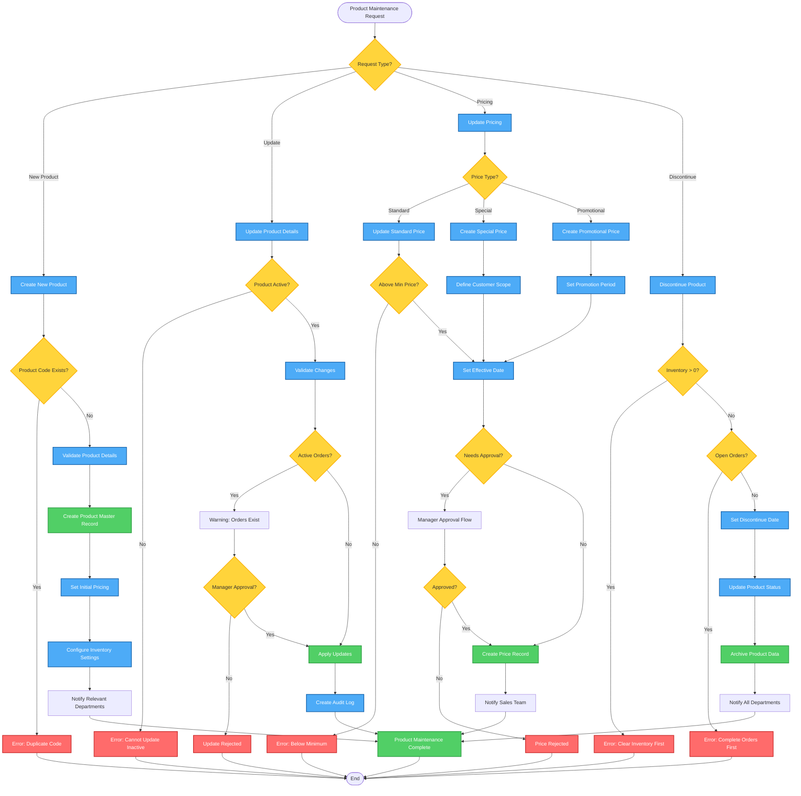

# Product Maintenance Workflow - Lucky Gas Legacy System

## 🎯 Workflow Purpose

The Product Maintenance workflow manages the complete lifecycle of gas cylinder products, including creation, pricing updates, inventory settings, and discontinuation. This workflow ensures data integrity while supporting complex pricing structures and Taiwan-specific business rules.

## 📊 Workflow Overview



## 🔄 Process Steps

### 1. Product Creation Process

**Step 1.1: Validate Product Code**
- Check uniqueness across system
- Verify format compliance (P[0-9]{3})
- Reserve code in system

**Step 1.2: Product Master Creation**
```yaml
Required Fields:
  - product_code: Business identifier
  - product_name: Chinese name
  - product_category: 01-04
  - product_size: 4KG/16KG/20KG/50KG
  - unit_of_measure: UNIT/SET/PACK
  - standard_price: Base price
  - weight_kg: Physical weight
  - track_inventory: true/false
  - requires_deposit: true/false
  - tax_rate: Default 5%
```

**Step 1.3: Initial Pricing Setup**
- Set standard retail price
- Define minimum price threshold
- Configure deposit amount if applicable
- Set tax-inclusive flag

**Step 1.4: Inventory Configuration**
- Set safety stock level
- Configure reorder point
- Define reorder quantity
- Set lead time days

### 2. Product Update Process

**Step 2.1: Update Validation**
```yaml
Validation Rules:
  - Product must be active
  - No pending price changes
  - Manager approval for critical fields
  - Check impact on active orders
  
Restricted Fields (Need Approval):
  - product_code (never changeable)
  - standard_price (affects all customers)
  - tax_rate (financial impact)
  - requires_deposit (customer impact)
```

**Step 2.2: Change Application**
- Update master record
- Create audit trail
- Version previous values
- Trigger notifications

### 3. Pricing Update Process

**Step 3.1: Price Hierarchy**
```yaml
Price Types (Priority Order):
  1. Contract Price: Customer-specific contracts
  2. Special Price: Customer category prices
  3. Promotional Price: Time-limited offers
  4. Volume Price: Quantity-based discounts
  5. Standard Price: Base retail price
```

**Step 3.2: Price Approval Matrix**
| Change Type | Discount % | Approver Required |
|------------|------------|-------------------|
| Standard Price | Any | Manager |
| Special Price | < 10% | Supervisor |
| Special Price | ≥ 10% | Manager |
| Promotional | < 15% | Supervisor |
| Promotional | ≥ 15% | Manager |
| Below Cost | Any | General Manager |

**Step 3.3: Effective Date Rules**
- Standard prices: Next business day minimum
- Special prices: Immediate or scheduled
- Promotional: Must have end date
- All changes: Cannot be retroactive

### 4. Product Discontinuation Process

**Step 4.1: Pre-Discontinuation Checks**
```yaml
Required Conditions:
  - Zero physical inventory
  - No open orders
  - No active promotions
  - All deposits returned
  - No pending deliveries
```

**Step 4.2: Discontinuation Steps**
1. Set discontinue date (minimum 30 days notice)
2. Block new orders
3. Notify all customers with standing orders
4. Process final inventory adjustments
5. Archive product data
6. Update reporting exclusions

## 📋 Business Rules

### Pricing Rules
1. **Minimum Price Protection**: Cannot set price below cost + 10%
2. **Maximum Discount**: 25% without GM approval
3. **Price Effective Time**: 00:00 on effective date
4. **Price History**: Maintain 2 years of price history
5. **Promotional Overlap**: No overlapping promotions

### Inventory Rules
1. **Safety Stock**: Minimum 3 days of average usage
2. **Reorder Point**: Safety stock + lead time usage
3. **Maximum Stock**: 30 days of average usage
4. **Stock Validation**: Physical count monthly

### Taiwan-Specific Rules
1. **Lucky Numbers**: Prefer prices ending in 8
2. **Avoid Unlucky**: No prices ending in 4
3. **Festival Pricing**: Special rules during lunar new year
4. **B2B Invoicing**: Special tax invoice requirements

## 🔐 Security & Permissions

### Role-Based Access
| Role | Create | Update | Price Change | Discontinue |
|------|--------|--------|--------------|-------------|
| Admin | ✅ | ✅ | ✅ | ✅ |
| Manager | ✅ | ✅ | ✅ | ✅ |
| Supervisor | ❌ | ✅ | Limited | ❌ |
| Operator | ❌ | Limited | ❌ | ❌ |

### Audit Requirements
- All changes logged with timestamp
- User identification required
- Previous values preserved
- Change reasons documented
- Approval chain tracked

## 🔄 Integration Points

### Internal Systems
1. **Order Management**: Check active orders
2. **Inventory System**: Validate stock levels
3. **Customer Management**: Special pricing assignments
4. **Financial System**: Cost and margin data

### Notifications
1. **Sales Team**: Price changes, new products
2. **Warehouse**: Inventory parameter changes
3. **Customer Service**: Discontinuation notices
4. **Finance**: Tax rate changes

## ⚡ Performance Considerations

### Response Times
- Product search: < 1 second
- Price calculation: < 100ms
- Update operations: < 2 seconds
- Bulk updates: Batched processing

### Data Volumes
- Products: ~100 active items
- Price records: ~1000 active prices
- Historical data: 2 years retention
- Audit logs: 5 years retention

## 🚨 Error Handling

### Common Errors
1. **Duplicate Product Code**: Show existing product
2. **Below Minimum Price**: Display minimum allowed
3. **Inventory Exists**: Show current stock levels
4. **Active Orders**: List affected orders
5. **Missing Approval**: Route to approver

### Recovery Procedures
- Transaction rollback on errors
- Audit log for troubleshooting
- Notification of failed updates
- Manual override capabilities

## 📊 Success Metrics

### Operational Metrics
- Product creation time: < 5 minutes
- Price update accuracy: 99.9%
- Approval turnaround: < 2 hours
- System availability: 99.5%

### Business Metrics
- Price competitiveness maintained
- Inventory optimization achieved
- Margin targets protected
- Compliance requirements met