# Order Sales Integration Points (訂單銷售整合點)

**Module**: Order Sales  
**Document Version**: 1.0  
**Last Updated**: 2024-01-25  
**Integration Complexity**: ⭐⭐⭐⭐⭐ (Highest - Core business hub)

## 📋 Overview

The Order Sales module serves as the central hub of Lucky Gas operations, integrating with virtually every other module in the system. This document details all integration points, data flows, dependencies, and synchronization requirements.

## 🔗 Integration Architecture

```mermaid
graph TB
    OS[Order Sales<br/>訂單銷售] --> CM[Customer Management<br/>會員作業]
    OS --> DM[Data Maintenance<br/>資料維護]
    OS --> DO[Dispatch Operations<br/>派遣作業]
    OS --> IO[Invoice Operations<br/>發票作業]
    OS --> AM[Account Management<br/>帳務管理]
    OS --> RP[Reports<br/>報表作業]
    
    CM --> OS
    DM --> OS
    DO --> OS
    IO --> OS
    AM --> OS
    
    OS --> EXT1[SMS Gateway<br/>簡訊閘道]
    OS --> EXT2[Payment Gateway<br/>金流服務]
    OS --> EXT3[e-Invoice Platform<br/>電子發票平台]
    OS --> EXT4[Google Maps API<br/>地圖服務]
```



## 🏢 Internal Module Integrations

### 1. Customer Management (會員作業)

#### Data Flow Direction: Bidirectional
#### Integration Type: Real-time, Synchronous

**From Customer Management:**
```javascript
// Customer data retrieval
GET /internal/customers/{customer_id}
Response: {
    customer_id: "C000123",
    customer_name: "王大明",
    phone_primary: "0912-345-678",
    tax_id: "12345678",
    customer_type: "COMMERCIAL",
    credit_limit: 50000.00,
    credit_used: 12000.00,
    credit_available: 38000.00,
    status: "ACTIVE",
    payment_terms: "NET30",
    delivery_addresses: [
        {
            address_id: 456,
            address_type: "01",  // Delivery
            full_address: "台北市信義區信義路五段7號",
            postal_code: "11049",
            zone: "NORTH",
            is_default: true
        }
    ],
    special_prices: [
        {
            product_id: "P001",
            special_price: 820.00,
            valid_until: "2024-12-31"
        }
    ]
}
```

**To Customer Management:**
```javascript
// Update credit utilization
POST /internal/customers/{customer_id}/credit
Body: {
    operation: "RESERVE",  // RESERVE, RELEASE, USE
    amount: 1835.00,
    order_id: "O-20240125-000123",
    timestamp: "2024-01-25T14:30:00Z"
}

// Update customer statistics
POST /internal/customers/{customer_id}/statistics
Body: {
    last_order_date: "2024-01-25",
    total_orders_count: 156,
    total_order_value: 234500.00,
    average_order_value: 1503.20,
    favorite_products: ["P001", "P002"]
}
```

**Integration Points:**
1. **Customer Validation**: Every order creation
2. **Credit Check**: Order creation and modification
3. **Address Retrieval**: Delivery planning
4. **Statistics Update**: After order completion
5. **Payment History**: Credit limit adjustments

### 2. Data Maintenance (資料維護)

#### Data Flow Direction: Unidirectional (Data Maintenance → Order Sales)
#### Integration Type: Cached, Asynchronous updates

**From Data Maintenance:**
```javascript
// Product catalog
GET /internal/products
Response: {
    products: [
        {
            product_id: "P001",
            product_name: "20kg 瓦斯桶",
            product_size: "20KG",
            standard_price: 850.00,
            track_inventory: true,
            available_quantity: 523,
            reserved_quantity: 45,
            requires_empty_return: true,
            deposit_amount: 1500.00,
            active: true
        }
    ]
}

// Pricing rules
GET /internal/pricing/rules
Response: {
    volume_discounts: [
        {
            min_quantity: 10,
            discount_percent: 2
        },
        {
            min_quantity: 20,
            discount_percent: 3
        }
    ],
    zone_delivery_fees: {
        "NORTH": 50.00,
        "CENTRAL": 80.00,
        "SOUTH": 100.00,
        "REMOTE": 200.00
    },
    time_slot_surcharges: {
        "URGENT": 1.5,
        "EVENING": 1.3,
        "HOLIDAY": 2.0
    }
}

// System parameters
GET /internal/parameters
Response: {
    business_hours: {
        weekday_start: "08:00",
        weekday_end: "18:00",
        saturday_start: "08:00",
        saturday_end: "12:00",
        sunday: "CLOSED"
    },
    order_settings: {
        minimum_order_value: 800.00,
        same_day_cutoff: "14:00",
        advance_booking_days: 30,
        cancellation_window_hours: 4
    }
}
```

**Cache Management:**
```javascript
// Cache invalidation notification
POST /internal/cache/invalidate
Body: {
    cache_type: "PRODUCTS",  // PRODUCTS, PRICES, PARAMETERS
    affected_ids: ["P001", "P002"],
    effective_time: "2024-01-25T15:00:00Z"
}
```

### 3. Dispatch Operations (派遣作業)

#### Data Flow Direction: Bidirectional
#### Integration Type: Real-time, Event-driven

**To Dispatch Operations:**
```javascript
// Submit orders for dispatch
POST /internal/dispatch/orders
Body: {
    delivery_date: "2024-01-26",
    orders: [
        {
            order_id: "O-20240125-000123",
            customer_id: "C000123",
            delivery_address: "台北市信義區信義路五段7號",
            time_slot: "02",
            priority: "NORMAL",
            products: [
                {
                    product_id: "P001",
                    quantity: 2,
                    weight_kg: 40
                }
            ],
            special_instructions: "請按門鈴",
            contact_phone: "0912-345-678"
        }
    ]
}

// Update dispatch assignment
PUT /internal/dispatch/orders/{order_id}/assign
Body: {
    dispatch_id: "D-20240126-001",
    driver_id: "DRV001",
    vehicle_id: "3456-AB",
    route_sequence: 5,
    estimated_arrival: "2024-01-26T14:30:00Z"
}
```

**From Dispatch Operations:**
```javascript
// Dispatch status updates
POST /internal/orders/{order_id}/dispatch-status
Body: {
    status: "DRIVER_ASSIGNED",  // ASSIGNED, EN_ROUTE, ARRIVED, COMPLETED, FAILED
    driver_id: "DRV001",
    timestamp: "2024-01-26T13:45:00Z",
    location: {
        latitude: 25.0330,
        longitude: 121.5654
    },
    notes: "Driver on the way"
}

// Route optimization results
GET /internal/dispatch/routes/{date}
Response: {
    routes: [
        {
            driver_id: "DRV001",
            vehicle_id: "3456-AB",
            total_stops: 15,
            total_distance_km: 45.6,
            estimated_duration_mins: 240,
            orders: [
                {
                    sequence: 1,
                    order_id: "O-20240125-000098",
                    estimated_arrival: "2024-01-26T09:15:00Z"
                }
            ]
        }
    ]
}
```

**WebSocket Events:**
```javascript
// Real-time driver location
{
    event: "driver.location.updated",
    data: {
        driver_id: "DRV001",
        order_id: "O-20240125-000123",
        location: {
            latitude: 25.0330,
            longitude: 121.5654,
            accuracy: 10,
            speed_kmh: 35,
            heading: 145
        },
        timestamp: "2024-01-26T14:25:00Z"
    }
}

// Delivery events
{
    event: "delivery.status.changed",
    data: {
        order_id: "O-20240125-000123",
        old_status: "EN_ROUTE",
        new_status: "ARRIVED",
        driver_id: "DRV001",
        timestamp: "2024-01-26T14:30:00Z"
    }
}
```

### 4. Invoice Operations (發票作業)

#### Data Flow Direction: Unidirectional (Order Sales → Invoice Operations)
#### Integration Type: Asynchronous, Queue-based

**To Invoice Operations:**
```javascript
// Request invoice generation
POST /internal/invoices/generate
Body: {
    order_id: "O-20240125-000123",
    invoice_type: "TRIPLICATE",  // DUPLICATE, TRIPLICATE
    customer_info: {
        customer_id: "C000123",
        customer_name: "大同股份有限公司",
        tax_id: "12345678",
        address: "台北市中山區...",
        email: "accounting@datong.com.tw"
    },
    items: [
        {
            description: "20kg 瓦斯桶",
            quantity: 2,
            unit_price: 850.00,
            amount: 1700.00
        }
    ],
    subtotal: 1700.00,
    tax_amount: 85.00,
    total_amount: 1785.00,
    payment_info: {
        method: "MONTHLY",
        due_date: "2024-02-25"
    }
}

// Cancel invoice request
POST /internal/invoices/{invoice_id}/cancel
Body: {
    reason: "ORDER_CANCELLED",
    order_id: "O-20240125-000123",
    cancelled_by: "USER001"
}
```

**From Invoice Operations:**
```javascript
// Invoice generation confirmation
POST /internal/orders/{order_id}/invoice-generated
Body: {
    invoice_id: "IV-202401-12345",
    invoice_number: "AB12345678",
    invoice_date: "2024-01-25",
    pdf_url: "https://invoices.luckygas.com.tw/2024/01/AB12345678.pdf",
    qr_code: "AB123456782024012517850000000085000...",
    submission_status: "PENDING"  // PENDING, SUBMITTED, ACCEPTED, REJECTED
}
```

### 5. Account Management (帳務管理)

#### Data Flow Direction: Bidirectional
#### Integration Type: Real-time for payments, Batch for reconciliation

**To Account Management:**
```javascript
// Create receivable
POST /internal/accounts/receivables
Body: {
    order_id: "O-20240125-000123",
    customer_id: "C000123",
    amount: 1785.00,
    due_date: "2024-02-25",
    invoice_id: "IV-202401-12345",
    payment_terms: "NET30"
}

// Update payment collection
POST /internal/accounts/payments
Body: {
    order_id: "O-20240125-000123",
    payment_method: "CASH",
    amount_collected: 1785.00,
    collected_by: "DRV001",
    collection_date: "2024-01-26T14:45:00Z",
    reference_number: "CASH-20240126-001"
}
```

**From Account Management:**
```javascript
// Payment status updates
POST /internal/orders/{order_id}/payment-status
Body: {
    payment_status: "PAID",  // UNPAID, PARTIAL, PAID, OVERDUE
    paid_amount: 1785.00,
    paid_date: "2024-01-26",
    payment_method: "CASH",
    receipt_number: "RCP-20240126-001"
}

// Credit hold notifications
POST /internal/customers/{customer_id}/credit-hold
Body: {
    hold_status: "ACTIVE",  // ACTIVE, RELEASED
    hold_reason: "OVERDUE_PAYMENT",
    overdue_amount: 5600.00,
    days_overdue: 45,
    affected_orders: ["O-20240125-000456", "O-20240125-000457"]
}
```

### 6. Reports (報表作業)

#### Data Flow Direction: Unidirectional (Order Sales → Reports)
#### Integration Type: Batch, Scheduled

**To Reports Module:**
```javascript
// Daily order summary
POST /internal/reports/daily-orders
Body: {
    report_date: "2024-01-25",
    summary: {
        total_orders: 156,
        total_revenue: 234500.00,
        total_cylinders: 203,
        cancelled_orders: 4,
        delivery_success_rate: 0.94
    },
    by_zone: {
        "NORTH": {
            orders: 67,
            revenue: 98500.00
        }
    },
    by_product: {
        "P001": {
            quantity: 145,
            revenue: 123250.00
        }
    },
    by_customer_type: {
        "COMMERCIAL": {
            orders: 89,
            revenue: 156300.00
        }
    }
}

// Real-time metrics feed
POST /internal/reports/metrics
Body: {
    metric_type: "ORDER_CREATED",
    timestamp: "2024-01-25T14:30:00Z",
    dimensions: {
        zone: "NORTH",
        customer_type: "COMMERCIAL",
        product_category: "STANDARD",
        payment_method: "MONTHLY"
    },
    values: {
        order_count: 1,
        revenue: 1785.00,
        cylinder_count: 2
    }
}
```

## 🌐 External System Integrations

### 1. SMS Gateway Integration

**Provider**: TwSMS / Mitake  
**Protocol**: REST API  
**Authentication**: API Key

```javascript
// Send order confirmation
POST https://api.twsms.com/send
Headers: {
    "Authorization": "Bearer {API_KEY}",
    "Content-Type": "application/json"
}
Body: {
    "to": "0912345678",
    "message": "您的訂單 O-20240125-000123 已確認。預計配送時間：1/26 下午。金額：NT$1,785",
    "sender": "LUCKYGAS"
}

// Delivery notification
POST https://api.twsms.com/send
Body: {
    "to": "0912345678",
    "message": "您的瓦斯即將送達，司機李師傅(0923456789)約10分鐘後到達。",
    "sender": "LUCKYGAS"
}
```

### 2. Payment Gateway Integration

**Provider**: ECPay / NewebPay  
**Protocol**: REST API + Callback  
**Authentication**: Merchant ID + Hash

```javascript
// Process online payment
POST https://payment.ecpay.com.tw/checkout
Body: {
    "MerchantID": "2000132",
    "MerchantTradeNo": "O20240125000123",
    "MerchantTradeDate": "2024/01/25 14:30:00",
    "PaymentType": "aio",
    "TotalAmount": 1785,
    "TradeDesc": "Lucky Gas Order",
    "ItemName": "20kg瓦斯桶 x 2",
    "ReturnURL": "https://api.luckygas.com.tw/payment/callback",
    "ClientBackURL": "https://luckygas.com.tw/orders/O-20240125-000123"
}

// Payment callback handler
POST /payment/callback
Body: {
    "MerchantID": "2000132",
    "MerchantTradeNo": "O20240125000123",
    "RtnCode": 1,  // 1 = Success
    "RtnMsg": "交易成功",
    "TradeNo": "2401251430320098",
    "TradeAmt": 1785,
    "PaymentDate": "2024/01/25 14:35:23",
    "PaymentType": "Credit_CreditCard",
    "CheckMacValue": "..."
}
```

### 3. e-Invoice Platform Integration

**Provider**: Ministry of Finance (財政部)  
**Protocol**: XML/SOAP  
**Authentication**: Certificate-based

```javascript
// Submit e-invoice
POST https://www.einvoice.nat.gov.tw/BIZAPIVAN/biz
SOAPAction: "CreateInvoice"
Body: (XML)
<Invoice>
    <Main>
        <InvoiceNumber>AB12345678</InvoiceNumber>
        <InvoiceDate>20240125</InvoiceDate>
        <InvoiceTime>14:45:00</InvoiceTime>
        <Seller>
            <Identifier>12345678</Identifier>
            <Name>幸福氣體有限公司</Name>
        </Seller>
        <Buyer>
            <Identifier>23456789</Identifier>
            <Name>大同股份有限公司</Name>
        </Buyer>
    </Main>
    <Details>
        <ProductItem>
            <Description>20kg瓦斯桶</Description>
            <Quantity>2</Quantity>
            <UnitPrice>850</UnitPrice>
            <Amount>1700</Amount>
        </ProductItem>
    </Details>
    <Amount>
        <SalesAmount>1700</SalesAmount>
        <TaxAmount>85</TaxAmount>
        <TotalAmount>1785</TotalAmount>
    </Amount>
</Invoice>
```

### 4. Google Maps API Integration

**Service**: Distance Matrix API, Geocoding API  
**Authentication**: API Key  
**Usage**: Address validation, Distance calculation

```javascript
// Validate delivery address
GET https://maps.googleapis.com/maps/api/geocode/json
?address=台北市信義區信義路五段7號
&language=zh-TW
&region=tw
&key={API_KEY}

Response: {
    "results": [{
        "formatted_address": "110台灣台北市信義區信義路五段7號",
        "geometry": {
            "location": {
                "lat": 25.0330,
                "lng": 121.5654
            }
        },
        "place_id": "ChIJH56c2rarQjQRphD1dKDrAg8"
    }],
    "status": "OK"
}

// Calculate delivery distance
GET https://maps.googleapis.com/maps/api/distancematrix/json
?origins=25.0477,121.5170  // Warehouse
&destinations=25.0330,121.5654  // Customer
&mode=driving
&language=zh-TW
&key={API_KEY}

Response: {
    "rows": [{
        "elements": [{
            "distance": {
                "text": "5.2 公里",
                "value": 5234
            },
            "duration": {
                "text": "12 分",
                "value": 720
            }
        }]
    }]
}
```

## 🔄 Data Synchronization Requirements

### Real-time Sync Requirements
1. **Customer credit updates**: < 100ms
2. **Inventory availability**: < 200ms
3. **Order status changes**: < 500ms
4. **Payment confirmations**: < 1 second

### Batch Sync Schedule
1. **Customer statistics**: Every 1 hour
2. **Product catalog**: Every 4 hours
3. **Pricing updates**: Daily at 02:00
4. **Report aggregation**: Daily at 03:00

### Event-Driven Updates
```javascript
// WebSocket event subscriptions
const eventSubscriptions = [
    'customer.credit.changed',
    'product.stock.low',
    'product.price.updated',
    'delivery.status.changed',
    'payment.received',
    'invoice.generated'
];

// Event handler
socket.on('event', (data) => {
    switch(data.event) {
        case 'customer.credit.changed':
            updateLocalCreditCache(data.customer_id, data.new_credit);
            break;
        case 'product.stock.low':
            notifyLowStock(data.product_id, data.available_quantity);
            break;
        // ... other handlers
    }
});
```

## 🚨 Integration Error Handling

### Retry Policies
```javascript
const retryConfig = {
    maxRetries: 3,
    initialDelay: 1000,  // 1 second
    maxDelay: 30000,     // 30 seconds
    backoffMultiplier: 2,
    retryableErrors: [
        'ECONNREFUSED',
        'ETIMEDOUT',
        'ENOTFOUND',
        500, 502, 503, 504
    ]
};
```

### Circuit Breaker Pattern
```javascript
const circuitBreaker = {
    failureThreshold: 5,
    resetTimeout: 60000,  // 1 minute
    monitoringPeriod: 120000,  // 2 minutes
    halfOpenRequests: 3
};
```

### Fallback Strategies
1. **Customer Service**: Use cached data for 5 minutes
2. **Product Catalog**: Use local snapshot
3. **Payment Gateway**: Queue for retry, allow COD
4. **SMS Gateway**: Use backup provider
5. **Maps API**: Use static zone mapping

## 📊 Integration Monitoring

### Health Check Endpoints
```javascript
GET /internal/health/integrations
Response: {
    "timestamp": "2024-01-25T14:30:00Z",
    "integrations": {
        "customer_management": {
            "status": "healthy",
            "latency_ms": 45,
            "success_rate": 0.998
        },
        "dispatch_operations": {
            "status": "healthy",
            "latency_ms": 123,
            "success_rate": 0.995
        },
        "sms_gateway": {
            "status": "degraded",
            "latency_ms": 2500,
            "success_rate": 0.92,
            "error": "High latency detected"
        }
    }
}
```

### Integration Metrics
- **Request Rate**: Requests per second by integration
- **Error Rate**: Failed requests by integration and error type
- **Latency**: P50, P95, P99 by integration
- **Circuit Breaker**: Open/closed status
- **Queue Depth**: Pending async operations

## 🔐 Security Considerations

### Internal API Security
- mTLS for service-to-service communication
- JWT tokens with 5-minute expiry
- API rate limiting per service
- Request signing for critical operations

### External API Security
- API keys stored in secure vault
- IP whitelisting where supported
- Request/response encryption
- Audit logging for all external calls

---

**Note**: This integration architecture ensures the Order Sales module can effectively coordinate with all other systems while maintaining performance, reliability, and data consistency. Regular monitoring and optimization of these integration points is critical for overall system health.