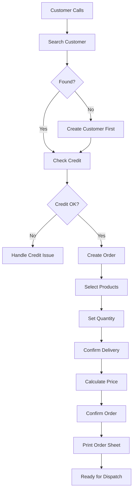
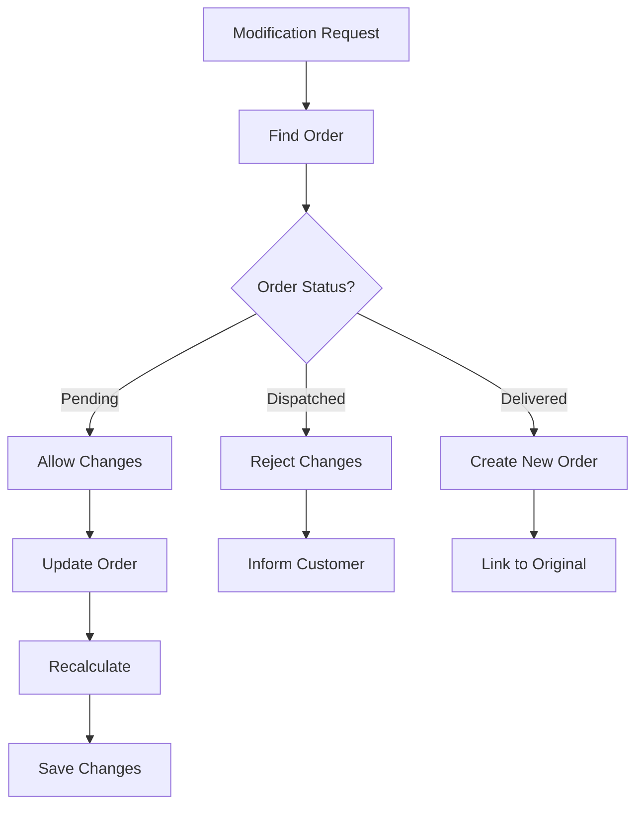

# Order Sales Module (訂單銷售)

**Module Code**: W100  
**Total Leaf Nodes**: 13  
**Primary Users**: Office Staff, Customer Service, Sales Team  
**Business Critical**: ⭐⭐⭐⭐⭐ (Core revenue-generating module)

## 📋 Module Purpose

The Order Sales module is the heart of Lucky Gas operations, managing the entire order lifecycle from customer request to delivery confirmation. It handles order creation, modification, tracking, and reporting, serving as the central hub for daily business transactions.

## 🎯 Key Business Functions

1. **Order Creation** (訂單建立)
   - Multi-step order wizard
   - Customer credit validation
   - Product availability checking
   - Delivery scheduling
   - Pricing calculation with discounts

2. **Order Management** (訂單管理)
   - Order modification before dispatch
   - Cancellation with reason tracking
   - Status updates throughout lifecycle
   - Special instruction handling

3. **Order Inquiry** (訂單查詢)
   - Multiple search criteria
   - Real-time status tracking
   - Order history viewing
   - Delivery confirmation status

4. **Order Reporting** (訂單報表)
   - Daily sales summaries
   - Monthly performance analysis
   - Annual business reports
   - Export capabilities for analysis

## 👥 User Roles & Permissions

| Role | Create | Read | Update | Cancel | Reports |
|------|--------|------|--------|--------|---------|
| Admin | ✅ | ✅ | ✅ | ✅ | ✅ |
| Manager | ✅ | ✅ | ✅ | ✅ | ✅ |
| Sales | ✅ | ✅ | ✅ | Limited | ✅ |
| Staff | ✅ | ✅ | Limited | ❌ | Limited |
| Driver | ❌ | Limited | Status only | ❌ | ❌ |

## 🔄 Integration Points

### Upstream Dependencies
1. **Customer Management** (會員作業)
   - Customer selection and validation
   - Credit limit checking
   - Delivery address retrieval
   - Payment terms

2. **Data Maintenance** (資料維護)
   - Product catalog and pricing
   - Available inventory
   - Delivery zones
   - Business hours

### Downstream Consumers
1. **Dispatch Operations** (派遣作業)
   - Orders ready for dispatch
   - Delivery requirements
   - Route optimization input
   - Driver assignments

2. **Invoice Operations** (發票作業)
   - Completed orders for billing
   - Pricing and tax information
   - Customer billing preferences

3. **Account Management** (帳務管理)
   - Order amounts for receivables
   - Payment tracking
   - Credit utilization

4. **Reports** (報表作業)
   - Sales analytics
   - Performance metrics
   - Business intelligence

## 📊 Data Volume & Performance

- **Daily Orders**: 200-300 average, 500 peak
- **Items per Order**: 1.2 average (mostly single cylinder)
- **Peak Hours**: 9 AM - 11 AM (morning orders)
- **Processing Time**: < 2 minutes per order
- **Modification Rate**: 15% of orders modified
- **Cancellation Rate**: 3-5% of orders

## 🚨 Critical Business Rules

1. **Order Creation Rules**
   - Customer must be active (not suspended/blacklisted)
   - Credit check must pass (available credit >= order amount)
   - Delivery address must be in service area
   - Minimum order quantity enforced
   - Cut-off times for same-day delivery

2. **Pricing Rules**
   - Customer-specific pricing tiers
   - Volume discounts applied automatically
   - Special contract prices override standard
   - Promotional pricing with validity dates
   - Delivery charges based on zone

3. **Modification Rules**
   - No modifications after dispatch
   - Quantity changes require credit re-check
   - Address changes require zone validation
   - Price protection for confirmed orders

4. **Cancellation Rules**
   - Reason required for all cancellations
   - No cancellation after delivery start
   - Refund policy varies by reason
   - Cylinder deposit handling

## 🌏 Taiwan-Specific Features

1. **Order Timing**
   - Traditional lunar calendar considerations
   - Public holiday delivery restrictions
   - Typhoon day policies
   - Ghost month special handling

2. **Payment Methods**
   - Cash on delivery (most common)
   - Monthly billing (corporate)
   - Bank transfer (pre-payment)
   - Post-dated checks

3. **Delivery Preferences**
   - Morning delivery for restaurants
   - Flexible timing for households
   - Bulk delivery for factories
   - Emergency delivery surcharge

4. **Cultural Considerations**
   - Lucky number preferences (8, 6)
   - Avoiding unlucky numbers (4)
   - Gift orders during festivals
   - Corporate gift documentation

## 📋 Module Sections Overview

### 1. Order Operations (訂單作業)
Complete order lifecycle management from creation to completion

### 2. Order Search (訂單查詢)
Flexible search and inquiry functions for customer service

### 3. Order Reports (訂單報表)
Comprehensive reporting for business analysis and decision making

## ⚠️ Known Issues & Limitations

1. **No Real-time Inventory**
   - Manual stock checking required
   - Over-selling possibility
   - No automatic backorder

2. **Limited Modification Options**
   - Full order cancellation for major changes
   - No partial order modifications
   - No order splitting capability

3. **Basic Pricing Engine**
   - Manual discount application
   - No dynamic pricing
   - Limited promotion management

4. **No Order Templates**
   - Repeat orders entered manually
   - No favorite orders feature
   - No subscription management

5. **Performance Issues**
   - Slow during peak hours
   - Report generation delays
   - Search timeout on large datasets

## 🔄 Typical User Workflows

### Standard Order Flow

### Order Modification Flow

## 💾 Order Lifecycle States

1. **Draft** (草稿)
   - Order being created
   - Not yet confirmed
   - Can be abandoned

2. **Confirmed** (已確認)
   - Order placed successfully
   - Awaiting dispatch
   - Can be modified/cancelled

3. **Dispatched** (已派送)
   - Assigned to driver
   - En route to customer
   - Cannot be modified

4. **Delivered** (已送達)
   - Successfully delivered
   - Awaiting payment/invoice
   - Completed transaction

5. **Cancelled** (已取消)
   - Order cancelled
   - Reason recorded
   - Inventory released

6. **Failed** (配送失敗)
   - Delivery attempted but failed
   - Requires rescheduling
   - Customer notification sent

## 🔐 Security Considerations

1. **Order Tampering**
   - Price protection after confirmation
   - Audit trail for all changes
   - Manager approval for discounts > 10%

2. **Credit Exposure**
   - Real-time credit checking
   - Order limits per customer
   - Approval workflow for large orders

3. **Data Privacy**
   - Customer data protection
   - Order history access control
   - Delivery details confidentiality

## 📈 Business Metrics

Key performance indicators tracked:
- Daily order count and value
- Average order value (AOV)
- Order fulfillment rate
- On-time delivery percentage
- Customer order frequency
- Product mix analysis
- Peak hour distribution

## 🚀 Migration Priorities

1. **High Priority**
   - Real-time inventory integration
   - Enhanced pricing engine
   - Order templates and favorites
   - Mobile order entry
   - Subscription management

2. **Medium Priority**
   - Advanced search capabilities
   - Bulk order processing
   - Promotion management
   - Customer portal access
   - API for third-party integration

3. **Low Priority**
   - AI-powered demand forecasting
   - Route optimization integration
   - Voice order entry
   - Chatbot ordering

---

The Order Sales module is the operational backbone of Lucky Gas, processing all customer transactions and driving daily revenue. Its efficiency directly impacts customer satisfaction and business profitability.