# Credit Check Flow (信用檢查流程)

**Process Code**: ORDER_FLOW_004  
**Business Critical**: ⭐⭐⭐⭐⭐ (Financial risk management)  
**Average Duration**: 10-30 seconds automated, 2-5 minutes with override  
**Check Frequency**: Every order, every modification

## 📋 Overview

The credit check flow is a critical financial control mechanism that validates customer creditworthiness before order confirmation. It prevents bad debt, manages cash flow, and ensures business sustainability while maintaining customer relationships.

## 🔄 Process Flow

```mermaid
graph TD
    Start([Credit Check Required<br/>需要信用檢查]) --> A[Initiate Check<br/>開始檢查]
    
    A --> B[Retrieve Customer Profile<br/>取得客戶檔案]
    
    B --> C{Customer Type?<br/>客戶類型?}
    C -->|New<br/>新客戶| D[New Customer Flow<br/>新客戶流程]
    C -->|Existing<br/>現有客戶| E[Existing Customer Flow<br/>現有客戶流程]
    C -->|VIP<br/>VIP| F[VIP Fast Track<br/>VIP快速通道]
    C -->|Blacklisted<br/>黑名單| G[Reject Immediately<br/>立即拒絕]
    
    G --> End1([Order Rejected<br/>訂單拒絕])
    
    D --> D1[Default Limits<br/>預設額度]
    D1 --> D2{Prepayment Required?<br/>需要預付?}
    D2 -->|Yes<br/>是| D3[Request Prepayment<br/>要求預付]
    D2 -->|No<br/>否| D4[Basic Credit<br/>基本額度]
    
    D3 --> D5{Prepaid?<br/>已預付?}
    D5 -->|No<br/>否| End1
    D5 -->|Yes<br/>是| H[Calculate Order Total<br/>計算訂單總額]
    
    D4 --> H
    
    E --> E1[Load Credit History<br/>載入信用歷史]
    E1 --> E2[Check Payment Record<br/>檢查付款記錄]
    
    E2 --> E3{Payment Status?<br/>付款狀態?}
    E3 -->|Good<br/>良好| E4[Standard Check<br/>標準檢查]
    E3 -->|Delayed<br/>延遲| E5[Restricted Check<br/>限制檢查]
    E3 -->|Bad<br/>不良| E6[Enhanced Check<br/>加強檢查]
    
    F --> F1[Premium Limits<br/>優質額度]
    F1 --> F2[Skip Detailed Check<br/>略過詳細檢查]
    F2 --> H
    
    E4 --> H
    E5 --> H
    E6 --> H
    
    H --> I[Add Pending Orders<br/>加入待處理訂單]
    I --> J[Include Tax & Fees<br/>包含稅費]
    J --> K[Total Exposure Calculation<br/>總曝險計算]
    
    K --> L{Check Formula<br/>檢查公式}
    L --> M[Available = Limit - Used - Pending<br/>可用 = 額度 - 已用 - 待處理]
    
    M --> N{Sufficient Credit?<br/>信用足夠?}
    N -->|Yes<br/>是| O[Approve Credit<br/>核准信用]
    N -->|No<br/>否| P[Credit Options<br/>信用選項]
    
    O --> Q[Reserve Credit<br/>保留信用]
    Q --> R[Update Records<br/>更新記錄]
    R --> Success([Credit Approved<br/>信用核准])
    
    P --> S{Resolution Path?<br/>解決路徑?}
    S -->|Partial Prepay<br/>部分預付| T[Calculate Prepayment<br/>計算預付款]
    S -->|Full Prepay<br/>全額預付| U[Request Full Payment<br/>要求全額付款]
    S -->|Split Order<br/>分割訂單| V[Divide Order<br/>分割訂單]
    S -->|Override<br/>覆蓋| W[Manager Override<br/>主管覆蓋]
    S -->|Reject<br/>拒絕| X[Decline Order<br/>謝絕訂單]
    
    T --> T1{Customer Agrees?<br/>客戶同意?}
    T1 -->|Yes<br/>是| T2[Process Prepayment<br/>處理預付]
    T1 -->|No<br/>否| X
    
    T2 --> O
    
    U --> U1{Payment Received?<br/>收到付款?}
    U1 -->|Yes<br/>是| O
    U1 -->|No<br/>否| X
    
    V --> V1[Create Sub-Orders<br/>建立子訂單]
    V1 --> V2[Check Each Part<br/>檢查每部分]
    V2 --> N
    
    W --> W1[Manager Review<br/>主管審查]
    W1 --> W2{Override Decision?<br/>覆蓋決定?}
    W2 -->|Approve<br/>核准| W3[Document Override<br/>記錄覆蓋]
    W2 -->|Reject<br/>拒絕| X
    
    W3 --> W4[Set Conditions<br/>設定條件]
    W4 --> O
    
    X --> Y[Release Reserved<br/>釋放保留]
    Y --> Z[Suggest Alternatives<br/>建議替代方案]
    Z --> End1
```



## 💳 Credit Limit Structure

### Customer Categories

| Category | Base Limit | Payment Terms | Review Cycle | Risk Level |
|----------|------------|---------------|--------------|------------|
| New Customer | NT$ 5,000 | COD/Prepay | After 3 orders | High |
| Regular | NT$ 30,000 | Net 30 | Quarterly | Medium |
| Corporate | NT$ 100,000 | Net 45 | Monthly | Medium |
| VIP | NT$ 300,000+ | Net 60 | Annual | Low |
| Government | Unlimited* | Net 90 | Annual | Very Low |

*Subject to contract terms

### Dynamic Credit Calculation

```
Base Credit Limit Factors:
- Customer Type (40%)
- Payment History (30%)
- Business Volume (20%)
- Years Active (10%)

Adjustment Factors:
- On-time Payment: +10% per quarter
- Late Payment: -20% immediately
- Bounced Check: -50% immediately
- Referral Bonus: +NT$ 10,000
```

## 📊 Credit Scoring Model

### Payment History Scoring
```
Payment Score = 100 - (Late Days × 2) - (Bounced Checks × 20)

Where:
- Late Days = Total days late in past 12 months
- Bounced Checks = Count in past 12 months

Score Interpretation:
- 90-100: Excellent (Increase limit)
- 70-89: Good (Maintain limit)
- 50-69: Fair (Review required)
- 0-49: Poor (Reduce/Restrict)
```

### Business Volume Impact
```
Monthly Average | Limit Multiplier
< NT$ 10,000   | 1.0x
NT$ 10-50,000  | 1.5x
NT$ 50-100,000 | 2.0x
NT$ 100,000+   | 3.0x
```

## 🚨 Override Authority Matrix

| Override Amount | Operator | Supervisor | Manager | Director |
|----------------|----------|------------|---------|----------|
| Up to 10% over | ❌ | ✅ | ✅ | ✅ |
| 11-25% over | ❌ | ❌ | ✅ | ✅ |
| 26-50% over | ❌ | ❌ | ❌ | ✅ |
| >50% over | ❌ | ❌ | ❌ | Special |

### Override Conditions
1. **Temporary Override**: Valid for single order only
2. **Permanent Increase**: Requires formal review
3. **Conditional Override**: With specific payment terms
4. **Guaranteed Override**: With bank guarantee or deposit

## 🔔 Real-time Monitoring

### Credit Utilization Alerts

```
Alert Levels:
- 70% Used: Yellow Alert - Notify customer
- 85% Used: Orange Alert - Notify sales team
- 95% Used: Red Alert - Notify management
- 100% Used: Block new orders

Notification Example:
"客戶 [Name] 信用額度使用已達 [X]%
可用額度: NT$ [Available]
建議行動: [Action]"
```

### Exposure Dashboard
```
Real-time Metrics:
- Total Credit Extended: NT$ X,XXX,XXX
- Current Utilization: XX%
- Overdue Amount: NT$ XXX,XXX
- At-Risk Accounts: XX
- Daily Credit Approvals: XXX
```

## 📈 Credit Management Strategies

### Proactive Management
1. **Early Warning System**
   - Monitor utilization trends
   - Predict limit breaches
   - Suggest preemptive actions

2. **Seasonal Adjustments**
   - Increase limits during peak seasons
   - Temporary limits for holidays
   - Event-based modifications

3. **Portfolio Optimization**
   - Balance risk across customers
   - Diversify credit exposure
   - Regular portfolio reviews

### Risk Mitigation
1. **Credit Insurance**
   - For high-value accounts
   - Export credit insurance
   - Bad debt provision

2. **Collection Strategies**
   - Automated payment reminders
   - Escalation procedures
   - Legal action thresholds

## 🌏 Taiwan-Specific Considerations

### Payment Culture
- Post-dated checks common for B2B
- Monthly settlement preferred
- Relationship-based flexibility
- Face-saving considerations

### Holiday Impact
- Lunar New Year extended terms
- Ghost Month conservative lending
- Quarter-end tightening
- Year-end settlements

### Legal Framework
- Company registration verification
- Tax ID validation mandatory
- Director guarantee options
- Promissory note requirements

## 💡 System Integration

### Real-time Connections
1. **Banking System**: Current balance checks
2. **Credit Bureau**: External credit scores
3. **ERP System**: Financial status updates
4. **Collection System**: Outstanding tracking

### Batch Processing
1. **Daily**: Recalculate utilization
2. **Weekly**: Payment performance review
3. **Monthly**: Limit adjustments
4. **Quarterly**: Portfolio analysis

## 🎯 Best Practices

### For Operators
1. Always check credit before confirming
2. Explain credit policies clearly
3. Offer alternatives when declined
4. Document all overrides
5. Monitor high-utilization accounts

### For Managers
1. Review override patterns
2. Adjust limits proactively
3. Balance sales with risk
4. Train staff on policies
5. Maintain customer relationships

## 📊 Performance Metrics

| Metric | Target | Current | Variance |
|--------|--------|---------|----------|
| Bad Debt Ratio | < 0.5% | 0.3% | ✅ |
| DSO (Days Sales Outstanding) | < 45 | 42 | ✅ |
| Credit Approval Rate | > 85% | 87% | ✅ |
| Override Frequency | < 5% | 4.2% | ✅ |
| Collection Success | > 95% | 96% | ✅ |

## 🔒 Security & Compliance

### Data Protection
- Encrypt credit information
- Limit access by role
- Audit all credit checks
- Mask sensitive data

### Regulatory Compliance
- Follow banking regulations
- Maintain credit records
- Report suspicious activity
- Regular compliance audits

## 🚀 Future Enhancements

1. **AI Credit Scoring**: Machine learning models
2. **Blockchain Integration**: Smart contracts
3. **Open Banking**: Real-time bank verification
4. **Mobile Approvals**: Manager app overrides
5. **Predictive Analytics**: Default prediction

---

**Note**: Credit management is crucial for business sustainability. Always balance customer service with financial prudence.