# Delivery Confirmation Flow (配送確認流程)

**Process Code**: ORDER_FLOW_005  
**Business Critical**: ⭐⭐⭐⭐⭐ (Revenue realization point)  
**Average Duration**: 2-5 minutes per delivery  
**Success Rate**: 92% first attempt, 98% including re-attempts

## 📋 Overview

The delivery confirmation flow is the critical final step in the order lifecycle where physical delivery is verified, payment is collected (if COD), and customer satisfaction is ensured. This process directly impacts revenue recognition, inventory accuracy, and customer relationships.

## 🔄 Process Flow

```mermaid
graph TD
    Start([Delivery Start<br/>開始配送]) --> A[Driver Receives Route<br/>司機接收路線]
    
    A --> B[Load Orders<br/>載入訂單]
    B --> C[Verify Products<br/>驗證產品]
    
    C --> D{Products Match?<br/>產品相符?}
    D -->|No<br/>否| E[Report Discrepancy<br/>回報差異]
    D -->|Yes<br/>是| F[Begin Route<br/>開始路線]
    
    E --> E1[Resolve Issue<br/>解決問題]
    E1 --> C
    
    F --> G[Navigate to Customer<br/>導航至客戶]
    G --> H[Arrive at Location<br/>到達地點]
    
    H --> I[Update Status<br/>更新狀態]
    I --> J[Contact Customer<br/>聯絡客戶]
    
    J --> K{Customer Available?<br/>客戶在場?}
    K -->|No<br/>否| L[Wait Protocol<br/>等待程序]
    K -->|Yes<br/>是| M[Verify Identity<br/>驗證身份]
    
    L --> L1[Wait 15 mins<br/>等待15分鐘]
    L1 --> L2[Call Again<br/>再次致電]
    L2 --> L3{Still No Answer?<br/>仍無回應?}
    L3 -->|Yes<br/>是| L4[Delivery Failed<br/>配送失敗]
    L3 -->|No<br/>否| M
    
    L4 --> L5[Document Reason<br/>記錄原因]
    L5 --> L6[Next Delivery<br/>下一個配送]
    
    M --> N[Present Order<br/>出示訂單]
    N --> O[Customer Verification<br/>客戶驗證]
    
    O --> P{Order Correct?<br/>訂單正確?}
    P -->|No<br/>否| Q[Handle Dispute<br/>處理爭議]
    P -->|Yes<br/>是| R[Deliver Products<br/>交付產品]
    
    Q --> Q1{Can Resolve?<br/>可解決?}
    Q1 -->|No<br/>否| Q2[Contact Office<br/>聯絡辦公室]
    Q1 -->|Yes<br/>是| Q3[Make Adjustment<br/>進行調整]
    
    Q2 --> Q4{Office Decision?<br/>辦公室決定?}
    Q4 -->|Cancel<br/>取消| L4
    Q4 -->|Proceed<br/>繼續| R
    Q4 -->|Modify<br/>修改| Q3
    
    Q3 --> R
    
    R --> S[Check Quality<br/>檢查品質]
    S --> T{Quality OK?<br/>品質合格?}
    T -->|No<br/>否| U[Quality Issue<br/>品質問題]
    T -->|Yes<br/>是| V[Cylinder Exchange<br/>瓦斯桶交換]
    
    U --> U1[Document Issue<br/>記錄問題]
    U1 --> U2[Replace Product<br/>更換產品]
    U2 --> S
    
    V --> W{Empty Return?<br/>空桶回收?}
    W -->|Yes<br/>是| X[Collect Empty<br/>收集空桶]
    W -->|No<br/>否| Y[Note No Return<br/>註記無回收]
    
    X --> X1[Count Cylinders<br/>清點瓦斯桶]
    X1 --> X2[Check Condition<br/>檢查狀況]
    
    Y --> Z[Calculate Payment<br/>計算付款]
    X2 --> Z
    
    Z --> AA{Payment Method?<br/>付款方式?}
    AA -->|Cash<br/>現金| AB[Collect Cash<br/>收取現金]
    AA -->|Monthly<br/>月結| AC[Verify Account<br/>驗證帳戶]
    AA -->|Prepaid<br/>已預付| AD[Confirm Prepaid<br/>確認預付]
    AA -->|Check<br/>支票| AE[Receive Check<br/>接收支票]
    
    AB --> AB1[Count Money<br/>點算金額]
    AB1 --> AB2{Correct Amount?<br/>金額正確?}
    AB2 -->|No<br/>否| AB3[Handle Difference<br/>處理差額]
    AB2 -->|Yes<br/>是| AF[Issue Receipt<br/>開立收據]
    
    AB3 --> AB4{Resolution?<br/>解決方案?}
    AB4 -->|Pay Diff<br/>補差額| AB1
    AB4 -->|Reduce Order<br/>減少訂單| Z
    AB4 -->|Credit Next<br/>下次扣抵| AF
    
    AC --> AC1{Credit OK?<br/>信用合格?}
    AC1 -->|No<br/>否| AC2[Request Payment<br/>要求付款]
    AC1 -->|Yes<br/>是| AF
    
    AC2 --> AA
    
    AD --> AD1{Verified?<br/>已驗證?}
    AD1 -->|No<br/>否| AD2[Check System<br/>檢查系統]
    AD1 -->|Yes<br/>是| AF
    
    AD2 --> AD3{Found?<br/>找到?}
    AD3 -->|No<br/>否| AB
    AD3 -->|Yes<br/>是| AF
    
    AE --> AE1[Verify Check<br/>驗證支票]
    AE1 --> AF
    
    AF --> AG[Get Signature<br/>取得簽名]
    AG --> AH{Digital or Paper?<br/>數位或紙本?}
    AH -->|Digital<br/>數位| AI[Tablet Signature<br/>平板簽名]
    AH -->|Paper<br/>紙本| AJ[Paper Form<br/>紙本表單]
    
    AI --> AK[Upload Signature<br/>上傳簽名]
    AJ --> AL[Scan Later<br/>稍後掃描]
    
    AK --> AM[Take Photo<br/>拍照]
    AL --> AM
    
    AM --> AN[Delivery Location<br/>配送地點]
    AN --> AO[Update System<br/>更新系統]
    
    AO --> AP[Send Confirmation<br/>發送確認]
    AP --> AQ[Customer Copy<br/>客戶聯]
    
    AQ --> AR{More Deliveries?<br/>還有配送?}
    AR -->|Yes<br/>是| AS[Next Address<br/>下一個地址]
    AR -->|No<br/>否| AT[Return to Base<br/>返回基地]
    
    AS --> G
    
    AT --> AU[Reconcile Route<br/>核對路線]
    AU --> AV[Submit Report<br/>提交報告]
    AV --> Success([Delivery Complete<br/>配送完成])
    
    L6 --> AR
```



## 📱 Mobile App Integration

### Driver App Features
```
Real-time Features:
- GPS navigation to customer
- One-tap arrival notification
- Digital order display
- QR code scanning
- Photo capture
- Digital signature
- Payment processing
- Real-time sync

Offline Capabilities:
- Download route before departure
- Cache customer data
- Store confirmations locally
- Sync when connected
```

### Customer Notifications
```
SMS Template:
"您的瓦斯訂單正在配送中
司機: [DRIVER_NAME]
預計到達: [TIME]
訂單號: [ORDER_ID]
追蹤: [TRACKING_LINK]"

Delivery Complete:
"訂單 [ORDER_ID] 已送達
金額: NT$ [AMOUNT]
時間: [TIMESTAMP]
感謝您的惠顧！"
```

## 🏠 Delivery Scenarios

### Scenario 1: Standard Delivery
- **Process**: Normal flow, customer present
- **Duration**: 3-5 minutes
- **Success Rate**: 95%
- **Key Points**: Smooth exchange, correct payment

### Scenario 2: Nobody Home
- **Process**: Wait 15 mins, multiple contact attempts
- **Duration**: 20 minutes
- **Success Rate**: 40% (after wait)
- **Resolution**: Reschedule or neighbor delivery

### Scenario 3: Access Issues
- **Process**: Gated community, restricted access
- **Duration**: 10-15 minutes
- **Success Rate**: 85%
- **Resolution**: Security coordination, customer meet

### Scenario 4: Product Issues
- **Process**: Damaged cylinder, wrong product
- **Duration**: 15-20 minutes
- **Success Rate**: 70%
- **Resolution**: Replace from truck stock

### Scenario 5: Payment Problems
- **Process**: Insufficient cash, check issues
- **Duration**: 10-15 minutes
- **Success Rate**: 80%
- **Resolution**: Partial delivery, payment arrangement

## 💰 Payment Handling

### Cash Management
```
Driver Cash Handling:
1. Start of Day Float: NT$ 5,000
2. Maximum Cash Carry: NT$ 50,000
3. Drop Safe Protocol: Every NT$ 30,000
4. End of Day Reconciliation: Required

Cash Security:
- Counterfeit detection pen
- Secured cash box
- GPS tracking if > NT$ 20,000
- Panic button on app
```

### Check Acceptance
```
Valid Check Requirements:
- Payee: 幸福氣體有限公司
- Date: Current or post-dated (max 30 days)
- Amount: Matches order exactly
- Signature: Verified against ID
- Bank: Major banks only

Red Flags:
- Alterations or corrections
- Unusual bank names
- Missing security features
- Previous bounced checks
```

### Digital Payment (Future)
```
Planned Options:
- LINE Pay integration
- Credit card via mobile POS
- QR code payment
- Mobile banking transfer
- e-Invoice integration
```

## 📸 Evidence Collection

### Photo Requirements
1. **Delivery Location**: Wide shot showing address
2. **Product Placement**: Cylinders in position
3. **Quality Evidence**: Close-up of gauge/seal
4. **Damage Documentation**: Any issues found
5. **Signature Capture**: Clear and legible

### Metadata Captured
```
For Each Photo:
- GPS coordinates
- Timestamp
- Device ID
- Driver ID
- Order ID
- Photo type
- Orientation
```

## 🔒 Security Protocols

### Driver Safety
1. **High-Risk Areas**: Buddy system required
2. **Large Cash Orders**: Manager notification
3. **Evening Deliveries**: Extra precautions
4. **Suspicious Behavior**: Abort and report
5. **Emergency Protocol**: One-button alert

### Product Security
1. **Cylinder Tracking**: Serial number scan
2. **Quantity Verification**: Double count
3. **Load Securing**: Proper restraints
4. **Transfer Documentation**: All movements

## 📊 Performance Metrics

### Delivery KPIs
| Metric | Target | Current | Action Level |
|--------|--------|---------|--------------|
| First Attempt Success | > 90% | 92% | < 85% |
| On-Time Delivery | > 95% | 93% | < 90% |
| Delivery Time/Stop | < 5 min | 4.8 min | > 7 min |
| Customer Satisfaction | > 4.5/5 | 4.6/5 | < 4.0/5 |
| Payment Collection | > 98% | 97.5% | < 95% |

### Driver Performance
```
Scoring Factors:
- Delivery success rate (40%)
- Customer ratings (30%)
- Time efficiency (20%)
- Cash accuracy (10%)

Recognition Levels:
- Elite Driver: > 95 points
- Senior Driver: 85-94 points
- Standard Driver: 70-84 points
- Probation: < 70 points
```

## 🚨 Exception Handling

### Common Issues & Resolution

| Issue | Immediate Action | Follow-up | Prevention |
|-------|-----------------|-----------|------------|
| Wrong Address | Verify with customer | Update database | Address validation |
| Product Shortage | Offer partial delivery | Priority restock | Better forecasting |
| Vehicle Breakdown | Transfer to backup | Complete route | Preventive maintenance |
| Customer Dispute | Document details | Manager review | Clear communication |
| Safety Concern | Abort delivery | Security review | Risk assessment |

## 📱 Technology Integration

### Real-time Updates
```
System Notifications:
- Order dispatched
- Driver en route
- Driver arrived
- Delivery complete
- Payment received

Update Frequency:
- GPS: Every 30 seconds
- Status: On change
- Sync: Every 5 minutes
- Emergency: Immediate
```

### Future Enhancements
1. **AR Navigation**: For complex addresses
2. **Predictive ETA**: ML-based arrival times
3. **Smart Routing**: Dynamic optimization
4. **IoT Cylinders**: Smart gauge reading
5. **Drone Delivery**: For remote areas

## 🌏 Taiwan-Specific Considerations

### Cultural Aspects
- Remove shoes when entering homes
- Red envelope for first delivery (new customers)
- Avoid 4th floor deliveries if possible
- Respect for elderly customers
- Festival delivery preparations

### Address Challenges
- Alley (巷) and lane (弄) navigation
- Unofficial addresses in older areas
- Mixed building numbering systems
- Traditional market locations
- Rural area descriptions

## ✅ Delivery Checklist

Before leaving customer:
- [ ] Products delivered correctly
- [ ] Empty cylinders collected
- [ ] Payment received/verified
- [ ] Receipt provided
- [ ] Signature obtained
- [ ] Photos taken
- [ ] System updated
- [ ] Customer satisfied
- [ ] Area secured
- [ ] Next delivery ready

---

**Note**: Delivery confirmation is where customer experience is made or broken. Every interaction represents the Lucky Gas brand.