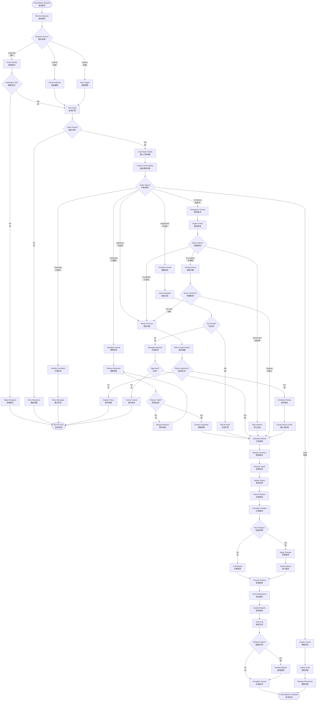

# Order Cancellation Flow (訂單取消流程)

**Process Code**: ORDER_FLOW_003  
**Business Critical**: ⭐⭐⭐⭐ (Financial and customer impact)  
**Average Duration**: 2-5 minutes depending on status  
**Cancellation Rate**: 3-5% of all orders

## 📋 Overview

The order cancellation flow manages the systematic cancellation of orders while ensuring proper inventory release, credit restoration, customer notification, and financial reconciliation. The complexity varies significantly based on the order's current status.

## 🔄 Process Flow



## 📊 Cancellation Rules by Status

### Status-Specific Requirements

| Order Status | Reason Required | Approval Needed | Charges Apply | Refund Type | Complexity |
|--------------|----------------|-----------------|---------------|-------------|------------|
| Draft | No | No | No | N/A | ⭐ |
| Confirmed | Yes | No | No | Full | ⭐⭐ |
| Dispatched | Yes | Supervisor | Maybe | Partial/Full | ⭐⭐⭐ |
| In Delivery | Yes | Manager | Yes | Partial | ⭐⭐⭐⭐ |
| Delivered | Yes | Manager | Yes | Varies | ⭐⭐⭐⭐⭐ |

## 🎯 Cancellation Reasons

### Standard Reasons (代碼)
```
01 - 客戶改變心意 (Customer changed mind)
02 - 找到更好價格 (Found better price)
03 - 不需要了 (No longer needed)
04 - 訂錯產品 (Wrong product ordered)
05 - 訂錯數量 (Wrong quantity ordered)
06 - 配送時間不合 (Delivery time unsuitable)
07 - 配送地址錯誤 (Wrong delivery address)
08 - 重複訂單 (Duplicate order)
09 - 付款問題 (Payment issues)
10 - 其他 (Other - specify)
```

### System Reasons (系統)
```
S1 - 庫存不足 (Insufficient stock)
S2 - 超出配送範圍 (Outside delivery area)
S3 - 信用額度不足 (Credit limit exceeded)
S4 - 系統錯誤 (System error)
S5 - 價格錯誤 (Pricing error)
```

### Operational Reasons (營運)
```
O1 - 無司機可用 (No driver available)
O2 - 車輛故障 (Vehicle breakdown)
O3 - 天氣因素 (Weather conditions)
O4 - 道路封閉 (Road closure)
O5 - 安全考量 (Safety concerns)
```

## 💰 Cancellation Charges

### Charge Calculation Logic
```
IF Status = 'Draft' OR 'Confirmed' THEN
    Charge = 0
ELSE IF Status = 'Dispatched' THEN
    IF Time_Since_Dispatch < 30 minutes THEN
        Charge = 0
    ELSE
        Charge = Delivery_Fee * 0.5
    END IF
ELSE IF Status = 'In Delivery' THEN
    Charge = Delivery_Fee + (Product_Total * 0.1)
ELSE IF Status = 'Delivered' THEN
    Charge = Delivery_Fee + Return_Fee + (Product_Total * 0.15)
END IF

// Waive charges for system/operational reasons
IF Reason_Category IN ('System', 'Operational') THEN
    Charge = 0
END IF
```

### Charge Waiver Authority
| Charge Amount | Operator | Supervisor | Manager |
|---------------|----------|------------|---------|
| $0 - $100 | ✅ Auto | ✅ | ✅ |
| $101 - $500 | ❌ | ✅ | ✅ |
| $501+ | ❌ | ❌ | ✅ |

## 🔄 Inventory & Credit Management

### Inventory Release
```
FOR each order line:
    IF product.track_inventory THEN
        inventory.available += line.quantity
        inventory.reserved -= line.quantity
    END IF
    
    IF line.deposit_required THEN
        Process deposit return
    END IF
END FOR
```

### Credit Restoration
```
customer.credit_used -= order.final_amount
customer.credit_available += order.final_amount

IF customer.credit_hold AND 
   customer.credit_available > 0 THEN
    Review credit hold status
END IF
```

## 🔔 Notification Templates

### Customer Notification (SMS)
```
訂單取消確認
訂單號: [ORDER_ID]
取消原因: [REASON]
退款金額: NT$ [REFUND]
預計退款: [REFUND_DATE]
客服: 0800-XXX-XXX
```

### Customer Notification (Email)
```
Subject: 訂單取消確認 - [ORDER_ID]

親愛的 [CUSTOMER_NAME] 您好,

您的訂單已成功取消。

訂單詳情:
- 訂單編號: [ORDER_ID]
- 訂單日期: [ORDER_DATE]
- 原訂金額: NT$ [ORIGINAL_AMOUNT]
- 取消原因: [REASON]
- 取消費用: NT$ [CHARGES]
- 退款金額: NT$ [REFUND_AMOUNT]

退款處理:
- 處理方式: [REFUND_METHOD]
- 預計時間: [REFUND_TIMELINE]

如有任何問題，請聯絡客服。

幸福氣 Lucky Gas
```

### Internal Notifications
1. **Dispatch Team**: Remove from route planning
2. **Warehouse**: Update stock levels
3. **Finance**: Process refund
4. **Management**: Daily cancellation report

## 🚨 Special Scenarios

### Scenario 1: Customer No-Show
- **Trigger**: Driver arrives, customer unavailable
- **Process**: Attempt contact, wait 15 minutes
- **Result**: Mark as failed delivery, return to warehouse

### Scenario 2: Product Quality Issue
- **Trigger**: Customer reports defect
- **Process**: Immediate cancellation, quality investigation
- **Result**: Full refund, no charges

### Scenario 3: Emergency Cancellation
- **Trigger**: Safety issue or emergency
- **Process**: Immediate stop, all charges waived
- **Result**: Full refund, priority handling

### Scenario 4: Bulk Cancellation
- **Trigger**: System error or major issue
- **Process**: Batch cancellation with management approval
- **Result**: Automated processing, bulk notifications

## 📈 Performance Metrics

| Metric | Target | Current | Alert |
|--------|--------|---------|-------|
| Cancellation Rate | < 3% | 3.5% | > 5% |
| Processing Time | < 3 min | 2.8 min | > 5 min |
| Refund Accuracy | 100% | 99.8% | < 99% |
| Customer Satisfaction | > 4.0/5 | 4.2/5 | < 3.5/5 |

## 🔒 Fraud Prevention

### Red Flags
1. Multiple cancellations from same customer
2. High-value orders cancelled repeatedly
3. Cancellations after product price changes
4. Pattern of last-minute cancellations

### Prevention Measures
1. Track cancellation history by customer
2. Require prepayment for habitual cancellers
3. Implement cancellation limits
4. Flag suspicious patterns for review

## 💡 Best Practices

1. **Always Document**: Record specific reason for cancellation
2. **Verify Before Processing**: Confirm customer identity
3. **Communicate Clearly**: Explain charges and refund timeline
4. **Act Quickly**: Process cancellations promptly
5. **Follow Up**: Ensure refund is received

## 🔧 System Integration

### Real-time Updates
1. **Inventory System**: Immediate stock release
2. **Credit System**: Instant limit restoration  
3. **Dispatch System**: Remove from routes
4. **Payment Gateway**: Initiate refunds

### Reporting Integration
1. **Daily Cancellation Report**: By reason and status
2. **Financial Impact Report**: Revenue loss analysis
3. **Customer Behavior Report**: Cancellation patterns
4. **Operational Report**: System vs customer cancellations

## 📊 Cancellation Analytics

### Key Insights Tracked
- Most common cancellation reasons
- Cancellation timing patterns
- Customer segments with high cancellation
- Financial impact by reason
- Seasonal cancellation trends

---

**Note**: This workflow emphasizes customer service while protecting business interests. Always prioritize customer satisfaction within policy guidelines.