# Order Modification Flow (訂單修改流程)

**Process Code**: ORDER_FLOW_002  
**Business Critical**: ⭐⭐⭐⭐ (High impact on customer satisfaction)  
**Average Duration**: 3-5 minutes per modification  
**Modification Rate**: 15% of all orders require changes

## 📋 Overview

The order modification flow handles changes to existing orders based on customer requests or operational requirements. The ability to modify orders depends heavily on the current order status, with strict rules to maintain data integrity and operational efficiency.

## 🔄 Process Flow

```mermaid
graph TD
    Start([Modification Request<br/>修改要求]) --> A[Receive Request<br/>接收要求]
    
    A --> B{Request Source?<br/>要求來源?}
    B -->|Customer<br/>客戶| C[Verify Identity<br/>驗證身份]
    B -->|Internal<br/>內部| D[Check Authority<br/>檢查權限]
    B -->|System<br/>系統| E[Auto Validation<br/>自動驗證]
    
    C --> F[Search Order<br/>搜尋訂單]
    D --> F
    E --> F
    
    F --> G{Order Found?<br/>找到訂單?}
    G -->|No<br/>否| H[Error Message<br/>錯誤訊息]
    G -->|Yes<br/>是| I[Load Order Details<br/>載入訂單明細]
    
    H --> End1([End Process<br/>結束流程])
    
    I --> J[Check Order Status<br/>檢查訂單狀態]
    
    J --> K{Status Check<br/>狀態檢查}
    K -->|Draft<br/>草稿| L[Full Edit Mode<br/>完整編輯模式]
    K -->|Confirmed<br/>已確認| M[Limited Edit Mode<br/>有限編輯模式]
    K -->|Dispatched<br/>已派送| N[No Modifications<br/>不可修改]
    K -->|Delivered<br/>已送達| O[Create New Order<br/>建立新訂單]
    K -->|Cancelled<br/>已取消| P[Reactivate Check<br/>重啟檢查]
    
    N --> Q[Notify Restriction<br/>通知限制]
    Q --> R{Alternative?<br/>替代方案?}
    R -->|Cancel & Reorder<br/>取消重訂| S[Cancel Current<br/>取消當前]
    R -->|Contact Driver<br/>聯絡司機| T[Driver Approval<br/>司機核准]
    R -->|No Change<br/>不變更| End1
    
    O --> U[Link Orders<br/>關聯訂單]
    U --> V[Copy Details<br/>複製明細]
    V --> W[New Order Flow<br/>新訂單流程]
    
    P --> X{Can Reactivate?<br/>可重啟?}
    X -->|Yes<br/>是| Y[Restore Order<br/>恢復訂單]
    X -->|No<br/>否| End1
    
    L --> Z[Modification Menu<br/>修改選單]
    M --> Z
    
    Z --> AA{Change Type?<br/>變更類型?}
    AA -->|Products<br/>產品| AB[Product Changes<br/>產品變更]
    AA -->|Quantity<br/>數量| AC[Quantity Changes<br/>數量變更]
    AA -->|Delivery<br/>配送| AD[Delivery Changes<br/>配送變更]
    AA -->|Payment<br/>付款| AE[Payment Changes<br/>付款變更]
    AA -->|Cancel<br/>取消| AF[Cancellation Flow<br/>取消流程]
    
    AB --> AB1[Select Products<br/>選擇產品]
    AB1 --> AB2{Add or Remove?<br/>新增或移除?}
    AB2 -->|Add<br/>新增| AB3[Check Inventory<br/>檢查庫存]
    AB2 -->|Remove<br/>移除| AB4[Update Lines<br/>更新明細]
    
    AC --> AC1[New Quantity<br/>新數量]
    AC1 --> AC2{Quantity Check<br/>數量檢查}
    AC2 -->|Increase<br/>增加| AC3[Credit Check<br/>信用檢查]
    AC2 -->|Decrease<br/>減少| AC4[Update Amount<br/>更新金額]
    
    AD --> AD1{Delivery Change?<br/>配送變更?}
    AD1 -->|Date<br/>日期| AD2[Check Schedule<br/>檢查排程]
    AD1 -->|Time<br/>時間| AD3[Check Slots<br/>檢查時段]
    AD1 -->|Address<br/>地址| AD4[Verify Area<br/>驗證區域]
    
    AE --> AE1[Payment Method<br/>付款方式]
    AE1 --> AE2[Update Terms<br/>更新條件]
    
    AB3 --> AG[Recalculate Total<br/>重新計算總額]
    AB4 --> AG
    AC3 --> AG
    AC4 --> AG
    AD2 --> AG
    AD3 --> AG
    AD4 --> AG
    AE2 --> AG
    
    AG --> AH[Show Changes<br/>顯示變更]
    AH --> AI{Customer Confirms?<br/>客戶確認?}
    
    AI -->|No<br/>否| AJ[Revert Changes<br/>還原變更]
    AI -->|Yes<br/>是| AK[Validate All<br/>全部驗證]
    
    AJ --> AA
    
    AK --> AL{Validation OK?<br/>驗證成功?}
    AL -->|No<br/>否| AM[Show Errors<br/>顯示錯誤]
    AL -->|Yes<br/>是| AN[Save Changes<br/>儲存變更]
    
    AM --> AA
    
    AN --> AO[Update Status History<br/>更新狀態歷史]
    AO --> AP[Recalculate Credit<br/>重算信用]
    AP --> AQ[Send Notifications<br/>發送通知]
    
    AQ --> AR{Dispatch Updated?<br/>派送已更新?}
    AR -->|Yes<br/>是| AS[Notify Driver<br/>通知司機]
    AR -->|No<br/>否| AT[Update Queue<br/>更新佇列]
    
    AS --> AU[Confirmation<br/>確認]
    AT --> AU
    
    AU --> Success([Modification Complete<br/>修改完成])
    
    S --> S1[Process Cancellation<br/>處理取消]
    S1 --> S2[Create New Order<br/>建立新訂單]
    S2 --> W
    
    T --> T1{Driver Response?<br/>司機回應?}
    T1 -->|Approved<br/>核准| AD
    T1 -->|Rejected<br/>拒絕| Q
    
    Y --> Y1[Check Inventory<br/>檢查庫存]
    Y1 --> Y2[Verify Credit<br/>驗證信用]
    Y2 --> M
    
    AF --> Cancel([To Cancellation<br/>Flow])
```



## 📊 Status-Based Modification Rules

### Order Status Matrix

| Status | Products | Quantity | Delivery Date | Delivery Time | Address | Payment | Cancel |
|--------|----------|----------|--------------|---------------|---------|---------|---------|
| Draft (草稿) | ✅ Full | ✅ Full | ✅ Full | ✅ Full | ✅ Full | ✅ Full | ✅ |
| Confirmed (已確認) | ✅ Limited | ✅ Limited | ✅ | ✅ | ⚠️ Verify | ✅ | ✅ |
| Dispatched (已派送) | ❌ | ❌ | ❌ | ❌ | ❌ | ❌ | ⚠️ Special |
| In Delivery (配送中) | ❌ | ❌ | ❌ | ❌ | ❌ | ❌ | ❌ |
| Delivered (已送達) | ❌ | ❌ | ❌ | ❌ | ❌ | ❌ | ❌ |
| Cancelled (已取消) | N/A | N/A | N/A | N/A | N/A | N/A | N/A |

**Legend**: ✅ Allowed | ⚠️ Conditional | ❌ Not Allowed

## 🎯 Modification Types

### 1. Product Changes
- **Add Products**: Subject to inventory and credit checks
- **Remove Products**: Allowed until dispatch
- **Change Products**: Treated as remove + add

### 2. Quantity Changes
- **Increase**: Requires credit and inventory validation
- **Decrease**: Updates totals and releases reserved stock
- **Minimum Quantities**: Must maintain product minimums

### 3. Delivery Changes
- **Date**: Must be future date, check driver availability
- **Time Slot**: Subject to capacity constraints
- **Address**: Requires service area validation

### 4. Payment Changes
- **Method**: May require credit re-evaluation
- **Terms**: Subject to customer credit profile
- **Prepayment**: Always allowed

## ⚠️ Validation Rules

### Credit Validation
```
IF (New Total > Original Total) THEN
    Available Credit >= (New Total - Original Total)
ELSE
    Release Credit = (Original Total - New Total)
END IF
```

### Inventory Validation
```
FOR each modified line item:
    IF quantity increased THEN
        Check available stock >= increase amount
    ELSE IF quantity decreased THEN
        Release reserved stock
    END IF
END FOR
```

### Delivery Validation
- New date must be >= today + minimum lead time
- New address must be in approved service area
- Time slot must have available capacity

## 🔔 Notification Requirements

### Customer Notifications
1. **Email**: Detailed change summary
2. **SMS**: Brief confirmation with new total
3. **App Push**: If mobile app user

### Internal Notifications
1. **Dispatch Team**: For delivery changes
2. **Credit Team**: For payment changes
3. **Warehouse**: For product/quantity changes

### Notification Template
```
訂單修改通知 Order Modification Notice
訂單編號: [ORDER_ID]
修改項目: [CHANGE_TYPE]
原始內容: [ORIGINAL]
新內容: [NEW]
修改原因: [REASON]
修改人員: [USER]
修改時間: [TIMESTAMP]
```

## 🚨 Common Scenarios

### Scenario 1: Add Forgotten Item
- **Trigger**: Customer calls within 30 minutes
- **Process**: Add item if order not dispatched
- **Result**: Updated total, same delivery

### Scenario 2: Change Delivery Date
- **Trigger**: Customer unavailable on scheduled date
- **Process**: Reschedule to next available slot
- **Result**: Updated dispatch queue

### Scenario 3: Reduce Quantity
- **Trigger**: Customer budget constraints
- **Process**: Decrease quantity, recalculate
- **Result**: Credit released, total reduced

### Scenario 4: Emergency Cancellation
- **Trigger**: Customer emergency
- **Process**: Cancel even if dispatched (manager approval)
- **Result**: Return to warehouse, full refund

## 🔐 Security & Audit

### Authorization Levels
| Action | Operator | Supervisor | Manager |
|--------|----------|------------|---------|
| Modify Draft | ✅ | ✅ | ✅ |
| Modify Confirmed | Limited | ✅ | ✅ |
| Modify Dispatched | ❌ | Limited | ✅ |
| Override Validations | ❌ | Limited | ✅ |

### Audit Trail
Every modification creates an audit record:
- Original values
- New values
- Modification reason
- User ID and timestamp
- Customer confirmation method

## 📈 Performance Metrics

| Metric | Target | Alert |
|--------|--------|-------|
| Modification Time | < 3 min | > 5 min |
| First Call Resolution | > 80% | < 70% |
| Customer Satisfaction | > 4.5/5 | < 4.0/5 |
| System Errors | < 1% | > 2% |

## 🔧 System Integration

### Real-time Updates
1. **Inventory System**: Immediate stock adjustment
2. **Credit System**: Real-time limit updates
3. **Dispatch System**: Queue reordering
4. **SMS Gateway**: Instant notifications

### Batch Processing
1. **Reporting**: Hourly modification summary
2. **Analytics**: Daily modification patterns
3. **Invoicing**: End-of-day reconciliation

## 💡 Best Practices

1. **Always Verify**: Confirm customer identity before changes
2. **Document Reason**: Record why modification was requested
3. **Check Impact**: Assess downstream effects before saving
4. **Communicate Clearly**: Ensure customer understands changes
5. **Follow Up**: Confirm satisfaction after delivery

## 🚀 Future Enhancements

1. **Self-Service Portal**: Customer-initiated modifications
2. **Smart Suggestions**: AI-based modification recommendations
3. **Automated Approvals**: Rule-based instant approvals
4. **Mobile App Integration**: Push-to-modify functionality
5. **Predictive Analytics**: Anticipate modification needs

---

**Note**: This workflow must be used in conjunction with the standard order flow and cancellation flow for complete order lifecycle management.