# Standard Order Flow (標準訂單流程)

**Process Code**: ORDER_FLOW_001  
**Business Critical**: ⭐⭐⭐⭐⭐ (Core revenue process)  
**Average Duration**: 5-10 minutes per order  
**Success Rate**: 95% (when following standard process)

## 📋 Overview

The standard order flow represents the most common path for order creation, from initial customer contact through to dispatch readiness. This workflow handles approximately 85% of all orders in the Lucky Gas system.

## 🔄 Process Flow

```mermaid
graph TD
    Start([Customer Contact<br/>客戶聯繫]) --> A{Contact Method?<br/>聯繫方式?}
    
    A -->|Phone Call<br/>電話| B[Operator Answers<br/>接線員接聽]
    A -->|Walk-in<br/>現場| C[Counter Service<br/>櫃檯服務]
    A -->|Web/App<br/>網路/APP| D[Online Form<br/>線上表單]
    
    B --> E[Search Customer<br/>搜尋客戶]
    C --> E
    D --> E
    
    E --> F{Customer Found?<br/>找到客戶?}
    
    F -->|No<br/>否| G[Create New Customer<br/>建立新客戶]
    F -->|Yes<br/>是| H[Retrieve Customer Info<br/>取得客戶資料]
    
    G --> I[Verify Tax ID<br/>驗證統一編號]
    I --> J[Set Credit Limit<br/>設定信用額度]
    J --> H
    
    H --> K[Check Customer Status<br/>檢查客戶狀態]
    
    K --> L{Status OK?<br/>狀態正常?}
    L -->|Suspended<br/>停權| M[Handle Suspension<br/>處理停權]
    L -->|Blacklisted<br/>黑名單| N[Reject Order<br/>拒絕訂單]
    L -->|Active<br/>正常| O[Check Credit<br/>檢查信用]
    
    M --> End1([End Process<br/>結束流程])
    N --> End1
    
    O --> P{Credit Available?<br/>信用額度足夠?}
    P -->|No<br/>否| Q[Credit Options<br/>信用選項]
    P -->|Yes<br/>是| R[Start Order Entry<br/>開始輸入訂單]
    
    Q --> Q1{Resolution?<br/>解決方案?}
    Q1 -->|Prepayment<br/>預付| R
    Q1 -->|Manager Override<br/>主管核准| R
    Q1 -->|Cancel<br/>取消| End1
    
    R --> S[Select Products<br/>選擇產品]
    S --> T[Enter Quantity<br/>輸入數量]
    
    T --> U{Check Inventory?<br/>檢查庫存?}
    U -->|Available<br/>有貨| V[Apply Pricing<br/>套用價格]
    U -->|Low Stock<br/>庫存不足| W[Inventory Alert<br/>庫存警示]
    
    W --> W1{Continue?<br/>繼續?}
    W1 -->|Adjust Qty<br/>調整數量| T
    W1 -->|Backorder<br/>預訂| V
    W1 -->|Cancel<br/>取消| End1
    
    V --> X[Calculate Discounts<br/>計算折扣]
    X --> Y[Add Delivery Info<br/>新增配送資訊]
    
    Y --> Z{Delivery Address?<br/>配送地址?}
    Z -->|Existing<br/>現有| AA[Select Address<br/>選擇地址]
    Z -->|New<br/>新增| AB[Enter New Address<br/>輸入新地址]
    
    AA --> AC[Verify Service Area<br/>驗證服務區域]
    AB --> AC
    
    AC --> AD{In Service Area?<br/>在服務區內?}
    AD -->|No<br/>否| AE[Area Exception<br/>區域例外]
    AD -->|Yes<br/>是| AF[Set Delivery Date<br/>設定配送日期]
    
    AE --> AE1{Options?<br/>選項?}
    AE1 -->|Special Approval<br/>特殊核准| AF
    AE1 -->|Cancel<br/>取消| End1
    
    AF --> AG[Select Time Slot<br/>選擇時段]
    AG --> AH[Add Special Instructions<br/>新增特殊指示]
    AH --> AI[Calculate Total<br/>計算總額]
    
    AI --> AJ[Review Order<br/>檢視訂單]
    AJ --> AK{Customer Confirms?<br/>客戶確認?}
    
    AK -->|No<br/>否| AL[Make Changes<br/>修改]
    AK -->|Yes<br/>是| AM[Save Order<br/>儲存訂單]
    
    AL --> AL1{Change Type?<br/>修改類型?}
    AL1 -->|Products<br/>產品| S
    AL1 -->|Delivery<br/>配送| Y
    AL1 -->|Cancel<br/>取消| End1
    
    AM --> AN[Generate Order ID<br/>產生訂單編號]
    AN --> AO[Update Credit Used<br/>更新信用使用]
    AO --> AP[Print Order Sheet<br/>列印訂單]
    AP --> AQ[Send Confirmation<br/>發送確認]
    
    AQ --> AR[Add to Dispatch Queue<br/>加入派送佇列]
    AR --> Success([Order Ready<br/>訂單就緒])
```

## 📊 Decision Points

### 1. Customer Verification
- **Found**: Proceed with existing customer data
- **Not Found**: Create new customer with full validation
- **Multiple Matches**: Disambiguate using phone/address

### 2. Credit Check
- **Sufficient Credit**: Continue order
- **Insufficient Credit**: Require prepayment or manager approval
- **Credit Hold**: Resolve outstanding issues first

### 3. Inventory Check
- **Available**: Continue with order
- **Low Stock**: Warn operator, allow partial fulfillment
- **Out of Stock**: Offer backorder or alternatives

### 4. Service Area
- **Within Area**: Standard delivery charges apply
- **Border Area**: May require additional fee
- **Outside Area**: Special approval required

## 🎯 Key Performance Indicators

| Metric | Target | Current | Alert Threshold |
|--------|--------|---------|----------------|
| Order Entry Time | < 5 min | 4.2 min | > 8 min |
| First Call Resolution | > 90% | 92% | < 85% |
| Credit Check Pass Rate | > 85% | 87% | < 80% |
| Inventory Availability | > 95% | 93% | < 90% |
| Order Accuracy | > 99% | 98.5% | < 97% |

## ⚠️ Common Issues & Resolutions

### Customer Not Found
- **Issue**: Name variations, outdated records
- **Resolution**: Search by phone, tax ID, or partial address
- **Prevention**: Regular customer data cleanup

### Credit Limit Exceeded
- **Issue**: Large order exceeds available credit
- **Resolution**: 
  - Split order into multiple smaller orders
  - Request prepayment for excess amount
  - Get manager approval for temporary increase

### Delivery Address Problems
- **Issue**: Address not in system, unclear location
- **Resolution**: 
  - Use Google Maps integration for validation
  - Add detailed delivery instructions
  - Confirm with customer via phone

### System Performance
- **Issue**: Slow response during peak hours
- **Resolution**: 
  - Queue orders for batch processing
  - Use order templates for regular customers
  - Implement caching for customer data

## 🔄 Integration Points

### Upstream Systems
1. **Customer Management**: Real-time customer data and credit status
2. **Product Catalog**: Current pricing and availability
3. **Inventory System**: Stock levels and reservations

### Downstream Systems
1. **Dispatch System**: Orders ready for routing
2. **Invoice System**: Pending invoices for confirmed orders
3. **SMS Gateway**: Order confirmations to customers
4. **Credit Management**: Update credit utilization

## 📱 Mobile Considerations

For orders taken via mobile app:
- Simplified product selection with favorites
- GPS-based address validation
- Photo upload for delivery location
- Digital signature capability
- Push notifications for order updates

## 🚨 Escalation Matrix

| Situation | Level 1 | Level 2 | Level 3 |
|-----------|---------|---------|----------|
| Credit Issues | Operator suggests options | Supervisor override | Manager approval |
| Inventory Shortage | Offer alternatives | Check other warehouses | Production priority |
| Delivery Problems | Reschedule | Special arrangement | Regional manager |
| System Errors | Retry operation | IT support | Manual processing |

## ✅ Quality Checklist

Before marking order as complete:
- [ ] Customer information verified and current
- [ ] Credit check passed or override documented
- [ ] Products and quantities confirmed with customer
- [ ] Delivery address validated in service area
- [ ] Delivery date and time acceptable to customer
- [ ] Special instructions recorded if any
- [ ] Total amount confirmed and accepted
- [ ] Order confirmation sent to customer
- [ ] Order sheet printed for dispatch
- [ ] Credit system updated with order amount

## 🔐 Security Considerations

1. **Authentication**: Operator must be logged in with valid credentials
2. **Authorization**: Credit overrides require manager role
3. **Audit Trail**: All order actions logged with timestamp and user
4. **Data Privacy**: Customer information displayed only as needed
5. **Price Protection**: Locked after customer confirmation

## 📈 Optimization Opportunities

1. **Quick Order Templates**: For regular customers with standard orders
2. **Predictive Ordering**: AI-based suggestions from order history
3. **Real-time Inventory**: Prevent overselling with live stock data
4. **Route Optimization**: Consider delivery efficiency during order entry
5. **Self-service Portal**: Allow customers to place orders directly

---

**Note**: This workflow represents the happy path for standard orders. Edge cases and exceptions are handled through separate specialized workflows.