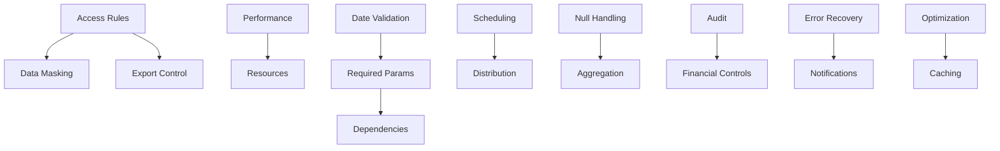

# Business Rules - Reports Module - Lucky Gas Legacy System

## 🎯 Business Rule Categories

The Reports module business rules ensure data integrity, performance optimization, security compliance, and consistent report generation across the Lucky Gas system.

## 📋 Rule Categories

### 1. Report Access & Security Rules

**RULE-RPT-001: Report Permission Matrix**
```yaml
Rule: Each report must have defined access permissions
Implementation:
  - Security level assignment (Public/Internal/Confidential/Restricted)
  - Role-based access control mapping
  - Department-level data filtering
  - Time-based access restrictions
Validation:
  - User role verification at runtime
  - Department boundary enforcement
  - IP address validation for restricted reports
  - Access audit logging
```

**RULE-RPT-002: Data Masking Requirements**
```yaml
Rule: Sensitive data must be masked based on user permissions
Fields Affected:
  - Customer phone numbers (show last 4 digits only)
  - Credit card information (never displayed)
  - Personal ID numbers (partial masking)
  - Financial details (role-based visibility)
Exceptions:
  - Full data for authorized managers
  - Complete info for data owner
  - Audit reports show masked versions
```

**RULE-RPT-003: Export Restrictions**
```yaml
Rule: Report exports must comply with data governance policies
Restrictions:
  - Financial reports: Manager approval required
  - Customer lists: No bulk export without authorization
  - Pricing data: Internal use only, no external sharing
  - Personal data: GDPR compliance check
Export Limits:
  - Maximum 50,000 rows per export
  - Daily export quota per user
  - Watermarking for sensitive exports
```

### 2. Report Generation Rules

**RULE-RPT-004: Query Performance Limits**
```yaml
Rule: Report queries must complete within defined timeouts
Timeouts:
  - Interactive reports: 30 seconds maximum
  - Scheduled reports: 5 minutes maximum
  - Dashboard queries: 10 seconds maximum
  - Export operations: 30 minutes maximum
Fallback:
  - Offer to schedule for batch processing
  - Suggest parameter refinement
  - Provide partial results option
```

**RULE-RPT-005: Resource Utilization Caps**
```yaml
Rule: Report generation must not exceed resource limits
Limits:
  - Memory: 4GB per report generation
  - CPU: 50% maximum utilization
  - Concurrent reports: 10 per server
  - Database connections: 5 per report
Throttling:
  - Queue overflow handling
  - Priority-based scheduling
  - Resource reservation system
```

**RULE-RPT-006: Data Freshness Requirements**
```yaml
Rule: Reports must indicate data currency
Requirements:
  - Display data extraction timestamp
  - Show last update time for cached data
  - Warning for stale data (>24 hours)
  - Real-time indicator for live data
Cache Rules:
  - Financial data: 15-minute cache
  - Operational data: 1-hour cache
  - Historical data: 24-hour cache
  - Static reports: 7-day cache
```

### 3. Parameter Validation Rules

**RULE-RPT-007: Date Range Validations**
```yaml
Rule: Date parameters must follow business logic
Validations:
  - End date >= Start date
  - Maximum range: 1 year for detailed reports
  - Maximum range: 5 years for summary reports
  - Future dates not allowed for historical reports
  - Business day adjustments for financial reports
Special Dates:
  - Fiscal year boundaries
  - Taiwan holidays consideration
  - Month-end processing dates
```

**RULE-RPT-008: Required Parameter Enforcement**
```yaml
Rule: Mandatory parameters cannot be bypassed
Requirements:
  - Date range for all transaction reports
  - Department selection for filtered reports
  - Customer ID for customer-specific reports
  - Product category for inventory reports
Defaults:
  - Current month for period reports
  - User's department for filtered reports
  - All active products for product reports
```

**RULE-RPT-009: Cross-Parameter Dependencies**
```yaml
Rule: Parameter combinations must be logically valid
Dependencies:
  - Region selection requires country
  - Product details require category
  - Employee reports require department
  - Financial periods require fiscal year
Validation:
  - Cascade parameter updates
  - Disable invalid combinations
  - Show contextual help
```

### 4. Scheduling & Distribution Rules

**RULE-RPT-010: Schedule Window Compliance**
```yaml
Rule: Scheduled reports must respect operational windows
Windows:
  - Batch processing: 02:00-06:00 AM only
  - Business reports: Not during 11:30-13:30 (lunch)
  - Month-end reports: After day 3 of new month
  - Year-end reports: Special 48-hour window
Exceptions:
  - Critical reports can override
  - Manual execution allowed with warning
  - Holiday adjustments automatic
```

**RULE-RPT-011: Distribution List Validation**
```yaml
Rule: Email recipients must be validated monthly
Validation:
  - Email address format check
  - Domain verification
  - Bounce handling (3 strikes rule)
  - Inactive user removal
Updates:
  - Monthly validation run
  - Automatic cleanup
  - Admin notifications
  - Alternative delivery setup
```

**RULE-RPT-012: Delivery Size Restrictions**
```yaml
Rule: Report delivery must comply with channel limits
Email Limits:
  - Attachment: 25MB maximum
  - Compressed: 50MB maximum
  - Link delivery: >50MB files
FTP Limits:
  - Single file: 1GB maximum
  - Daily quota: 10GB per client
Portal Limits:
  - Storage quota: 100GB total
  - Retention: 90 days default
```

### 5. Data Quality Rules

**RULE-RPT-013: Null Value Handling**
```yaml
Rule: Null values must be handled consistently
Display Rules:
  - Numeric nulls: Show as "-" or "0"
  - Date nulls: Show as "N/A"
  - Text nulls: Show as empty string
  - Currency nulls: Show as "NT$ 0"
Calculations:
  - Exclude nulls from averages
  - Include as zero in sums (configurable)
  - Flag null percentages >10%
```

**RULE-RPT-014: Data Aggregation Standards**
```yaml
Rule: Aggregations must follow business definitions
Standards:
  - Revenue: Include tax, exclude refunds
  - Customer count: Active only by default
  - Inventory: Physical count only
  - Delivery: Completed status only
Rounding:
  - Currency: 0 decimal places
  - Percentages: 1 decimal place
  - Quantities: Integer only
  - Averages: 2 decimal places
```

**RULE-RPT-015: Missing Data Protocols**
```yaml
Rule: Reports must handle missing data gracefully
Protocols:
  - Show data coverage percentage
  - Highlight incomplete periods
  - Provide estimation option
  - Allow partial report generation
Thresholds:
  - <90% completeness: Warning
  - <70% completeness: Requires approval
  - <50% completeness: Block generation
```

### 6. Format & Presentation Rules

**RULE-RPT-016: Localization Requirements**
```yaml
Rule: Reports must support Traditional Chinese
Requirements:
  - Default language: Traditional Chinese
  - Number format: 1,234,567
  - Currency: NT$ prefix
  - Date format: 民國 YYY/MM/DD
Options:
  - English version available
  - Bilingual headers supported
  - Export maintains formatting
```

**RULE-RPT-017: Corporate Branding**
```yaml
Rule: All reports must include Lucky Gas branding
Elements:
  - Company logo on first page
  - Footer with report ID and timestamp
  - Confidentiality notice if required
  - Page numbering (第 X 頁，共 Y 頁)
Colors:
  - Primary: #1976D2 (Lucky Gas Blue)
  - Secondary: #FFA726 (Gas Flame Orange)
  - Success: #4CAF50
  - Warning: #FF9800
```

**RULE-RPT-018: Pagination Standards**
```yaml
Rule: Large reports must implement pagination
Standards:
  - Screen display: 50 rows per page
  - PDF export: 30 rows per page
  - Excel export: 10,000 rows per sheet
  - CSV export: No pagination
Navigation:
  - First/Previous/Next/Last buttons
  - Page number input
  - Rows per page selector
```

### 7. Dashboard Specific Rules

**RULE-RPT-019: Real-time Update Frequency**
```yaml
Rule: Dashboard refresh rates based on data criticality
Refresh Rates:
  - Critical KPIs: 10 seconds
  - Operational metrics: 30 seconds
  - Summary data: 5 minutes
  - Historical trends: 15 minutes
Throttling:
  - Reduce frequency during peak hours
  - Pause updates on inactive tabs
  - Resume on user interaction
```

**RULE-RPT-020: Widget Performance Limits**
```yaml
Rule: Dashboard widgets must maintain responsiveness
Limits:
  - Maximum 20 widgets per dashboard
  - Data points: 1,000 per chart
  - Animation duration: <500ms
  - Initial load: <3 seconds
Optimization:
  - Progressive loading
  - Viewport-based rendering
  - Data windowing for large sets
```

**RULE-RPT-021: Alert Threshold Management**
```yaml
Rule: Dashboard alerts require business validation
Requirements:
  - Threshold values approved by manager
  - Minimum 5% deviation for triggers
  - Maximum 10 alerts per dashboard
  - Escalation path defined
Types:
  - Error: Immediate attention (red)
  - Warning: Review needed (yellow)
  - Info: FYI only (blue)
  - Success: Target achieved (green)
```

### 8. Compliance & Audit Rules

**RULE-RPT-022: Report Access Auditing**
```yaml
Rule: All report access must be logged
Log Details:
  - User ID and name
  - Report ID and name
  - Access timestamp
  - Parameters used
  - Export/View action
  - IP address
  - Duration
Retention:
  - Access logs: 1 year
  - Export logs: 3 years
  - Error logs: 90 days
```

**RULE-RPT-023: Financial Report Controls**
```yaml
Rule: Financial reports require additional controls
Controls:
  - Dual approval for modifications
  - Change tracking with reasons
  - Version control mandatory
  - Period lock after closing
  - Reconciliation requirements
Compliance:
  - SOX compliance for public data
  - Tax authority requirements
  - Internal audit standards
```

**RULE-RPT-024: Data Retention Policies**
```yaml
Rule: Generated reports follow retention schedule
Retention Periods:
  - Daily operational: 90 days
  - Monthly summaries: 2 years
  - Annual reports: 7 years
  - Regulatory reports: 10 years
  - Temporary exports: 7 days
Archival:
  - Compress after 30 days
  - Move to archive after 90 days
  - Offline storage after 1 year
```

### 9. Error Handling Rules

**RULE-RPT-025: Generation Failure Protocols**
```yaml
Rule: Failed reports must follow recovery procedures
Procedures:
  - Automatic retry: 3 attempts
  - Retry interval: 5, 15, 30 minutes
  - Notification after 2nd failure
  - Alternative format offer
  - Manual intervention option
Fallbacks:
  - Provide last successful version
  - Offer reduced data set
  - Schedule for off-peak retry
```

**RULE-RPT-026: Data Inconsistency Handling**
```yaml
Rule: Data quality issues must be flagged
Checks:
  - Negative values in count fields
  - Future dates in historical data
  - Outliers beyond 3 standard deviations
  - Missing mandatory relationships
Actions:
  - Flag suspicious data
  - Continue with warnings
  - Log quality issues
  - Notify data steward
```

**RULE-RPT-027: User Notification Standards**
```yaml
Rule: Users must be informed of report status
Notifications:
  - Generation started confirmation
  - Progress updates for long-running
  - Completion with download link
  - Failure with reason and options
Channels:
  - In-app notifications
  - Email for scheduled reports
  - SMS for critical failures
  - Dashboard status widget
```

### 10. Performance Optimization Rules

**RULE-RPT-028: Query Optimization Requirements**
```yaml
Rule: Report queries must use optimization techniques
Techniques:
  - Index usage mandatory
  - Partition pruning for date ranges
  - Materialized views for summaries
  - Query hints for complex joins
Monitoring:
  - Execution plan review
  - Slow query logging
  - Resource usage tracking
  - Optimization recommendations
```

**RULE-RPT-029: Caching Strategy Rules**
```yaml
Rule: Implement intelligent caching for performance
Strategy:
  - Parameter-based cache keys
  - User-specific cache for filtered data
  - Shared cache for common reports
  - Cache warming for popular reports
Invalidation:
  - Time-based expiry
  - Data change triggers
  - Manual refresh option
  - Scheduled cache rebuilds
```

**RULE-RPT-030: Concurrent Execution Limits**
```yaml
Rule: Manage concurrent report load
Limits:
  - Per user: 3 concurrent reports
  - Per server: 20 concurrent reports
  - Per database: 50 active queries
  - Queue depth: 100 maximum
Priority:
  - Executive reports: Highest
  - Scheduled reports: High
  - Ad-hoc reports: Normal
  - Export jobs: Low
```

## 📐 Rule Implementation Matrix

| Rule Category | Count | Critical Rules | Automated Validation |
|--------------|-------|----------------|---------------------|
| Access & Security | 3 | RPT-001, RPT-002 | 100% |
| Generation | 3 | RPT-004, RPT-005 | 100% |
| Parameters | 3 | RPT-008 | 90% |
| Scheduling | 3 | RPT-010 | 85% |
| Data Quality | 3 | RPT-014 | 80% |
| Format | 3 | RPT-016 | 100% |
| Dashboard | 3 | RPT-020 | 95% |
| Compliance | 3 | RPT-022, RPT-023 | 100% |
| Error Handling | 3 | RPT-025 | 90% |
| Performance | 3 | RPT-029 | 85% |

## 🔄 Rule Dependencies



## ⚡ Performance Impact

### High Impact Rules
- RPT-004: Query timeout enforcement
- RPT-005: Resource utilization caps
- RPT-020: Widget performance limits
- RPT-029: Caching strategy

### Medium Impact Rules
- RPT-006: Data freshness checks
- RPT-014: Aggregation standards
- RPT-028: Query optimization
- RPT-030: Concurrency limits

### Low Impact Rules
- RPT-016: Localization formatting
- RPT-017: Branding elements
- RPT-022: Access logging
- RPT-027: User notifications