# Batch Report Processing Workflow - Lucky Gas Legacy System

## 🎯 Workflow Purpose

The Batch Report Processing workflow handles large-scale report generation, data aggregation, and bulk export operations during off-peak hours. This workflow optimizes resource utilization for computationally intensive reports, historical data processing, and enterprise-wide analytics that require significant processing time and system resources.

## 📊 Workflow Overview

```mermaid
graph TB
    Start([Batch Process Trigger]) --> TriggerType{Trigger Type?}
    
    TriggerType -->|Scheduled| ScheduledTrigger[Scheduled Job]
    TriggerType -->|Manual| ManualTrigger[Manual Request]
    TriggerType -->|Event| EventTrigger[Event-Based Trigger]
    TriggerType -->|API| APITrigger[API Request]
    
    %% Scheduled Processing
    ScheduledTrigger --> CheckBatchWindow{Batch Window?}
    CheckBatchWindow -->|Not Yet| WaitWindow[Wait for Window]
    CheckBatchWindow -->|Active| LoadBatchConfig[Load Batch Configuration]
    WaitWindow --> CheckBatchWindow
    
    %% Manual Processing
    ManualTrigger --> ValidateUser{Authorized User?}
    ValidateUser -->|No| RejectRequest[Reject Request]
    ValidateUser -->|Yes| CheckResources[Check System Resources]
    
    %% Event Processing
    EventTrigger --> ValidateEvent{Valid Event?}
    ValidateEvent -->|No| LogInvalidEvent[Log Invalid Event]
    ValidateEvent -->|Yes| CheckEventPriority[Check Event Priority]
    
    %% API Processing
    APITrigger --> AuthenticateAPI{Valid API Key?}
    AuthenticateAPI -->|No| ReturnError[Return 401 Error]
    AuthenticateAPI -->|Yes| ValidateRequest[Validate API Request]
    
    %% Resource Checking
    CheckResources --> ResourceStatus{Resources OK?}
    ResourceStatus -->|Insufficient| QueueForLater[Queue for Later]
    ResourceStatus -->|Available| LoadBatchConfig
    
    CheckEventPriority --> PriorityLevel{Priority Level?}
    PriorityLevel -->|Low| QueueForLater
    PriorityLevel -->|High| LoadBatchConfig
    
    ValidateRequest --> LoadBatchConfig
    
    %% Batch Configuration
    LoadBatchConfig --> BatchType{Batch Type?}
    BatchType -->|Daily Aggregation| DailyBatch[Daily Aggregation Jobs]
    BatchType -->|Monthly Close| MonthlyBatch[Monthly Closing Reports]
    BatchType -->|Data Export| ExportBatch[Bulk Data Export]
    BatchType -->|Archive| ArchiveBatch[Historical Archive]
    BatchType -->|Custom| CustomBatch[Custom Batch Jobs]
    
    %% Daily Aggregation
    DailyBatch --> LoadDailyJobs[Load Daily Job Queue]
    LoadDailyJobs --> PrioritizeJobs[Prioritize Job Execution]
    
    %% Monthly Processing
    MonthlyBatch --> CheckMonthEnd{Month End Verified?}
    CheckMonthEnd -->|No| WaitDataComplete[Wait for Data Completion]
    CheckMonthEnd -->|Yes| LoadMonthlyJobs[Load Monthly Jobs]
    WaitDataComplete --> CheckMonthEnd
    
    %% Export Processing
    ExportBatch --> LoadExportQueue[Load Export Requests]
    LoadExportQueue --> ValidateExports[Validate Export Permissions]
    
    %% Archive Processing
    ArchiveBatch --> IdentifyArchiveData[Identify Data for Archive]
    IdentifyArchiveData --> ValidateRetention[Validate Retention Policy]
    
    %% Custom Processing
    CustomBatch --> LoadCustomJobs[Load Custom Job Definitions]
    
    %% Job Queue Management
    PrioritizeJobs --> CreateExecutionPlan[Create Execution Plan]
    LoadMonthlyJobs --> CreateExecutionPlan
    ValidateExports --> CreateExecutionPlan
    ValidateRetention --> CreateExecutionPlan
    LoadCustomJobs --> CreateExecutionPlan
    
    CreateExecutionPlan --> EstimateResources[Estimate Resource Requirements]
    EstimateResources --> CheckCapacity{Capacity Available?}
    
    CheckCapacity -->|Insufficient| SplitBatch[Split into Sub-batches]
    CheckCapacity -->|Sufficient| InitializeBatch[Initialize Batch Process]
    SplitBatch --> InitializeBatch
    
    %% Batch Initialization
    InitializeBatch --> CreateBatchRecord[Create Batch Execution Record]
    CreateBatchRecord --> SetupEnvironment[Setup Processing Environment]
    
    SetupEnvironment --> EnvTask{Environment Task?}
    EnvTask -->|Temp Tables| CreateTempTables[Create Temporary Tables]
    EnvTask -->|Connections| EstablishConnections[Establish DB Connections]
    EnvTask -->|Memory| AllocateMemory[Allocate Memory Pools]
    EnvTask -->|Threads| CreateThreadPool[Create Thread Pool]
    
    CreateTempTables --> StartProcessing[Start Batch Processing]
    EstablishConnections --> StartProcessing
    AllocateMemory --> StartProcessing
    CreateThreadPool --> StartProcessing
    
    %% Main Processing Loop
    StartProcessing --> GetNextJob[Get Next Job from Queue]
    GetNextJob --> JobAvailable{Job Available?}
    
    JobAvailable -->|No| CheckPendingJobs{Any Pending?}
    JobAvailable -->|Yes| JobType{Job Type?}
    
    CheckPendingJobs -->|Yes| WaitForCompletion[Wait for Job Completion]
    CheckPendingJobs -->|No| FinalizeBatch[Finalize Batch Process]
    WaitForCompletion --> GetNextJob
    
    %% Job Type Processing
    JobType -->|Report| ProcessReport[Process Report Generation]
    JobType -->|Aggregation| ProcessAggregation[Process Data Aggregation]
    JobType -->|Export| ProcessExport[Process Data Export]
    JobType -->|Archive| ProcessArchive[Process Data Archive]
    JobType -->|Calculation| ProcessCalculation[Process Calculations]
    
    %% Report Processing
    ProcessReport --> LoadReportDef[Load Report Definition]
    LoadReportDef --> ExecuteReportQuery[Execute Report Query]
    ExecuteReportQuery --> CheckQueryResult{Query Success?}
    
    CheckQueryResult -->|Failed| HandleQueryError[Handle Query Error]
    CheckQueryResult -->|Success| GenerateReportOutput[Generate Report Output]
    
    %% Aggregation Processing
    ProcessAggregation --> LoadAggRules[Load Aggregation Rules]
    LoadAggRules --> ExecuteAggregation[Execute Aggregation Logic]
    ExecuteAggregation --> StoreAggResults[Store Aggregated Results]
    
    %% Export Processing
    ProcessExport --> PrepareExportData[Prepare Export Data]
    PrepareExportData --> ChunkData{Large Dataset?}
    ChunkData -->|Yes| CreateChunks[Create Data Chunks]
    ChunkData -->|No| ExportSingleFile[Export Single File]
    CreateChunks --> ExportMultipleFiles[Export Multiple Files]
    
    %% Archive Processing
    ProcessArchive --> CompressData[Compress Historical Data]
    CompressData --> MoveToArchive[Move to Archive Storage]
    MoveToArchive --> UpdateArchiveIndex[Update Archive Index]
    
    %% Calculation Processing
    ProcessCalculation --> LoadCalcRules[Load Calculation Rules]
    LoadCalcRules --> PerformCalculations[Perform Complex Calculations]
    PerformCalculations --> ValidateResults[Validate Calculation Results]
    
    %% Job Completion
    GenerateReportOutput --> UpdateJobStatus[Update Job Status]
    StoreAggResults --> UpdateJobStatus
    ExportSingleFile --> UpdateJobStatus
    ExportMultipleFiles --> UpdateJobStatus
    UpdateArchiveIndex --> UpdateJobStatus
    ValidateResults --> UpdateJobStatus
    HandleQueryError --> UpdateJobStatus
    
    UpdateJobStatus --> LogJobMetrics[Log Job Performance Metrics]
    LogJobMetrics --> CheckDependencies{Dependent Jobs?}
    
    CheckDependencies -->|Yes| TriggerDependents[Trigger Dependent Jobs]
    CheckDependencies -->|No| GetNextJob
    TriggerDependents --> GetNextJob
    
    %% Batch Finalization
    FinalizeBatch --> GenerateSummary[Generate Batch Summary]
    GenerateSummary --> CheckErrors{Any Errors?}
    
    CheckErrors -->|Yes| PrepareErrorReport[Prepare Error Report]
    CheckErrors -->|No| PrepareSuccessReport[Prepare Success Report]
    
    PrepareErrorReport --> NotifyStakeholders[Notify Stakeholders]
    PrepareSuccessReport --> NotifyStakeholders
    
    %% Cleanup Process
    NotifyStakeholders --> CleanupResources[Cleanup Resources]
    CleanupResources --> CleanupTask{Cleanup Task?}
    
    CleanupTask -->|Temp Tables| DropTempTables[Drop Temporary Tables]
    CleanupTask -->|Connections| CloseConnections[Close DB Connections]
    CleanupTask -->|Memory| ReleaseMemory[Release Memory]
    CleanupTask -->|Files| DeleteTempFiles[Delete Temp Files]
    
    DropTempTables --> UpdateBatchRecord[Update Batch Record]
    CloseConnections --> UpdateBatchRecord
    ReleaseMemory --> UpdateBatchRecord
    DeleteTempFiles --> UpdateBatchRecord
    
    %% Post-Processing
    UpdateBatchRecord --> ArchiveBatchLog[Archive Batch Log]
    ArchiveBatchLog --> ScheduleNext{Recurring Batch?}
    
    ScheduleNext -->|Yes| CalculateNextRun[Calculate Next Run]
    ScheduleNext -->|No| CompleteBatch[Complete Batch]
    
    CalculateNextRun --> UpdateSchedule[Update Schedule]
    UpdateSchedule --> CompleteBatch
    
    %% Error Handling
    QueueForLater --> End([End])
    RejectRequest --> End
    LogInvalidEvent --> End
    ReturnError --> End
    CompleteBatch --> End
    
    %% Styling
    classDef errorStyle fill:#ff6b6b,stroke:#c92a2a,stroke-width:2px,color:#fff
    classDef successStyle fill:#51cf66,stroke:#2f9e44,stroke-width:2px,color:#fff
    classDef processStyle fill:#4dabf7,stroke:#1864ab,stroke-width:2px,color:#fff
    classDef decisionStyle fill:#ffd43b,stroke:#fab005,stroke-width:2px
    classDef resourceStyle fill:#a29bfe,stroke:#6c5ce7,stroke-width:2px,color:#fff
    
    class RejectRequest,LogInvalidEvent,ReturnError,HandleQueryError errorStyle
    class CompleteBatch,PrepareSuccessReport,UpdateBatchRecord successStyle
    class LoadBatchConfig,CreateExecutionPlan,StartProcessing,ProcessReport processStyle
    class TriggerType,BatchType,JobAvailable,CheckErrors,ScheduleNext decisionStyle
    class SetupEnvironment,AllocateMemory,CreateThreadPool,CleanupResources resourceStyle
```



## 🔄 Process Steps

### 1. Batch Triggering Mechanisms

**Step 1.1: Trigger Types**
```yaml
Scheduled Triggers:
  Daily Batch:
    - Time: 02:00 AM Taiwan Time
    - Window: 02:00 - 06:00 AM
    - Priority: Normal
    - Retry: 3 attempts
    
  Weekly Batch:
    - Day: Sunday
    - Time: 01:00 AM
    - Window: 8 hours
    - Priority: Low
    
  Monthly Batch:
    - Day: 1st of month
    - Time: 00:00 AM
    - Window: 12 hours
    - Priority: High
    
  Year-End Batch:
    - Date: December 31
    - Time: 22:00 PM
    - Window: 24 hours
    - Priority: Critical

Manual Triggers:
  Authorization Required:
    - Role: Manager or above
    - Approval: For production
    - Limit: 3 per day
    - Tracking: Audit log

Event Triggers:
  Data Completion:
    - Month-end close
    - Data import finish
    - System maintenance
    
  Threshold Triggers:
    - Data volume exceeded
    - Time-based cutoff
    - Business events
```

**Step 1.2: Batch Windows**
```yaml
Processing Windows:
  Peak Avoidance:
    - Business Hours: 08:00-18:00 (Avoid)
    - Lunch Peak: 11:30-13:30 (Never)
    - Month End: 25th-5th (Restricted)
    
  Optimal Windows:
    - Weekday Night: 02:00-06:00
    - Weekend: 00:00-08:00
    - Holiday: All day
    
  Resource Allocation:
    - CPU: Up to 80% during window
    - Memory: Up to 16GB per batch
    - IO: Throttled to 70%
    - Connections: 50 max
```

### 2. Job Queue Management

**Step 2.1: Job Prioritization**
```yaml
Priority Matrix:
  Critical (P1):
    - Financial closing reports
    - Regulatory compliance
    - Executive dashboards
    - Processing: Immediate
    
  High (P2):
    - Daily operational reports
    - Inventory reconciliation
    - Customer statements
    - Processing: Within 1 hour
    
  Normal (P3):
    - Historical analysis
    - Trend reports
    - Performance metrics
    - Processing: Within window
    
  Low (P4):
    - Archive operations
    - Data cleanup
    - Optional exports
    - Processing: Best effort
```

**Step 2.2: Dependency Management**
```yaml
Dependency Types:
  Data Dependencies:
    - Source table completion
    - External data arrival
    - Prior calculation finish
    
  Sequential Dependencies:
    - Job A must complete before B
    - Aggregation before reporting
    - Validation before export
    
  Resource Dependencies:
    - Exclusive table locks
    - Memory requirements
    - CPU allocation
    
Dependency Resolution:
  - Topological sorting
  - Deadlock detection
  - Automatic reordering
  - Manual override option
```

### 3. Processing Types

**Step 3.1: Report Generation**
```yaml
Large Report Processing:
  Data Strategies:
    - Partition processing
    - Parallel execution
    - Incremental building
    - Result streaming
    
  Memory Management:
    - Chunk size: 10,000 rows
    - Spill to disk: >1GB
    - Garbage collection
    - Memory monitoring
    
  Output Handling:
    - Progressive writing
    - Compression on-fly
    - Multi-file splitting
    - Format optimization
```

**Step 3.2: Data Aggregation**
```yaml
Aggregation Levels:
  Hourly Rollups:
    - Transaction summaries
    - Performance metrics
    - System statistics
    
  Daily Summaries:
    - Sales totals
    - Delivery counts
    - Inventory snapshots
    
  Monthly Aggregates:
    - Revenue analysis
    - Customer metrics
    - Product performance
    
  Yearly Consolidation:
    - Annual reports
    - Trend analysis
    - Comparative data
    
Aggregation Techniques:
  - Materialized views
  - Incremental updates
  - Windowing functions
  - Parallel aggregation
```

**Step 3.3: Bulk Data Export**
```yaml
Export Scenarios:
  Customer Data:
    - Format: CSV/Excel
    - Encryption: Required
    - Chunking: 50,000 rows
    - Compression: ZIP
    
  Financial Data:
    - Format: Fixed-width
    - Validation: Checksums
    - Audit: Complete trail
    - Delivery: Secure FTP
    
  Regulatory Reports:
    - Format: Government spec
    - Validation: Schema-based
    - Certification: Digital sign
    - Retention: 7 years
    
Export Optimization:
  - Parallel extraction
  - Direct path writes
  - Minimal logging
  - Network throttling
```

**Step 3.4: Data Archival**
```yaml
Archive Strategy:
  Age-Based:
    - Transactions: >2 years
    - Logs: >90 days
    - Reports: >1 year
    - Temp data: >7 days
    
  Volume-Based:
    - Table size: >100GB
    - Partition size: >10GB
    - Index size: >5GB
    
  Archive Process:
    - Data validation
    - Compression (70% ratio)
    - Encryption at rest
    - Catalog update
    - Original deletion
    
  Retrieval Process:
    - On-demand restore
    - Partial retrieval
    - Search capability
    - Access logging
```

### 4. Resource Management

**Step 4.1: System Resources**
```yaml
CPU Management:
  Allocation:
    - Batch processes: 60%
    - Online systems: 30%
    - OS/overhead: 10%
    
  Throttling:
    - CPU >80%: Pause low priority
    - CPU >90%: Emergency throttle
    - Temperature: Monitor limits
    
Memory Management:
  Allocation:
    - Per job limit: 4GB
    - Total batch: 16GB
    - Buffer cache: 8GB
    - Emergency reserve: 2GB
    
  Optimization:
    - Memory pooling
    - Object recycling
    - Garbage collection
    - Swap monitoring
```

**Step 4.2: Database Resources**
```yaml
Connection Management:
  Pool Configuration:
    - Min connections: 10
    - Max connections: 50
    - Timeout: 30 seconds
    - Retry: 3 attempts
    
  Load Distribution:
    - Read replicas: Reports
    - Primary: Aggregations
    - Archive DB: Historical
    
Transaction Management:
  Batch Transactions:
    - Size: 1000 records
    - Checkpoint: Every 5 min
    - Rollback segments
    - Lock monitoring
    
Temporary Storage:
  Temp Tables:
    - Naming: BATCH_TEMP_*
    - Tablespace: TEMP_BATCH
    - Cleanup: Automatic
    - Monitoring: Space usage
```

### 5. Error Handling & Recovery

**Step 5.1: Error Categories**
```yaml
Data Errors:
  Types:
    - Missing source data
    - Data quality issues
    - Constraint violations
    - Calculation errors
    
  Handling:
    - Log detail records
    - Continue processing
    - Summary report
    - Manual review queue

System Errors:
  Types:
    - Out of memory
    - Disk space full
    - Network failure
    - Database errors
    
  Recovery:
    - Automatic retry
    - Resource cleanup
    - Checkpoint restart
    - Escalation alerts

Process Errors:
  Types:
    - Timeout exceeded
    - Dependency failure
    - Configuration error
    - Permission denied
    
  Resolution:
    - Skip and continue
    - Fail entire batch
    - Manual intervention
    - Automated fixes
```

**Step 5.2: Recovery Mechanisms**
```yaml
Checkpoint Recovery:
  Strategy:
    - Checkpoint every 1000 records
    - State preservation
    - Restart capability
    - Progress tracking
    
  Implementation:
    - Database checkpoints
    - File markers
    - Memory snapshots
    - Transaction logs

Rollback Procedures:
  Levels:
    - Transaction rollback
    - Job rollback
    - Batch rollback
    - Complete reset
    
  Automation:
    - Automatic detection
    - Rollback execution
    - State restoration
    - Notification sending
```

## 📋 Business Rules

### Processing Rules
1. **Window Compliance**: No batch during business hours
2. **Priority Override**: P1 can preempt P3/P4
3. **Retry Limits**: Max 3 retries per job
4. **Timeout Values**: 4 hours max per batch
5. **Concurrent Batches**: Max 2 simultaneous

### Data Rules
1. **Validation Required**: All exports validated
2. **Retention Compliance**: Follow legal requirements
3. **Compression Standards**: Min 50% for archives
4. **Encryption Mandatory**: For sensitive data
5. **Audit Complete**: Every record tracked

### Resource Rules
1. **CPU Limit**: 80% max utilization
2. **Memory Cap**: 16GB for batch total
3. **Disk Reserve**: Keep 20% free
4. **Connection Limit**: 50 concurrent max
5. **Network Throttle**: 70% bandwidth max

## 🔐 Security & Compliance

### Access Control
- Batch job creation: Manager approval
- Production execution: Restricted roles
- Data export: Audit required
- Archive access: Special permission
- Log viewing: Read-only access

### Data Protection
- Encryption in transit
- Encryption at rest for archives
- Secure deletion protocols
- Access logging mandatory
- PII handling compliance

### Audit Requirements
- Job execution history
- Data lineage tracking
- Error documentation
- Performance metrics
- Compliance reporting

## 🔄 Integration Points

### Source Systems
1. **Transaction Database**: Live data extraction
2. **Data Warehouse**: Historical processing
3. **External Files**: Import processing
4. **API Endpoints**: Third-party data
5. **Archive Storage**: Historical retrieval

### Target Systems
1. **Report Repository**: Output storage
2. **Email System**: Distribution
3. **FTP Servers**: External delivery
4. **Archive System**: Long-term storage
5. **Analytics Platform**: Data feeding

## ⚡ Performance Optimization

### Processing Optimization
- Parallel job execution
- Partition-wise processing
- Index-only scans
- Result set caching
- Query plan optimization

### Storage Optimization
- Data compression
- Partition pruning
- Archive tiering
- Temporary cleanup
- Space pre-allocation

### Network Optimization
- Batch data transfers
- Compression protocols
- Bandwidth scheduling
- Connection pooling
- Route optimization

## 🚨 Monitoring & Alerts

### Performance Monitoring
- Job execution times
- Resource utilization
- Queue depths
- Error rates
- Throughput metrics

### Alert Conditions
- Job failure: Immediate
- Resource exhaustion: Warning
- Window violation: Critical
- Dependency break: High
- Performance degradation: Medium

### Reporting Metrics
- Batch success rate: >95%
- On-time completion: >90%
- Resource efficiency: >70%
- Error rate: <2%
- Recovery success: >98%

## 📊 Success Metrics

### Operational Metrics
- Batch reliability: 99%
- Processing speed: 1M records/hour
- Resource utilization: 70% average
- Error recovery: <30 minutes

### Business Impact
- Report availability: By 7 AM daily
- Data freshness: <24 hours
- Cost reduction: 40% vs real-time
- Quality improvement: 99.9% accuracy