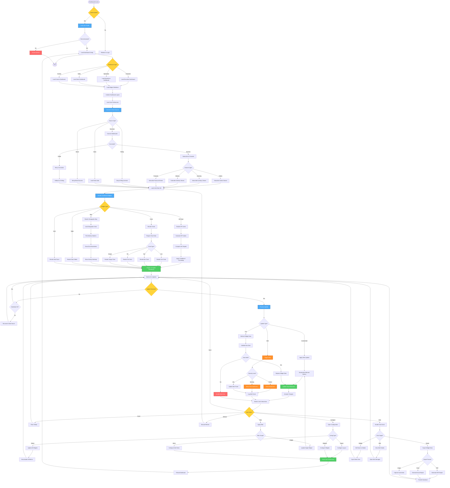

# Real-time Dashboard Workflow - Lucky Gas Legacy System

## 🎯 Workflow Purpose

The Real-time Dashboard workflow provides executives and managers with live business metrics and KPIs through interactive visualizations. This workflow handles continuous data streaming, real-time calculations, alert generation, and responsive display updates to support immediate decision-making.

## 📊 Workflow Overview



## 🔄 Process Steps

### 1. Dashboard Initialization

**Step 1.1: User Authentication & Authorization**
```yaml
Authentication:
  - Session validation
  - JWT token verification
  - Permission checking
  - IP whitelist validation
  
Authorization Levels:
  Executive: Full access to all KPIs
  Manager: Department-specific metrics
  Supervisor: Team performance data
  Operator: Operational metrics only
```

**Step 1.2: Dashboard Configuration**
```yaml
Dashboard Types:
  Executive Dashboard:
    - Revenue metrics
    - Profit margins
    - Market share
    - Strategic KPIs
    
  Operations Dashboard:
    - Delivery performance
    - Driver utilization
    - Inventory levels
    - Service metrics
    
  Sales Dashboard:
    - Sales pipeline
    - Customer metrics
    - Product performance
    - Territory analysis
    
  Custom Dashboard:
    - User-defined widgets
    - Personalized layout
    - Selected metrics
    - Custom alerts
```

### 2. Data Source Management

**Step 2.1: Real-time Data Streams**
```yaml
WebSocket Channels:
  orders: 
    - New orders
    - Order updates
    - Cancellations
    
  inventory:
    - Stock levels
    - Product movements
    - Low stock alerts
    
  delivery:
    - Driver locations
    - Delivery status
    - Route progress
    
  financial:
    - Payment updates
    - Revenue tracking
    - Cost changes
```

**Step 2.2: Data Polling Strategy**
```yaml
Polling Intervals:
  High Priority: 10 seconds
  Medium Priority: 30 seconds
  Low Priority: 5 minutes
  
Optimization:
  - Adaptive intervals based on activity
  - Batch requests for efficiency
  - Delta updates only
  - Cache validation
```

### 3. Widget Components

**Step 3.1: KPI Cards**
```yaml
KPI Components:
  Value Display:
    - Current value
    - Previous value
    - Change percentage
    - Trend indicator
    
  Visual Elements:
    - Icon representation
    - Color coding
    - Sparkline chart
    - Progress bar
    
  Interactions:
    - Click for details
    - Hover for history
    - Configure targets
    - Set alerts
```

**Step 3.2: Chart Widgets**
```yaml
Chart Types:
  Line Charts:
    - Time series data
    - Trend analysis
    - Multi-series comparison
    - Zoom/pan support
    
  Bar Charts:
    - Category comparison
    - Stacked/grouped options
    - Horizontal/vertical
    - Data labels
    
  Pie/Donut Charts:
    - Distribution analysis
    - Percentage breakdown
    - Interactive legends
    - Drill-down support
    
  Gauge Charts:
    - Performance metrics
    - Target comparison
    - Color zones
    - Animated needles
```

**Step 3.3: Geographic Map**
```yaml
Map Features:
  Delivery Tracking:
    - Real-time driver positions
    - Route visualization
    - Customer locations
    - Traffic overlay
    
  Zone Analysis:
    - Delivery density heatmap
    - Zone boundaries
    - Performance by area
    - Coverage gaps
    
  Interactive Elements:
    - Marker clustering
    - Info windows
    - Filter by status
    - Route animation
```

### 4. Real-time Update Processing

**Step 4.1: Update Mechanisms**
```yaml
Update Types:
  Incremental Updates:
    - Add new data points
    - Update existing values
    - Remove obsolete data
    - Maintain history
    
  Full Refresh:
    - Complete data reload
    - Reset calculations
    - Clear cache
    - Rebuild visualizations
    
  Alert Triggers:
    - Threshold breaches
    - Anomaly detection
    - Target misses
    - System events
```

**Step 4.2: Performance Optimization**
```yaml
Optimization Techniques:
  Data Management:
    - Virtual scrolling for tables
    - Data windowing
    - Progressive loading
    - Memory management
    
  Rendering:
    - Canvas vs SVG selection
    - WebGL for complex visuals
    - Animation throttling
    - Batch DOM updates
    
  Network:
    - WebSocket compression
    - Binary protocols
    - Request batching
    - CDN for static assets
```

### 5. User Interactions

**Step 5.1: Interactive Features**
```yaml
Click Actions:
  Drill-down:
    - Widget to report
    - Summary to detail
    - Time period zoom
    - Entity exploration
    
  Filtering:
    - Global filters
    - Widget filters
    - Quick filters
    - Saved filters
    
  Export Options:
    - Current view PDF
    - Data Excel export
    - Screenshot capture
    - Scheduled reports
```

**Step 5.2: Personalization**
```yaml
User Preferences:
  Layout:
    - Widget positioning
    - Grid size
    - Theme selection
    - Density settings
    
  Data:
    - Default filters
    - Time ranges
    - Metric selection
    - Alert thresholds
    
  Notifications:
    - Alert preferences
    - Sound settings
    - Email digests
    - Mobile push
```

## 📋 Business Rules

### Display Rules
1. **Refresh Rate**: 10s minimum for real-time widgets
2. **Data Retention**: 24 hours for trend display
3. **Alert Threshold**: User-configurable per metric
4. **Color Coding**: Red/Yellow/Green by performance
5. **Number Format**: Traditional Chinese numerals option

### Security Rules
1. **Session Timeout**: 30 minutes of inactivity
2. **Data Filtering**: Based on user role/department
3. **Export Limits**: Max 10,000 rows per export
4. **Screenshot**: Watermark with user/timestamp
5. **Audit Trail**: All interactions logged

### Performance Rules
1. **Widget Limit**: Max 20 widgets per dashboard
2. **Update Frequency**: Throttled during peak hours
3. **Data Points**: Max 1,000 per chart
4. **Concurrent Users**: 50 per dashboard instance
5. **Cache Policy**: 5-minute cache for static data

## 🔐 Security & Permissions

### Data Security
- Row-level security by department
- Metric access control by role
- PII masking in displays
- Secure WebSocket (WSS)
- API key rotation

### Audit Requirements
- User access logging
- Data export tracking
- Configuration changes
- Alert acknowledgments
- Performance metrics

## 🔄 Integration Points

### Data Sources
1. **Operational Database**: Real-time transactions
2. **Analytics Database**: Aggregated metrics
3. **Cache Layer**: Redis for performance
4. **Message Queue**: Event streaming
5. **External APIs**: Weather, traffic data

### Client Technologies
1. **WebSocket**: Real-time communication
2. **REST APIs**: Data queries
3. **GraphQL**: Flexible data fetching
4. **Server-Sent Events**: Fallback streaming
5. **Local Storage**: Preference caching

## ⚡ Performance Optimization

### Client-Side Optimization
- Lazy loading of widgets
- Virtual DOM updates
- Web Workers for calculations
- IndexedDB for offline cache
- Service Worker for resilience

### Server-Side Optimization
- Query result caching
- Aggregation pre-computation
- Connection pooling
- Load balancing
- CDN distribution

## 🚨 Monitoring & Alerts

### System Monitoring
- WebSocket connection health
- Widget render times
- Data freshness checks
- Error rate tracking
- User experience metrics

### Business Alerts
- KPI threshold breaches
- Anomaly detection
- Target achievement
- Trend reversals
- Compliance violations

## 📊 Success Metrics

### Technical Metrics
- Page load time: <2 seconds
- Update latency: <500ms
- Availability: 99.9%
- Error rate: <0.1%

### Business Metrics
- Decision speed: 70% faster
- Alert response: <5 minutes
- User adoption: 90%
- Data accuracy: 99.9%