# Report Generation Workflow - Lucky Gas Legacy System

## 🎯 Workflow Purpose

The Report Generation workflow manages the complete process of generating reports from user request through data retrieval, processing, formatting, and delivery. This workflow handles both ad-hoc report requests and scheduled report executions with proper resource management and error handling.

## 📊 Workflow Overview

```mermaid
graph TB
    Start([Report Request]) --> RequestType{Request Type?}
    
    RequestType -->|Ad-hoc| UserRequest[User Report Request]
    RequestType -->|Scheduled| ScheduledJob[Scheduled Execution]
    RequestType -->|API| APIRequest[API Call]
    RequestType -->|Triggered| EventTrigger[Event Triggered]
    
    %% User Request Flow
    UserRequest --> SelectReport[Select Report]
    SelectReport --> CheckPermission{Has Permission?}
    CheckPermission -->|No| Error1[Access Denied]
    CheckPermission -->|Yes| LoadParameters[Load Report Parameters]
    
    %% Scheduled Job Flow
    ScheduledJob --> LoadSchedule[Load Schedule Config]
    LoadSchedule --> CheckActive{Schedule Active?}
    CheckActive -->|No| SkipExecution[Skip Execution]
    CheckActive -->|Yes| LoadSavedParams[Load Saved Parameters]
    
    %% API Request Flow
    APIRequest --> ValidateAPI{Valid API Key?}
    ValidateAPI -->|No| Error2[Authentication Failed]
    ValidateAPI -->|Yes| ParseAPIParams[Parse API Parameters]
    
    %% Event Trigger Flow
    EventTrigger --> CheckTrigger{Valid Trigger?}
    CheckTrigger -->|No| Error3[Invalid Trigger]
    CheckTrigger -->|Yes| LoadEventParams[Load Event Parameters]
    
    %% Parameter Collection
    LoadParameters --> ShowParamForm[Display Parameter Form]
    ShowParamForm --> UserInput[User Enters Parameters]
    UserInput --> ValidateParams{Parameters Valid?}
    ValidateParams -->|No| ShowErrors[Show Validation Errors]
    ShowErrors --> UserInput
    ValidateParams -->|Yes| PrepareExecution[Prepare Execution]
    
    LoadSavedParams --> PrepareExecution
    ParseAPIParams --> PrepareExecution
    LoadEventParams --> PrepareExecution
    
    %% Execution Preparation
    PrepareExecution --> CheckCache{Report Cached?}
    CheckCache -->|Yes| CheckCacheValid{Cache Valid?}
    CheckCacheValid -->|Yes| ReturnCached[Return Cached Report]
    CheckCacheValid -->|No| QueueReport[Queue for Generation]
    CheckCache -->|No| QueueReport
    
    %% Queue Management
    QueueReport --> CheckResources{Resources Available?}
    CheckResources -->|No| WaitQueue[Wait in Queue]
    CheckResources -->|Yes| StartGeneration[Start Generation]
    WaitQueue --> CheckResources
    
    %% Report Generation
    StartGeneration --> CreateExecRecord[Create Execution Record]
    CreateExecRecord --> ApplyDataSecurity[Apply Data Security]
    ApplyDataSecurity --> ExecuteQuery[Execute Report Query]
    
    ExecuteQuery --> QueryStatus{Query Success?}
    QueryStatus -->|No| HandleQueryError[Handle Query Error]
    QueryStatus -->|Yes| CheckRowCount{Row Count OK?}
    
    HandleQueryError --> RetryQuery{Retry?}
    RetryQuery -->|Yes| ExecuteQuery
    RetryQuery -->|No| LogError[Log Error]
    LogError --> Error4[Generation Failed]
    
    CheckRowCount -->|Too Many| Error5[Row Limit Exceeded]
    CheckRowCount -->|OK| ProcessData[Process Result Data]
    
    %% Data Processing
    ProcessData --> ApplyCalculations[Apply Calculations]
    ApplyCalculations --> ApplyGrouping[Apply Grouping/Sorting]
    ApplyGrouping --> ApplyFormatting[Apply Formatting Rules]
    
    %% Format Generation
    ApplyFormatting --> OutputFormat{Output Format?}
    OutputFormat -->|HTML| GenerateHTML[Generate HTML]
    OutputFormat -->|PDF| GeneratePDF[Generate PDF]
    OutputFormat -->|Excel| GenerateExcel[Generate Excel]
    OutputFormat -->|CSV| GenerateCSV[Generate CSV]
    
    GenerateHTML --> StoreReport[Store Generated Report]
    GeneratePDF --> StoreReport
    GenerateExcel --> StoreReport
    GenerateCSV --> StoreReport
    
    %% Post-Generation
    StoreReport --> UpdateExecRecord[Update Execution Record]
    UpdateExecRecord --> CacheReport{Cacheable?}
    CacheReport -->|Yes| StoreinCache[Store in Cache]
    CacheReport -->|No| PrepareDelivery[Prepare Delivery]
    StoreinCache --> PrepareDelivery
    
    %% Delivery
    PrepareDelivery --> DeliveryMethod{Delivery Method?}
    DeliveryMethod -->|Download| ProvideDownload[Provide Download Link]
    DeliveryMethod -->|Email| SendEmail[Send via Email]
    DeliveryMethod -->|FTP| UploadFTP[Upload to FTP]
    DeliveryMethod -->|API| ReturnAPI[Return via API]
    
    ProvideDownload --> LogDelivery[Log Delivery]
    SendEmail --> CheckEmailStatus{Email Sent?}
    CheckEmailStatus -->|Yes| LogDelivery
    CheckEmailStatus -->|No| RetryEmail[Retry Email]
    RetryEmail --> LogDelivery
    UploadFTP --> LogDelivery
    ReturnAPI --> LogDelivery
    
    %% Completion
    ReturnCached --> Success[Report Delivered]
    LogDelivery --> Success
    
    %% Error Convergence
    Error1 --> End([End])
    Error2 --> End
    Error3 --> End
    Error4 --> End
    Error5 --> End
    SkipExecution --> End
    Success --> End
    
    %% Styling
    classDef errorStyle fill:#ff6b6b,stroke:#c92a2a,stroke-width:2px,color:#fff
    classDef successStyle fill:#51cf66,stroke:#2f9e44,stroke-width:2px,color:#fff
    classDef processStyle fill:#4dabf7,stroke:#1864ab,stroke-width:2px,color:#fff
    classDef decisionStyle fill:#ffd43b,stroke:#fab005,stroke-width:2px
    
    class Error1,Error2,Error3,Error4,Error5 errorStyle
    class Success,StoreReport,StoreinCache,LogDelivery successStyle
    class UserRequest,SelectReport,LoadParameters,PrepareExecution,StartGeneration,ExecuteQuery,ProcessData processStyle
    class RequestType,CheckPermission,ValidateParams,CheckCache,CheckResources,QueryStatus,OutputFormat,DeliveryMethod decisionStyle
```



## 🔄 Process Steps

### 1. Report Request Initiation

**Step 1.1: Request Types**
```yaml
Ad-hoc Request:
  - User selects from report catalog
  - Real-time parameter entry
  - Interactive execution
  - Immediate delivery
  
Scheduled Request:
  - Triggered by scheduler
  - Pre-configured parameters
  - Batch execution
  - Automated delivery
  
API Request:
  - External system integration
  - Programmatic parameters
  - Synchronous/Asynchronous
  - JSON/XML response
  
Event Triggered:
  - Business event based
  - Context-aware parameters
  - Automatic execution
  - Rule-based delivery
```

**Step 1.2: Permission Validation**
```yaml
Permission Checks:
  - User authentication
  - Report access rights
  - Data-level security
  - Time-based restrictions
  - IP-based access control
  
Security Levels:
  - Public: All authenticated users
  - Internal: Company employees
  - Confidential: Specific roles
  - Restricted: Named users only
```

### 2. Parameter Collection & Validation

**Step 2.1: Parameter Types**
```yaml
Date Parameters:
  - Date pickers with calendar
  - Relative dates (Today, Yesterday)
  - Date ranges with validation
  - Fiscal period selection
  
Selection Parameters:
  - Single select dropdowns
  - Multi-select lists
  - Hierarchical selections
  - Type-ahead search
  
Numeric Parameters:
  - Number inputs with validation
  - Range sliders
  - Currency formatting
  - Percentage inputs
```

**Step 2.2: Parameter Validation**
```yaml
Validation Rules:
  - Required field checks
  - Data type validation
  - Range validation
  - Cross-field validation
  - Business rule validation
  
Error Handling:
  - Inline error messages
  - Field highlighting
  - Validation summary
  - Help text display
```

### 3. Report Generation Process

**Step 3.1: Queue Management**
```yaml
Queue Priority:
  1. Real-time dashboards
  2. Executive reports
  3. Scheduled reports
  4. Ad-hoc requests
  5. Bulk exports
  
Resource Allocation:
  - CPU threshold: 80%
  - Memory limit: 4GB/report
  - Concurrent limit: 10 reports
  - Timeout: 5 minutes default
```

**Step 3.2: Query Execution**
```yaml
Query Optimization:
  - Parameter injection
  - Index utilization
  - Partition pruning
  - Result set limiting
  
Data Security:
  - Row-level filtering
  - Column masking
  - Audit logging
  - Access tracking
```

**Step 3.3: Data Processing**
```yaml
Calculations:
  - Aggregations (SUM, AVG, COUNT)
  - Derived fields
  - Running totals
  - Percentage calculations
  
Formatting:
  - Number formatting (千/萬/億)
  - Date formatting (民國/西元)
  - Currency display (NT$)
  - Conditional formatting
```

### 4. Output Generation

**Step 4.1: Format-Specific Processing**
```yaml
HTML Generation:
  - Responsive layout
  - Interactive elements
  - Print-friendly CSS
  - Embedded charts
  
PDF Generation:
  - Page layout control
  - Headers/footers
  - Watermarking
  - Digital signatures
  
Excel Generation:
  - Multiple worksheets
  - Formulas preservation
  - Pivot table creation
  - Conditional formatting
  
CSV Generation:
  - UTF-8 encoding
  - Configurable delimiters
  - Header row option
  - Quote handling
```

**Step 4.2: Large Report Handling**
```yaml
Size Thresholds:
  - <10MB: Direct generation
  - 10-50MB: Streaming generation
  - 50-100MB: Background processing
  - >100MB: Scheduled delivery only
  
Optimization:
  - Data pagination
  - Progressive loading
  - Compression options
  - Split file delivery
```

### 5. Report Delivery

**Step 5.1: Delivery Methods**
```yaml
Direct Download:
  - Temporary URL generation
  - Secure token validation
  - Download tracking
  - Bandwidth throttling
  
Email Delivery:
  - SMTP configuration
  - Attachment size limits
  - HTML email formatting
  - Delivery confirmation
  
FTP Upload:
  - Secure FTP (SFTP)
  - Directory structure
  - File naming convention
  - Transfer verification
  
API Response:
  - JSON/XML formatting
  - Response compression
  - Pagination support
  - Rate limiting
```

**Step 5.2: Delivery Tracking**
```yaml
Tracking Metrics:
  - Delivery timestamp
  - Recipient confirmation
  - Download count
  - View duration
  - Error tracking
```

## 📋 Business Rules

### Generation Rules
1. **Timeout Management**: 5-minute default, 30-minute maximum
2. **Row Limits**: 10K default, 100K maximum per report
3. **Concurrent Execution**: Max 3 reports per user
4. **Cache Duration**: 1 hour for dynamic, 24 hours for static
5. **Retry Policy**: 3 attempts with exponential backoff

### Security Rules
1. **Data Access**: Filtered by user role and department
2. **Export Restrictions**: Sensitive data requires approval
3. **Audit Trail**: All report access logged for 90 days
4. **IP Restrictions**: Certain reports limited to office IPs
5. **Time Restrictions**: Financial reports business hours only

### Format Rules
1. **Excel Limits**: 1 million rows per worksheet
2. **PDF Limits**: 1000 pages maximum
3. **Email Size**: 25MB attachment limit
4. **Compression**: Automatic for files >10MB
5. **Encoding**: UTF-8 for all text formats

## 🔐 Security & Permissions

### Access Control Matrix
| Report Type | Public | Internal | Confidential | Restricted |
|-------------|--------|----------|--------------|------------|
| Sales Summary | ❌ | ✅ | ✅ | ✅ |
| Customer Details | ❌ | Limited | ✅ | ✅ |
| Financial Reports | ❌ | ❌ | ✅ | ✅ |
| Executive Dashboard | ❌ | ❌ | ❌ | ✅ |

### Data Masking Rules
- **Customer Names**: Show for own customers only
- **Revenue Details**: Aggregate for non-managers
- **Personal Data**: Masked in exports
- **Credit Information**: Restricted access

## 🔄 Integration Points

### Data Sources
1. **Primary Database**: Real-time transactional data
2. **Data Warehouse**: Historical and aggregated data
3. **Cache Layer**: Frequently accessed reports
4. **External APIs**: Third-party data integration

### Delivery Systems
1. **Email Server**: SMTP integration
2. **File Server**: Report storage
3. **CDN**: Static report delivery
4. **Message Queue**: Async processing

## ⚡ Performance Optimization

### Caching Strategy
- **Query Results**: 1-hour cache for parameters
- **Generated Reports**: 24-hour cache for static
- **Metadata**: Permanent cache with invalidation
- **User Preferences**: Session-based cache

### Resource Management
- **Thread Pool**: 20 concurrent report threads
- **Memory Allocation**: 4GB heap per generator
- **Query Timeout**: 5 minutes default
- **Connection Pool**: 50 database connections

## 🚨 Error Handling

### Common Errors
1. **Query Timeout**: Offer to schedule for off-peak
2. **Memory Exceeded**: Suggest smaller date range
3. **Permission Denied**: Show required roles
4. **Data Not Found**: Check parameter values
5. **Format Error**: Fallback to CSV

### Recovery Procedures
- Automatic retry with backoff
- Query optimization hints
- Alternative delivery methods
- Admin notification for failures
- User notification with options

## 📊 Success Metrics

### Performance Metrics
- Report generation: <30 seconds average
- Cache hit rate: >60%
- Delivery success: >99%
- User satisfaction: >90%

### Business Metrics
- Report utilization: 80% of available
- Decision time: 50% reduction
- Data accuracy: 99.9%
- Cost savings: 30% via automation