# Scheduled Report Workflow - Lucky Gas Legacy System

## 🎯 Workflow Purpose

The Scheduled Report workflow automates recurring report generation and distribution based on predefined schedules. This workflow ensures timely delivery of critical business reports to stakeholders without manual intervention, supporting daily operations and decision-making processes.

## 📊 Workflow Overview

```mermaid
graph TB
    Start([Scheduler Start]) --> LoadSchedules[Load Active Schedules]
    
    LoadSchedules --> CheckTime{Schedule Due?}
    CheckTime -->|No| Wait[Wait Next Interval]
    CheckTime -->|Yes| ValidateSchedule[Validate Schedule]
    
    Wait --> LoadSchedules
    
    %% Schedule Validation
    ValidateSchedule --> CheckActive{Schedule Active?}
    CheckActive -->|No| SkipSchedule[Skip & Log]
    CheckActive -->|Yes| CheckDateRange{Within Date Range?}
    
    CheckDateRange -->|No| MarkExpired[Mark Schedule Expired]
    CheckDateRange -->|Yes| CheckHoliday{Holiday Check}
    
    CheckHoliday -->|Holiday| CheckHolidayRule{Skip on Holiday?}
    CheckHolidayRule -->|Yes| RescheduleNext[Reschedule to Next Day]
    CheckHolidayRule -->|No| ProceedGeneration[Proceed with Generation]
    CheckHoliday -->|Not Holiday| ProceedGeneration
    
    %% Pre-Generation Checks
    ProceedGeneration --> CheckLastRun{Last Run Status?}
    CheckLastRun -->|Failed| CheckRetries{Retries Left?}
    CheckLastRun -->|Success| CheckDependencies[Check Dependencies]
    CheckLastRun -->|First Run| CheckDependencies
    
    CheckRetries -->|No| AlertAdmin[Alert Administrator]
    CheckRetries -->|Yes| IncrementRetry[Increment Retry Count]
    IncrementRetry --> CheckDependencies
    
    %% Dependency Management
    CheckDependencies --> DataReady{Data Ready?}
    DataReady -->|No| CheckDataTimeout{Timeout?}
    DataReady -->|Yes| LoadReportDef[Load Report Definition]
    
    CheckDataTimeout -->|Yes| HandleDataError[Handle Data Error]
    CheckDataTimeout -->|No| WaitForData[Wait for Data]
    WaitForData --> DataReady
    
    %% Parameter Preparation
    LoadReportDef --> LoadScheduleParams[Load Schedule Parameters]
    LoadScheduleParams --> ResolveParams[Resolve Dynamic Parameters]
    
    ResolveParams --> ParamType{Parameter Type?}
    ParamType -->|Date-Based| CalculateDates[Calculate Date Ranges]
    ParamType -->|Query-Based| ExecuteParamQuery[Execute Parameter Query]
    ParamType -->|Static| UseStaticValues[Use Static Values]
    
    CalculateDates --> ValidateAllParams[Validate All Parameters]
    ExecuteParamQuery --> ValidateAllParams
    UseStaticValues --> ValidateAllParams
    
    %% Queue Management
    ValidateAllParams --> CheckQueue{Queue Available?}
    CheckQueue -->|Full| WaitInQueue[Wait in Priority Queue]
    CheckQueue -->|Available| CreateExecution[Create Execution Record]
    
    WaitInQueue --> CheckPriority{High Priority?}
    CheckPriority -->|Yes| PreemptLower[Preempt Lower Priority]
    CheckPriority -->|No| WaitTurn[Wait Turn]
    PreemptLower --> CreateExecution
    WaitTurn --> CheckQueue
    
    %% Report Generation
    CreateExecution --> StartGeneration[Start Report Generation]
    StartGeneration --> MonitorProgress[Monitor Generation Progress]
    
    MonitorProgress --> CheckProgress{Generation Status?}
    CheckProgress -->|Running| CheckTimeout{Timeout?}
    CheckProgress -->|Completed| ValidateOutput[Validate Output]
    CheckProgress -->|Failed| HandleGenError[Handle Generation Error]
    
    CheckTimeout -->|Yes| KillProcess[Kill Generation Process]
    CheckTimeout -->|No| MonitorProgress
    KillProcess --> HandleGenError
    
    %% Output Validation
    ValidateOutput --> CheckOutput{Output Valid?}
    CheckOutput -->|Invalid| HandleOutputError[Handle Output Error]
    CheckOutput -->|Valid| CheckSize{Size Acceptable?}
    
    CheckSize -->|Too Large| CompressOutput[Compress Output]
    CheckSize -->|OK| PrepareDistribution[Prepare Distribution]
    CompressOutput --> PrepareDistribution
    
    %% Distribution Preparation
    PrepareDistribution --> LoadDistList[Load Distribution List]
    LoadDistList --> ValidateRecipients[Validate Recipients]
    
    ValidateRecipients --> CheckRecipients{All Valid?}
    CheckRecipients -->|Some Invalid| FilterInvalid[Filter Invalid Recipients]
    CheckRecipients -->|All Valid| FormatDelivery[Format for Delivery]
    FilterInvalid --> LogInvalid[Log Invalid Recipients]
    LogInvalid --> FormatDelivery
    
    %% Multi-Channel Distribution
    FormatDelivery --> DistMethod{Distribution Method?}
    DistMethod -->|Email| PrepareEmail[Prepare Email]
    DistMethod -->|FTP| PrepareFTP[Prepare FTP Upload]
    DistMethod -->|Portal| PublishPortal[Publish to Portal]
    DistMethod -->|Archive| ArchiveReport[Archive Only]
    
    %% Email Distribution
    PrepareEmail --> CheckAttachSize{Attachment Size?}
    CheckAttachSize -->|Too Large| CreateDownloadLink[Create Download Link]
    CheckAttachSize -->|OK| AttachReport[Attach Report]
    
    CreateDownloadLink --> SendEmailLink[Send Email with Link]
    AttachReport --> SendEmailDirect[Send Email with Attachment]
    
    SendEmailLink --> CheckEmailStatus{Email Sent?}
    SendEmailDirect --> CheckEmailStatus
    
    CheckEmailStatus -->|Failed| RetryEmail{Retry Attempts?}
    CheckEmailStatus -->|Success| LogEmailSuccess[Log Email Success]
    
    RetryEmail -->|Remaining| WaitRetry[Wait & Retry]
    RetryEmail -->|Exhausted| LogEmailFailure[Log Email Failure]
    WaitRetry --> SendEmailLink
    
    %% FTP Distribution
    PrepareFTP --> ConnectFTP{FTP Connected?}
    ConnectFTP -->|Failed| RetryFTP[Retry FTP Connection]
    ConnectFTP -->|Success| UploadFile[Upload Report File]
    
    UploadFile --> VerifyUpload{Upload Verified?}
    VerifyUpload -->|Failed| RetryUpload[Retry Upload]
    VerifyUpload -->|Success| LogFTPSuccess[Log FTP Success]
    
    %% Portal Publishing
    PublishPortal --> CheckPortalSpace{Space Available?}
    CheckPortalSpace -->|No| CleanOldReports[Clean Old Reports]
    CheckPortalSpace -->|Yes| PublishReport[Publish Report]
    
    CleanOldReports --> PublishReport
    PublishReport --> UpdatePortalIndex[Update Portal Index]
    UpdatePortalIndex --> LogPortalSuccess[Log Portal Success]
    
    %% Archive
    ArchiveReport --> CompressArchive[Compress for Archive]
    CompressArchive --> StoreArchive[Store in Archive]
    StoreArchive --> UpdateArchiveIndex[Update Archive Index]
    UpdateArchiveIndex --> LogArchiveSuccess[Log Archive Success]
    
    %% Post-Distribution
    LogEmailSuccess --> UpdateScheduleRecord[Update Schedule Record]
    LogEmailFailure --> UpdateScheduleRecord
    LogFTPSuccess --> UpdateScheduleRecord
    LogPortalSuccess --> UpdateScheduleRecord
    LogArchiveSuccess --> UpdateScheduleRecord
    
    UpdateScheduleRecord --> CalculateNextRun[Calculate Next Run Time]
    CalculateNextRun --> UpdateNextRun[Update Next Run]
    UpdateNextRun --> CleanupTemp[Cleanup Temp Files]
    CleanupTemp --> NotifyComplete[Notify Completion]
    
    %% Error Handling Convergence
    HandleDataError --> LogError[Log Error Details]
    HandleGenError --> LogError
    HandleOutputError --> LogError
    
    LogError --> CheckCritical{Critical Report?}
    CheckCritical -->|Yes| AlertOnCall[Alert On-Call Team]
    CheckCritical -->|No| ScheduleRetry[Schedule Retry]
    
    AlertOnCall --> UpdateErrorStatus[Update Error Status]
    ScheduleRetry --> UpdateErrorStatus
    AlertAdmin --> UpdateErrorStatus
    
    %% Success Path
    NotifyComplete --> Success[Schedule Execution Complete]
    
    %% End States
    SkipSchedule --> End([End])
    MarkExpired --> End
    RescheduleNext --> End
    UpdateErrorStatus --> End
    Success --> End
    
    %% Styling
    classDef errorStyle fill:#ff6b6b,stroke:#c92a2a,stroke-width:2px,color:#fff
    classDef successStyle fill:#51cf66,stroke:#2f9e44,stroke-width:2px,color:#fff
    classDef processStyle fill:#4dabf7,stroke:#1864ab,stroke-width:2px,color:#fff
    classDef decisionStyle fill:#ffd43b,stroke:#fab005,stroke-width:2px
    
    class HandleDataError,HandleGenError,HandleOutputError,LogError,AlertAdmin,LogEmailFailure errorStyle
    class Success,LogEmailSuccess,LogFTPSuccess,LogPortalSuccess,LogArchiveSuccess,NotifyComplete successStyle
    class LoadSchedules,ValidateSchedule,StartGeneration,PrepareDistribution,FormatDelivery processStyle
    class CheckTime,CheckActive,CheckHoliday,DataReady,CheckQueue,CheckProgress,DistMethod decisionStyle
```



## 🔄 Process Steps

### 1. Schedule Management

**Step 1.1: Schedule Loading**
```yaml
Schedule Types:
  Daily:
    - Execution time: Fixed time each day
    - Business days only option
    - Holiday handling rules
    
  Weekly:
    - Specific days selection
    - Multiple days allowed
    - Week start configuration
    
  Monthly:
    - Day of month (1-31)
    - Last day option
    - Business day adjustment
    
  Custom:
    - Cron expression support
    - Complex patterns
    - Timezone aware
```

**Step 1.2: Schedule Validation**
```yaml
Validation Checks:
  - Active flag status
  - Date range validity
  - User permissions
  - Report availability
  - Resource availability
  
Holiday Handling:
  - Skip execution
  - Move to next business day
  - Move to previous business day
  - Execute with notification
```

### 2. Parameter Resolution

**Step 2.1: Dynamic Parameters**
```yaml
Date Parameters:
  TODAY: Current date
  YESTERDAY: Previous date
  MONTH_START: First day of month
  MONTH_END: Last day of month
  YEAR_START: January 1st
  FISCAL_START: Fiscal year start
  
Calculated Parameters:
  - Relative date calculations
  - Business day adjustments
  - Period comparisons
  - Rolling windows
```

**Step 2.2: Query-Based Parameters**
```yaml
Parameter Queries:
  - Department list for user
  - Active customers
  - Product categories
  - Dynamic thresholds
  
Query Execution:
  - Connection pooling
  - Timeout handling
  - Result caching
  - Error defaults
```

### 3. Queue Management

**Step 3.1: Priority Queue**
```yaml
Priority Levels:
  1. Critical (Executive/Regulatory)
  2. High (Daily Operations)
  3. Normal (Regular Reports)
  4. Low (Historical/Archive)
  5. Batch (Bulk Exports)
  
Queue Rules:
  - Higher priority preempts lower
  - Same priority: FIFO
  - Starvation prevention
  - Resource reservation
```

**Step 3.2: Resource Management**
```yaml
Resource Limits:
  - Max concurrent: 5 scheduled reports
  - Memory per report: 2GB
  - CPU allocation: 50%
  - Disk space check
  
Throttling:
  - Peak hours: 2 concurrent
  - Off-peak: 5 concurrent
  - Weekend: 10 concurrent
  - Holiday: 1 concurrent
```

### 4. Distribution Management

**Step 4.1: Email Distribution**
```yaml
Email Configuration:
  Subject Template: "{REPORT_NAME} - {DATE}"
  Body Template: HTML with report summary
  Attachment Naming: "Report_YYYYMMDD_HHMMSS.pdf"
  
Size Handling:
  <5MB: Direct attachment
  5-25MB: Compressed attachment
  >25MB: Download link (7-day expiry)
  
Recipient Management:
  - Primary recipients
  - CC recipients
  - BCC for audit
  - Reply-to address
```

**Step 4.2: FTP Distribution**
```yaml
FTP Configuration:
  Protocol: SFTP preferred
  Directory: /reports/{YYYY}/{MM}/
  Naming: {REPORT_CODE}_{YYYYMMDD}.{FORMAT}
  
Transfer Options:
  - Binary mode
  - Resume support
  - Integrity check
  - Post-transfer notification
```

**Step 4.3: Portal Publishing**
```yaml
Portal Integration:
  Location: /shared/reports/{CATEGORY}/
  Retention: 90 days default
  Access: Role-based
  Indexing: Automatic
  
Features:
  - Version history
  - Download tracking
  - Comment system
  - Subscription alerts
```

### 5. Error Handling & Recovery

**Step 5.1: Error Classification**
```yaml
Data Errors:
  - Source unavailable
  - Query timeout
  - Invalid results
  Recovery: Retry with backoff
  
Generation Errors:
  - Memory exceeded
  - Process crash
  - Template error
  Recovery: Restart with reduced data
  
Distribution Errors:
  - Network failure
  - Authentication fail
  - Recipient invalid
  Recovery: Alternative delivery
```

**Step 5.2: Notification Rules**
```yaml
Notification Triggers:
  - 3 consecutive failures
  - Critical report failure
  - Data source unavailable
  - Distribution failure
  
Notification Channels:
  - Email to admin
  - SMS for critical
  - System dashboard
  - Audit log entry
```

## 📋 Business Rules

### Scheduling Rules
1. **Business Hours**: Reports generated 6 AM - 10 PM only
2. **Holiday Handling**: Follow Taiwan holiday calendar
3. **Retry Policy**: Max 3 retries, 30-min intervals
4. **Expiry Handling**: Disable expired schedules automatically
5. **Conflict Resolution**: Higher priority wins slot

### Distribution Rules
1. **Delivery Window**: Within 30 mins of generation
2. **Recipient Validation**: Monthly email verification
3. **Size Limits**: 50MB max per distribution
4. **Retention**: 90 days in portal, 1 year in archive
5. **Access Control**: Recipients must have report access

### Performance Rules
1. **Generation Timeout**: 30 minutes maximum
2. **Queue Timeout**: 2 hours maximum wait
3. **Distribution Timeout**: 15 minutes per channel
4. **Concurrent Limit**: 5 scheduled + 10 ad-hoc
5. **Resource Cap**: 50% CPU, 8GB RAM total

## 🔐 Security & Compliance

### Access Security
- Schedule creation requires Manager role
- Modification requires owner or Admin
- Distribution list changes logged
- Sensitive reports require approval
- Audit trail for all changes

### Data Security
- Encryption for email attachments
- SFTP for file transfers
- Secure links with tokens
- Access logging for downloads
- PII masking in logs

## 🔄 Integration Points

### Internal Systems
1. **Report Engine**: Generation service
2. **Queue Manager**: Priority handling
3. **Email Service**: SMTP integration
4. **File Service**: Storage management
5. **Audit Service**: Activity logging

### External Systems
1. **Mail Server**: Email delivery
2. **FTP Server**: File uploads
3. **Portal CMS**: Publishing API
4. **Archive Storage**: Long-term storage
5. **Monitoring**: Health checks

## ⚡ Performance Optimization

### Scheduling Optimization
- **Off-Peak Scheduling**: Prefer 2-6 AM slots
- **Load Balancing**: Distribute across time
- **Batch Grouping**: Combine similar reports
- **Incremental Generation**: Delta processing
- **Parallel Distribution**: Multi-channel async

### Resource Optimization
- **Pre-Generation**: Cache common parameters
- **Connection Pooling**: Reuse DB connections
- **Memory Management**: Stream large data
- **Disk Management**: Cleanup temporary files
- **Network Optimization**: Compression, CDN

## 🚨 Monitoring & Alerts

### Key Metrics
- **Schedule Success Rate**: Target >95%
- **On-Time Delivery**: Target >90%
- **Average Generation Time**: <5 minutes
- **Distribution Success**: >99%
- **Queue Wait Time**: <10 minutes

### Alert Thresholds
- **Failure Rate**: >10% triggers alert
- **Queue Depth**: >50 reports alerts
- **Generation Time**: >20 min warning
- **Disk Space**: <10GB critical
- **Memory Usage**: >80% warning

## 📊 Success Metrics

### Operational Metrics
- Schedule reliability: 99%
- Delivery accuracy: 99.5%
- User satisfaction: >85%
- System uptime: 99.9%

### Business Impact
- Manual effort saved: 100 hours/month
- Report delivery time: 80% faster
- Data freshness: Real-time to hourly
- Decision latency: Reduced by 60%