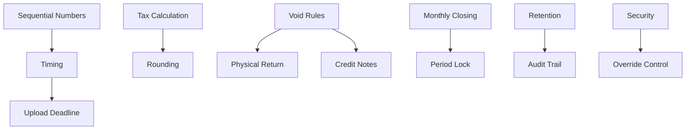

# Business Rules - Invoice Operations Module - Lucky Gas Legacy System

## 🎯 Business Rule Categories

The Invoice Operations module business rules ensure compliance with Taiwan tax regulations, maintain invoice integrity, protect revenue, and provide excellent customer service while managing the complete invoice lifecycle.

## 📋 Rule Categories

### 1. Invoice Generation Rules

**RULE-INV-001: Sequential Invoice Numbering**
```yaml
Rule: Invoice numbers must be sequential with no gaps
Implementation:
  - Government-allocated number ranges
  - Format: 2 letters + 8 digits (e.g., AB12345678)
  - Atomic number assignment
  - Rollback protection
Validation:
  - Check for gaps daily
  - Alert on approaching range end (80% used)
  - Prevent duplicate assignment
  - Audit trail for every number
Exceptions:
  - Damaged physical invoices (documented)
  - System recovery scenarios (approved)
```

**RULE-INV-002: Invoice Timing Requirements**
```yaml
Rule: Invoices must be issued within legal timeframes
Deadlines:
  - B2C Sales: At point of sale or delivery
  - B2B Sales: Within 7 days of delivery
  - Service Completion: Within 7 days
  - Prepayment: Upon payment receipt
Enforcement:
  - Automatic alerts at 5 days
  - Escalation at 6 days
  - Block at 8 days (requires override)
  - Daily aging report
```

**RULE-INV-003: Mandatory Invoice Information**
```yaml
Rule: All invoices must contain complete required information
Required Fields:
  B2B Invoice:
    - Seller tax ID and name
    - Buyer tax ID and name
    - Complete address
    - Invoice number and date
    - Item details with amounts
    - Tax calculation
    
  B2C Invoice:
    - Seller tax ID and name
    - Invoice number and date
    - Sale amount and tax
    - Carrier information (if applicable)
    
Validation:
  - Pre-save validation
  - Cannot print/send incomplete
  - Field format checking
```

**RULE-INV-004: One Delivery One Invoice**
```yaml
Rule: Each delivery must have exactly one invoice
Implementation:
  - Delivery completion triggers invoice
  - No partial invoicing allowed
  - No multiple invoices per delivery
  - Consolidation requires approval
Exceptions:
  - Split shipments (pre-approved)
  - Replacement deliveries
  - Sample deliveries (special type)
```

### 2. Tax Calculation Rules

**RULE-INV-005: Standard Tax Rate Application**
```yaml
Rule: Apply 5% VAT to all taxable sales
Calculation:
  - Tax = Sales Amount × 0.05
  - Round to nearest integer
  - Display separately on invoice
  - Include in total amount
Special Cases:
  - Zero-rated exports
  - Tax-exempt items
  - Mixed tax scenarios
Validation:
  - Automatic recalculation
  - Manual override logged
  - Daily tax reconciliation
```

**RULE-INV-006: Tax Rounding Rules**
```yaml
Rule: Tax amounts must be rounded to whole numbers
Method:
  - Standard rounding (0.5 and up)
  - Applied at line level
  - Sum of lines = total tax
  - No fractional cents
Examples:
  - 52.4 → 52
  - 52.5 → 53
  - 52.6 → 53
```

**RULE-INV-007: Zero-Rate Qualification**
```yaml
Rule: Zero tax rate only for qualified transactions
Qualifying Transactions:
  - Export sales (with documentation)
  - International services
  - Duty-free zone sales
  - Special government programs
Requirements:
  - Supporting documentation
  - Approval workflow
  - Audit trail
  - Separate reporting
```

### 3. E-Invoice Rules

**RULE-INV-008: E-Invoice Carrier Priority**
```yaml
Rule: Use customer's preferred carrier when available
Priority Order:
  1. Customer saved preference
  2. Provided carrier code
  3. Natural person certificate
  4. Print (if no carrier)
Processing:
  - Validate carrier before use
  - Update customer preference
  - Handle carrier failures
  - Log carrier usage
```

**RULE-INV-009: QR Code Requirements**
```yaml
Rule: E-invoices must include valid QR codes
QR Code Contents:
  Left QR Code:
    - Invoice number
    - Date (YYYMMDD)
    - Random code (4 digits)
    - Sales amount
    - Total amount
    - Buyer/Seller Tax ID
    - Encryption code
    
  Right QR Code:
    - Product details
    - Encoded information
    
Standards:
  - Minimum 2.5cm × 2.5cm
  - Error correction level H
  - Black on white only
```

**RULE-INV-010: Government Upload Deadlines**
```yaml
Rule: Upload e-invoices within regulatory timeframes
Deadlines:
  - B2C invoices: Within 48 hours
  - B2B invoices: Within 5 days
  - Void invoices: Same day
  - Credit notes: Within 5 days
Monitoring:
  - Real-time upload status
  - Automated upload process
  - Failure alerts
  - Compliance reporting
```

### 4. Invoice Void/Cancellation Rules

**RULE-INV-011: Void Time Restrictions**
```yaml
Rule: Invoice voids must comply with period restrictions
Time Limits:
  - Same month: Standard void process
  - Cross-month: Within 15 days only
  - After 15 days: Credit note required
  - E-invoice: Before government acceptance
Requirements:
  - Supervisor approval
  - Documented reason
  - Physical return (if printed)
  - Customer notification
```

**RULE-INV-012: Physical Invoice Return**
```yaml
Rule: Paper invoices must be physically returned for void
Process:
  - Customer returns all copies
  - Verify invoice numbers match
  - Document receipt of return
  - Destroy returned invoices
Exceptions:
  - Lost invoices (affidavit required)
  - Damaged invoices (photo evidence)
  - E-invoices (no physical needed)
```

**RULE-INV-013: Void Approval Hierarchy**
```yaml
Rule: Void approvals based on timing and amount
Approval Levels:
  Same Day Void:
    - Staff level (own invoices)
    - Any amount
    
  Same Month Void:
    - Supervisor approval
    - Up to NT$50,000
    
  Cross-Month/High Value:
    - Manager approval required
    - Finance review
    - Documentation required
```

### 5. Credit Note Rules

**RULE-INV-014: Credit Note Eligibility**
```yaml
Rule: Credit notes for adjustments after void deadline
Eligible Scenarios:
  - Product returns (with RMA)
  - Price adjustments
  - Quality issues
  - Billing errors
Requirements:
  - Original invoice reference
  - Cannot exceed original amount
  - Approval based on amount
  - Customer agreement
```

**RULE-INV-015: Credit Note Numbering**
```yaml
Rule: Credit notes use separate sequential numbering
Format:
  - Prefix: CN
  - Number: 10 digits
  - Example: CN2024010001
Management:
  - Annual reset option
  - No gaps allowed
  - Separate by type
  - Audit trail maintained
```

**RULE-INV-016: Credit Note Time Limits**
```yaml
Rule: No time limit for credit notes but affects accounting
Accounting Impact:
  - Same period: Direct reduction
  - Different period: Prior period adjustment
  - Tax filing: Must report in correct period
Processing:
  - Document reason clearly
  - Maintain linkage to original
  - Update AR accordingly
```

### 6. Reprint and Duplicate Rules

**RULE-INV-017: Invoice Reprint Restrictions**
```yaml
Rule: Limit and track all invoice reprints
Restrictions:
  - Maximum 3 reprints per invoice
  - "DUPLICATE" watermark required
  - Reason documentation required
  - Authorized personnel only
Tracking:
  - Print counter maintained
  - User and timestamp logged
  - Reason code recorded
  - Report generation
```

**RULE-INV-018: Reprint Authorization**
```yaml
Rule: Reprint requests require authorization
Authorization Levels:
  - 1st reprint: Staff level
  - 2nd reprint: Supervisor
  - 3rd reprint: Manager
  - Beyond 3: Not allowed
Documentation:
  - Customer request
  - Loss declaration
  - Damage evidence
  - Internal error
```

### 7. Payment and Collection Rules

**RULE-INV-019: Payment Terms Assignment**
```yaml
Rule: Payment terms based on customer credit status
Standard Terms:
  - New customers: Cash/COD only
  - Established: Net 30 days
  - VIP customers: Net 60 days
  - Special contracts: As agreed
Application:
  - Automatic assignment
  - Override with approval
  - Clear on invoice
  - Due date calculation
```

**RULE-INV-020: Overdue Invoice Handling**
```yaml
Rule: Systematic handling of overdue invoices
Escalation Process:
  - Due date + 3 days: Friendly reminder
  - Due date + 7 days: Formal notice
  - Due date + 14 days: Collection call
  - Due date + 30 days: Stop delivery
  - Due date + 60 days: Legal action
Documentation:
  - All contacts logged
  - Payment promises tracked
  - Escalation approved
```

### 8. Period and Closing Rules

**RULE-INV-021: Monthly Closing Requirements**
```yaml
Rule: Complete monthly closing by 5th of next month
Closing Checklist:
  - All invoices uploaded
  - Voids processed
  - Credits completed
  - Reconciliation done
  - Reports generated
Lock Period:
  - No changes after closing
  - Read-only access
  - Audit trail for any override
```

**RULE-INV-022: Period Lock Override**
```yaml
Rule: Closed periods require special approval to modify
Override Process:
  - Finance manager approval
  - Document reason
  - Limited to corrections only
  - Full audit trail
  - Report to management
Restrictions:
  - No new transactions
  - Corrections only
  - Must document impact
```

### 9. Compliance and Audit Rules

**RULE-INV-023: Invoice Retention Requirements**
```yaml
Rule: Maintain invoices per legal requirements
Retention Periods:
  - Electronic copies: 10 years
  - Physical copies: 7 years
  - Void records: 10 years
  - Upload confirmations: 10 years
Storage:
  - Secure, searchable format
  - Backup procedures
  - Access controls
  - Audit capability
```

**RULE-INV-024: Audit Trail Completeness**
```yaml
Rule: Maintain complete audit trail for all actions
Tracked Actions:
  - Invoice creation/modification
  - Void processing
  - Credit notes
  - Reprints
  - System overrides
Information Logged:
  - User ID
  - Timestamp
  - Action type
  - Before/after values
  - IP address
```

**RULE-INV-025: Regulatory Compliance Monitoring**
```yaml
Rule: Monitor and ensure ongoing regulatory compliance
Monitoring Points:
  - Upload success rates (target: 100%)
  - On-time invoicing (target: 100%)
  - Sequential integrity (no gaps)
  - Tax accuracy (100%)
Reporting:
  - Daily compliance dashboard
  - Monthly summary report
  - Exception alerts
  - Trend analysis
```

### 10. System and Security Rules

**RULE-INV-026: Invoice Data Security**
```yaml
Rule: Protect sensitive invoice information
Security Measures:
  - Encryption at rest
  - Secure transmission
  - Access control by role
  - PII masking in logs
  - Regular security audits
Access Levels:
  - View own: Sales staff
  - View all: Supervisors
  - Modify: Authorized only
  - Void: Manager level
```

**RULE-INV-027: System Override Controls**
```yaml
Rule: System overrides require documentation and approval
Override Scenarios:
  - Force invoice number
  - Skip validation
  - Modify locked period
  - Change tax calculation
Controls:
  - Manager approval required
  - Reason documentation
  - Audit log entry
  - Regular review
  - Exception reporting
```

**RULE-INV-028: Disaster Recovery Procedures**
```yaml
Rule: Maintain invoice continuity during system issues
Procedures:
  - Manual invoice books (backup)
  - Offline number tracking
  - Recovery reconciliation
  - Upload catch-up process
Requirements:
  - DR plan documented
  - Regular testing
  - Staff training
  - Quick activation
```

### 11. Customer Service Rules

**RULE-INV-029: Invoice Delivery Options**
```yaml
Rule: Provide multiple invoice delivery methods
Options:
  - E-invoice to carrier
  - Email PDF
  - Physical printing
  - Customer portal
  - SMS notification
Selection:
  - Customer preference
  - Fallback methods
  - Delivery confirmation
  - Retry on failure
```

**RULE-INV-030: Invoice Inquiry Response**
```yaml
Rule: Respond to invoice inquiries promptly
Service Standards:
  - Phone inquiry: Immediate
  - Email inquiry: Within 4 hours
  - Portal inquiry: Real-time
  - Written request: 2 business days
Information Provided:
  - Invoice details
  - Payment status
  - Delivery method
  - Reprint options
```

## 📐 Rule Implementation Matrix

| Rule Category | Count | Critical Rules | System Enforced |
|--------------|-------|----------------|-----------------|
| Generation | 4 | INV-001, INV-002 | 100% |
| Tax Calculation | 3 | INV-005 | 100% |
| E-Invoice | 3 | INV-010 | 95% |
| Void/Cancel | 3 | INV-011 | 90% |
| Credit Notes | 3 | INV-014 | 95% |
| Reprints | 2 | INV-017 | 100% |
| Payment | 2 | INV-020 | 85% |
| Period/Closing | 2 | INV-021 | 100% |
| Compliance | 3 | INV-023, INV-024 | 100% |
| Security | 3 | INV-026 | 100% |
| Customer Service | 2 | INV-030 | 90% |

## 🔄 Rule Dependencies



## ⚡ Performance Impact

### High Impact Rules
- INV-001: Sequential numbering (database locks)
- INV-010: Government upload (batch processing)
- INV-021: Monthly closing (system lock)

### Medium Impact Rules
- INV-005: Tax calculation (computation)
- INV-024: Audit trail (storage)

### Low Impact Rules
- INV-017: Reprint restrictions (counter update)
- INV-029: Delivery options (configuration)