# Credit Note Workflow - Lucky Gas Legacy System

## 🎯 Workflow Purpose

The Credit Note workflow manages the issuance of allowances (折讓單) for price adjustments, quantity corrections, and product returns after the invoice void deadline has passed. This process ensures proper documentation of reductions while maintaining the original invoice's validity for tax purposes.

## 📊 Workflow Overview

```mermaid
graph TB
    Start([Credit Note Request]) --> RequestType{Request Type?}
    
    RequestType -->|Product Return| ReturnRequest[Return Authorization]
    RequestType -->|Price Adjustment| PriceRequest[Price Correction]
    RequestType -->|Quality Issue| QualityRequest[Quality Complaint]
    RequestType -->|Billing Error| BillingRequest[Billing Correction]
    
    %% Return Authorization Path
    ReturnRequest --> CheckRMA[Check Return Authorization]
    CheckRMA --> RMAValid{RMA Valid?}
    RMAValid -->|No| RejectNoRMA[Reject - No Valid RMA]
    RMAValid -->|Yes| VerifyProducts[Verify Returned Products]
    
    VerifyProducts --> ProductsMatch{Products Match?}
    ProductsMatch -->|No| RejectMismatch[Reject - Product Mismatch]
    ProductsMatch -->|Yes| CalculateReturnValue[Calculate Return Value]
    
    %% Price Adjustment Path
    PriceRequest --> VerifyPriceError[Verify Price Discrepancy]
    VerifyPriceError --> PriceErrorConfirmed{Error Confirmed?}
    PriceErrorConfirmed -->|No| RejectPriceValid[Reject - Price Correct]
    PriceErrorConfirmed -->|Yes| CalculatePriceDiff[Calculate Price Difference]
    
    %% Quality Issue Path
    QualityRequest --> QualityInspection[Quality Inspection Report]
    QualityInspection --> QualityConfirmed{Issue Confirmed?}
    QualityConfirmed -->|No| RejectQualityOK[Reject - Quality OK]
    QualityConfirmed -->|Yes| DetermineCompensation[Determine Compensation]
    
    %% Billing Error Path
    BillingRequest --> VerifyBillingError[Verify Billing Details]
    VerifyBillingError --> ErrorFound{Error Found?}
    ErrorFound -->|No| RejectBillingOK[Reject - Billing Correct]
    ErrorFound -->|Yes| CalculateCorrection[Calculate Correction Amount]
    
    %% Converge to Load Invoice
    CalculateReturnValue --> LoadOriginalInvoice
    CalculatePriceDiff --> LoadOriginalInvoice
    DetermineCompensation --> LoadOriginalInvoice
    CalculateCorrection --> LoadOriginalInvoice
    
    %% Load Original Invoice
    LoadOriginalInvoice[Load Original Invoice] --> CheckInvoiceStatus{Invoice Status?}
    
    CheckInvoiceStatus -->|Void| CannotCredit[Cannot Credit Void Invoice]
    CheckInvoiceStatus -->|Normal| CheckCreditHistory[Check Credit History]
    CheckInvoiceStatus -->|Locked| PeriodLocked[Period Locked Error]
    
    %% Credit History Check
    CheckCreditHistory --> CalculateTotalCredits[Calculate Total Credits]
    CalculateTotalCredits --> CheckCreditLimit{Within Limit?}
    
    CheckCreditLimit -->|Exceeds Original| ExceedsLimit[Exceeds Invoice Amount]
    CheckCreditLimit -->|Within Limit| CheckPeriodStatus[Check Period Status]
    
    %% Period Validation
    CheckPeriodStatus --> PeriodOpen{Period Open?}
    PeriodOpen -->|Closed| RequireNextPeriod[Process in Next Period]
    PeriodOpen -->|Open| ValidateAmount[Validate Credit Amount]
    
    RequireNextPeriod --> SetNextPeriod[Set Next Period Date]
    SetNextPeriod --> ValidateAmount
    
    %% Amount Validation
    ValidateAmount --> AmountCheck{Amount Valid?}
    AmountCheck -->|Zero/Negative| InvalidAmount[Invalid Amount Error]
    AmountCheck -->|Valid| CheckApproval[Check Approval Required]
    
    %% Approval Workflow
    CheckApproval --> ApprovalRequired{Approval Needed?}
    
    ApprovalRequired -->|No| GenerateCreditNumber[Generate Credit Note Number]
    ApprovalRequired -->|Yes| RouteApproval[Route for Approval]
    
    RouteApproval --> ApprovalLevel{Approval Level?}
    ApprovalLevel -->|Supervisor| SupervisorApproval[Supervisor Review]
    ApprovalLevel -->|Manager| ManagerApproval[Manager Review]
    ApprovalLevel -->|Executive| ExecutiveApproval[Executive Review]
    
    SupervisorApproval --> ApprovalDecision1{Approved?}
    ManagerApproval --> ApprovalDecision2{Approved?}
    ExecutiveApproval --> ApprovalDecision3{Approved?}
    
    ApprovalDecision1 -->|No| RejectCredit1[Reject Credit Request]
    ApprovalDecision1 -->|Yes| GenerateCreditNumber
    ApprovalDecision2 -->|No| RejectCredit2[Reject Credit Request]
    ApprovalDecision2 -->|Yes| GenerateCreditNumber
    ApprovalDecision3 -->|No| RejectCredit3[Reject Credit Request]
    ApprovalDecision3 -->|Yes| GenerateCreditNumber
    
    %% Credit Note Generation
    GenerateCreditNumber --> AssignCreditNumber[Assign Sequential Number]
    AssignCreditNumber --> CreateCreditHeader[Create Credit Note Header]
    
    CreateCreditHeader --> CreditDetails{Credit Details}
    CreditDetails --> SetCreditDate[Set Credit Date]
    SetCreditDate --> SetOriginalRef[Link Original Invoice]
    SetOriginalRef --> SetCustomerInfo[Copy Customer Info]
    SetCustomerInfo --> SetCreditType[Set Credit Type]
    SetCreditType --> SetCreditReason[Set Reason & Description]
    
    %% Line Item Processing
    SetCreditReason --> ProcessLineItems[Process Credit Lines]
    ProcessLineItems --> ItemSelection{Item Selection?}
    
    ItemSelection -->|Full Credit| CopyAllLines[Copy All Invoice Lines]
    ItemSelection -->|Partial Credit| SelectSpecificLines[Select Specific Lines]
    
    CopyAllLines --> AdjustQuantities[Adjust Quantities/Amounts]
    SelectSpecificLines --> AdjustQuantities
    
    AdjustQuantities --> LineLoop{More Lines?}
    LineLoop -->|Yes| ProcessNextLine[Process Next Line]
    LineLoop -->|No| CalculateCreditTotals[Calculate Credit Totals]
    
    ProcessNextLine --> ValidateLine{Line Valid?}
    ValidateLine -->|No| SkipLine[Skip Invalid Line]
    ValidateLine -->|Yes| CalculateLineCredit[Calculate Line Credit]
    
    SkipLine --> LineLoop
    CalculateLineCredit --> ApplyLineDiscount{Discount?}
    ApplyLineDiscount -->|Yes| CalculateNetCredit[Calculate Net Credit]
    ApplyLineDiscount -->|No| AddCreditLine[Add to Credit Lines]
    
    CalculateNetCredit --> AddCreditLine
    AddCreditLine --> LineLoop
    
    %% Total Calculation
    CalculateCreditTotals --> SumCreditAmount[Sum Credit Amount]
    SumCreditAmount --> CalculateTax[Calculate Tax Credit]
    CalculateTax --> TaxType{Tax Type?}
    
    TaxType -->|Taxable| Calculate5PercentCredit[Calculate 5% Tax Credit]
    TaxType -->|Zero Rate| ZeroTaxCredit[Zero Tax Credit]
    TaxType -->|Exempt| ExemptCredit[Tax Exempt Credit]
    
    Calculate5PercentCredit --> CalculateTotalCredit
    ZeroTaxCredit --> CalculateTotalCredit
    ExemptCredit --> CalculateTotalCredit[Calculate Total Credit]
    
    %% Save Credit Note
    CalculateTotalCredit --> BeginTransaction[Begin Database Transaction]
    BeginTransaction --> SaveCreditHeader[Save Credit Header]
    SaveCreditHeader --> SaveCreditLines[Save Credit Lines]
    SaveCreditLines --> UpdateInvoiceRecord[Update Original Invoice]
    
    %% Update Original Invoice
    UpdateInvoiceRecord --> UpdateCreditAmount[Update Total Credits]
    UpdateCreditAmount --> UpdateNetAmount[Update Net Invoice Amount]
    UpdateNetAmount --> CheckPaymentStatus[Check Payment Status]
    
    CheckPaymentStatus --> PaymentStatus{Payment Status?}
    PaymentStatus -->|Unpaid| UpdateARBalance[Update AR Balance]
    PaymentStatus -->|Partial| RecalculateBalance[Recalculate Balance]
    PaymentStatus -->|Paid| InitiateRefund[Initiate Refund Process]
    
    UpdateARBalance --> CreateAccountingEntry
    RecalculateBalance --> CreateAccountingEntry
    InitiateRefund --> CreateRefundRequest[Create Refund Request]
    CreateRefundRequest --> CreateAccountingEntry
    
    %% Accounting Entry
    CreateAccountingEntry[Create Accounting Entry] --> AccountingType{Entry Type?}
    
    AccountingType -->|Revenue Reduction| RevenueEntry[Dr: Revenue, Cr: AR]
    AccountingType -->|Tax Reduction| TaxEntry[Dr: Tax, Cr: Tax Payable]
    AccountingType -->|Refund| RefundEntry[Dr: AR, Cr: Cash/Bank]
    
    RevenueEntry --> PostToGL
    TaxEntry --> PostToGL
    RefundEntry --> PostToGL[Post to General Ledger]
    
    %% Government Reporting
    PostToGL --> CheckReportRequired{E-Invoice Credit?}
    CheckReportRequired -->|No| SkipGovReport[Skip Government Report]
    CheckReportRequired -->|Yes| PrepareGovReport[Prepare Government Report]
    
    PrepareGovReport --> GenerateXML[Generate Credit XML]
    GenerateXML --> ValidateXML{XML Valid?}
    
    ValidateXML -->|No| FixXMLErrors[Fix XML Errors]
    ValidateXML -->|Yes| QueueForUpload[Queue for Upload]
    
    FixXMLErrors --> GenerateXML
    QueueForUpload --> SetUploadDeadline[Set 5-Day Deadline]
    
    %% Complete Transaction
    SetUploadDeadline --> CommitTransaction[Commit Transaction]
    SkipGovReport --> CommitTransaction
    
    CommitTransaction --> TransactionResult{Success?}
    TransactionResult -->|Failed| RollbackChanges[Rollback All Changes]
    TransactionResult -->|Success| GenerateDocuments[Generate Documents]
    
    RollbackChanges --> HandleFailure[Handle Transaction Failure]
    HandleFailure --> RetryCredit{Retry?}
    RetryCredit -->|Yes| BeginTransaction
    RetryCredit -->|No| CreditFailed[Credit Note Failed]
    
    %% Document Generation
    GenerateDocuments --> DocType{Document Type?}
    DocType -->|Print| GeneratePrintCredit[Generate Print Format]
    DocType -->|Email| GeneratePDFCredit[Generate PDF Format]
    DocType -->|Both| GenerateBothFormats[Generate Both Formats]
    
    GeneratePrintCredit --> SendToPrinter[Send to Printer]
    GeneratePDFCredit --> AttachToEmail[Attach to Email]
    GenerateBothFormats --> SendToPrinter
    GenerateBothFormats --> AttachToEmail
    
    %% Notification
    SendToPrinter --> NotifyCustomer
    AttachToEmail --> SendCreditEmail[Send Credit Email]
    SendCreditEmail --> NotifyCustomer[Notify Customer]
    
    NotifyCustomer --> NotificationChannel{Channel?}
    NotificationChannel -->|SMS| SendSMS[Send SMS Notice]
    NotificationChannel -->|Portal| UpdatePortal[Update Customer Portal]
    NotificationChannel -->|None| SkipNotification[Skip Notification]
    
    SendSMS --> LogCommunication
    UpdatePortal --> LogCommunication
    SkipNotification --> LogCommunication[Log Communication]
    
    %% Upload Monitoring
    LogCommunication --> MonitorGovUpload[Monitor Government Upload]
    MonitorGovUpload --> UploadStatus{Upload Complete?}
    
    UploadStatus -->|Pending| WaitForUpload[Wait for Upload]
    UploadStatus -->|Success| RecordConfirmation[Record Confirmation]
    UploadStatus -->|Failed| RetryUpload[Retry Upload]
    
    WaitForUpload --> CheckDeadline{Past Deadline?}
    CheckDeadline -->|No| MonitorGovUpload
    CheckDeadline -->|Yes| EscalateUpload[Escalate Upload Issue]
    
    RetryUpload --> RetryCount{Max Retries?}
    RetryCount -->|No| MonitorGovUpload
    RetryCount -->|Yes| ManualUpload[Manual Upload Required]
    
    %% Completion
    RecordConfirmation --> UpdateCreditStatus[Update Credit Status]
    EscalateUpload --> UpdateCreditStatus
    ManualUpload --> UpdateCreditStatus
    
    UpdateCreditStatus --> ArchiveDocuments[Archive Documents]
    ArchiveDocuments --> UpdateReports[Update Reports]
    UpdateReports --> Success[Credit Note Completed]
    
    %% Error Endpoints
    RejectNoRMA --> End([End])
    RejectMismatch --> End
    RejectPriceValid --> End
    RejectQualityOK --> End
    RejectBillingOK --> End
    CannotCredit --> End
    PeriodLocked --> End
    ExceedsLimit --> End
    InvalidAmount --> End
    RejectCredit1 --> End
    RejectCredit2 --> End
    RejectCredit3 --> End
    CreditFailed --> End
    Success --> End
    
    %% Styling
    classDef errorStyle fill:#ff6b6b,stroke:#c92a2a,stroke-width:2px,color:#fff
    classDef successStyle fill:#51cf66,stroke:#2f9e44,stroke-width:2px,color:#fff
    classDef processStyle fill:#4dabf7,stroke:#1864ab,stroke-width:2px,color:#fff
    classDef decisionStyle fill:#ffd43b,stroke:#fab005,stroke-width:2px
    classDef warningStyle fill:#ff922b,stroke:#e8590c,stroke-width:2px,color:#fff
    
    class RejectNoRMA,RejectMismatch,RejectPriceValid,CannotCredit,ExceedsLimit,InvalidAmount,CreditFailed errorStyle
    class Success,UpdateCreditStatus,RecordConfirmation successStyle
    class CreateCreditHeader,CalculateCreditTotals,SaveCreditHeader,CreateAccountingEntry processStyle
    class RequestType,RMAValid,CheckInvoiceStatus,AmountCheck,TransactionResult decisionStyle
    class RequireNextPeriod,RouteApproval,EscalateUpload,ManualUpload warningStyle
```



## 🔄 Process Steps

### 1. Credit Note Initiation

**Step 1.1: Request Types**
```yaml
Product Return:
  - Requires RMA number
  - Physical inspection required
  - Quality verification
  - Return receipt documentation
  
Price Adjustment:
  - Contract price evidence
  - Approval documentation
  - Retroactive calculation
  - Customer agreement
  
Quality Issue:
  - Inspection report
  - Photo evidence
  - Customer complaint record
  - Compensation agreement
  
Billing Error:
  - Error identification
  - Correct information
  - Supporting documents
  - Internal approval
```

**Step 1.2: Validation Requirements**
```yaml
Original Invoice:
  - Must be valid (not void)
  - Within credit period
  - Customer must match
  - Amount verification

Credit Limits:
  - Cannot exceed original invoice
  - Cumulative credits tracked
  - Partial credits allowed
  - Multiple credits possible

Documentation:
  - Reason code mandatory
  - Description required
  - Evidence attached
  - Approval chain complete
```

### 2. Approval Workflow

**Step 2.1: Approval Thresholds**
```yaml
Automatic Approval:
  - Under NT$1,000
  - System detected errors
  - Within policy limits
  - Pre-approved customers

Supervisor Level:
  - NT$1,000 - NT$10,000
  - Standard returns
  - Regular adjustments
  - Same day processing

Manager Level:
  - NT$10,000 - NT$50,000
  - Policy exceptions
  - Special cases
  - 1-day processing

Executive Level:
  - Over NT$50,000
  - Major customers
  - Unusual circumstances
  - 2-day processing
```

**Step 2.2: Approval Criteria**
```yaml
Review Points:
  - Documentation completeness
  - Policy compliance
  - Customer history
  - Financial impact
  - Pattern detection

Rejection Reasons:
  - Insufficient documentation
  - Policy violation
  - Suspicious pattern
  - Amount unreasonable
  - Duplicate request
```

### 3. Credit Calculation

**Step 3.1: Amount Determination**
```yaml
Full Credit:
  - Entire invoice amount
  - All products returned
  - Complete cancellation
  - System error correction

Partial Credit:
  - Specific line items
  - Quantity adjustments
  - Price corrections
  - Selective returns

Calculation Rules:
  - Pro-rata basis
  - Original pricing
  - Tax recalculation
  - Discount preservation
```

**Step 3.2: Tax Handling**
```yaml
Tax Credit:
  - 5% on credit amount
  - Proportional reduction
  - Rounding rules apply
  - Separate line item

Special Cases:
  - Zero-rated: No tax credit
  - Tax exempt: Note required
  - Mixed tax: Line by line
  - Export: Special handling
```

### 4. System Processing

**Step 4.1: Number Assignment**
```yaml
Credit Note Number:
  - Format: CN + 10 digits
  - Sequential assignment
  - No gaps allowed
  - Period specific

Numbering Rules:
  - Unique per period
  - Cannot reuse
  - System generated only
  - Audit trail required
```

**Step 4.2: Data Recording**
```yaml
Header Information:
  - Credit note number
  - Credit date
  - Original invoice reference
  - Customer details
  - Total amounts

Line Details:
  - Product information
  - Quantities credited
  - Unit prices
  - Line amounts
  - Tax calculations

Linkage:
  - Original invoice link
  - Related documents
  - Approval records
  - Communication logs
```

### 5. Accounting Impact

**Step 5.1: Journal Entries**
```yaml
Revenue Reduction:
  Dr: Sales Revenue     XXX
  Cr: Accounts Receivable   XXX

Tax Adjustment:
  Dr: Output Tax       XXX
  Cr: Tax Payable      XXX

Customer Refund:
  Dr: Accounts Receivable   XXX
  Cr: Cash/Bank        XXX

GL Posting:
  - Real-time posting
  - Batch processing option
  - Period validation
  - Balance verification
```

**Step 5.2: AR Impact**
```yaml
Balance Adjustment:
  - Reduce outstanding amount
  - Update aging
  - Recalculate interest
  - Adjust credit limit

Payment Application:
  - Apply to specific invoice
  - Maintain payment history
  - Update collection status
  - Generate statements
```

### 6. Government Reporting

**Step 6.1: E-Invoice Platform**
```yaml
XML Format:
  <CreditNote>
    <CreditNoteNumber>CN2024010001</CreditNoteNumber>
    <CreditDate>2024-01-20</CreditDate>
    <OriginalInvoice>AB12345678</OriginalInvoice>
    <CreditAmount>5000</CreditAmount>
    <TaxAmount>250</TaxAmount>
    <TotalCredit>5250</TotalCredit>
    <Reason>退貨</Reason>
  </CreditNote>

Upload Timeline:
  - Within 5 days required
  - Daily batch at 23:00
  - Immediate option available
  - Retry on failure
```

**Step 6.2: Compliance Requirements**
```yaml
Documentation:
  - Keep for 7 years
  - Original linkage required
  - Approval documentation
  - Customer acknowledgment

Reporting:
  - Monthly summary
  - Annual reconciliation
  - Audit trail complete
  - Exception reporting
```

### 7. Customer Communication

**Step 7.1: Notification Methods**
```yaml
Email Notification:
  - PDF attachment
  - Detail breakdown
  - Payment instructions
  - Contact information

SMS Alert:
  - Credit note number
  - Amount credited
  - Reference number
  - Portal link

Customer Portal:
  - Real-time update
  - Document download
  - History access
  - Dispute option
```

**Step 7.2: Documentation Delivery**
```yaml
Physical Delivery:
  - Printed credit note
  - Certified mail option
  - Signature required
  - Tracking provided

Electronic Delivery:
  - Encrypted PDF
  - Digital signature
  - Read receipt
  - Archive access
```

## 📋 Business Rules

### Credit Eligibility
1. **Time Limit**: No limit, but affects accounting period
2. **Amount Limit**: Cannot exceed original invoice total
3. **Frequency**: No limit on number of credits
4. **Documentation**: Must have valid reason and evidence
5. **Approval**: Based on amount and customer status

### Processing Rules
1. **Same Period**: Direct reduction in revenue
2. **Different Period**: Prior period adjustment
3. **Tax Handling**: Proportional tax credit
4. **Payment Status**: Affects refund vs. balance adjustment
5. **Notification**: Within 24 hours of approval

### Compliance Rules
1. **Government Upload**: Within 5 days mandatory
2. **Sequential Numbers**: No gaps permitted
3. **Document Retention**: 7 years minimum
4. **Audit Trail**: Complete approval chain
5. **Customer Consent**: Required for all credits

## 🔐 Security & Compliance

### Access Control
- Credit initiation: Service staff
- Approval rights: Hierarchical
- Amount limits: Role-based
- System credits: Restricted
- Report access: Finance only

### Audit Trail
- Request details logged
- Approval chain recorded
- Calculations preserved
- Changes tracked
- Access monitored

### Data Security
- Customer data protected
- Financial amounts encrypted
- Document access controlled
- Communication logged
- Archive security maintained

## 🔄 Integration Points

### Upstream Systems
1. **RMA System**: Return authorization
2. **Quality System**: Inspection reports
3. **Contract System**: Price agreements
4. **CRM System**: Customer history

### Downstream Systems
1. **GL System**: Accounting entries
2. **AR System**: Balance updates
3. **Payment System**: Refund processing
4. **Reporting System**: Credit analytics

## ⚡ Performance Optimization

### Processing Efficiency
- Batch approval processing
- Cached customer data
- Pre-calculated taxes
- Template-based generation
- Parallel notifications

### System Performance
- Database indexing
- Query optimization
- Connection pooling
- Async processing
- Load balancing

## 🚨 Error Handling

### Common Issues
1. **Exceeds Original**: Show current credit total
2. **Period Closed**: Defer to next period
3. **Missing Documents**: List requirements
4. **Upload Failed**: Queue for retry
5. **Customer Not Found**: Verify details

### Recovery Procedures
- Transaction rollback
- Manual processing queue
- Approval escalation
- Alternative channels
- Emergency procedures

## 📊 Success Metrics

### Operational Metrics
- Processing time: <30 minutes
- Approval time: <24 hours
- Upload success: >99%
- Customer notification: 100%

### Business Metrics
- Credit accuracy: >99.5%
- Customer satisfaction: >90%
- Compliance rate: 100%
- Process efficiency: 80% automated