# E-Invoice Upload Workflow - Lucky Gas Legacy System

## 🎯 Workflow Purpose

The E-Invoice Upload workflow manages the mandatory submission of electronic invoices to Taiwan's Ministry of Finance platform. This critical process ensures tax compliance, enables customer e-invoice services, and maintains the company's authorization to issue electronic invoices.

## 📊 Workflow Overview

```mermaid
graph TB
    Start([Upload Process Start]) --> TriggerType{Trigger Type?}
    
    TriggerType -->|Scheduled| ScheduledUpload[Daily Schedule 23:00]
    TriggerType -->|Manual| ManualUpload[Manual Trigger]
    TriggerType -->|Threshold| ThresholdUpload[Count/Time Threshold]
    TriggerType -->|Urgent| UrgentUpload[Priority Upload]
    
    %% Scheduled Upload Path
    ScheduledUpload --> CheckScheduleWindow[Check Upload Window]
    CheckScheduleWindow --> WindowOpen{Window Open?}
    WindowOpen -->|No| WaitWindow[Wait for Window]
    WindowOpen -->|Yes| LoadUploadConfig[Load Upload Configuration]
    
    %% Manual Upload Path
    ManualUpload --> CheckUserAuth[Check User Authorization]
    CheckUserAuth --> Authorized{Authorized?}
    Authorized -->|No| RejectUnauthorized[Access Denied]
    Authorized -->|Yes| SelectUploadScope[Select Upload Scope]
    
    SelectUploadScope --> ScopeType{Scope Type?}
    ScopeType -->|Date Range| SelectDateRange[Select Date Range]
    ScopeType -->|Invoice Range| SelectInvoiceRange[Select Invoice Range]
    ScopeType -->|Pending All| SelectAllPending[Select All Pending]
    
    SelectDateRange --> LoadUploadConfig
    SelectInvoiceRange --> LoadUploadConfig
    SelectAllPending --> LoadUploadConfig
    
    %% Threshold Upload Path
    ThresholdUpload --> CheckThresholds[Check System Thresholds]
    CheckThresholds --> ThresholdMet{Threshold Met?}
    ThresholdMet -->|No| ContinueMonitoring[Continue Monitoring]
    ThresholdMet -->|Yes| LoadUploadConfig
    
    %% Urgent Upload Path
    UrgentUpload --> IdentifyUrgentItems[Identify Urgent Items]
    IdentifyUrgentItems --> LoadUploadConfig
    
    %% Load Configuration
    LoadUploadConfig --> ConfigItems{Configuration Items}
    ConfigItems --> LoadCertificate[Load Digital Certificate]
    LoadCertificate --> LoadAPIEndpoint[Load API Endpoint]
    LoadAPIEndpoint --> LoadCredentials[Load Credentials]
    LoadCredentials --> LoadBatchLimits[Load Batch Limits]
    
    %% Query Pending Invoices
    LoadBatchLimits --> QueryPendingInvoices[Query Pending Invoices]
    QueryPendingInvoices --> FilterCriteria{Filter Criteria}
    
    FilterCriteria -->|B2B| QueryB2B[Query B2B Invoices]
    FilterCriteria -->|B2C| QueryB2C[Query B2C Invoices]
    FilterCriteria -->|Void| QueryVoid[Query Void Records]
    FilterCriteria -->|Credit| QueryCredit[Query Credit Notes]
    
    QueryB2B --> ValidateInvoices
    QueryB2C --> ValidateInvoices
    QueryVoid --> ValidateInvoices
    QueryCredit --> ValidateInvoices[Validate Invoice Data]
    
    %% Validation Process
    ValidateInvoices --> ValidationLoop{For Each Invoice}
    ValidationLoop -->|Next| ValidateStructure[Validate Data Structure]
    ValidationLoop -->|Done| GroupByType[Group by Type]
    
    ValidateStructure --> StructureValid{Valid Structure?}
    StructureValid -->|No| MarkInvalid[Mark as Invalid]
    StructureValid -->|Yes| ValidateBusinessRules[Validate Business Rules]
    
    MarkInvalid --> LogValidationError[Log Validation Error]
    LogValidationError --> ValidationLoop
    
    ValidateBusinessRules --> RulesValid{Rules Valid?}
    RulesValid -->|No| MarkRuleViolation[Mark Rule Violation]
    RulesValid -->|Yes| ValidateTaxCalculation[Validate Tax Calculation]
    
    MarkRuleViolation --> LogRuleError[Log Rule Error]
    LogRuleError --> ValidationLoop
    
    ValidateTaxCalculation --> TaxValid{Tax Valid?}
    TaxValid -->|No| MarkTaxError[Mark Tax Error]
    TaxValid -->|Yes| AddToValidSet[Add to Valid Set]
    
    MarkTaxError --> LogTaxError[Log Tax Error]
    LogTaxError --> ValidationLoop
    AddToValidSet --> ValidationLoop
    
    %% Group and Batch Creation
    GroupByType --> CreateBatches[Create Upload Batches]
    CreateBatches --> BatchStrategy{Batch Strategy}
    
    BatchStrategy -->|Type-Based| GroupByInvoiceType[Group by Invoice Type]
    BatchStrategy -->|Size-Based| GroupBySize[Group by Size Limit]
    BatchStrategy -->|Period-Based| GroupByPeriod[Group by Period]
    
    GroupByInvoiceType --> AssignBatchNumbers
    GroupBySize --> AssignBatchNumbers
    GroupByPeriod --> AssignBatchNumbers[Assign Batch Numbers]
    
    %% XML Generation
    AssignBatchNumbers --> GenerateXML[Generate XML Files]
    GenerateXML --> XMLGenLoop{For Each Batch}
    
    XMLGenLoop -->|Next| CreateBatchHeader[Create Batch Header]
    XMLGenLoop -->|Done| ValidateAllXML[Validate All XML]
    
    CreateBatchHeader --> AddInvoiceData[Add Invoice Data]
    AddInvoiceData --> InvoiceLoop{For Each Invoice}
    
    InvoiceLoop -->|Next| BuildInvoiceXML[Build Invoice XML]
    InvoiceLoop -->|Done| CalculateBatchTotals[Calculate Batch Totals]
    
    BuildInvoiceXML --> AddMandatoryFields[Add Mandatory Fields]
    AddMandatoryFields --> AddOptionalFields[Add Optional Fields]
    AddOptionalFields --> AddLineItems[Add Line Items]
    AddLineItems --> InvoiceLoop
    
    CalculateBatchTotals --> CreateBatchTrailer[Create Batch Trailer]
    CreateBatchTrailer --> SignXML[Digitally Sign XML]
    SignXML --> XMLGenLoop
    
    %% XML Validation
    ValidateAllXML --> SchemaValidation[Validate Against Schema]
    SchemaValidation --> SchemaValid{All Valid?}
    
    SchemaValid -->|No| IdentifySchemaErrors[Identify Schema Errors]
    SchemaValid -->|Yes| PrepareUpload[Prepare for Upload]
    
    IdentifySchemaErrors --> FixableErrors{Fixable?}
    FixableErrors -->|Yes| AutoFixErrors[Auto-Fix Errors]
    FixableErrors -->|No| ManualIntervention[Require Manual Fix]
    
    AutoFixErrors --> SchemaValidation
    ManualIntervention --> NotifyAdmin[Notify Administrator]
    
    %% Upload Preparation
    PrepareUpload --> EstablishConnection[Establish Secure Connection]
    EstablishConnection --> ConnectionStatus{Connected?}
    
    ConnectionStatus -->|No| RetryConnection[Retry Connection]
    ConnectionStatus -->|Yes| AuthenticateSession[Authenticate Session]
    
    RetryConnection --> RetryCount{Max Retries?}
    RetryCount -->|No| EstablishConnection
    RetryCount -->|Yes| ConnectionFailed[Connection Failed]
    
    AuthenticateSession --> AuthStatus{Authenticated?}
    AuthStatus -->|No| AuthError[Authentication Error]
    AuthStatus -->|Yes| BeginUploadSession[Begin Upload Session]
    
    %% Upload Process
    BeginUploadSession --> UploadLoop{For Each Batch}
    UploadLoop -->|Next| UploadBatchFile[Upload Batch File]
    UploadLoop -->|Done| EndUploadSession[End Upload Session]
    
    UploadBatchFile --> TransmitFile[Transmit XML File]
    TransmitFile --> TransmitStatus{Success?}
    
    TransmitStatus -->|Failed| HandleTransmitError[Handle Transmit Error]
    TransmitStatus -->|Success| WaitProcessing[Wait for Processing]
    
    HandleTransmitError --> RetryUpload{Retry?}
    RetryUpload -->|Yes| TransmitFile
    RetryUpload -->|No| MarkBatchFailed[Mark Batch Failed]
    MarkBatchFailed --> UploadLoop
    
    %% Government Processing
    WaitProcessing --> CheckProcessStatus[Check Process Status]
    CheckProcessStatus --> ProcessingStatus{Status?}
    
    ProcessingStatus -->|Processing| WaitInterval[Wait 30 Seconds]
    ProcessingStatus -->|Success| RecordSuccess[Record Success]
    ProcessingStatus -->|Failed| RecordFailure[Record Failure]
    ProcessingStatus -->|Partial| HandlePartial[Handle Partial Success]
    
    WaitInterval --> TimeoutCheck{Timeout?}
    TimeoutCheck -->|No| CheckProcessStatus
    TimeoutCheck -->|Yes| ProcessTimeout[Process Timeout]
    
    %% Success Processing
    RecordSuccess --> GetConfirmation[Get Confirmation Number]
    GetConfirmation --> UpdateInvoiceStatus[Update Invoice Status]
    UpdateInvoiceStatus --> StoreConfirmation[Store Confirmation]
    StoreConfirmation --> UpdateBatchRecord[Update Batch Record]
    UpdateBatchRecord --> UploadLoop
    
    %% Failure Processing
    RecordFailure --> GetErrorDetails[Get Error Details]
    GetErrorDetails --> ParseErrors[Parse Error Messages]
    ParseErrors --> ErrorType{Error Type?}
    
    ErrorType -->|Data Error| HandleDataError[Handle Data Error]
    ErrorType -->|System Error| HandleSystemError[Handle System Error]
    ErrorType -->|Business Rule| HandleRuleError[Handle Rule Error]
    
    HandleDataError --> CreateErrorReport
    HandleSystemError --> CreateErrorReport
    HandleRuleError --> CreateErrorReport[Create Error Report]
    CreateErrorReport --> QueueForCorrection[Queue for Correction]
    QueueForCorrection --> UploadLoop
    
    %% Partial Success
    HandlePartial --> IdentifyFailed[Identify Failed Items]
    IdentifyFailed --> SeparateItems[Separate Success/Fail]
    SeparateItems --> ProcessSuccessful[Process Successful Items]
    ProcessSuccessful --> QueueFailedItems[Queue Failed Items]
    QueueFailedItems --> UploadLoop
    
    ProcessTimeout --> MarkTimeout[Mark as Timeout]
    MarkTimeout --> UploadLoop
    
    %% Session End
    EndUploadSession --> GenerateSummary[Generate Upload Summary]
    GenerateSummary --> SummaryContent{Summary Content}
    
    SummaryContent --> TotalBatches[Total Batches]
    TotalBatches --> SuccessCount[Success Count]
    SuccessCount --> FailureCount[Failure Count]
    FailureCount --> ErrorSummary[Error Summary]
    
    %% Post-Upload Processing
    ErrorSummary --> CheckFailures{Any Failures?}
    CheckFailures -->|Yes| InitiateCorrection[Initiate Correction Process]
    CheckFailures -->|No| UpdateDashboard[Update Dashboard]
    
    InitiateCorrection --> CorrectiveAction{Action Type?}
    CorrectiveAction -->|Auto-Fix| AutoCorrection[Auto Correction]
    CorrectiveAction -->|Manual| ManualQueue[Manual Queue]
    CorrectiveAction -->|Escalate| EscalateIssue[Escalate Issue]
    
    AutoCorrection --> RequeueUpload[Requeue for Upload]
    ManualQueue --> NotifyStaff[Notify Staff]
    EscalateIssue --> NotifyManagement[Notify Management]
    
    RequeueUpload --> UpdateDashboard
    NotifyStaff --> UpdateDashboard
    NotifyManagement --> UpdateDashboard
    
    %% Reporting and Notification
    UpdateDashboard --> GenerateReports[Generate Reports]
    GenerateReports --> ReportTypes{Report Types}
    
    ReportTypes --> UploadSummary[Upload Summary Report]
    ReportTypes --> ErrorDetail[Error Detail Report]
    ReportTypes --> ComplianceReport[Compliance Report]
    
    UploadSummary --> DistributeReports
    ErrorDetail --> DistributeReports
    ComplianceReport --> DistributeReports[Distribute Reports]
    
    DistributeReports --> NotificationChannels{Channels}
    NotificationChannels -->|Email| SendEmailReport[Send Email Reports]
    NotificationChannels -->|Dashboard| UpdateWebDashboard[Update Web Dashboard]
    NotificationChannels -->|SMS| SendSMSAlert[Send SMS Alerts]
    
    SendEmailReport --> LogActivity
    UpdateWebDashboard --> LogActivity
    SendSMSAlert --> LogActivity[Log Activity]
    
    %% Archive and Cleanup
    LogActivity --> ArchiveFiles[Archive Upload Files]
    ArchiveFiles --> CleanupTemp[Cleanup Temp Files]
    CleanupTemp --> UpdateMetrics[Update Metrics]
    UpdateMetrics --> Success[Upload Process Complete]
    
    %% Error Endpoints
    RejectUnauthorized --> End([End])
    ContinueMonitoring --> End
    WaitWindow --> End
    ConnectionFailed --> End
    AuthError --> End
    NotifyAdmin --> End
    Success --> End
    
    %% Styling
    classDef errorStyle fill:#ff6b6b,stroke:#c92a2a,stroke-width:2px,color:#fff
    classDef successStyle fill:#51cf66,stroke:#2f9e44,stroke-width:2px,color:#fff
    classDef processStyle fill:#4dabf7,stroke:#1864ab,stroke-width:2px,color:#fff
    classDef decisionStyle fill:#ffd43b,stroke:#fab005,stroke-width:2px
    classDef warningStyle fill:#ff922b,stroke:#e8590c,stroke-width:2px,color:#fff
    
    class RejectUnauthorized,ConnectionFailed,AuthError,MarkInvalid,MarkBatchFailed errorStyle
    class Success,RecordSuccess,UpdateInvoiceStatus successStyle
    class GenerateXML,TransmitFile,UpdateBatchRecord,GenerateSummary processStyle
    class TriggerType,WindowOpen,SchemaValid,ConnectionStatus,ProcessingStatus decisionStyle
    class ManualIntervention,NotifyAdmin,ProcessTimeout,EscalateIssue warningStyle
```



## 🔄 Process Steps

### 1. Upload Triggers

**Step 1.1: Trigger Types**
```yaml
Scheduled Upload:
  - Daily at 23:00 Taiwan time
  - Processes all pending invoices
  - Automatic batch creation
  - Non-business hours execution

Manual Upload:
  - User-initiated upload
  - Specific date/invoice range
  - Emergency corrections
  - Testing purposes

Threshold Triggers:
  - Invoice count > 1000
  - Time since last upload > 24 hrs
  - Urgent flag invoices
  - Period closing requirement

Priority Upload:
  - Government request
  - Audit requirement
  - System recovery
  - Critical corrections
```

**Step 1.2: Pre-Upload Checks**
```yaml
System Readiness:
  - Certificate validity
  - API endpoint availability
  - Network connectivity
  - Disk space verification

Data Readiness:
  - Pending invoice count
  - Data validation status
  - Period lock status
  - Previous upload status

Configuration:
  - Batch size limits (5000/batch)
  - Timeout settings (30 min)
  - Retry parameters (3 attempts)
  - Error thresholds (5%)
```

### 2. Data Collection & Validation

**Step 2.1: Invoice Selection**
```yaml
Selection Criteria:
  Upload Status = 'Pending':
    - New invoices
    - Failed previous uploads
    - Corrected invoices
    
  Invoice Types:
    - B2B (三聯式)
    - B2C (二聯式)
    - Void records
    - Credit notes
    
  Period Validation:
    - Current period preferred
    - Prior period allowed
    - Future period blocked
```

**Step 2.2: Data Validation**
```yaml
Structural Validation:
  Required Fields:
    - Invoice number (unique)
    - Invoice date (valid date)
    - Customer info (complete)
    - Amount fields (numeric)
    - Tax fields (calculated)
    
  Format Validation:
    - Date format: YYYYMMDD
    - Amount format: Integer
    - Tax ID: 8 digits
    - Phone: Valid format

Business Rules:
  - Invoice sequence check
  - Tax calculation accuracy
  - Period consistency
  - Customer data validity
  - Product code existence
```

### 3. XML Generation

**Step 3.1: XML Structure**
```yaml
Batch Structure:
  <InvoiceUpload>
    <Header>
      <BatchNumber>20240120001</BatchNumber>
      <UploadDateTime>20240120230000</UploadDateTime>
      <SellerTaxId>12345678</SellerTaxId>
      <InvoiceCount>500</InvoiceCount>
    </Header>
    <Invoices>
      <Invoice>...</Invoice>
      ...
    </Invoices>
    <Trailer>
      <TotalAmount>5000000</TotalAmount>
      <TotalTax>250000</TotalTax>
      <Checksum>ABC123...</Checksum>
    </Trailer>
  </InvoiceUpload>
```

**Step 3.2: Invoice XML Details**
```yaml
Invoice Element:
  <Invoice>
    <InvoiceHeader>
      <InvoiceNumber>AB12345678</InvoiceNumber>
      <InvoiceDate>20240120</InvoiceDate>
      <BuyerTaxId>87654321</BuyerTaxId>
      <BuyerName>客戶名稱</BuyerName>
      <InvoiceType>07</InvoiceType>
    </InvoiceHeader>
    <InvoiceDetails>
      <DetailItem>
        <Description>產品說明</Description>
        <Quantity>10</Quantity>
        <UnitPrice>100</UnitPrice>
        <Amount>1000</Amount>
      </DetailItem>
    </InvoiceDetails>
    <InvoiceAmount>
      <SalesAmount>1000</SalesAmount>
      <TaxType>1</TaxType>
      <TaxRate>0.05</TaxRate>
      <TaxAmount>50</TaxAmount>
      <TotalAmount>1050</TotalAmount>
    </InvoiceAmount>
  </Invoice>
```

### 4. Security & Authentication

**Step 4.1: Digital Signature**
```yaml
Certificate Requirements:
  - Government-issued certificate
  - Valid period check
  - Private key access
  - PIN protection

Signing Process:
  - XML canonicalization
  - Hash calculation (SHA-256)
  - Signature generation
  - Signature embedding
```

**Step 4.2: Secure Connection**
```yaml
Connection Setup:
  - TLS 1.2+ required
  - Certificate validation
  - Session establishment
  - Keep-alive management

Authentication:
  - Certificate-based auth
  - Session token
  - IP whitelist
  - Rate limiting
```

### 5. Upload Process

**Step 5.1: Batch Upload**
```yaml
Upload Parameters:
  - Max file size: 10MB
  - Compression: GZIP
  - Encoding: UTF-8
  - Timeout: 300 seconds

Upload Flow:
  1. Establish session
  2. Send batch header
  3. Stream invoice data
  4. Send batch trailer
  5. Await confirmation
```

**Step 5.2: Response Handling**
```yaml
Success Response:
  <UploadResponse>
    <Status>SUCCESS</Status>
    <ConfirmationNumber>2024012000123</ConfirmationNumber>
    <ProcessedCount>500</ProcessedCount>
    <Timestamp>20240120230500</Timestamp>
  </UploadResponse>

Error Response:
  <UploadResponse>
    <Status>PARTIAL</Status>
    <SuccessCount>480</SuccessCount>
    <FailCount>20</FailCount>
    <Errors>
      <Error>
        <InvoiceNumber>AB12345679</InvoiceNumber>
        <ErrorCode>E001</ErrorCode>
        <ErrorMessage>重複的發票號碼</ErrorMessage>
      </Error>
    </Errors>
  </UploadResponse>
```

### 6. Error Handling

**Step 6.1: Error Categories**
```yaml
Data Errors:
  E001: Duplicate invoice number
  E002: Invalid tax calculation
  E003: Missing required field
  E004: Invalid format
  
System Errors:
  S001: Connection timeout
  S002: Authentication failed
  S003: Server unavailable
  S004: File corrupted

Business Rule Errors:
  B001: Period closed
  B002: Invalid invoice type
  B003: Exceeds limit
  B004: Unauthorized operation
```

**Step 6.2: Error Recovery**
```yaml
Automatic Recovery:
  - Format corrections
  - Recalculation
  - Retry with backoff
  - Session renewal

Manual Intervention:
  - Data corrections
  - Certificate renewal
  - Contact support
  - Emergency procedures

Escalation Path:
  - Level 1: Auto-retry
  - Level 2: Staff notification
  - Level 3: Supervisor alert
  - Level 4: Management escalation
```

### 7. Post-Upload Processing

**Step 7.1: Status Updates**
```yaml
Invoice Updates:
  - Upload status → 'Uploaded'
  - Confirmation number stored
  - Upload timestamp recorded
  - Batch reference linked

Batch Records:
  - Success count updated
  - Failure list maintained
  - Processing time logged
  - Error details stored
```

**Step 7.2: Reporting**
```yaml
Upload Summary:
  - Total invoices processed
  - Success rate percentage
  - Error breakdown
  - Processing duration

Compliance Report:
  - On-time upload rate
  - Error trend analysis
  - Period completeness
  - Audit trail summary

Exception Report:
  - Failed invoices list
  - Error reasons
  - Correction needed
  - Follow-up actions
```

## 📋 Business Rules

### Upload Requirements
1. **48-Hour Rule**: B2C invoices within 48 hours
2. **5-Day Rule**: B2B invoices within 5 days
3. **Same Period**: Voids must upload same day
4. **Batch Limits**: Maximum 5000 invoices per batch
5. **Daily Cutoff**: Complete by month-end

### Data Integrity
1. **No Duplicates**: Each invoice uploaded once
2. **Sequential**: No gaps in numbering
3. **Complete Data**: All fields populated
4. **Accurate Tax**: Calculations verified
5. **Valid Periods**: Match invoice date

### Compliance Rules
1. **Certificate Valid**: Must be current
2. **Retry Limits**: Maximum 3 attempts
3. **Error Threshold**: <5% failure rate
4. **Audit Trail**: Complete logging
5. **Data Retention**: 10 years online

## 🔐 Security & Compliance

### Security Measures
- End-to-end encryption
- Certificate-based authentication
- Session management
- Access logging
- Intrusion detection

### Compliance Controls
- Upload deadlines monitored
- Success rates tracked
- Error patterns analyzed
- Audit reports generated
- Regulatory updates applied

### Data Protection
- PII encryption
- Secure transmission
- Access control
- Backup procedures
- Disaster recovery

## 🔄 Integration Points

### Internal Systems
1. **Invoice System**: Source data
2. **Certificate Store**: Security credentials
3. **Monitoring System**: Performance tracking
4. **Reporting System**: Analytics
5. **Alert System**: Notifications

### External Systems
1. **Government Platform**: Target system
2. **Certificate Authority**: Certificate validation
3. **Network Monitoring**: Connection health
4. **Backup Systems**: Failover support

## ⚡ Performance Optimization

### Batch Optimization
- Optimal batch size: 1000-2000
- Parallel processing threads: 5
- Compression ratio: 70%
- Connection pooling: 10
- Cache duration: Session-based

### Resource Management
- Memory allocation: 2GB
- CPU threads: 4 cores
- Disk I/O: SSD preferred
- Network bandwidth: 100Mbps
- Database connections: 20 pool

## 🚨 Monitoring & Alerts

### Key Metrics
- Upload success rate: >99%
- Average processing time: <5 min/1000
- Error rate by type: <1%
- System availability: 99.9%
- Certificate expiry: 30-day warning

### Alert Conditions
- Upload failure: Immediate
- High error rate: >5%
- Certificate expiring: 30/7/1 day
- Connection issues: 3 failures
- Queue buildup: >10,000

## 📊 Success Metrics

### Operational Metrics
- On-time upload rate: 100%
- First-attempt success: >95%
- Error resolution time: <4 hours
- System uptime: 99.9%

### Business Metrics
- Compliance rate: 100%
- Customer satisfaction: >95%
- Audit findings: Zero critical
- Cost per invoice: <NT$0.50