# Invoice Generation Workflow - Lucky Gas Legacy System

## 🎯 Workflow Purpose

The Invoice Generation workflow manages the creation of sales invoices from completed deliveries, ensuring proper numbering, tax calculation, regulatory compliance, and customer delivery. This workflow is critical for revenue recognition and government tax reporting.

## 📊 Workflow Overview

```mermaid
graph TB
    Start([Invoice Generation Start]) --> TriggerSource{Trigger Source?}
    
    TriggerSource -->|Delivery Complete| DeliveryTrigger[Delivery Confirmation]
    TriggerSource -->|Manual Request| ManualTrigger[Manual Invoice Request]
    TriggerSource -->|Batch Process| BatchTrigger[Daily Batch Job]
    TriggerSource -->|System Auto| AutoTrigger[Auto-Generation Rule]
    
    %% Delivery Trigger Path
    DeliveryTrigger --> CheckDeliveryStatus{Delivery Status?}
    CheckDeliveryStatus -->|Not Completed| WaitDelivery[Wait for Completion]
    CheckDeliveryStatus -->|Completed| ValidateDelivery[Validate Delivery Data]
    
    ValidateDelivery --> DeliveryValid{Valid Delivery?}
    DeliveryValid -->|No| RejectDelivery[Reject with Reason]
    DeliveryValid -->|Yes| CheckExistingInvoice[Check Existing Invoice]
    
    %% Manual Trigger Path
    ManualTrigger --> SelectOrders[Select Orders/Deliveries]
    SelectOrders --> ValidateSelection{Valid Selection?}
    ValidateSelection -->|No| ShowSelectionError[Show Error Message]
    ValidateSelection -->|Yes| CheckPermission[Check User Permission]
    
    CheckPermission --> HasPermission{Authorized?}
    HasPermission -->|No| AccessDenied[Access Denied]
    HasPermission -->|Yes| CheckExistingInvoice
    
    %% Batch Process Path
    BatchTrigger --> LoadPendingDeliveries[Load Uninvoiced Deliveries]
    LoadPendingDeliveries --> FilterDeliveries[Apply Business Rules]
    FilterDeliveries --> CheckExistingInvoice
    
    %% Auto Generation Path
    AutoTrigger --> CheckAutoRules[Check Auto-Invoice Rules]
    CheckAutoRules --> RulesMet{Rules Met?}
    RulesMet -->|No| SkipAuto[Skip Auto-Generation]
    RulesMet -->|Yes| CheckExistingInvoice
    
    %% Duplicate Check
    CheckExistingInvoice --> InvoiceExists{Invoice Exists?}
    InvoiceExists -->|Yes| HandleDuplicate[Handle Duplicate]
    InvoiceExists -->|No| LoadCustomerData[Load Customer Data]
    
    HandleDuplicate --> DuplicateAction{Action?}
    DuplicateAction -->|Skip| LogSkip[Log Skipped]
    DuplicateAction -->|Replace| VoidExisting[Void Existing Invoice]
    VoidExisting --> LoadCustomerData
    
    %% Customer Data Loading
    LoadCustomerData --> CheckCustomerStatus{Customer Active?}
    CheckCustomerStatus -->|Inactive| RejectInactive[Reject - Inactive Customer]
    CheckCustomerStatus -->|Active| CheckCreditLimit[Check Credit Limit]
    
    CheckCreditLimit --> CreditOK{Within Limit?}
    CreditOK -->|No| CreditAction{Override?}
    CreditAction -->|No| RejectCredit[Reject - Credit Limit]
    CreditAction -->|Yes| LogOverride[Log Credit Override]
    CreditOK -->|Yes| LoadInvoiceSettings[Load Invoice Settings]
    LogOverride --> LoadInvoiceSettings
    
    %% Invoice Settings
    LoadInvoiceSettings --> CheckInvoiceType{Invoice Type?}
    CheckInvoiceType -->|B2C| SetB2CParams[Set B2C Parameters]
    CheckInvoiceType -->|B2B| SetB2BParams[Set B2B Parameters]
    CheckInvoiceType -->|Export| SetExportParams[Set Export Parameters]
    
    SetB2CParams --> CheckCarrier[Check E-Invoice Carrier]
    SetB2BParams --> ValidateTaxID[Validate Tax ID]
    SetExportParams --> SetZeroTax[Set Zero Tax Rate]
    
    %% Carrier Processing
    CheckCarrier --> CarrierType{Carrier Type?}
    CarrierType -->|Mobile| ValidateMobile[Validate Mobile Barcode]
    CarrierType -->|Card| ValidateCard[Validate Carrier Card]
    CarrierType -->|None| PrintRequired[Flag Print Required]
    CarrierType -->|Donate| ValidateCharity[Validate Charity Code]
    
    ValidateMobile --> AssignInvoiceNumber
    ValidateCard --> AssignInvoiceNumber
    PrintRequired --> AssignInvoiceNumber
    ValidateCharity --> AssignInvoiceNumber
    
    %% Tax ID Validation
    ValidateTaxID --> TaxIDValid{Valid Tax ID?}
    TaxIDValid -->|No| RequestTaxID[Request Tax ID Update]
    TaxIDValid -->|Yes| AssignInvoiceNumber
    RequestTaxID --> TaxIDProvided{Provided?}
    TaxIDProvided -->|No| RejectNoTaxID[Reject - No Tax ID]
    TaxIDProvided -->|Yes| AssignInvoiceNumber
    
    SetZeroTax --> AssignInvoiceNumber
    
    %% Invoice Number Assignment
    AssignInvoiceNumber --> GetNumberRange[Get Current Number Range]
    GetNumberRange --> CheckAvailable{Numbers Available?}
    CheckAvailable -->|No| AlertNumberShortage[Alert - Numbers Running Low]
    CheckAvailable -->|Yes| AssignNextNumber[Assign Next Sequential Number]
    
    AlertNumberShortage --> AdminAction{Admin Action?}
    AdminAction -->|Add Range| AddNumberRange[Add New Number Range]
    AdminAction -->|Continue| AssignNextNumber
    AddNumberRange --> AssignNextNumber
    
    %% Invoice Creation
    AssignNextNumber --> CreateInvoiceHeader[Create Invoice Header]
    CreateInvoiceHeader --> LoadOrderDetails[Load Order/Delivery Items]
    LoadOrderDetails --> ProcessItems[Process Each Line Item]
    
    ProcessItems --> ItemLoop{More Items?}
    ItemLoop -->|Yes| GetNextItem[Get Next Item]
    ItemLoop -->|No| CalculateTotals[Calculate Invoice Totals]
    
    GetNextItem --> ValidateItem{Valid Item?}
    ValidateItem -->|No| SkipItem[Skip Invalid Item]
    ValidateItem -->|Yes| CalculateLineAmount[Calculate Line Amount]
    
    SkipItem --> ItemLoop
    CalculateLineAmount --> ApplyDiscount{Has Discount?}
    ApplyDiscount -->|Yes| CalculateDiscount[Apply Discount Rules]
    ApplyDiscount -->|No| AddLineItem[Add to Invoice Detail]
    CalculateDiscount --> AddLineItem
    AddLineItem --> ItemLoop
    
    %% Total Calculation
    CalculateTotals --> SumLineAmounts[Sum All Line Amounts]
    SumLineAmounts --> ApplyTax[Apply Tax Calculation]
    ApplyTax --> TaxType{Tax Type?}
    
    TaxType -->|Taxable| Calculate5Percent[Calculate 5% VAT]
    TaxType -->|Zero| SetZeroTaxAmount[Set Tax = 0]
    TaxType -->|Exempt| SetExemptFlag[Set Tax Exempt]
    
    Calculate5Percent --> CalculateGrandTotal[Calculate Grand Total]
    SetZeroTaxAmount --> CalculateGrandTotal
    SetExemptFlag --> CalculateGrandTotal
    
    %% QR Code Generation
    CalculateGrandTotal --> GenerateQRData[Generate QR Code Data]
    GenerateQRData --> QRCodeType{E-Invoice?}
    QRCodeType -->|Yes| GenerateEInvoiceQR[Generate E-Invoice QR]
    QRCodeType -->|No| SkipQR[Skip QR Generation]
    
    GenerateEInvoiceQR --> EncryptQRData[Encrypt QR Data]
    EncryptQRData --> SaveInvoice
    SkipQR --> SaveInvoice[Save Invoice to Database]
    
    %% Save and Print
    SaveInvoice --> SaveStatus{Save Success?}
    SaveStatus -->|Failed| HandleSaveError[Handle Save Error]
    SaveStatus -->|Success| UpdateReferences[Update Order/Delivery Status]
    
    HandleSaveError --> RetryAction{Retry?}
    RetryAction -->|Yes| SaveInvoice
    RetryAction -->|No| RollbackInvoice[Rollback Transaction]
    
    UpdateReferences --> CheckPrintRequired{Print Required?}
    CheckPrintRequired -->|No| CheckEmailRequired[Check Email Required]
    CheckPrintRequired -->|Yes| SendToPrinter[Send to Invoice Printer]
    
    SendToPrinter --> PrintStatus{Print Success?}
    PrintStatus -->|Failed| QueueForReprint[Queue for Reprint]
    PrintStatus -->|Success| UpdatePrintStatus[Update Print Status]
    
    QueueForReprint --> CheckEmailRequired
    UpdatePrintStatus --> CheckEmailRequired
    
    %% Email Processing
    CheckEmailRequired --> EmailRequired{Email Invoice?}
    EmailRequired -->|No| CheckUploadRequired[Check Upload Required]
    EmailRequired -->|Yes| GeneratePDF[Generate PDF Invoice]
    
    GeneratePDF --> SendEmail[Send Invoice Email]
    SendEmail --> EmailStatus{Email Sent?}
    EmailStatus -->|Failed| QueueForResend[Queue for Email Retry]
    EmailStatus -->|Success| UpdateEmailStatus[Update Email Status]
    
    QueueForResend --> CheckUploadRequired
    UpdateEmailStatus --> CheckUploadRequired
    
    %% E-Invoice Upload
    CheckUploadRequired --> UploadRequired{E-Invoice Upload?}
    UploadRequired -->|No| CompleteInvoice[Complete Invoice Process]
    UploadRequired -->|Yes| QueueForUpload[Queue for Government Upload]
    
    QueueForUpload --> UpdateUploadStatus[Update Upload Status]
    UpdateUploadStatus --> CompleteInvoice
    
    %% Completion
    CompleteInvoice --> LogTransaction[Log Transaction Details]
    LogTransaction --> NotifyCompletion[Notify Completion]
    NotifyCompletion --> Success[Invoice Generated Successfully]
    
    %% Error Endpoints
    WaitDelivery --> End([End])
    RejectDelivery --> End
    ShowSelectionError --> End
    AccessDenied --> End
    SkipAuto --> End
    LogSkip --> End
    RejectInactive --> End
    RejectCredit --> End
    RejectNoTaxID --> End
    RollbackInvoice --> End
    Success --> End
    
    %% Styling
    classDef errorStyle fill:#ff6b6b,stroke:#c92a2a,stroke-width:2px,color:#fff
    classDef successStyle fill:#51cf66,stroke:#2f9e44,stroke-width:2px,color:#fff
    classDef processStyle fill:#4dabf7,stroke:#1864ab,stroke-width:2px,color:#fff
    classDef decisionStyle fill:#ffd43b,stroke:#fab005,stroke-width:2px
    classDef warningStyle fill:#ff922b,stroke:#e8590c,stroke-width:2px,color:#fff
    
    class RejectDelivery,AccessDenied,RejectInactive,RejectCredit,RejectNoTaxID,RollbackInvoice,HandleSaveError errorStyle
    class Success,CompleteInvoice,UpdatePrintStatus,UpdateEmailStatus successStyle
    class CreateInvoiceHeader,CalculateTotals,SaveInvoice,GenerateQRData processStyle
    class TriggerSource,DeliveryValid,InvoiceExists,CreditOK,TaxType,SaveStatus decisionStyle
    class AlertNumberShortage,QueueForReprint,QueueForResend warningStyle
```



## 🔄 Process Steps

### 1. Invoice Triggering

**Step 1.1: Trigger Sources**
```yaml
Delivery Completion:
  - Automatic trigger on delivery confirmation
  - Real-time processing
  - Validation of delivery data
  - Single delivery = single invoice

Manual Request:
  - User-initiated from order/delivery screen
  - Batch selection capability
  - Permission validation
  - Override options for special cases

Daily Batch:
  - Scheduled at 22:00 daily
  - Process all pending deliveries
  - Apply date cutoff rules
  - Exception handling for failures

Auto-Generation Rules:
  - Customer-specific settings
  - Time-based triggers
  - Consolidation rules
  - Credit term considerations
```

**Step 1.2: Pre-Generation Validation**
```yaml
Duplicate Prevention:
  - Check existing invoice for same delivery
  - Prevent double billing
  - Handle replacement scenarios
  - Audit trail for skipped items

Customer Validation:
  - Active status verification
  - Credit limit checking
  - Payment history review
  - Block list screening

Business Rules:
  - Minimum invoice amount
  - Delivery completion status
  - Order approval status
  - Special handling flags
```

### 2. Invoice Type Determination

**Step 2.1: B2B vs B2C Classification**
```yaml
B2B Invoice (Business):
  - Requires valid tax ID (統一編號)
  - Company name mandatory
  - Triplicate format
  - Allow input tax deduction

B2C Invoice (Consumer):
  - Personal customers
  - E-invoice carrier options
  - Donation capability
  - Lottery participation

Export Invoice:
  - Zero tax rate
  - Special documentation
  - Customs requirements
  - Foreign currency option
```

**Step 2.2: E-Invoice Carrier Processing**
```yaml
Carrier Types:
  Mobile Barcode:
    - Format: /[A-Z0-9+-.]{7}/
    - Validation via government API
    - Store for repeat customers
    
  Natural Person Certificate:
    - 16-digit card number
    - Name verification
    - Privacy protection
    
  EasyCard/iCash:
    - Card number validation
    - Balance not checked
    - Anonymous option
    
  Love Code (Donation):
    - 3-7 digit charity code
    - Verify active status
    - No lottery participation
    
  Print (No Carrier):
    - Physical invoice required
    - Customer signature needed
    - Storage responsibility
```

### 3. Invoice Number Management

**Step 3.1: Number Assignment**
```yaml
Sequential Numbering:
  - Format: AB12345678 (2 letters + 8 digits)
  - No gaps allowed
  - Period-specific ranges
  - Government allocated

Number Range Management:
  - Track current position
  - Monitor remaining quantity
  - Alert at 80% usage
  - Request new ranges early

Special Handling:
  - Reserve numbers for VIP
  - Skip damaged numbers
  - Handle year transitions
  - Emergency number requests
```

**Step 3.2: Number Security**
```yaml
Controls:
  - Atomic number assignment
  - Concurrency handling
  - Rollback protection
  - Audit trail complete

Monitoring:
  - Daily usage reports
  - Unusual pattern detection
  - Gap identification
  - Compliance checking
```

### 4. Invoice Calculation

**Step 4.1: Line Item Processing**
```yaml
Item Validation:
  - Product existence check
  - Price verification
  - Quantity validation
  - Unit conversion

Pricing Rules:
  - Contract prices first
  - Standard pricing fallback
  - Promotional discounts
  - Volume discounts

Amount Calculation:
  - Quantity × Unit Price
  - Apply discounts
  - Round to integers
  - Accumulate totals
```

**Step 4.2: Tax Calculation**
```yaml
Standard Tax (5%):
  - Sales Amount × 0.05
  - Round to nearest integer
  - Include in total
  - Show separately

Zero Tax Rate:
  - Export sales
  - Duty-free goods
  - Show zero tax
  - Special marking

Tax Exempt:
  - Special products
  - Government sales
  - No tax calculation
  - Exemption code required
```

### 5. QR Code Generation

**Step 5.1: QR Code Data Structure**
```yaml
Left QR Code:
  - Invoice number
  - Date (ROC format)
  - Random code
  - Sales amount
  - Tax amount
  - Total amount
  - Buyer tax ID
  - Seller tax ID
  - Encryption

Right QR Code:
  - Product details
  - Extended information
  - Carrier data
  - Additional encryption
```

**Step 5.2: Encryption Process**
```yaml
AES Encryption:
  - Government-provided key
  - Daily key rotation
  - Secure key storage
  - Validation required

QR Generation:
  - High error correction
  - Minimum size 2.5cm
  - Black on white
  - Test scanning
```

### 6. Output Processing

**Step 6.1: Physical Printing**
```yaml
Printer Selection:
  - Invoice-specific printer
  - Queue management
  - Error handling
  - Jam recovery

Print Format:
  - Government template
  - Company header
  - Clear sections
  - Perforation alignment

Quality Control:
  - Print preview
  - Alignment check
  - Ink level monitoring
  - Paper stock alerts
```

**Step 6.2: Electronic Delivery**
```yaml
PDF Generation:
  - A4 format standard
  - Embedded fonts
  - QR codes included
  - Digital signature

Email Delivery:
  - Template formatting
  - Attachment handling
  - Delivery confirmation
  - Bounce management

Storage:
  - 7-year retention
  - Searchable archive
  - Backup copies
  - Access control
```

### 7. Government Upload Queue

**Step 7.1: Upload Preparation**
```yaml
Data Validation:
  - XML schema compliance
  - Required field check
  - Format verification
  - Checksum calculation

Batch Formation:
  - Group by type
  - Size limitations
  - Time windows
  - Priority handling
```

**Step 7.2: Upload Schedule**
```yaml
Upload Windows:
  - B2C: Every 2 days
  - B2B: Real-time option
  - Batch: Daily at 23:00
  - Retry: Every 4 hours

Failure Handling:
  - Automatic retry
  - Error logging
  - Manual intervention
  - Alternative methods
```

## 📋 Business Rules

### Generation Rules
1. **One Delivery = One Invoice**: No partial invoicing
2. **7-Day Rule**: Must issue within 7 days of delivery
3. **Sequential Numbers**: Absolutely no gaps allowed
4. **Credit Checking**: Can override with approval
5. **Minimum Amount**: NT$1 minimum invoice amount

### Tax Rules
1. **5% Standard Rate**: For all domestic sales
2. **Zero Rate**: Exports and duty-free only
3. **Tax Exempt**: Requires specific product codes
4. **Rounding**: Always round tax to integer
5. **Separate Display**: Tax shown as separate line

### E-Invoice Rules
1. **Carrier Priority**: Customer preference saved
2. **Print Fallback**: If carrier fails, must print
3. **Donation Option**: Replaces lottery chance
4. **48-Hour Upload**: Government deadline
5. **QR Mandatory**: For all e-invoices

## 🔐 Security & Compliance

### Access Control
- Invoice generation: Billing staff role
- Credit override: Supervisor approval
- Number management: Admin only
- Reprint permission: Logged access
- Void permission: Manager level

### Audit Requirements
- Every number assignment logged
- Generation user tracked
- Override reasons recorded
- Print/email status maintained
- Upload confirmations stored

### Data Protection
- Customer data encryption
- Tax ID masking in logs
- Secure QR generation
- Access control on PDFs
- Retention policy enforcement

## 🔄 Integration Points

### Upstream Systems
1. **Delivery System**: Completion triggers
2. **Order System**: Order details and pricing
3. **Customer Master**: Billing information
4. **Product Master**: Item details and tax

### Downstream Systems
1. **Accounting**: Revenue recognition
2. **AR System**: Payment tracking
3. **Government**: Tax reporting
4. **Email Service**: Invoice delivery
5. **Archive System**: Long-term storage

## ⚡ Performance Optimization

### Batch Processing
- Process up to 1000 invoices/batch
- Parallel QR code generation
- Bulk database inserts
- Asynchronous email sending
- Queue-based printing

### Caching Strategy
- Customer data: 1-hour cache
- Product info: 24-hour cache
- Tax rates: Until changed
- Number ranges: Real-time
- QR templates: Session cache

## 🚨 Error Handling

### Common Errors
1. **Number Exhausted**: Alert admin, block generation
2. **Invalid Tax ID**: Request update, allow override
3. **Print Failure**: Queue for reprint, notify user
4. **Upload Failure**: Retry queue, escalate if persistent
5. **QR Generation Error**: Fallback to manual entry

### Recovery Procedures
- Transaction rollback on failure
- Number recovery mechanism
- Duplicate prevention
- Manual override options
- Complete audit trail

## 📊 Success Metrics

### Operational Metrics
- Generation time: <3 seconds average
- Print success rate: >99%
- Upload success rate: >99.5%
- Number utilization: >99.9%

### Business Metrics
- Same-day invoicing: >95%
- E-invoice adoption: >80%
- Customer satisfaction: >90%
- Compliance rate: 100%