# Invoice Void/Cancellation Workflow - Lucky Gas Legacy System

## 🎯 Workflow Purpose

The Invoice Void workflow manages the cancellation of issued invoices in compliance with Taiwan tax regulations. This critical process ensures proper documentation, government notification, and accounting adjustments while maintaining a complete audit trail for cancelled invoices.

## 📊 Workflow Overview

```mermaid
graph TB
    Start([Void Request Start]) --> RequestSource{Request Source?}
    
    RequestSource -->|Customer Request| CustomerRequest[Customer Initiated]
    RequestSource -->|Internal Error| InternalRequest[Staff Initiated]
    RequestSource -->|System Auto| SystemRequest[System Detected]
    RequestSource -->|Return Process| ReturnRequest[Return Triggered]
    
    %% Customer Request Path
    CustomerRequest --> VerifyCustomer[Verify Customer Identity]
    VerifyCustomer --> CustomerVerified{Verified?}
    CustomerVerified -->|No| RejectRequest[Reject Void Request]
    CustomerVerified -->|Yes| DocumentReason[Document Void Reason]
    
    %% Internal Request Path
    InternalRequest --> CheckPermission[Check User Permission]
    CheckPermission --> HasPermission{Authorized?}
    HasPermission -->|No| EscalateApproval[Escalate to Supervisor]
    HasPermission -->|Yes| DocumentReason
    
    EscalateApproval --> SupervisorReview{Approved?}
    SupervisorReview -->|No| RejectVoid[Reject Void Request]
    SupervisorReview -->|Yes| DocumentReason
    
    %% System Auto Path
    SystemRequest --> ValidateSystemRule[Validate System Rule]
    ValidateSystemRule --> RuleValid{Valid Rule?}
    RuleValid -->|No| LogException[Log Exception]
    RuleValid -->|Yes| DocumentReason
    
    %% Return Process Path
    ReturnRequest --> ValidateReturn[Validate Return Authorization]
    ValidateReturn --> ReturnValid{Valid Return?}
    ReturnValid -->|No| RejectReturn[Reject - Invalid Return]
    ReturnValid -->|Yes| DocumentReason
    
    %% Document Reason
    DocumentReason --> SelectReason[Select Void Reason Code]
    SelectReason --> ReasonType{Reason Type?}
    
    ReasonType -->|Data Error| DataErrorFlow[Data Error Process]
    ReasonType -->|Duplicate| DuplicateFlow[Duplicate Invoice Process]
    ReasonType -->|Return| ReturnFlow[Customer Return Process]
    ReasonType -->|Other| OtherFlow[Other Reason Process]
    
    DataErrorFlow --> RequireDetails[Require Error Details]
    DuplicateFlow --> IdentifyOriginal[Identify Original Invoice]
    ReturnFlow --> LinkReturnAuth[Link Return Authorization]
    OtherFlow --> RequireDescription[Require Description]
    
    RequireDetails --> LoadInvoice
    IdentifyOriginal --> LoadInvoice
    LinkReturnAuth --> LoadInvoice
    RequireDescription --> LoadInvoice
    
    %% Load Invoice Data
    LoadInvoice[Load Invoice Data] --> CheckInvoiceStatus{Invoice Status?}
    
    CheckInvoiceStatus -->|Already Void| AlreadyVoid[Already Voided Error]
    CheckInvoiceStatus -->|Normal| CheckInvoiceDate[Check Invoice Date]
    CheckInvoiceStatus -->|Credited| HasCredit[Has Credit Note Error]
    
    %% Date Validation
    CheckInvoiceDate --> CalculateDays[Calculate Days Since Issue]
    CalculateDays --> CheckPeriod{Same Period?}
    
    CheckPeriod -->|Same Month| CheckUploadStatus[Check Upload Status]
    CheckPeriod -->|Different Month| CheckCrossMonth{Within 15 Days?}
    
    CheckCrossMonth -->|No| RejectLate[Reject - Too Late]
    CheckCrossMonth -->|Yes| RequireApproval[Require Special Approval]
    
    RequireApproval --> SpecialApproval{Approved?}
    SpecialApproval -->|No| RejectSpecial[Reject Special Request]
    SpecialApproval -->|Yes| CheckUploadStatus
    
    %% Upload Status Check
    CheckUploadStatus --> UploadStatus{E-Invoice Uploaded?}
    
    UploadStatus -->|Not Uploaded| DirectVoid[Process Direct Void]
    UploadStatus -->|Uploaded| CheckGovDeadline[Check Government Deadline]
    UploadStatus -->|Failed Upload| HandleFailedUpload[Handle Failed Upload]
    
    %% Government Deadline
    CheckGovDeadline --> BeforeDeadline{Before Deadline?}
    BeforeDeadline -->|No| RequireCreditNote[Must Use Credit Note]
    BeforeDeadline -->|Yes| CheckPhysicalReturn[Check Physical Return]
    
    %% Physical Invoice Return
    CheckPhysicalReturn --> InvoiceType{Invoice Type?}
    
    InvoiceType -->|Paper Invoice| RequirePhysical[Require Physical Return]
    InvoiceType -->|E-Invoice| NoPhysicalNeeded[No Physical Needed]
    
    RequirePhysical --> PhysicalReceived{Received?}
    PhysicalReceived -->|No| WaitPhysical[Wait for Physical]
    PhysicalReceived -->|Yes| VerifyInvoiceNumber[Verify Invoice Number]
    
    WaitPhysical --> SetDeadline[Set Return Deadline]
    SetDeadline --> NotifyCustomer[Notify Customer]
    NotifyCustomer --> PendingReturn[Pending Physical Return]
    
    VerifyInvoiceNumber --> NumberMatch{Numbers Match?}
    NumberMatch -->|No| RejectMismatch[Reject - Number Mismatch]
    NumberMatch -->|Yes| CreateVoidRecord
    
    NoPhysicalNeeded --> CreateVoidRecord[Create Void Record]
    DirectVoid --> CreateVoidRecord
    
    %% Create Void Record
    CreateVoidRecord --> AssignVoidID[Assign Void Record ID]
    AssignVoidID --> RecordVoidDetails[Record Void Details]
    
    RecordVoidDetails --> VoidData{Record Data}
    VoidData --> RecordInvoiceNo[Invoice Number]
    RecordInvoiceNo --> RecordVoidDate[Void Date/Time]
    RecordVoidDate --> RecordVoidType[Void Type]
    RecordVoidType --> RecordReason[Void Reason]
    RecordReason --> RecordApprover[Approver Info]
    RecordApprover --> RecordPhysicalReturn[Physical Return Status]
    
    %% Update Invoice Status
    RecordPhysicalReturn --> BeginTransaction[Begin Database Transaction]
    BeginTransaction --> UpdateInvoiceStatus[Update Invoice Status to Void]
    UpdateInvoiceStatus --> UpdatePaymentStatus[Update Payment Records]
    UpdatePaymentStatus --> ReverseAccounting[Reverse Accounting Entries]
    
    %% Accounting Reversal
    ReverseAccounting --> AccountingType{Accounting Impact?}
    
    AccountingType -->|Revenue| ReverseRevenue[Reverse Revenue Entry]
    AccountingType -->|Tax| ReverseTax[Reverse Tax Entry]
    AccountingType -->|None| NoAccounting[No Accounting Impact]
    
    ReverseRevenue --> CreateReversal[Create Reversal Entry]
    ReverseTax --> CreateReversal
    NoAccounting --> CheckReplacement
    
    CreateReversal --> PostReversal[Post to General Ledger]
    PostReversal --> CheckReplacement[Check Replacement Need]
    
    %% Replacement Invoice
    CheckReplacement --> NeedReplacement{Need Replacement?}
    
    NeedReplacement -->|Yes| CreateReplacement[Create Replacement Order]
    NeedReplacement -->|No| PrepareNotification[Prepare Notifications]
    
    CreateReplacement --> LinkOriginal[Link to Original]
    LinkOriginal --> QueueGeneration[Queue New Generation]
    QueueGeneration --> PrepareNotification
    
    %% Government Notification
    PrepareNotification --> NotificationType{Notification Type?}
    
    NotificationType -->|E-Invoice| PrepareXML[Prepare XML Notification]
    NotificationType -->|Paper| PrepareManual[Prepare Manual Report]
    NotificationType -->|None| SkipNotification[Skip Notification]
    
    PrepareXML --> ValidateXML[Validate XML Format]
    ValidateXML --> QueueUpload[Queue for Upload]
    
    PrepareManual --> GenerateReport[Generate Void Report]
    GenerateReport --> QueueUpload
    
    QueueUpload --> SetUploadDeadline[Set Upload Deadline]
    SetUploadDeadline --> CommitTransaction
    SkipNotification --> CommitTransaction[Commit Transaction]
    
    %% Transaction Completion
    CommitTransaction --> TransactionStatus{Commit Success?}
    
    TransactionStatus -->|Failed| RollbackAll[Rollback All Changes]
    TransactionStatus -->|Success| UpdateReferences[Update Related Records]
    
    RollbackAll --> HandleError[Handle Transaction Error]
    HandleError --> RetryVoid{Retry?}
    RetryVoid -->|Yes| BeginTransaction
    RetryVoid -->|No| VoidFailed[Void Process Failed]
    
    %% Update References
    UpdateReferences --> UpdateOrder[Update Order Status]
    UpdateOrder --> UpdateDelivery[Update Delivery Records]
    UpdateDelivery --> UpdateCustomerAccount[Update Customer Account]
    
    %% Notifications
    UpdateCustomerAccount --> SendNotifications[Send Notifications]
    SendNotifications --> NotifyChannels{Channels?}
    
    NotifyChannels -->|Email| SendEmail[Send Void Email]
    NotifyChannels -->|SMS| SendSMS[Send SMS Alert]
    NotifyChannels -->|System| SystemNotify[System Notification]
    NotifyChannels -->|Print| PrintNotice[Print Void Notice]
    
    SendEmail --> LogNotification
    SendSMS --> LogNotification
    SystemNotify --> LogNotification
    PrintNotice --> LogNotification[Log Notifications]
    
    %% Upload Monitoring
    LogNotification --> MonitorUpload[Monitor Government Upload]
    MonitorUpload --> UploadComplete{Upload Done?}
    
    UploadComplete -->|No| WaitUpload[Wait for Upload]
    UploadComplete -->|Yes| ConfirmUpload[Confirm Upload Success]
    
    WaitUpload --> CheckUploadTimeout{Timeout?}
    CheckUploadTimeout -->|No| MonitorUpload
    CheckUploadTimeout -->|Yes| EscalateUpload[Escalate Upload Issue]
    
    ConfirmUpload --> RecordConfirmation[Record Confirmation Number]
    RecordConfirmation --> CompleteVoid[Complete Void Process]
    EscalateUpload --> CompleteVoid
    
    %% Archive Process
    CompleteVoid --> ArchiveDocuments[Archive Void Documents]
    ArchiveDocuments --> UpdateReports[Update Void Reports]
    UpdateReports --> Success[Void Completed Successfully]
    
    %% Alternative Paths
    RequireCreditNote --> InitiateCreditNote[Initiate Credit Note]
    InitiateCreditNote --> CreditNoteProcess[Credit Note Process]
    
    HandleFailedUpload --> ManualIntervention[Manual Intervention Required]
    ManualIntervention --> ResolveUpload{Resolved?}
    ResolveUpload -->|Yes| CheckPhysicalReturn
    ResolveUpload -->|No| VoidBlocked[Void Process Blocked]
    
    %% Error Endpoints
    RejectRequest --> End([End])
    RejectVoid --> End
    LogException --> End
    RejectReturn --> End
    AlreadyVoid --> End
    HasCredit --> End
    RejectLate --> End
    RejectSpecial --> End
    RejectMismatch --> End
    PendingReturn --> End
    VoidFailed --> End
    VoidBlocked --> End
    CreditNoteProcess --> End
    Success --> End
    
    %% Styling
    classDef errorStyle fill:#ff6b6b,stroke:#c92a2a,stroke-width:2px,color:#fff
    classDef successStyle fill:#51cf66,stroke:#2f9e44,stroke-width:2px,color:#fff
    classDef processStyle fill:#4dabf7,stroke:#1864ab,stroke-width:2px,color:#fff
    classDef decisionStyle fill:#ffd43b,stroke:#fab005,stroke-width:2px
    classDef warningStyle fill:#ff922b,stroke:#e8590c,stroke-width:2px,color:#fff
    
    class RejectRequest,RejectVoid,RejectReturn,AlreadyVoid,HasCredit,RejectLate,RejectSpecial,RejectMismatch,VoidFailed,VoidBlocked errorStyle
    class Success,CompleteVoid,ConfirmUpload successStyle
    class CreateVoidRecord,UpdateInvoiceStatus,ReverseAccounting,CommitTransaction processStyle
    class RequestSource,CustomerVerified,CheckPeriod,UploadStatus,TransactionStatus decisionStyle
    class RequireApproval,PendingReturn,EscalateUpload,ManualIntervention warningStyle
```



## 🔄 Process Steps

### 1. Void Request Initiation

**Step 1.1: Request Sources**
```yaml
Customer Request:
  - Written request required
  - Identity verification
  - Original invoice reference
  - Reason documentation

Internal Error:
  - Staff discovery of errors
  - System validation failures
  - Duplicate detection
  - Data inconsistencies

System Auto-Void:
  - Undelivered orders (>30 days)
  - Payment reversals
  - Fraud detection
  - Compliance violations

Return Process:
  - Linked to RMA number
  - Automatic trigger
  - Product verification
  - Quality inspection
```

**Step 1.2: Authorization Requirements**
```yaml
Permission Levels:
  Basic Void (Same Day):
    - Billing staff
    - Own invoices only
    - Before upload
    
  Standard Void (Same Month):
    - Supervisor approval
    - Department invoices
    - Reason required
    
  Special Void (Cross Month):
    - Manager approval
    - Finance review
    - Documentation required
    
  System Void:
    - Automatic process
    - Audit logging
    - Exception reporting
```

### 2. Validation Process

**Step 2.1: Invoice Status Validation**
```yaml
Valid Statuses:
  - Normal: Can be voided
  - Printed: Requires physical return
  - Uploaded: Government rules apply
  - Paid: Requires refund process

Invalid Statuses:
  - Already Void: Reject duplicate
  - Has Credit Note: Use credit process
  - Archived: Special handling
  - Locked: Period closed
```

**Step 2.2: Time Period Validation**
```yaml
Same Month Void:
  - Within calendar month
  - Before month-end closing
  - Standard process
  - Quick approval

Cross-Month Void:
  - Within 15 days allowed
  - Special approval needed
  - Higher documentation
  - Government notification

Late Void:
  - After 15 days
  - Not allowed for e-invoice
  - Credit note required
  - Exception process only
```

### 3. Physical Invoice Handling

**Step 3.1: Return Requirements**
```yaml
Paper Invoice:
  - Physical return mandatory
  - All copies required
  - Condition verification
  - Destruction process

E-Invoice with Print:
  - Customer copy return
  - Declaration sufficient
  - Photo evidence accepted
  - Simplified process

E-Invoice No Print:
  - No physical needed
  - System void only
  - Carrier notification
  - Automatic process
```

**Step 3.2: Return Verification**
```yaml
Verification Points:
  - Invoice number match
  - All pages present
  - No alterations
  - Signature if required

Documentation:
  - Return receipt
  - Photo/scan copy
  - Destruction certificate
  - Audit trail
```

### 4. Void Record Creation

**Step 4.1: Data Recording**
```yaml
Required Information:
  - Original invoice details
  - Void date and time
  - Reason code and description
  - Approver information
  - Physical return status
  - Related documents

System Generated:
  - Void record ID
  - Transaction timestamp
  - User audit trail
  - Status tracking
```

**Step 4.2: Database Updates**
```yaml
Invoice Master:
  - Status → "02" (Void)
  - Void date populated
  - Void reason recorded
  - Void by user

Related Tables:
  - Order status update
  - Delivery record update
  - Payment reversal
  - Customer account
```

### 5. Accounting Reversal

**Step 5.1: Revenue Reversal**
```yaml
Journal Entry:
  Dr: Revenue Account    XXX
  Cr: Accounts Receivable    XXX
  
Tax Entry:
  Dr: Output Tax    XXX
  Cr: Tax Payable    XXX

Posting Rules:
  - Same period: Direct reversal
  - Different period: Adjustment entry
  - Maintain audit trail
  - Reference original
```

**Step 5.2: System Integration**
```yaml
General Ledger:
  - Automatic posting
  - Batch processing
  - Balance validation
  - Period checking

Accounts Receivable:
  - Customer balance update
  - Aging adjustment
  - Credit memo option
  - Statement impact
```

### 6. Government Notification

**Step 6.1: E-Invoice Platform**
```yaml
XML Notification:
  <VoidInvoice>
    <InvoiceNumber>AB12345678</InvoiceNumber>
    <VoidDate>2024-01-20</VoidDate>
    <VoidReason>01</VoidReason>
    <VoidDescription>資料錯誤</VoidDescription>
  </VoidInvoice>

Upload Requirements:
  - Within 48 hours
  - Batch processing allowed
  - Confirmation required
  - Retry on failure
```

**Step 6.2: Paper Invoice Reporting**
```yaml
Monthly Report:
  - List all voids
  - Reason summary
  - Number sequence check
  - Supervisor signature

Retention:
  - Physical: 7 years
  - Electronic: 10 years
  - Audit ready
  - Searchable format
```

### 7. Replacement Process

**Step 7.1: Auto-Replacement**
```yaml
Eligible Scenarios:
  - Data correction only
  - Same customer
  - Same amount
  - Same period

Process:
  - Link to void record
  - Copy original data
  - Apply corrections
  - New invoice number
```

**Step 7.2: Manual Replacement**
```yaml
Requirements:
  - New order creation
  - Approval workflow
  - Reference original
  - Customer notification

Special Handling:
  - Price adjustments
  - Quantity changes
  - Different products
  - Credit terms
```

## 📋 Business Rules

### Void Eligibility Rules
1. **Time Limits**: Must void within 15 days maximum
2. **Physical Return**: Required for paper invoices
3. **Upload Status**: Cannot void after government acceptance
4. **Payment Status**: Paid invoices need refund first
5. **Period Lock**: Cannot void closed period invoices

### Approval Rules
1. **Same Day**: Staff level approval
2. **Same Month**: Supervisor approval required
3. **Cross Month**: Manager + Finance approval
4. **High Value**: Additional executive approval
5. **Batch Void**: Special audit requirements

### Documentation Rules
1. **Reason Codes**: Mandatory selection
2. **Description**: Required for "Other" reason
3. **Evidence**: Physical or electronic proof
4. **Approval Trail**: Complete chain required
5. **Retention**: 7-year minimum

## 🔐 Security & Compliance

### Access Control
- Void initiation: Role-based
- Approval levels: Hierarchical
- System voids: Restricted
- Batch operations: Admin only
- Report access: Audit team

### Audit Requirements
- Every action logged
- IP address tracking
- Timestamp precision
- User identification
- Reason documentation

### Compliance Checkpoints
- Tax law adherence
- Government deadlines
- Physical evidence
- Number integrity
- Period accuracy

## 🔄 Integration Points

### Upstream Systems
1. **Order System**: Cancel related orders
2. **Delivery System**: Update delivery status
3. **Customer Portal**: Show void status
4. **Payment System**: Process refunds

### Downstream Systems
1. **General Ledger**: Reversal entries
2. **AR System**: Balance adjustments
3. **Tax Reporting**: Void declarations
4. **Audit System**: Compliance tracking

## ⚡ Performance Optimization

### Batch Processing
- Group void notifications
- Bulk government uploads
- Parallel validation
- Cached permission checks
- Async notifications

### Database Optimization
- Indexed void lookups
- Partitioned void tables
- Archived old records
- Optimized queries
- Connection pooling

## 🚨 Error Handling

### Common Errors
1. **Already Voided**: Show existing void details
2. **Period Locked**: Suggest credit note
3. **No Permission**: Show approval chain
4. **Upload Failed**: Queue for retry
5. **Physical Not Returned**: Set deadline reminder

### Recovery Procedures
- Transaction rollback
- Manual intervention queue
- Escalation workflow
- Alternative processes
- Emergency contacts

## 📊 Success Metrics

### Operational Metrics
- Void processing time: <5 minutes
- Upload success rate: >99%
- Physical return rate: >95%
- First-time approval: >90%

### Compliance Metrics
- On-time notification: 100%
- Documentation complete: 100%
- Audit pass rate: >99%
- Error correction: <24 hours