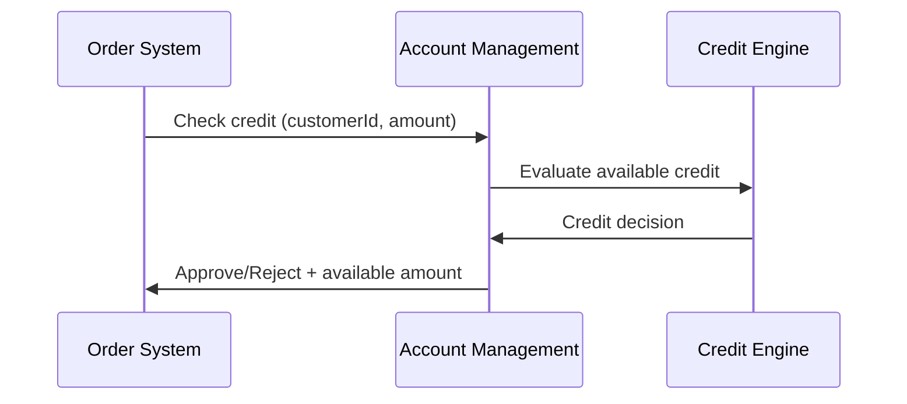
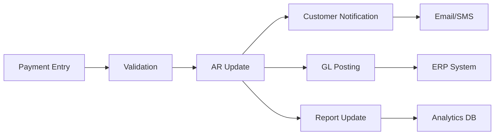

# Account Management Integration Points - Lucky Gas Legacy System

## 🔗 Integration Overview

The Account Management module serves as the financial backbone of the Lucky Gas system, integrating with multiple internal modules and external systems to ensure accurate financial tracking, credit control, and cash management. This document details all integration touchpoints, data flows, and synchronization requirements.

## 🏢 Internal System Integration

### 1. Customer Management Integration

**Integration Type**: Real-time bidirectional sync

**Data Exchange**:
```yaml
From Customer Management:
  - Customer master data
  - Contact information updates
  - Business registration changes
  - Authorized signatory list
  - Customer category changes

To Customer Management:
  - Credit limit status
  - Account balance
  - Payment history
  - Collection status
  - Service hold flags
```

**Integration Points**:
| Operation | Direction | Frequency | Method |
|-----------|-----------|-----------|---------|
| Customer creation | Customer → Account | Real-time | Event trigger |
| Credit limit update | Account → Customer | Real-time | API call |
| Balance inquiry | Customer → Account | On-demand | API call |
| Status synchronization | Bidirectional | Every 15 min | Batch sync |

**Error Handling**:
- Retry mechanism: 3 attempts with exponential backoff
- Fallback: Queue for manual reconciliation
- Monitoring: Alert if sync fails > 1 hour

### 2. Order & Sales Integration

**Integration Type**: Event-driven with queue

**Data Exchange**:
```yaml
From Order Management:
  - Delivery confirmations
  - Order cancellations
  - Pricing updates
  - Discount approvals
  - Return authorizations

To Order Management:
  - Credit availability
  - Hold/release status
  - Payment terms
  - Special pricing approvals
```

**Key Workflows**:

**Credit Check on Order**:


**Invoice Generation**:
```yaml
Trigger: Delivery completion
Process:
  1. Receive delivery details
  2. Fetch pricing and terms
  3. Calculate taxes
  4. Generate invoice
  5. Update AR balance
  6. Notify customer
```

### 3. Inventory Management Integration

**Integration Type**: Batch processing

**Data Exchange**:
```yaml
From Inventory:
  - Product master updates
  - Pricing changes
  - Cylinder deposits
  - Stock adjustments

To Inventory:
  - Sales analytics
  - Product-wise AR aging
  - Deposit reconciliation
```

**Synchronization Schedule**:
- Product master: Daily at 02:00
- Pricing updates: Real-time
- Deposit tracking: Hourly
- Analytics: Daily at 06:00

### 4. Dispatch Operations Integration

**Integration Type**: Real-time event streaming

**Data Exchange**:
```yaml
From Dispatch:
  - Delivery confirmations
  - POD (Proof of Delivery)
  - Driver collections
  - Failed delivery attempts

To Dispatch:
  - Customer hold status
  - COD requirements
  - Special instructions
  - Collection targets
```

**Driver Collection Workflow**:
```yaml
Process:
  1. Driver receives payment
  2. Records in mobile app
  3. Syncs to dispatch system
  4. Dispatch notifies accounts
  5. Temporary receipt issued
  6. Final receipt on reconciliation
  
Reconciliation:
  - Daily driver settlement
  - Cash/check verification
  - Variance investigation
  - System update
```

### 5. Reports Module Integration

**Integration Type**: Data warehouse feed

**Data Provided**:
```yaml
Transactional Data:
  - Daily payment details
  - Invoice registry
  - Credit note log
  - Collection activities
  - Write-off records

Master Data:
  - Customer account status
  - Credit limits
  - Aging buckets
  - Payment terms

Metrics:
  - DSO calculations
  - Collection efficiency
  - Bad debt ratios
  - Cash flow projections
```

**Report Dependencies**:
| Report | Data Required | Update Frequency |
|--------|---------------|------------------|
| Daily Cash Position | Payments, balances | Real-time |
| Aging Analysis | Invoice details, payments | Hourly |
| Credit Utilization | Limits, balances | Real-time |
| Collection Performance | Activities, outcomes | Daily |

## 🌐 External System Integration

### 1. Banking System Integration

**Integration Methods**:
- SFTP for bank statements
- API for real-time verification
- SWIFT for international transfers

**Bank Statement Processing**:
```yaml
File Format: MT940/BAI2
Schedule: 
  - Morning: 07:00
  - Afternoon: 14:00
  - Evening: 19:00

Processing Steps:
  1. Secure file download
  2. Format validation
  3. Transaction parsing
  4. Customer matching
  5. Automatic allocation
  6. Exception handling
```

**Payment Verification**:
```yaml
Real-time Verification:
  - Check clearance status
  - Account validation
  - Fraud prevention
  - Amount confirmation

Supported Banks:
  - 台灣銀行 (004)
  - 第一銀行 (007)
  - 華南銀行 (008)
  - 彰化銀行 (009)
  - 國泰世華 (013)
```

### 2. Credit Bureau Integration (聯徵中心)

**Integration Type**: Web service API

**Services Used**:
```yaml
Credit Inquiry:
  - Business credit report
  - Payment history
  - Current exposures
  - Legal records

Update Reporting:
  - Monthly AR positions
  - Default reporting
  - Settlement updates
```

**API Specifications**:
```yaml
Endpoint: https://api.jcic.org.tw/v2/
Authentication: Certificate-based
Frequency Limits:
  - Inquiry: 100/day
  - Batch update: 1/month
  
Data Format:
  Request: XML with digital signature
  Response: Encrypted XML
  Timeout: 30 seconds
```

### 3. Government Tax System

**Integration Type**: File-based submission

**VAT Reporting (營業稅)**:
```yaml
Format: 
  - Media File Format (媒體申報)
  - CSV backup option

Schedule:
  - Bi-monthly: By 15th
  - Monthly: For large taxpayers

Content:
  - Sales invoices (銷項)
  - Purchase records (進項)
  - Zero-rated exports
  - Tax calculations
```

**Electronic Invoice Platform**:
```yaml
Integration:
  - B2B e-invoice issuance
  - B2C carrier storage
  - Void/allowance handling
  - QR code generation

Compliance:
  - Real-time upload required
  - 48-hour correction window
  - Audit trail maintenance
```

### 4. Collection Agency Integration

**Integration Type**: Secure API + File transfer

**Account Transfer Process**:
```yaml
Criteria:
  - Age > 90 days
  - Amount > NT$50,000
  - Internal efforts exhausted

Transfer Package:
  - Account details
  - Transaction history
  - Contact records
  - Legal documents
  - Collection notes
```

**Status Updates**:
```yaml
Update Frequency: Daily
Information Exchanged:
  - Collection activities
  - Payment arrangements
  - Legal proceedings
  - Recovery amounts
  - Case closure
```

### 5. ERP/GL System Integration

**Integration Type**: Real-time journal posting

**Journal Entry Mapping**:
```yaml
Payment Receipt:
  Dr: Cash/Bank (1101/1103)
  Cr: Accounts Receivable (1140)

Invoice Creation:
  Dr: Accounts Receivable (1140)
  Cr: Sales Revenue (4110)
  Cr: VAT Payable (2141)

Bad Debt Provision:
  Dr: Bad Debt Expense (6155)
  Cr: Allowance for Bad Debt (1149)
```

**Reconciliation Process**:
```yaml
Daily Reconciliation:
  - AR sub-ledger total
  - GL control account
  - Variance investigation
  - Adjustment entries

Month-end Process:
  - Full reconciliation
  - Aging verification
  - Provision calculation
  - Journal posting
```

## 📱 Mobile Application Integration

### Driver Mobile App

**Integration Features**:
```yaml
Payment Collection:
  - Customer search
  - Payment recording
  - Receipt printing
  - Signature capture
  - Photo upload

Synchronization:
  - Online: Real-time
  - Offline: Queue and sync
  - Conflict resolution
  - Data validation
```

### Customer Portal Integration

**Self-Service Features**:
```yaml
Account Access:
  - Balance inquiry
  - Statement download
  - Payment history
  - Dispute submission

Payment Options:
  - Credit card gateway
  - Bank transfer initiation
  - Payment plan request
  - Receipt download
```

## 🔄 Data Synchronization

### Master Data Sync

**Customer Data Sync Matrix**:
| Data Element | Source System | Target Systems | Sync Method | Frequency |
|--------------|---------------|----------------|-------------|-----------|
| Credit Limit | Account Mgmt | Order, Customer | Push | Real-time |
| Balance | Account Mgmt | Customer, Portal | Push | Real-time |
| Status | Account Mgmt | All systems | Broadcast | Change event |
| Terms | Account Mgmt | Order, Invoice | Pull | On-demand |

### Transaction Sync

**Payment Sync Flow**:


### Batch Processing Schedule

**Daily Batches**:
| Time | Process | Duration | Dependencies |
|------|---------|----------|--------------|
| 01:00 | Bank file import | 30 min | Bank systems |
| 02:00 | Customer sync | 45 min | Customer DB |
| 03:00 | Aging calculation | 60 min | AR data |
| 04:00 | Report generation | 90 min | All data |
| 06:00 | Email statements | 120 min | Report completion |

## 🔐 Security & Compliance

### Data Security

**Encryption Requirements**:
```yaml
In Transit:
  - TLS 1.2 minimum
  - Certificate pinning
  - API key rotation

At Rest:
  - AES-256 encryption
  - Key management service
  - Encrypted backups
```

### Audit Trail

**Integration Logging**:
```yaml
Required Fields:
  - Timestamp (UTC+8)
  - Source system
  - Target system
  - Operation type
  - User/System ID
  - Success/Failure
  - Error details
  - Data before/after

Retention: 7 years
Format: JSON structured logs
Storage: Append-only audit DB
```

## ⚡ Performance Requirements

### Response Time SLAs

| Integration | Operation | Target SLA | Max Timeout |
|-------------|-----------|------------|-------------|
| Credit Check | Validation | <500ms | 2 seconds |
| Payment Post | Recording | <1 second | 5 seconds |
| Bank Sync | File process | <5 minutes | 30 minutes |
| Report Gen | Daily reports | <30 minutes | 2 hours |

### Throughput Capacity

**Peak Load Handling**:
```yaml
Payment Processing:
  - 1000 transactions/minute
  - 50,000 daily payments
  - Queuing for overflow

Credit Checks:
  - 500 requests/minute
  - Circuit breaker at 80%
  - Cache for 5 minutes

Batch Processing:
  - 100,000 records/hour
  - Parallel processing
  - Checkpoint recovery
```

## 🚨 Error Handling

### Integration Failure Matrix

| System | Failure Type | Retry Strategy | Fallback Method |
|--------|--------------|----------------|-----------------|
| Banking | Connection | 3x exponential | Manual file upload |
| Credit Bureau | Timeout | 2x immediate | Cache last known |
| ERP/GL | Post failure | Queue for retry | Manual journal |
| Customer | Sync error | Hourly retry | Reconciliation report |

### Monitoring & Alerts

**Health Checks**:
```yaml
Endpoints Monitored:
  - /health/account-mgmt
  - /health/integrations
  - /health/batch-status

Alert Thresholds:
  - Response time > 2s
  - Error rate > 1%
  - Queue depth > 1000
  - Sync delay > 1 hour
```

## 📊 Integration Metrics

### KPI Monitoring

**Real-time Metrics**:
- Integration success rate: Target >99.5%
- Average response time: Target <1s
- Queue processing time: Target <5 min
- Data sync accuracy: Target 100%

**Daily Metrics**:
- Batch completion rate: Target 100%
- Error resolution time: Target <4 hours
- System availability: Target >99.9%
- Transaction volume: Trend analysis

## 🔧 Maintenance Windows

**Scheduled Maintenance**:
```yaml
Regular Window:
  - Day: Sunday
  - Time: 02:00-04:00 TST
  - Frequency: Monthly
  - Notification: 7 days prior

Emergency Maintenance:
  - Notification: 2 hours minimum
  - Rollback plan required
  - Business approval needed
  - Customer communication
```