# Collection Management Workflow - Lucky Gas Legacy System

## 🎯 Workflow Purpose

The Collection Management workflow systematically pursues overdue accounts through escalating collection activities while maintaining customer relationships. This process balances firm collection practices with cultural sensitivity, ensuring maximum recovery while preserving future business opportunities.

## 📊 Workflow Overview

```mermaid
graph TB
    Start([Collection Process Start]) --> DailyAging[Daily Aging Run]
    
    DailyAging --> IdentifyOverdue[Identify Overdue Accounts]
    IdentifyOverdue --> OverdueFilter{Filter Criteria}
    
    OverdueFilter --> CheckMinAmount[Check Minimum Amount]
    CheckMinAmount --> MinThreshold{> NT$1,000?}
    MinThreshold -->|No| SkipSmallAmount[Skip Small Amounts]
    MinThreshold -->|Yes| CheckDispute[Check Dispute Flag]
    
    CheckDispute --> HasDispute{Disputed?}
    HasDispute -->|Yes| ExcludeDisputed[Exclude from Collection]
    HasDispute -->|No| CheckPaymentPlan[Check Payment Plan]
    
    CheckPaymentPlan --> HasPlan{Active Plan?}
    HasPlan -->|Yes| MonitorPlan[Monitor Plan Compliance]
    HasPlan -->|No| CategorizeOverdue[Categorize by Age]
    
    %% Monitor Payment Plan
    MonitorPlan --> PlanStatus{Plan Current?}
    PlanStatus -->|Yes| ContinueMonitoring[Continue Monitoring]
    PlanStatus -->|No| PlanDefault[Plan Default]
    PlanDefault --> CategorizeOverdue
    
    %% Categorize Overdue
    CategorizeOverdue --> AgeBucket{Days Overdue}
    
    AgeBucket -->|1-7 days| SoftReminder[Soft Reminder]
    AgeBucket -->|8-15 days| FirstNotice[First Notice]
    AgeBucket -->|16-30 days| SecondNotice[Second Notice]
    AgeBucket -->|31-45 days| FinalNotice[Final Notice]
    AgeBucket -->|46-60 days| PreLegal[Pre-Legal Action]
    AgeBucket -->|>60 days| LegalAction[Legal Action]
    
    %% Soft Reminder Path (1-7 days)
    SoftReminder --> CheckContactPref[Check Contact Preference]
    CheckContactPref --> ContactMethod{Preferred Method?}
    
    ContactMethod -->|SMS| SendSMS[Send SMS Reminder]
    ContactMethod -->|Email| SendEmail[Send Email Reminder]
    ContactMethod -->|Phone| ScheduleCall[Schedule Courtesy Call]
    ContactMethod -->|Mail| SkipSoft[Skip - Too Early for Mail]
    
    SendSMS --> LogActivity
    SendEmail --> LogActivity
    ScheduleCall --> MakeCall[Make Courtesy Call]
    SkipSoft --> WaitNextDay[Wait Next Day]
    
    MakeCall --> CallOutcome{Call Result?}
    CallOutcome -->|Answered| RecordConversation[Record Conversation]
    CallOutcome -->|No Answer| LeaveVoicemail[Leave Voicemail]
    CallOutcome -->|Wrong Number| UpdateContact[Update Contact Info]
    
    RecordConversation --> CustomerResponse{Response?}
    CustomerResponse -->|Will Pay| RecordPromise[Record Promise to Pay]
    CustomerResponse -->|Dispute| LogDispute[Log Dispute]
    CustomerResponse -->|Hardship| AssessHardship[Assess Hardship]
    CustomerResponse -->|Refuse| EscalateEarly[Early Escalation]
    
    %% First Notice Path (8-15 days)
    FirstNotice --> GenerateNotice1[Generate First Notice Letter]
    GenerateNotice1 --> Notice1Content{Content}
    
    Notice1Content --> FriendlyTone[Friendly Reminder Tone]
    FriendlyTone --> IncludeStatement[Include Statement Copy]
    IncludeStatement --> PaymentOptions[List Payment Options]
    PaymentOptions --> ContactInfo[Provide Contact Info]
    
    ContactInfo --> SendNotice1[Send First Notice]
    SendNotice1 --> DeliveryMethod1{Delivery?}
    
    DeliveryMethod1 -->|Email| EmailNotice1[Email with Read Receipt]
    DeliveryMethod1 -->|Mail| MailNotice1[Registered Mail]
    DeliveryMethod1 -->|Both| BothChannels1[Email + Mail]
    
    EmailNotice1 --> FollowUpCall1[Follow-up Call in 3 Days]
    MailNotice1 --> FollowUpCall1
    BothChannels1 --> FollowUpCall1
    
    %% Second Notice Path (16-30 days)
    SecondNotice --> CheckPriorContact[Check Prior Contact]
    CheckPriorContact --> PriorResponse{Prior Response?}
    
    PriorResponse -->|No Response| GenerateNotice2[Generate Second Notice]
    PriorResponse -->|Promise Broken| StrongerNotice2[Stronger Second Notice]
    PriorResponse -->|Partial Payment| AdjustedNotice2[Adjusted Notice]
    
    GenerateNotice2 --> Notice2Content{Content}
    StrongerNotice2 --> Notice2Content
    AdjustedNotice2 --> Notice2Content
    
    Notice2Content --> FirmTone[Firm but Professional]
    FirmTone --> HighlightConsequences[Highlight Consequences]
    HighlightConsequences --> OfferPaymentPlan[Offer Payment Plan]
    OfferPaymentPlan --> SetDeadline[Set Clear Deadline]
    
    SetDeadline --> SendNotice2[Send Second Notice]
    SendNotice2 --> RequireResponse[Require Response]
    RequireResponse --> CallCampaign[Initiate Call Campaign]
    
    CallCampaign --> AssignCollector[Assign to Collector]
    AssignCollector --> DailyCallList[Add to Daily Call List]
    DailyCallList --> CollectorAction[Collector Action]
    
    %% Final Notice Path (31-45 days)
    FinalNotice --> ReviewAccount[Review Account History]
    ReviewAccount --> AccountValue{Account Value?}
    
    AccountValue -->|High Value| PersonalVisit[Schedule Personal Visit]
    AccountValue -->|Medium Value| FinalLetter[Final Demand Letter]
    AccountValue -->|Low Value| StandardFinal[Standard Final Notice]
    
    PersonalVisit --> VisitOutcome{Visit Result?}
    VisitOutcome -->|Success| PaymentReceived[Payment Received]
    VisitOutcome -->|Promise| DocumentPromise[Document Promise]
    VisitOutcome -->|Failed| ProceedLegal[Proceed to Legal]
    
    FinalLetter --> LegalLanguage[Include Legal Language]
    StandardFinal --> LegalLanguage
    
    LegalLanguage --> ClearDeadline[7-Day Deadline]
    ClearDeadline --> CreditBureauWarning[Credit Bureau Warning]
    CreditBureauWarning --> ServiceSuspension[Service Suspension Notice]
    
    ServiceSuspension --> SendFinalNotice[Send Final Notice]
    SendFinalNotice --> NotifyManagement[Notify Management]
    
    %% Pre-Legal Path (46-60 days)
    PreLegal --> LegalAssessment[Legal Assessment]
    LegalAssessment --> AssessmentCriteria{Criteria}
    
    AssessmentCriteria --> AmountCheck[Check Amount vs. Cost]
    AmountCheck --> AmountWorth{Worth Pursuing?}
    
    AmountWorth -->|No| WriteOffCandidate[Write-off Candidate]
    AmountWorth -->|Yes| CustomerCheck[Check Customer Status]
    
    CustomerCheck --> CustomerStatus{Status?}
    CustomerStatus -->|Active| LastAttempt[Last Settlement Attempt]
    CustomerStatus -->|Inactive| DirectLegal[Direct to Legal]
    CustomerStatus -->|Bankrupt| SpecialHandling[Special Handling]
    
    LastAttempt --> SettlementOffer[Offer Settlement]
    SettlementOffer --> OfferTerms{Terms}
    
    OfferTerms --> Discount20[20% Discount if Paid Now]
    Discount20 --> PaymentPlan3[3-Month Payment Plan]
    PaymentPlan3 --> FinalDeadline[Final 7-Day Deadline]
    
    FinalDeadline --> ResponseWait{Response?}
    ResponseWait -->|Accept| CreateAgreement[Create Agreement]
    ResponseWait -->|Reject| PrepareLegal[Prepare Legal File]
    ResponseWait -->|No Response| PrepareLegal
    
    %% Legal Action Path (>60 days)
    LegalAction --> LegalReview[Legal Department Review]
    DirectLegal --> LegalReview
    PrepareLegal --> LegalReview
    
    LegalReview --> LegalCriteria{Legal Criteria Met?}
    
    LegalCriteria -->|No| AlternativeAction[Alternative Action]
    LegalCriteria -->|Yes| InitiateLegal[Initiate Legal Process]
    
    AlternativeAction --> ActionType{Alternative?}
    ActionType -->|Collection Agency| AssignAgency[Assign to Agency]
    ActionType -->|Write Off| InitiateWriteOff[Initiate Write-off]
    ActionType -->|Continue Internal| BackToCollection[Back to Collection]
    
    InitiateLegal --> LegalSteps{Legal Steps}
    LegalSteps --> DemandLetter[Legal Demand Letter]
    DemandLetter --> FilingPrep[Prepare Court Filing]
    FilingPrep --> AssetSearch[Asset Search]
    AssetSearch --> LegalStrategy[Determine Strategy]
    
    %% Payment Plans and Promises
    RecordPromise --> PromiseDetails{Promise Details}
    PromiseDetails --> PromiseAmount[Promise Amount]
    PromiseAmount --> PromiseDate[Promise Date]
    PromiseDate --> FollowUpDate[Set Follow-up Date]
    
    FollowUpDate --> CreateReminder[Create System Reminder]
    CreateReminder --> MonitorPromise[Monitor Promise]
    
    MonitorPromise --> PromiseKept{Promise Kept?}
    PromiseKept -->|Yes| UpdateAccount[Update Account Status]
    PromiseKept -->|No| BrokenPromise[Handle Broken Promise]
    
    BrokenPromise --> EscalateLevel[Escalate Collection Level]
    EscalateLevel --> RepeatCycle[Return to Collection Cycle]
    
    %% Dispute Handling
    LogDispute --> DisputeType{Dispute Type?}
    
    DisputeType -->|Quality| QualityInvestigation[Quality Investigation]
    DisputeType -->|Billing| BillingReview[Billing Review]
    DisputeType -->|Delivery| DeliveryVerification[Delivery Verification]
    DisputeType -->|Other| GeneralInvestigation[General Investigation]
    
    QualityInvestigation --> InvestigationResult
    BillingReview --> InvestigationResult
    DeliveryVerification --> InvestigationResult
    GeneralInvestigation --> InvestigationResult{Result?}
    
    InvestigationResult -->|Valid| AdjustAccount[Adjust Account]
    InvestigationResult -->|Invalid| ResumeCollection[Resume Collection]
    InvestigationResult -->|Partial| PartialAdjustment[Partial Adjustment]
    
    %% Payment Plan Creation
    CreateAgreement --> PlanTerms{Plan Terms}
    AssessHardship --> PlanTerms
    
    PlanTerms --> DownPayment[Down Payment Amount]
    DownPayment --> Installments[Number of Installments]
    Installments --> InterestRate[Interest Rate if Any]
    InterestRate --> PaymentSchedule[Payment Schedule]
    
    PaymentSchedule --> GenerateAgreement[Generate Agreement]
    GenerateAgreement --> CustomerSignature[Get Customer Signature]
    CustomerSignature --> ActivatePlan[Activate Payment Plan]
    
    ActivatePlan --> SetupAutoDebit[Setup Auto-debit if Possible]
    SetupAutoDebit --> PlanMonitoring[Begin Plan Monitoring]
    
    %% Activity Logging
    LogActivity[Log Collection Activity] --> ActivityDetails{Details}
    
    ActivityDetails --> DateTime[Date/Time]
    DateTime --> ActionTaken[Action Taken]
    ActionTaken --> ContactPerson[Contact Person]
    ContactPerson --> Result[Result]
    Result --> NextAction[Next Action]
    NextAction --> Notes[Detailed Notes]
    
    Notes --> UpdateHistory[Update Collection History]
    UpdateHistory --> UpdateMetrics[Update Metrics]
    
    %% Write-off Process
    WriteOffCandidate --> WriteOffApproval[Write-off Approval]
    InitiateWriteOff --> WriteOffApproval
    
    WriteOffApproval --> ApprovalLevel{Approval Level}
    ApprovalLevel -->|< NT$10K| ManagerApproval[Manager Approval]
    ApprovalLevel -->|NT$10-50K| DirectorApproval[Director Approval]
    ApprovalLevel -->|> NT$50K| ExecutiveApproval[Executive Approval]
    
    ManagerApproval --> ProcessWriteOff
    DirectorApproval --> ProcessWriteOff
    ExecutiveApproval --> ProcessWriteOff[Process Write-off]
    
    ProcessWriteOff --> AccountingEntry[Create Accounting Entry]
    AccountingEntry --> UpdateStatus[Update Account Status]
    UpdateStatus --> NotifyTax[Notify Tax Department]
    
    %% Success Paths
    PaymentReceived --> AllocatePayment[Allocate Payment]
    UpdateAccount --> CheckBalance[Check Remaining Balance]
    
    CheckBalance --> BalanceStatus{Balance Status?}
    BalanceStatus -->|Paid in Full| CloseCollection[Close Collection Case]
    BalanceStatus -->|Partial| UpdateCollectionAmount[Update Collection Amount]
    BalanceStatus -->|Overpaid| ProcessRefund[Process Refund]
    
    %% Reporting and Monitoring
    UpdateMetrics --> DailyReports[Update Daily Reports]
    DailyReports --> ReportTypes{Report Types}
    
    ReportTypes --> AgingReport[Aging Report]
    ReportTypes --> CollectorReport[Collector Performance]
    ReportTypes --> RecoveryReport[Recovery Rate Report]
    ReportTypes --> ActivityReport[Activity Summary]
    
    %% End States
    CloseCollection --> Success[Collection Successful]
    ProcessRefund --> Success
    NotifyTax --> End([End])
    ContinueMonitoring --> End
    ExcludeDisputed --> End
    SkipSmallAmount --> End
    WaitNextDay --> End
    AssignAgency --> End
    BackToCollection --> RepeatCycle
    RepeatCycle --> CategorizeOverdue
    PlanMonitoring --> End
    Success --> End
    
    %% Styling
    classDef errorStyle fill:#ff6b6b,stroke:#c92a2a,stroke-width:2px,color:#fff
    classDef successStyle fill:#51cf66,stroke:#2f9e44,stroke-width:2px,color:#fff
    classDef processStyle fill:#4dabf7,stroke:#1864ab,stroke-width:2px,color:#fff
    classDef decisionStyle fill:#ffd43b,stroke:#fab005,stroke-width:2px
    classDef warningStyle fill:#ff922b,stroke:#e8590c,stroke-width:2px,color:#fff
    
    class WriteOffCandidate,InitiateWriteOff,LegalAction,PreLegal errorStyle
    class PaymentReceived,CloseCollection,Success,UpdateAccount successStyle
    class DailyAging,CategorizeOverdue,GenerateNotice1,LogActivity,CreateAgreement processStyle
    class AgeBucket,CallOutcome,CustomerResponse,LegalCriteria,BalanceStatus decisionStyle
    class FinalNotice,PrepareLegal,BrokenPromise,EscalateLevel warningStyle
```



## 🔄 Process Steps

### 1. Daily Aging Analysis

**Step 1.1: Aging Calculation**
```yaml
Daily Process:
  Run Time: 06:00 AM daily
  Data Source: Open AR invoices
  Calculation: Current date - Invoice date
  
Aging Buckets:
  Current: Not yet due
  1-7 days: Gentle reminder
  8-15 days: First notice
  16-30 days: Second notice
  31-45 days: Final notice
  46-60 days: Pre-legal
  >60 days: Legal action
  
Exclusions:
  - Disputed invoices
  - Active payment plans
  - Amounts < NT$1,000
  - VIP customers (special handling)
```

**Step 1.2: Collection List Generation**
```yaml
Prioritization:
  1. Amount (highest first)
  2. Days overdue
  3. Customer category
  4. Payment history
  5. Current month target
  
Assignment Rules:
  - Senior collectors: High value/difficult
  - Regular collectors: Standard accounts
  - New collectors: Low risk/training
  - Specialized: Legal/dispute cases
```

### 2. Contact Strategies

**Step 2.1: Communication Channels**
```yaml
SMS (1-7 days):
  Template: "您好，您的帳款NT${amount}已到期，請儘快付款。"
  Timing: 10:00 AM
  Frequency: Once only
  Cost: Low
  
Email (1-15 days):
  Subject: "付款提醒 - 幸福氣體"
  Attachment: Statement copy
  Read receipt: Required
  Follow-up: If not opened
  
Phone (8+ days):
  Call hours: 9:00 AM - 8:00 PM
  Max attempts: 3 per day
  Script: Provided
  Recording: Required
  
Mail (15+ days):
  Type: Registered mail
  Contents: Formal notice
  Proof: Delivery receipt
  Cost: Higher
```

**Step 2.2: Call Scripts**
```yaml
Courtesy Call (1-7 days):
  Opening: "您好，我是幸福氣體的[Name]"
  Purpose: "友善提醒您..."
  Tone: Friendly, helpful
  Goal: Payment commitment
  
First Call (8-15 days):
  Opening: Professional greeting
  Verify: Confirm speaking to right person
  State: Outstanding amount and age
  Listen: Customer explanation
  Resolve: Offer solutions
  
Final Call (30+ days):
  Opening: Formal identification
  Warning: Consequences of non-payment
  Options: Last chance offers
  Document: All responses
```

### 3. Escalation Process

**Step 3.1: Internal Escalation**
```yaml
Level 1 - Collector (1-30 days):
  - Standard collection activities
  - Payment plans up to 3 months
  - Discounts up to 5%
  
Level 2 - Supervisor (31-45 days):
  - Enhanced authority
  - Payment plans up to 6 months
  - Discounts up to 10%
  - Service suspension approval
  
Level 3 - Manager (46-60 days):
  - Legal action decision
  - Write-off recommendation
  - Settlement authority to 20%
  - Major customer negotiations
  
Level 4 - Director (60+ days):
  - Final disposition
  - Legal action approval
  - Write-off approval
  - Strategic decisions
```

**Step 3.2: External Escalation**
```yaml
Collection Agency:
  Criteria:
    - Amount > NT$50,000
    - Age > 90 days
    - Internal efforts exhausted
    - Cost-benefit positive
  
  Process:
    - Package account file
    - Sign assignment agreement
    - Transfer documentation
    - Monitor progress
  
Legal Action:
  Criteria:
    - Amount > NT$100,000
    - Assets verified
    - Legal merit exists
    - ROI justified
  
  Steps:
    - Legal review
    - Demand letter
    - Court filing
    - Judgment enforcement
```

### 4. Payment Arrangements

**Step 4.1: Payment Plan Creation**
```yaml
Eligibility:
  - Good payment history
  - Genuine hardship
  - Reasonable proposal
  - Down payment made
  
Terms:
  Standard: 3 months, no interest
  Extended: 6 months, 1% monthly
  Special: 12 months, requires approval
  
Documentation:
  - Written agreement
  - Payment schedule
  - Default clause
  - Signatures required
```

**Step 4.2: Plan Monitoring**
```yaml
Monitoring:
  - Automatic payment tracking
  - Due date reminders
  - Default alerts
  - Performance reporting
  
Default Handling:
  - Grace period: 5 days
  - One missed: Warning
  - Two missed: Plan cancelled
  - Full balance due immediately
```

### 5. Dispute Resolution

**Step 5.1: Dispute Types**
```yaml
Billing Disputes:
  - Wrong amount
  - Duplicate billing
  - Pricing errors
  - Missing credits
  
Quality Disputes:
  - Product issues
  - Service complaints
  - Delivery problems
  - Quantity variance
  
Investigation:
  - 48-hour response
  - Evidence gathering
  - Department coordination
  - Customer communication
```

**Step 5.2: Resolution Process**
```yaml
Valid Dispute:
  - Adjust invoice
  - Issue credit note
  - Remove from collection
  - Apologize to customer
  
Invalid Dispute:
  - Document findings
  - Explain to customer
  - Resume collection
  - Note in account
  
Partial Validity:
  - Adjust disputed portion
  - Collect remainder
  - Document agreement
  - Monitor compliance
```

### 6. Write-off Process

**Step 6.1: Write-off Criteria**
```yaml
Automatic Write-off:
  - Amount < NT$1,000
  - Age > 365 days
  - Cost exceeds amount
  - Customer deceased/bankrupt
  
Approval Required:
  - NT$1,000 - 10,000: Supervisor
  - NT$10,001 - 50,000: Manager
  - NT$50,001 - 100,000: Director
  - > NT$100,000: CFO
```

**Step 6.2: Write-off Procedures**
```yaml
Documentation:
  - Collection history
  - Justification memo
  - Approval chain
  - Accounting entry
  
Tax Compliance:
  - Bad debt evidence
  - Legal requirements
  - Tax deduction claim
  - Audit documentation
  
Post Write-off:
  - Monitor for recovery
  - Update credit file
  - Block new credit
  - Report to credit bureau
```

## 📋 Business Rules

### Collection Timing
1. **First Contact**: Within 7 days of due date
2. **Escalation**: Every 15 days thereafter
3. **Legal Action**: After 60 days
4. **Write-off**: After 365 days
5. **Statute Limit**: 15 years (Taiwan law)

### Contact Restrictions
1. **Call Hours**: 9 AM - 8 PM only
2. **Frequency**: Maximum 1 call per day
3. **Harassment**: Strictly prohibited
4. **Recording**: Required for all calls
5. **Language**: Mandarin or customer preference

### Settlement Authority
1. **Collector**: 5% discount maximum
2. **Supervisor**: 10% discount maximum
3. **Manager**: 20% discount maximum
4. **Director**: 30% discount maximum
5. **CFO**: Above 30% discount

### Documentation Requirements
1. **All Contacts**: Logged in system
2. **Promises**: Written confirmation
3. **Disputes**: Full documentation
4. **Settlements**: Signed agreement
5. **Write-offs**: Complete file

## 🔐 Security & Compliance

### Legal Compliance
- Fair Debt Collection Practices
- Personal Data Protection Act
- Consumer Protection Law
- Banking regulations
- Court procedures

### Data Security
- Call recording encryption
- Customer data protection
- Access control by role
- Audit trail maintenance
- Document retention policy

### Ethical Standards
- Professional conduct
- No harassment
- Respect privacy
- Honest communication
- Cultural sensitivity

## 🔄 Integration Points

### Internal Systems
1. **AR System**: Account balances and aging
2. **Customer System**: Contact information
3. **Order System**: Service suspension
4. **Phone System**: Call recording/dialing
5. **Document System**: Letter generation

### External Systems
1. **SMS Gateway**: Message delivery
2. **Email Server**: Notice delivery
3. **Collection Agency**: Account transfer
4. **Legal System**: Court filings
5. **Credit Bureau**: Reporting

## ⚡ Performance Optimization

### Automation Features
- Aging calculation
- List generation
- Letter printing
- SMS/Email sending
- Payment monitoring

### Efficiency Tools
- Auto-dialer integration
- Call scripting system
- Template library
- Workflow automation
- Performance dashboards

## 🚨 Error Handling

### Common Issues
1. **Wrong Contact**: Update information
2. **System Errors**: Manual override
3. **Payment Disputes**: Investigation queue
4. **Legal Issues**: Escalate immediately
5. **Customer Complaints**: Special handling

### Recovery Procedures
- Data backup systems
- Manual collection option
- Offline documentation
- Alternative contact methods
- Escalation protocols

## 📊 Success Metrics

### Collection Metrics
- Recovery rate: > 95%
- DSO reduction: Target 45 days
- Promise kept rate: > 80%
- Cost per dollar: < 5%

### Activity Metrics
- Calls per day: 50-80
- Contact rate: > 60%
- Resolution rate: > 30%
- Dispute rate: < 5%