# Credit Management Workflow - Lucky Gas Legacy System

## 🎯 Workflow Purpose

The Credit Management workflow controls customer credit exposure through systematic evaluation, approval, monitoring, and adjustment processes. This ensures business growth while minimizing bad debt risk through data-driven credit decisions and proactive limit management.

## 📊 Workflow Overview

```mermaid
graph TB
    Start([Credit Management Start]) --> TriggerType{Trigger Type?}
    
    TriggerType -->|New Customer| NewCustomerRequest[New Customer Application]
    TriggerType -->|Increase Request| IncreaseRequest[Limit Increase Request]
    TriggerType -->|Periodic Review| PeriodicReview[Scheduled Review]
    TriggerType -->|Alert Trigger| AlertTrigger[System Alert]
    TriggerType -->|Sales Request| SalesRequest[Sales Override Request]
    
    %% New Customer Path
    NewCustomerRequest --> GatherInfo[Gather Customer Information]
    GatherInfo --> CustomerType{Customer Type?}
    
    CustomerType -->|Corporate| CorporateInfo[Company Registration]
    CustomerType -->|Individual| IndividualInfo[Personal Details]
    
    CorporateInfo --> CheckRegistration[Verify Registration]
    CheckRegistration --> RegistrationValid{Valid?}
    RegistrationValid -->|No| RejectApplication[Reject Application]
    RegistrationValid -->|Yes| CheckFinancials[Request Financials]
    
    IndividualInfo --> CheckIdentity[Verify Identity]
    CheckIdentity --> IdentityValid{Valid?}
    IdentityValid -->|No| RejectIdentity[Reject - Invalid ID]
    IdentityValid -->|Yes| CheckEmployment[Verify Employment]
    
    CheckFinancials --> FinancialsReceived{Received?}
    FinancialsReceived -->|No| FollowUpRequest[Follow-up Request]
    FinancialsReceived -->|Yes| AnalyzeFinancials[Analyze Financials]
    
    CheckEmployment --> EmploymentVerified{Verified?}
    EmploymentVerified -->|No| LowCreditScore[Assign Low Score]
    EmploymentVerified -->|Yes| CheckIncome[Verify Income]
    
    %% Credit Evaluation
    AnalyzeFinancials --> CalculateRatios[Calculate Financial Ratios]
    CheckIncome --> CalculateCapacity[Calculate Payment Capacity]
    LowCreditScore --> InitialAssessment
    
    CalculateRatios --> FinancialScore{Financial Health}
    FinancialScore -->|Strong| HighFinancialScore[High Score: 80-100]
    FinancialScore -->|Average| MedFinancialScore[Medium Score: 50-79]
    FinancialScore -->|Weak| LowFinancialScore[Low Score: 0-49]
    
    CalculateCapacity --> CapacityScore{Payment Capacity}
    CapacityScore -->|High| HighCapacityScore[High Capacity]
    CapacityScore -->|Medium| MedCapacityScore[Medium Capacity]
    CapacityScore -->|Low| LowCapacityScore[Low Capacity]
    
    HighFinancialScore --> InitialAssessment
    MedFinancialScore --> InitialAssessment
    LowFinancialScore --> InitialAssessment
    HighCapacityScore --> InitialAssessment
    MedCapacityScore --> InitialAssessment
    LowCapacityScore --> InitialAssessment
    
    InitialAssessment[Initial Credit Assessment] --> CheckExternalCredit[Check External Credit]
    
    %% External Credit Check
    CheckExternalCredit --> CreditBureau{Credit Bureau}
    CreditBureau -->|JCIC| JCICCheck[聯徵中心 Check]
    CreditBureau -->|Internal| InternalHistory[Internal Database]
    CreditBureau -->|Trade| TradeReference[Trade References]
    
    JCICCheck --> CreditReport[Credit Report]
    InternalHistory --> PastPerformance[Past Performance]
    TradeReference --> ReferenceCheck[Reference Verification]
    
    CreditReport --> CreditScore{Credit Score}
    CreditScore -->|Good >650| GoodCredit[Good Credit History]
    CreditScore -->|Fair 550-650| FairCredit[Fair Credit History]
    CreditScore -->|Poor <550| PoorCredit[Poor Credit History]
    
    PastPerformance --> HistoryCheck{History Type}
    HistoryCheck -->|Positive| GoodHistory[Good Payment History]
    HistoryCheck -->|Mixed| MixedHistory[Mixed History]
    HistoryCheck -->|Negative| BadHistory[Bad Payment History]
    
    ReferenceCheck --> RefResult{References}
    RefResult -->|Positive| GoodReferences[Positive References]
    RefResult -->|Neutral| NeutralReferences[Neutral References]
    RefResult -->|Negative| BadReferences[Negative References]
    
    %% Risk Scoring
    GoodCredit --> RiskScoring
    FairCredit --> RiskScoring
    PoorCredit --> RiskScoring
    GoodHistory --> RiskScoring
    MixedHistory --> RiskScoring
    BadHistory --> RiskScoring
    GoodReferences --> RiskScoring
    NeutralReferences --> RiskScoring
    BadReferences --> RiskScoring
    
    RiskScoring[Comprehensive Risk Scoring] --> CalculateScore[Calculate Total Score]
    CalculateScore --> ScoreComponents{Score Components}
    
    ScoreComponents --> FinancialWeight[Financial: 30%]
    FinancialWeight --> CreditWeight[Credit History: 25%]
    CreditWeight --> PaymentWeight[Payment History: 20%]
    PaymentWeight --> BusinessWeight[Business Stability: 15%]
    BusinessWeight --> ReferenceWeight[References: 10%]
    
    ReferenceWeight --> TotalScore[Total Risk Score]
    TotalScore --> RiskCategory{Risk Category}
    
    RiskCategory -->|Low Risk >80| LowRisk[Category A: Low Risk]
    RiskCategory -->|Medium 60-80| MediumRisk[Category B: Medium Risk]
    RiskCategory -->|High 40-60| HighRisk[Category C: High Risk]
    RiskCategory -->|Very High <40| VeryHighRisk[Category D: Very High Risk]
    
    %% Credit Limit Calculation
    LowRisk --> CalculateLimit
    MediumRisk --> CalculateLimit
    HighRisk --> CalculateLimit
    VeryHighRisk --> RejectCredit[Reject Credit]
    
    CalculateLimit[Calculate Credit Limit] --> LimitFactors{Factors}
    LimitFactors --> MonthlyVolume[Estimated Monthly Volume]
    MonthlyVolume --> PaymentTerms[Payment Terms Days]
    PaymentTerms --> RiskAdjustment[Risk Adjustment Factor]
    RiskAdjustment --> IndustryBenchmark[Industry Benchmark]
    
    IndustryBenchmark --> ProposedLimit[Proposed Credit Limit]
    ProposedLimit --> LimitValidation{Validation}
    
    LimitValidation -->|Reasonable| ProceedApproval[Proceed to Approval]
    LimitValidation -->|Too High| AdjustDown[Adjust Downward]
    LimitValidation -->|Too Low| AdjustUp[Adjust Upward]
    
    AdjustDown --> ProceedApproval
    AdjustUp --> ProceedApproval
    
    %% Increase Request Path
    IncreaseRequest --> LoadCurrentLimit[Load Current Limit]
    LoadCurrentLimit --> CheckUtilization[Check Current Utilization]
    CheckUtilization --> UtilizationRate{Utilization %?}
    
    UtilizationRate -->|<50%| LowUtilization[Low Utilization]
    UtilizationRate -->|50-80%| NormalUtilization[Normal Utilization]
    UtilizationRate -->|>80%| HighUtilization[High Utilization]
    
    LowUtilization --> DenyIncrease[Deny - Low Usage]
    NormalUtilization --> CheckPaymentHistory[Check Payment History]
    HighUtilization --> CheckPaymentHistory
    
    CheckPaymentHistory --> PaymentPattern{Payment Pattern}
    PaymentPattern -->|Excellent| ExcellentPayer[Always On Time]
    PaymentPattern -->|Good| GoodPayer[Mostly On Time]
    PaymentPattern -->|Poor| PoorPayer[Often Late]
    
    ExcellentPayer --> CalculateIncrease[Calculate Increase Amount]
    GoodPayer --> ConditionalIncrease[Conditional Increase]
    PoorPayer --> DenyPoorPayment[Deny - Payment Issues]
    
    CalculateIncrease --> IncreaseAmount{Increase %}
    IncreaseAmount -->|10-25%| SmallIncrease[Small Increase]
    IncreaseAmount -->|25-50%| MediumIncrease[Medium Increase]
    IncreaseAmount -->|>50%| LargeIncrease[Large Increase]
    
    SmallIncrease --> ProceedApproval
    MediumIncrease --> ProceedApproval
    LargeIncrease --> RequireJustification[Require Justification]
    RequireJustification --> ProceedApproval
    
    ConditionalIncrease --> SetConditions[Set Improvement Conditions]
    SetConditions --> ProceedApproval
    
    %% Periodic Review Path
    PeriodicReview --> LoadReviewList[Load Review List]
    LoadReviewList --> ReviewCriteria{Review Due?}
    
    ReviewCriteria -->|Annual| AnnualReview[Annual Review]
    ReviewCriteria -->|Triggered| TriggeredReview[Event Triggered]
    ReviewCriteria -->|Risk Based| RiskBasedReview[Risk Based Review]
    
    AnnualReview --> GatherCurrentData[Gather Current Data]
    TriggeredReview --> IdentifyTrigger[Identify Trigger Event]
    RiskBasedReview --> AssessRiskChange[Assess Risk Changes]
    
    GatherCurrentData --> AnalyzePerformance[Analyze Performance]
    IdentifyTrigger --> AnalyzePerformance
    AssessRiskChange --> AnalyzePerformance
    
    AnalyzePerformance --> PerformanceMetrics{Metrics}
    PerformanceMetrics --> PaymentBehavior[Payment Behavior]
    PaymentBehavior --> VolumeGrowth[Volume Growth]
    VolumeGrowth --> ProfitContribution[Profit Contribution]
    ProfitContribution --> RiskIndicators[Risk Indicators]
    
    RiskIndicators --> ReviewDecision{Decision}
    ReviewDecision -->|Increase| ProposeIncrease[Propose Increase]
    ReviewDecision -->|Maintain| MaintainLimit[Maintain Current]
    ReviewDecision -->|Decrease| ProposeDecrease[Propose Decrease]
    ReviewDecision -->|Suspend| SuspendCredit[Suspend Credit]
    
    ProposeIncrease --> ProceedApproval
    MaintainLimit --> UpdateReviewDate[Update Next Review]
    ProposeDecrease --> ProceedApproval
    SuspendCredit --> ImmediateAction[Immediate Action Required]
    
    %% Alert Trigger Path
    AlertTrigger --> AlertType{Alert Type?}
    
    AlertType -->|Overdue| OverdueAlert[Payment Overdue]
    AlertType -->|Overlimit| OverlimitAlert[Credit Exceeded]
    AlertType -->|External| ExternalAlert[External Event]
    AlertType -->|Pattern| PatternAlert[Unusual Pattern]
    
    OverdueAlert --> CheckSeverity[Check Overdue Severity]
    CheckSeverity --> OverdueDays{Days Overdue}
    
    OverdueDays -->|1-30| MinorOverdue[Minor Concern]
    OverdueDays -->|31-60| MajorOverdue[Major Concern]
    OverdueDays -->|>60| CriticalOverdue[Critical Situation]
    
    MinorOverdue --> MonitorClosely[Monitor Closely]
    MajorOverdue --> ReduceLimit[Reduce Limit]
    CriticalOverdue --> SuspendCredit
    
    OverlimitAlert --> CheckOverlimit[Check Overlimit Amount]
    ExternalAlert --> VerifyEvent[Verify External Event]
    PatternAlert --> AnalyzePattern[Analyze Pattern]
    
    CheckOverlimit --> OverlimitAction{Action}
    OverlimitAction -->|Block Orders| BlockNewOrders[Block New Orders]
    OverlimitAction -->|Request Payment| RequestPayment[Request Payment]
    
    %% Approval Process
    ProceedApproval[Proceed to Approval] --> DetermineLevel[Determine Approval Level]
    DetermineLevel --> ApprovalMatrix{Approval Matrix}
    
    ApprovalMatrix -->|< NT$100K| Level1[Supervisor Approval]
    ApprovalMatrix -->|NT$100-500K| Level2[Manager Approval]
    ApprovalMatrix -->|NT$500K-1M| Level3[Director Approval]
    ApprovalMatrix -->|> NT$1M| Level4[Executive Approval]
    
    Level1 --> CreateApprovalRequest
    Level2 --> CreateApprovalRequest
    Level3 --> CreateApprovalRequest
    Level4 --> CreateApprovalRequest[Create Approval Request]
    
    CreateApprovalRequest --> ApprovalPackage{Package Contents}
    ApprovalPackage --> CreditReport2[Credit Report]
    CreditReport2 --> FinancialSummary[Financial Summary]
    FinancialSummary --> RiskAssessment[Risk Assessment]
    RiskAssessment --> Recommendation[Recommendation]
    
    Recommendation --> RouteApproval[Route for Approval]
    RouteApproval --> ApprovalStatus{Status}
    
    ApprovalStatus -->|Approved| ApprovedLimit[Limit Approved]
    ApprovalStatus -->|Conditional| ConditionalApproval[Conditional Approval]
    ApprovalStatus -->|Rejected| RejectedLimit[Limit Rejected]
    ApprovalStatus -->|Modify| ModifyRequest[Modify Request]
    
    ConditionalApproval --> SetupConditions[Setup Conditions]
    ModifyRequest --> DetermineLevel
    
    %% Implementation
    ApprovedLimit --> ImplementLimit[Implement Credit Limit]
    SetupConditions --> ImplementLimit
    
    ImplementLimit --> UpdateSystem[Update System]
    UpdateSystem --> SystemUpdates{Updates}
    
    SystemUpdates --> UpdateMaster[Update Customer Master]
    UpdateMaster --> UpdateCreditTable[Update Credit Table]
    UpdateCreditTable --> UpdateApprovals[Update Approval Log]
    UpdateApprovals --> SetReviewDate[Set Review Date]
    
    SetReviewDate --> NotifyStakeholders[Notify Stakeholders]
    NotifyStakeholders --> NotificationList{Notify}
    
    NotificationList -->|Customer| NotifyCustomer[Notify Customer]
    NotificationList -->|Sales| NotifySales[Notify Sales Team]
    NotificationList -->|Credit| NotifyCredit[Notify Credit Team]
    NotificationList -->|System| SystemNotification[System Notification]
    
    %% Monitoring Setup
    NotifyCustomer --> SetupMonitoring
    NotifySales --> SetupMonitoring
    NotifyCredit --> SetupMonitoring
    SystemNotification --> SetupMonitoring[Setup Monitoring]
    
    SetupMonitoring --> MonitoringRules{Rules}
    MonitoringRules --> UtilizationAlert[Utilization Alerts]
    UtilizationAlert --> PaymentAlert[Payment Alerts]
    PaymentAlert --> ReviewReminder[Review Reminders]
    ReviewReminder --> RiskTriggers[Risk Triggers]
    
    RiskTriggers --> ActivateMonitoring[Activate Monitoring]
    ActivateMonitoring --> Success[Credit Limit Active]
    
    %% Rejection Paths
    RejectApplication --> NotifyRejection[Notify Rejection]
    RejectIdentity --> NotifyRejection
    RejectCredit --> NotifyRejection
    DenyIncrease --> NotifyRejection
    DenyPoorPayment --> NotifyRejection
    RejectedLimit --> NotifyRejection
    
    NotifyRejection --> End([End])
    
    %% Other Endpoints
    FollowUpRequest --> End
    UpdateReviewDate --> End
    MonitorClosely --> End
    ReduceLimit --> ImplementLimit
    BlockNewOrders --> End
    RequestPayment --> End
    ImmediateAction --> End
    Success --> End
    
    %% Styling
    classDef errorStyle fill:#ff6b6b,stroke:#c92a2a,stroke-width:2px,color:#fff
    classDef successStyle fill:#51cf66,stroke:#2f9e44,stroke-width:2px,color:#fff
    classDef processStyle fill:#4dabf7,stroke:#1864ab,stroke-width:2px,color:#fff
    classDef decisionStyle fill:#ffd43b,stroke:#fab005,stroke-width:2px
    classDef warningStyle fill:#ff922b,stroke:#e8590c,stroke-width:2px,color:#fff
    
    class RejectApplication,RejectIdentity,RejectCredit,DenyIncrease,RejectedLimit errorStyle
    class ApprovedLimit,Success,ImplementLimit successStyle
    class InitialAssessment,RiskScoring,CalculateLimit,CreateApprovalRequest processStyle
    class TriggerType,CustomerType,CreditScore,RiskCategory,ApprovalStatus decisionStyle
    class SuspendCredit,CriticalOverdue,ImmediateAction warningStyle
```



## 🔄 Process Steps

### 1. Credit Application

**Step 1.1: Information Requirements**
```yaml
Corporate Customers:
  - Company registration (統一編號)
  - Financial statements (3 years)
  - Bank references
  - Trade references
  - Ownership structure
  
Individual Customers:
  - National ID
  - Income proof
  - Employment verification
  - Bank statements
  - Property ownership
```

**Step 1.2: Verification Process**
```yaml
Document Verification:
  - Government database check
  - Financial statement audit
  - Reference verification calls
  - Site visit (if needed)
  - Legal status confirmation
  
Timeline:
  - Initial review: 2 days
  - Full evaluation: 5-7 days
  - Approval process: 2-3 days
  - Total: 10 business days
```

### 2. Risk Assessment

**Step 2.1: Scoring Model**
```yaml
Financial Health (30%):
  - Debt ratio < 60%: 25 points
  - Current ratio > 1.5: 25 points
  - Profit margin > 5%: 25 points
  - Revenue growth: 25 points
  
Credit History (25%):
  - JCIC score > 650: 50 points
  - No defaults: 30 points
  - Credit length: 20 points
  
Payment History (20%):
  - Always on time: 100 points
  - < 30 days late: 70 points
  - 30-60 days late: 40 points
  - > 60 days late: 0 points
  
Business Stability (15%):
  - Years in business: 40 points
  - Industry risk: 30 points
  - Management quality: 30 points
  
Trade References (10%):
  - Positive references: 100 points
  - Neutral references: 50 points
  - Negative references: 0 points
```

**Step 2.2: Risk Categories**
```yaml
Category A (Low Risk):
  - Score: 80-100
  - Credit terms: Net 60
  - Review: Annual
  - Monitoring: Light
  
Category B (Medium Risk):
  - Score: 60-79
  - Credit terms: Net 30
  - Review: Semi-annual
  - Monitoring: Regular
  
Category C (High Risk):
  - Score: 40-59
  - Credit terms: COD/Net 15
  - Review: Quarterly
  - Monitoring: Intensive
  
Category D (Very High Risk):
  - Score: < 40
  - Credit terms: COD only
  - Review: Monthly
  - Monitoring: Daily
```

### 3. Limit Calculation

**Step 3.1: Formula**
```yaml
Base Calculation:
  Monthly Sales Volume × Payment Terms Days / 30
  
Adjustments:
  - Risk factor: 0.5 - 1.2
  - Industry factor: 0.8 - 1.1
  - Relationship factor: 0.9 - 1.3
  - Seasonal factor: 0.8 - 1.2
  
Example:
  Monthly volume: NT$300,000
  Payment terms: 30 days
  Risk factor: 0.8 (Category B)
  = 300,000 × 30 / 30 × 0.8
  = NT$240,000 credit limit
```

**Step 3.2: Limit Guidelines**
```yaml
New Customers:
  - Start conservative
  - Maximum 50% of calculated
  - Increase after 6 months
  - Based on performance
  
Existing Customers:
  - Annual increases possible
  - Based on payment history
  - Volume growth considered
  - Maximum 50% increase/year
```

### 4. Approval Process

**Step 4.1: Approval Matrix**
```yaml
Level 1 - Supervisor:
  - Up to NT$100,000
  - Category A & B only
  - Standard terms
  - Same day approval
  
Level 2 - Manager:
  - NT$100,001 - 500,000
  - All categories
  - Modified terms allowed
  - 2 day approval
  
Level 3 - Director:
  - NT$500,001 - 1,000,000
  - Requires justification
  - Special terms possible
  - 3 day approval
  
Level 4 - Executive:
  - Over NT$1,000,000
  - Board presentation
  - Strategic customers
  - 5 day approval
```

**Step 4.2: Documentation**
```yaml
Approval Package:
  - Credit application form
  - Risk assessment report
  - Financial analysis
  - Reference check results
  - Recommendation memo
  - Terms and conditions
  
Digital Workflow:
  - Online submission
  - Electronic signatures
  - Automated routing
  - Status tracking
  - Email notifications
```

### 5. Implementation

**Step 5.1: System Updates**
```yaml
Customer Master:
  - Credit limit amount
  - Effective date
  - Expiry date
  - Terms code
  - Risk category
  
Credit Management:
  - Approval details
  - Conditions set
  - Review schedule
  - Alert thresholds
  - Contact persons
```

**Step 5.2: Communication**
```yaml
Internal:
  - Sales team alert
  - Order entry update
  - Credit team briefing
  - System notifications
  
External:
  - Customer letter
  - Terms agreement
  - Welcome package
  - Contact details
```

### 6. Monitoring

**Step 6.1: Automated Alerts**
```yaml
Utilization Alerts:
  - 80% utilized: Warning
  - 90% utilized: Attention
  - 100% utilized: Block orders
  - Overlimit: Immediate action
  
Payment Alerts:
  - 5 days late: Reminder
  - 15 days late: Warning
  - 30 days late: Escalation
  - 60 days late: Suspend
  
Pattern Alerts:
  - Sudden volume spike
  - Payment pattern change
  - Multiple disputes
  - Returned checks
```

**Step 6.2: Review Triggers**
```yaml
Mandatory Reviews:
  - Annual anniversary
  - Credit increase request
  - Payment problems
  - Risk score change
  
Event Triggers:
  - Management change
  - Financial distress
  - Legal issues
  - Industry downturn
  - M&A activity
```

## 📋 Business Rules

### Credit Approval Rules
1. **New Customer Limit**: Maximum 30 days sales initially
2. **Increase Limit**: Maximum 50% increase per review
3. **High Risk**: Requires additional collateral/guarantee
4. **Group Exposure**: Consider total group limit
5. **Concentration**: No customer > 10% of total AR

### Terms and Conditions
1. **Standard Terms**: Based on risk category
2. **Special Terms**: Require higher approval
3. **Guarantees**: Personal/corporate when needed
4. **Insurance**: Credit insurance for large exposures
5. **Security**: Property liens for very large limits

### Review Requirements
1. **Annual Review**: All active accounts
2. **Triggered Review**: Based on events
3. **Increase Review**: For any increase request
4. **Problem Review**: Payment issues
5. **Market Review**: Industry changes

## 🔐 Security & Compliance

### Data Security
- Encrypted credit reports
- Restricted access levels
- Audit trail complete
- Document retention 7 years
- Privacy law compliance

### Regulatory Compliance
- JCIC reporting requirements
- Banking law compliance
- Fair credit practices
- Anti-discrimination rules
- Data protection laws

### Internal Controls
- Segregation of duties
- Independent verification
- Regular audits
- Exception reporting
- Management oversight

## 🔄 Integration Points

### Internal Systems
1. **Customer Master**: Update credit data
2. **Order Entry**: Credit checking
3. **AR System**: Monitor exposure
4. **Collection System**: Problem accounts
5. **Reporting**: Credit analytics

### External Systems
1. **Credit Bureau**: JCIC interface
2. **Bank Systems**: Reference checks
3. **Government**: Company verification
4. **Insurance**: Credit insurance
5. **Legal**: Lien searches

## ⚡ Performance Optimization

### Process Efficiency
- Automated scoring models
- Digital document management
- Workflow automation
- Parallel processing
- Real-time decisions

### Decision Speed
- Auto-approval for low risk
- Pre-approved increases
- Fast-track process
- Mobile approvals
- API integration

## 🚨 Error Handling

### Common Issues
1. **Missing Documents**: Follow-up workflow
2. **System Errors**: Manual override
3. **Calculation Errors**: Validation rules
4. **Approval Delays**: Escalation process
5. **Communication Failures**: Retry mechanism

### Recovery Procedures
- Manual credit check
- Override procedures
- Emergency approvals
- Offline processing
- Backup workflows

## 📊 Success Metrics

### Operational Metrics
- Application processing: < 5 days
- Auto-approval rate: > 60%
- Review completion: 100%
- System uptime: 99.9%

### Business Metrics
- Bad debt ratio: < 0.5%
- Credit utilization: 70-80%
- Customer satisfaction: > 90%
- Revenue enabled: Track impact