# Financial Period Closing Workflow - Lucky Gas Legacy System

## 🎯 Workflow Purpose

The Financial Period Closing workflow ensures accurate and timely month-end closing of accounts receivable, maintaining financial integrity through systematic validation, reconciliation, and reporting. This critical process supports management decision-making and regulatory compliance while preventing unauthorized changes to closed periods.

## 📊 Workflow Overview

```mermaid
graph TB
    Start([Period Closing Start]) --> CheckDate[Check Calendar Date]
    
    CheckDate --> IsMonthEnd{Month End Date?}
    IsMonthEnd -->|No| TooEarly[Too Early to Close]
    IsMonthEnd -->|Yes| InitiateClosing[Initiate Closing Process]
    
    InitiateClosing --> CreateChecklist[Create Closing Checklist]
    CreateChecklist --> ChecklistItems{Checklist Items}
    
    ChecklistItems --> VerifyTransactions[Verify All Transactions]
    ChecklistItems --> CheckPayments[Check Pending Payments]
    ChecklistItems --> CheckInvoices[Check Pending Invoices]
    ChecklistItems --> CheckCredits[Check Pending Credits]
    ChecklistItems --> CheckBankRec[Check Bank Reconciliation]
    
    %% Transaction Verification
    VerifyTransactions --> TransactionTypes{Transaction Types}
    
    TransactionTypes -->|Invoices| VerifyInvoices[Verify All Invoices Posted]
    TransactionTypes -->|Payments| VerifyPayments[Verify All Payments Applied]
    TransactionTypes -->|Credits| VerifyCredits[Verify All Credits Processed]
    TransactionTypes -->|Adjustments| VerifyAdjustments[Verify All Adjustments]
    
    VerifyInvoices --> InvoiceCheck{All Posted?}
    InvoiceCheck -->|No| PendingInvoices[List Pending Invoices]
    InvoiceCheck -->|Yes| InvoicesComplete[✓ Invoices Complete]
    
    PendingInvoices --> ProcessPending{Process Now?}
    ProcessPending -->|Yes| ProcessInvoices[Process Invoices]
    ProcessPending -->|No| DocumentException[Document Exception]
    
    ProcessInvoices --> InvoicesComplete
    DocumentException --> InvoicesComplete
    
    %% Payment Verification
    VerifyPayments --> PaymentCheck{All Applied?}
    PaymentCheck -->|No| UnappliedPayments[List Unapplied Payments]
    PaymentCheck -->|Yes| PaymentsComplete[✓ Payments Complete]
    
    UnappliedPayments --> ApplyPayments{Apply Now?}
    ApplyPayments -->|Yes| ProcessApplication[Process Applications]
    ApplyPayments -->|No| HoldUnapplied[Hold as Unapplied]
    
    ProcessApplication --> PaymentsComplete
    HoldUnapplied --> PaymentsComplete
    
    %% Credit Note Verification
    VerifyCredits --> CreditCheck{All Processed?}
    CreditCheck -->|No| PendingCredits[List Pending Credits]
    CreditCheck -->|Yes| CreditsComplete[✓ Credits Complete]
    
    PendingCredits --> ProcessCredits{Process Now?}
    ProcessCredits -->|Yes| ApplyCredits[Apply Credit Notes]
    ProcessCredits -->|No| DeferCredits[Defer to Next Period]
    
    ApplyCredits --> CreditsComplete
    DeferCredits --> CreditsComplete
    
    %% Adjustment Verification
    VerifyAdjustments --> AdjustmentCheck{All Posted?}
    AdjustmentCheck -->|No| PendingAdjustments[List Pending Adjustments]
    AdjustmentCheck -->|Yes| AdjustmentsComplete[✓ Adjustments Complete]
    
    PendingAdjustments --> ReviewAdjustments[Review Each Adjustment]
    ReviewAdjustments --> ApprovalRequired{Approval Required?}
    ApprovalRequired -->|Yes| GetApproval[Get Approval]
    ApprovalRequired -->|No| PostAdjustment[Post Adjustment]
    
    GetApproval --> ApprovalStatus{Approved?}
    ApprovalStatus -->|Yes| PostAdjustment
    ApprovalStatus -->|No| RejectAdjustment[Reject Adjustment]
    
    PostAdjustment --> AdjustmentsComplete
    RejectAdjustment --> AdjustmentsComplete
    
    %% Consolidate Verification Results
    InvoicesComplete --> ChecklistValidation
    PaymentsComplete --> ChecklistValidation
    CreditsComplete --> ChecklistValidation
    AdjustmentsComplete --> ChecklistValidation[Validate Checklist]
    
    %% Bank Reconciliation
    CheckBankRec --> LoadBankStatement[Load Bank Statements]
    LoadBankStatement --> MatchTransactions[Match Transactions]
    
    MatchTransactions --> MatchingProcess{Matching Process}
    MatchingProcess -->|Auto Match| AutomaticMatching[Automatic Matching]
    MatchingProcess -->|Manual Match| ManualMatching[Manual Matching]
    
    AutomaticMatching --> MatchRate{Match Rate}
    MatchRate -->|>95%| GoodMatch[Good Match Rate]
    MatchRate -->|<95%| ReviewUnmatched[Review Unmatched]
    
    ManualMatching --> ReviewUnmatched
    ReviewUnmatched --> InvestigateItems[Investigate Items]
    InvestigateItems --> ResolveDiscrepancies[Resolve Discrepancies]
    ResolveDiscrepancies --> ReconciliationComplete[✓ Reconciliation Complete]
    GoodMatch --> ReconciliationComplete
    
    ReconciliationComplete --> ChecklistValidation
    
    %% Checklist Validation
    ChecklistValidation --> AllComplete{All Items Complete?}
    AllComplete -->|No| IncompleteItems[Show Incomplete Items]
    AllComplete -->|Yes| ProceedCutoff[Proceed to Cutoff]
    
    IncompleteItems --> ForceComplete{Force Complete?}
    ForceComplete -->|No| CannotClose[Cannot Close Period]
    ForceComplete -->|Yes| DocumentOverride[Document Override Reason]
    DocumentOverride --> ProceedCutoff
    
    %% Cutoff Procedures
    ProceedCutoff[Cutoff Procedures] --> SetCutoffTime[Set Cutoff Date/Time]
    SetCutoffTime --> PreventNewTrans[Prevent New Transactions]
    PreventNewTrans --> IdentifyLateTrans[Identify Late Transactions]
    
    IdentifyLateTrans --> LateTransFound{Late Transactions?}
    LateTransFound -->|Yes| HandleLate[Handle Late Transactions]
    LateTransFound -->|No| CutoffComplete[Cutoff Complete]
    
    HandleLate --> LateOptions{Options}
    LateOptions -->|Accrue| CreateAccrual[Create Accrual Entry]
    LateOptions -->|Next Period| DeferToNext[Defer to Next Period]
    LateOptions -->|Force Include| OverrideCutoff[Override Cutoff]
    
    CreateAccrual --> RecordAccrual[Record Accrual]
    RecordAccrual --> CutoffComplete
    DeferToNext --> CutoffComplete
    OverrideCutoff --> CutoffComplete
    
    %% Aging Analysis
    CutoffComplete --> RunAging[Run Aging Analysis]
    RunAging --> AgingCalculation[Calculate Aging Buckets]
    
    AgingCalculation --> BucketBreakdown{Aging Buckets}
    BucketBreakdown --> Current[Current]
    BucketBreakdown --> Days1_30[1-30 Days]
    BucketBreakdown --> Days31_60[31-60 Days]
    BucketBreakdown --> Days61_90[61-90 Days]
    BucketBreakdown --> Over90[Over 90 Days]
    
    Current --> SummarizeBuckets
    Days1_30 --> SummarizeBuckets
    Days31_60 --> SummarizeBuckets
    Days61_90 --> SummarizeBuckets
    Over90 --> SummarizeBuckets[Summarize Buckets]
    
    SummarizeBuckets --> CalculateProvision[Calculate Bad Debt Provision]
    
    %% Bad Debt Provision
    CalculateProvision --> ProvisionRules{Provision Rules}
    
    ProvisionRules --> CurrentRate[Current: 0%]
    ProvisionRules --> Rate1_30[1-30 Days: 1%]
    ProvisionRules --> Rate31_60[31-60 Days: 5%]
    ProvisionRules --> Rate61_90[61-90 Days: 10%]
    ProvisionRules --> RateOver90[Over 90 Days: 50%]
    
    CurrentRate --> ApplyRates
    Rate1_30 --> ApplyRates
    Rate31_60 --> ApplyRates
    Rate61_90 --> ApplyRates
    RateOver90 --> ApplyRates[Apply Provision Rates]
    
    ApplyRates --> CalculateTotal[Calculate Total Provision]
    CalculateTotal --> CompareLastMonth[Compare to Last Month]
    
    CompareLastMonth --> ProvisionChange{Change Amount}
    ProvisionChange -->|Increase| IncreaseProvision[Increase Provision]
    ProvisionChange -->|Decrease| DecreaseProvision[Decrease Provision]
    ProvisionChange -->|No Change| NoProvisionChange[No Change Needed]
    
    %% GL Interface
    IncreaseProvision --> CreateGLEntries
    DecreaseProvision --> CreateGLEntries
    NoProvisionChange --> CreateGLEntries[Create GL Entries]
    
    CreateGLEntries --> EntryTypes{GL Entry Types}
    
    EntryTypes --> ARSummary[AR Summary Entry]
    EntryTypes --> BadDebtEntry[Bad Debt Provision]
    EntryTypes --> DiscountEntry[Payment Discounts]
    EntryTypes --> WriteOffEntry[Write-offs]
    EntryTypes --> AccrualEntry[Accrual Entries]
    
    ARSummary --> ValidateEntries
    BadDebtEntry --> ValidateEntries
    DiscountEntry --> ValidateEntries
    WriteOffEntry --> ValidateEntries
    AccrualEntry --> ValidateEntries[Validate GL Entries]
    
    ValidateEntries --> BalanceCheck{Entries Balance?}
    BalanceCheck -->|No| FixImbalance[Fix Imbalance]
    BalanceCheck -->|Yes| PostToGL[Post to General Ledger]
    
    FixImbalance --> IdentifyError[Identify Error]
    IdentifyError --> CorrectError[Correct Error]
    CorrectError --> ValidateEntries
    
    %% Reconciliation
    PostToGL --> GLReconciliation[GL Reconciliation]
    GLReconciliation --> CompareBalances[Compare AR to GL]
    
    CompareBalances --> BalanceMatch{Balances Match?}
    BalanceMatch -->|No| InvestigateVariance[Investigate Variance]
    BalanceMatch -->|Yes| ReconciliationOK[Reconciliation OK]
    
    InvestigateVariance --> FindDifference[Find Difference]
    FindDifference --> CorrectDifference[Correct Difference]
    CorrectDifference --> CompareBalances
    
    %% Generate Reports
    ReconciliationOK --> GenerateReports[Generate Reports]
    GenerateReports --> ReportList{Report List}
    
    ReportList --> AgingReport[Aging Analysis Report]
    ReportList --> ARBalance[AR Balance Report]
    ReportList --> CashFlow[Cash Flow Report]
    ReportList --> CustomerStatement[Customer Statements]
    ReportList --> ManagementDash[Management Dashboard]
    ReportList --> TaxReport[Tax Reports]
    
    AgingReport --> CompilePackage
    ARBalance --> CompilePackage
    CashFlow --> CompilePackage
    CustomerStatement --> CompilePackage
    ManagementDash --> CompilePackage
    TaxReport --> CompilePackage[Compile Report Package]
    
    %% Review and Approval
    CompilePackage --> SubmitReview[Submit for Review]
    SubmitReview --> ManagementReview[Management Review]
    
    ManagementReview --> ReviewStatus{Review Status}
    ReviewStatus -->|Issues Found| AddressIssues[Address Issues]
    ReviewStatus -->|Approved| ApproveClosing[Approve Closing]
    
    AddressIssues --> MakeCorrections[Make Corrections]
    MakeCorrections --> RegenerateReports[Regenerate Reports]
    RegenerateReports --> SubmitReview
    
    %% Period Lock
    ApproveClosing --> LockPeriod[Lock Period]
    LockPeriod --> SetLockDate[Set Lock Date/Time]
    SetLockDate --> UpdatePermissions[Update User Permissions]
    UpdatePermissions --> PreventChanges[Prevent Changes]
    
    PreventChanges --> LockValidation{Lock Effective?}
    LockValidation -->|No| LockError[Lock Error]
    LockValidation -->|Yes| PeriodLocked[Period Locked]
    
    LockError --> RetryLock[Retry Lock]
    RetryLock --> LockPeriod
    
    %% Open New Period
    PeriodLocked --> OpenNewPeriod[Open New Period]
    OpenNewPeriod --> SetNewDates[Set New Period Dates]
    SetNewDates --> InitializeBalances[Initialize Opening Balances]
    
    InitializeBalances --> BalanceTypes{Balance Types}
    BalanceTypes --> ARBalance2[AR Balances]
    BalanceTypes --> ProvisionBalance[Provision Balance]
    BalanceTypes --> CustomerBalances[Customer Balances]
    
    ARBalance2 --> ValidateOpening
    ProvisionBalance --> ValidateOpening
    CustomerBalances --> ValidateOpening[Validate Opening Balances]
    
    ValidateOpening --> OpeningOK{Opening Balances OK?}
    OpeningOK -->|No| CorrectOpening[Correct Opening]
    OpeningOK -->|Yes| NewPeriodReady[New Period Ready]
    
    CorrectOpening --> ValidateOpening
    
    %% Archive and Backup
    NewPeriodReady --> ArchiveData[Archive Period Data]
    ArchiveData --> CreateBackup[Create Backup]
    CreateBackup --> VerifyBackup[Verify Backup]
    
    VerifyBackup --> BackupOK{Backup Verified?}
    BackupOK -->|No| RetryBackup[Retry Backup]
    BackupOK -->|Yes| NotifyComplete[Notify Completion]
    
    RetryBackup --> CreateBackup
    
    %% Notifications
    NotifyComplete --> NotifyUsers{Notify Users}
    NotifyUsers -->|Email| SendEmails[Send Email Notifications]
    NotifyUsers -->|System| SystemAlerts[System Alerts]
    NotifyUsers -->|Dashboard| UpdateDashboard[Update Dashboard]
    
    SendEmails --> LogCompletion
    SystemAlerts --> LogCompletion
    UpdateDashboard --> LogCompletion[Log Completion]
    
    LogCompletion --> Success[Period Closing Complete]
    
    %% Error Paths
    TooEarly --> End([End])
    CannotClose --> End
    Success --> End
    
    %% Styling
    classDef errorStyle fill:#ff6b6b,stroke:#c92a2a,stroke-width:2px,color:#fff
    classDef successStyle fill:#51cf66,stroke:#2f9e44,stroke-width:2px,color:#fff
    classDef processStyle fill:#4dabf7,stroke:#1864ab,stroke-width:2px,color:#fff
    classDef decisionStyle fill:#ffd43b,stroke:#fab005,stroke-width:2px
    classDef warningStyle fill:#ff922b,stroke:#e8590c,stroke-width:2px,color:#fff
    
    class TooEarly,CannotClose,LockError,FixImbalance errorStyle
    class Success,PeriodLocked,NewPeriodReady,ReconciliationOK successStyle
    class InitiateClosing,RunAging,CreateGLEntries,GenerateReports,LockPeriod processStyle
    class IsMonthEnd,AllComplete,BalanceCheck,ReviewStatus,OpeningOK decisionStyle
    class DocumentOverride,HandleLate,InvestigateVariance,AddressIssues warningStyle
```



## 🔄 Process Steps

### 1. Pre-Closing Validation

**Step 1.1: Closing Schedule**
```yaml
Monthly Schedule:
  Day 1-3: Transaction processing
  Day 4: Pre-closing preparation
  Day 5: Closing execution
  Day 6: Report distribution
  
Timing Requirements:
  Start: After last business day
  Cutoff: 23:59:59 last day
  Complete by: 5th of next month
  Tax filing: By 15th
```

**Step 1.2: Closing Checklist**
```yaml
Transaction Verification:
  □ All deliveries invoiced
  □ All payments recorded
  □ All credits processed
  □ All adjustments approved
  □ All disputes resolved
  
System Verification:
  □ Bank reconciliation complete
  □ Customer reconciliation done
  □ Unapplied payments reviewed
  □ System balances verified
  □ No system errors
  
Documentation:
  □ Supporting documents filed
  □ Approvals obtained
  □ Exceptions documented
  □ Audit trail complete
```

### 2. Cutoff Procedures

**Step 2.1: Transaction Cutoff**
```yaml
Cutoff Rules:
  - No backdating allowed
  - Late invoices → Next period
  - Payments by value date
  - Credits by approval date
  
Accrual Entries:
  - Unbilled deliveries
  - Unrecorded receipts
  - Pending credits
  - Service accruals
  
Documentation:
  - Cutoff memo
  - Exception list
  - Accrual calculations
  - Management approval
```

**Step 2.2: System Lock**
```yaml
Lock Implementation:
  - Set cutoff timestamp
  - Update user permissions
  - Block new transactions
  - Allow read-only access
  
Override Process:
  - CFO approval required
  - Document reason
  - Audit trail maintained
  - Limited time window
```

### 3. Aging Analysis

**Step 3.1: Aging Calculation**
```yaml
Standard Buckets:
  Current: Not yet due
  1-30 days: Recently overdue
  31-60 days: Overdue
  61-90 days: Seriously overdue
  Over 90 days: Collection/Legal
  
Analysis by:
  - Customer
  - Invoice
  - Product type
  - Sales region
  - Payment terms
```

**Step 3.2: Bad Debt Provision**
```yaml
Provision Rates (Taiwan Standard):
  Current: 0%
  1-30 days: 1%
  31-60 days: 5%
  61-90 days: 10%
  91-180 days: 50%
  Over 180 days: 100%
  
Adjustments:
  - Secured debt: Lower rate
  - Government: No provision
  - Related parties: Case by case
  - Disputed: Separate treatment
```

### 4. GL Interface

**Step 4.1: Journal Entries**
```yaml
Standard Entries:
  AR Summary:
    Dr: AR Control Account
    Cr: Various GL Accounts
    
  Bad Debt Provision:
    Dr: Bad Debt Expense
    Cr: Allowance for Bad Debt
    
  Payment Discounts:
    Dr: Sales Discount
    Cr: AR Control
    
  Write-offs:
    Dr: Allowance for Bad Debt
    Cr: AR Control
```

**Step 4.2: GL Reconciliation**
```yaml
Reconciliation Points:
  - AR sub-ledger = GL control
  - Customer balances = AR total
  - Aging total = AR balance
  - Bank receipts = Cash account
  
Variance Investigation:
  - Timing differences
  - Posting errors
  - System issues
  - Manual adjustments
```

### 5. Report Generation

**Step 5.1: Management Reports**
```yaml
Aging Analysis:
  - Summary by bucket
  - Detail by customer
  - Trend analysis
  - Collection forecast
  
Cash Flow:
  - Collections forecast
  - DSO trending
  - Payment patterns
  - Risk assessment
  
Performance Metrics:
  - Collection efficiency
  - Credit utilization
  - Bad debt ratio
  - Customer metrics
```

**Step 5.2: Regulatory Reports**
```yaml
Tax Reports:
  - VAT summary
  - Bad debt deduction
  - Interest income
  - Export documentation
  
Audit Reports:
  - Trial balance
  - GL reconciliation
  - Provision calculation
  - Journal entries
  
Compliance:
  - Credit limit report
  - Overdue analysis
  - Collection status
  - Write-off summary
```

### 6. Review and Approval

**Step 6.1: Review Process**
```yaml
Level 1 - Accounting:
  - Technical accuracy
  - Reconciliation check
  - Journal validation
  - Report verification
  
Level 2 - Finance Manager:
  - Provision adequacy
  - Unusual items
  - Trend analysis
  - Risk assessment
  
Level 3 - CFO:
  - Final approval
  - Strategic issues
  - Board reporting
  - Sign-off
```

**Step 6.2: Issue Resolution**
```yaml
Common Issues:
  - Reconciliation differences
  - Provision adjustments
  - Late adjustments
  - System errors
  
Resolution Process:
  - Identify root cause
  - Document correction
  - Obtain approval
  - Reprocess if needed
```

### 7. Period Lock & New Period

**Step 7.1: Lock Procedures**
```yaml
Lock Implementation:
  - Set lock timestamp
  - Update permissions
  - Archive transaction
  - Backup database
  
Security:
  - Read-only access
  - No modifications
  - Audit override
  - Emergency procedures
```

**Step 7.2: New Period Setup**
```yaml
Opening Procedures:
  - Roll forward balances
  - Reset period dates
  - Clear temporary accounts
  - Initialize sequences
  
Validation:
  - Opening = Closing
  - All accounts included
  - System ready
  - Users notified
```

## 📋 Business Rules

### Closing Requirements
1. **Timing**: Must close by 5th of month
2. **Completeness**: All transactions included
3. **Accuracy**: Balances must reconcile
4. **Authorization**: Proper approvals required
5. **Documentation**: Full audit trail

### Provision Rules
1. **Consistency**: Same method each month
2. **Conservatism**: Adequate coverage
3. **Tax Compliance**: Follow tax regulations
4. **Review**: Quarterly detailed review
5. **Adjustment**: Based on actual loss

### Report Distribution
1. **Management**: By 6th of month
2. **Board Package**: By 10th of month
3. **Tax Filing**: By 15th of month
4. **Audit File**: Complete and accessible
5. **Archive**: 7-year retention

## 🔐 Security & Compliance

### Access Control
- Closing process: Finance team only
- Approval: Management hierarchy
- Override: CFO only
- Reports: Role-based access
- Archive: Restricted access

### Audit Trail
- All actions logged
- User identification
- Timestamp precision
- Before/after values
- Approval documentation

### Compliance Requirements
- Taiwan GAAP compliance
- Tax regulation adherence
- Internal control standards
- SOX requirements (if applicable)
- Data retention policy

## 🔄 Integration Points

### Internal Systems
1. **GL System**: Journal posting
2. **AR Sub-ledger**: Balance source
3. **Banking System**: Reconciliation
4. **Reporting Tool**: Report generation
5. **Archive System**: Data storage

### External Requirements
1. **Tax Authority**: Monthly filing
2. **Auditors**: Documentation
3. **Bank Covenants**: Ratio reporting
4. **Board Reporting**: KPIs
5. **Regulatory**: Compliance reports

## ⚡ Performance Optimization

### Automation Features
- Checklist generation
- Balance validation
- Report creation
- Email distribution
- Archive process

### Efficiency Tools
- Parallel processing
- Pre-built reports
- Validation rules
- Exception alerts
- Dashboard updates

## 🚨 Error Handling

### Common Errors
1. **Out of Balance**: Investigation routine
2. **Missing Transactions**: Search and include
3. **System Timeout**: Batch processing
4. **Report Errors**: Regeneration process
5. **Lock Failures**: Manual intervention

### Recovery Procedures
- Rollback capability
- Manual overrides
- Offline processing
- Emergency contacts
- Escalation process

## 📊 Success Metrics

### Process Metrics
- Closing time: < 1 day
- First-time accuracy: > 95%
- On-time completion: 100%
- Automation rate: > 80%

### Quality Metrics
- Reconciliation accuracy: 100%
- Report accuracy: > 99.9%
- Audit findings: Zero critical
- User satisfaction: > 90%