# Account Reconciliation Workflow - Lucky Gas Legacy System

## 🎯 Workflow Purpose

The Account Reconciliation workflow ensures accuracy between customer records and internal accounting by systematically identifying and resolving discrepancies. This process maintains trust, prevents revenue leakage, and provides accurate financial reporting through comprehensive matching and investigation procedures.

## 📊 Workflow Overview

```mermaid
graph TB
    Start([Reconciliation Start]) --> ReconciliationType{Reconciliation Type?}
    
    ReconciliationType -->|Customer| CustomerReconciliation[Customer Statement Reconciliation]
    ReconciliationType -->|Bank| BankReconciliation[Bank Reconciliation]
    ReconciliationType -->|Internal| InternalReconciliation[AR to GL Reconciliation]
    ReconciliationType -->|Periodic| PeriodicReconciliation[Monthly Full Reconciliation]
    
    %% Customer Statement Reconciliation Path
    CustomerReconciliation --> SelectCustomers[Select Customers for Reconciliation]
    SelectCustomers --> SelectionCriteria{Selection Criteria}
    
    SelectionCriteria -->|High Value| HighValueCustomers[Top 20% by Revenue]
    SelectionCriteria -->|Problem| ProblemAccounts[Dispute History]
    SelectionCriteria -->|Random| RandomSample[Random 10% Sample]
    SelectionCriteria -->|Request| CustomerRequest[Customer Requested]
    
    HighValueCustomers --> GenerateStatements
    ProblemAccounts --> GenerateStatements
    RandomSample --> GenerateStatements
    CustomerRequest --> GenerateStatements[Generate Statements]
    
    GenerateStatements --> StatementPeriod[Select Statement Period]
    StatementPeriod --> GatherTransactions[Gather All Transactions]
    
    GatherTransactions --> TransactionTypes{Transaction Types}
    TransactionTypes --> OpeningBalance[Opening Balance]
    TransactionTypes --> Invoices[Invoice Details]
    TransactionTypes --> Credits[Credit Notes]
    TransactionTypes --> Payments[Payment Records]
    TransactionTypes --> Adjustments[Adjustments]
    
    OpeningBalance --> CompileStatement
    Invoices --> CompileStatement
    Credits --> CompileStatement
    Payments --> CompileStatement
    Adjustments --> CompileStatement[Compile Statement]
    
    CompileStatement --> CalculateClosing[Calculate Closing Balance]
    CalculateClosing --> StatementFormat{Format Type}
    
    StatementFormat -->|Detailed| DetailedStatement[Transaction Detail Format]
    StatementFormat -->|Summary| SummaryStatement[Summary Format]
    StatementFormat -->|Aging| AgingStatement[Aging Format]
    
    DetailedStatement --> QualityCheck
    SummaryStatement --> QualityCheck
    AgingStatement --> QualityCheck[Quality Check]
    
    QualityCheck --> QCResult{QC Passed?}
    QCResult -->|No| CorrectErrors[Correct Errors]
    QCResult -->|Yes| ApproveStatement[Approve Statement]
    
    CorrectErrors --> CompileStatement
    
    ApproveStatement --> SendStatement[Send to Customer]
    SendStatement --> DeliveryMethod{Delivery Method}
    
    DeliveryMethod -->|Email| EmailStatement[Email with PDF]
    DeliveryMethod -->|Portal| UploadPortal[Upload to Portal]
    DeliveryMethod -->|Mail| PrintMail[Print and Mail]
    
    EmailStatement --> TrackDelivery
    UploadPortal --> TrackDelivery
    PrintMail --> TrackDelivery[Track Delivery]
    
    TrackDelivery --> SetResponseDeadline[Set Response Deadline]
    SetResponseDeadline --> WaitForResponse[Wait for Customer Response]
    
    WaitForResponse --> ResponseReceived{Response Received?}
    ResponseReceived -->|No| SendReminder[Send Reminder]
    ResponseReceived -->|Yes| ReviewResponse[Review Response]
    
    SendReminder --> ReminderCount{Reminder Count}
    ReminderCount -->|1st| FirstReminder[Friendly Reminder]
    ReminderCount -->|2nd| SecondReminder[Urgent Reminder]
    ReminderCount -->|3rd| FinalReminder[Final Notice]
    
    FirstReminder --> WaitForResponse
    SecondReminder --> WaitForResponse
    FinalReminder --> AssumeAgreed[Assume Agreement]
    
    ReviewResponse --> ResponseType{Response Type?}
    ResponseType -->|Agree| ConfirmationReceived[Confirmation Received]
    ResponseType -->|Dispute| DisputeRaised[Dispute Raised]
    ResponseType -->|Partial| PartialAgreement[Partial Agreement]
    
    %% Dispute Handling
    DisputeRaised --> LogDispute[Log Dispute Details]
    LogDispute --> DisputeCategories{Dispute Category}
    
    DisputeCategories -->|Missing Invoice| MissingInvoiceCheck[Check Invoice Records]
    DisputeCategories -->|Missing Payment| MissingPaymentCheck[Check Payment Records]
    DisputeCategories -->|Wrong Amount| AmountCheck[Verify Amounts]
    DisputeCategories -->|Unknown Trans| UnknownCheck[Research Transaction]
    
    MissingInvoiceCheck --> FindInvoice{Invoice Found?}
    FindInvoice -->|Yes| ProvideEvidence[Provide Evidence]
    FindInvoice -->|No| InvestigateInvoice[Investigate Missing]
    
    MissingPaymentCheck --> FindPayment{Payment Found?}
    FindPayment -->|Yes| ShowAllocation[Show Payment Allocation]
    FindPayment -->|No| InvestigatePayment[Investigate Payment]
    
    AmountCheck --> CalculationReview[Review Calculation]
    CalculationReview --> CalcCorrect{Calculation Correct?}
    CalcCorrect -->|Yes| ExplainCalculation[Explain to Customer]
    CalcCorrect -->|No| CorrectAmount[Correct Amount]
    
    UnknownCheck --> ResearchTransaction[Research in System]
    ResearchTransaction --> TransFound{Transaction Found?}
    TransFound -->|Yes| ProvideDetails[Provide Transaction Details]
    TransFound -->|No| PossibleError[Possible System Error]
    
    %% Investigation Results
    ProvideEvidence --> CustomerReview
    InvestigateInvoice --> CustomerReview
    ShowAllocation --> CustomerReview
    InvestigatePayment --> CustomerReview
    ExplainCalculation --> CustomerReview
    CorrectAmount --> CustomerReview
    ProvideDetails --> CustomerReview
    PossibleError --> CustomerReview[Customer Review]
    
    CustomerReview --> CustomerAccepts{Customer Accepts?}
    CustomerAccepts -->|Yes| ResolveDispute[Resolve Dispute]
    CustomerAccepts -->|No| EscalateDispute[Escalate Dispute]
    
    EscalateDispute --> ManagementReview[Management Review]
    ManagementReview --> ManagementDecision{Decision}
    
    ManagementDecision -->|Customer Right| AdjustRecords[Adjust Our Records]
    ManagementDecision -->|We Right| MaintainPosition[Maintain Position]
    ManagementDecision -->|Compromise| NegotiateSettlement[Negotiate Settlement]
    
    AdjustRecords --> CreateAdjustment[Create Adjustment Entry]
    MaintainPosition --> DocumentDecision[Document Decision]
    NegotiateSettlement --> ReachAgreement[Reach Agreement]
    
    CreateAdjustment --> UpdateRecords
    DocumentDecision --> UpdateRecords
    ReachAgreement --> UpdateRecords[Update Records]
    
    %% Partial Agreement
    PartialAgreement --> IdentifyAgreed[Identify Agreed Items]
    IdentifyAgreed --> IdentifyDisputed[Identify Disputed Items]
    IdentifyDisputed --> ProcessAgreed[Process Agreed Items]
    ProcessAgreed --> HandleDisputed[Handle Disputed Separately]
    HandleDisputed --> DisputeRaised
    
    %% Bank Reconciliation Path
    BankReconciliation --> LoadBankStatement[Load Bank Statement]
    LoadBankStatement --> LoadSystemRecords[Load System Payment Records]
    
    LoadSystemRecords --> MatchingProcess[Begin Matching Process]
    MatchingProcess --> AutoMatch{Auto Match}
    
    AutoMatch --> MatchByAmount[Match by Amount]
    MatchByAmount --> MatchByDate[Match by Date]
    MatchByDate --> MatchByReference[Match by Reference]
    
    MatchByReference --> CalculateMatchRate[Calculate Match Rate]
    CalculateMatchRate --> MatchRateCheck{Match Rate}
    
    MatchRateCheck -->|>95%| HighMatchRate[Excellent Matching]
    MatchRateCheck -->|80-95%| MediumMatchRate[Good Matching]
    MatchRateCheck -->|<80%| LowMatchRate[Poor Matching]
    
    HighMatchRate --> ReviewUnmatched
    MediumMatchRate --> ReviewUnmatched
    LowMatchRate --> ManualMatching[Manual Matching Required]
    
    ManualMatching --> UnmatchedItems[List Unmatched Items]
    UnmatchedItems --> InvestigateEach[Investigate Each Item]
    
    InvestigateEach --> ItemType{Item Type}
    ItemType -->|Bank Only| BankOnlyItem[Payment Not Recorded]
    ItemType -->|System Only| SystemOnlyItem[Payment Not Cleared]
    ItemType -->|Mismatch| MismatchItem[Amount/Date Difference]
    
    BankOnlyItem --> IdentifyCustomer[Identify Customer]
    IdentifyCustomer --> RecordPayment[Record Payment]
    
    SystemOnlyItem --> CheckClearance[Check Bank Clearance]
    CheckClearance --> UpdateStatus[Update Clearance Status]
    
    MismatchItem --> InvestigateDiff[Investigate Difference]
    InvestigateDiff --> ResolveDiscrepancy[Resolve Discrepancy]
    
    RecordPayment --> UpdateBankRec
    UpdateStatus --> UpdateBankRec
    ResolveDiscrepancy --> UpdateBankRec[Update Bank Reconciliation]
    
    ReviewUnmatched --> UnmatchedCount{Unmatched Items?}
    UnmatchedCount -->|None| BankRecComplete[Bank Rec Complete]
    UnmatchedCount -->|Few| InvestigateItems[Investigate Items]
    UnmatchedCount -->|Many| SystemIssue[Possible System Issue]
    
    %% Internal AR to GL Reconciliation
    InternalReconciliation --> ExtractARBalance[Extract AR Sub-ledger Balance]
    ExtractARBalance --> ExtractGLBalance[Extract GL Control Balance]
    
    ExtractGLBalance --> CompareBalances[Compare Balances]
    CompareBalances --> BalanceMatch{Balances Match?}
    
    BalanceMatch -->|Yes| ReconciliationComplete[Reconciliation Complete]
    BalanceMatch -->|No| AnalyzeDifference[Analyze Difference]
    
    AnalyzeDifference --> DifferenceType{Difference Type}
    
    DifferenceType -->|Timing| TimingDifference[Timing Difference]
    DifferenceType -->|Error| PostingError[Posting Error]
    DifferenceType -->|System| SystemError[System Error]
    
    TimingDifference --> IdentifyTiming[Identify Timing Items]
    IdentifyTiming --> DocumentTiming[Document for Next Period]
    
    PostingError --> FindError[Find Error Source]
    FindError --> CorrectPosting[Correct Posting]
    
    SystemError --> SystemInvestigation[System Investigation]
    SystemInvestigation --> SystemFix[Apply System Fix]
    
    %% Periodic Full Reconciliation
    PeriodicReconciliation --> SelectAllCustomers[Select All Active Customers]
    SelectAllCustomers --> GenerateBulkStatements[Generate Bulk Statements]
    
    GenerateBulkStatements --> BatchProcess{Batch Process}
    BatchProcess --> ValidateData[Validate Data Completeness]
    BatchProcess --> GenerateFiles[Generate Statement Files]
    BatchProcess --> QualityAssurance[Quality Assurance]
    
    ValidateData --> GenerateReports
    GenerateFiles --> GenerateReports
    QualityAssurance --> GenerateReports[Generate Reconciliation Reports]
    
    GenerateReports --> ReportTypes{Report Types}
    ReportTypes --> ExceptionReport[Exception Report]
    ReportTypes --> AgingAnalysis[Aging Analysis]
    ReportTypes --> DisputeReport[Dispute Summary]
    ReportTypes --> TrendReport[Trend Analysis]
    
    %% Consolidation
    ConfirmationReceived --> UpdateStatus
    ResolveDispute --> UpdateStatus
    AssumeAgreed --> UpdateStatus
    UpdateRecords --> UpdateStatus[Update Reconciliation Status]
    
    BankRecComplete --> ConsolidateResults
    ReconciliationComplete --> ConsolidateResults
    DocumentTiming --> ConsolidateResults
    CorrectPosting --> ConsolidateResults
    SystemFix --> ConsolidateResults
    
    ExceptionReport --> ConsolidateResults
    AgingAnalysis --> ConsolidateResults
    DisputeReport --> ConsolidateResults
    TrendReport --> ConsolidateResults[Consolidate Results]
    
    UpdateStatus --> FinalReport[Generate Final Report]
    ConsolidateResults --> FinalReport
    
    FinalReport --> ReportContents{Report Contents}
    ReportContents --> ReconciliationSummary[Reconciliation Summary]
    ReportContents --> OutstandingItems[Outstanding Items]
    ReportContents --> ActionItems[Action Items]
    ReportContents --> Recommendations[Recommendations]
    
    ReconciliationSummary --> DistributeReport
    OutstandingItems --> DistributeReport
    ActionItems --> DistributeReport
    Recommendations --> DistributeReport[Distribute Report]
    
    DistributeReport --> Distribution{Distribution List}
    Distribution -->|Management| ManagementReport[Management Dashboard]
    Distribution -->|Operations| OpsReport[Operations Report]
    Distribution -->|Audit| AuditFile[Audit Documentation]
    
    ManagementReport --> ArchiveResults
    OpsReport --> ArchiveResults
    AuditFile --> ArchiveResults[Archive Results]
    
    ArchiveResults --> ScheduleNext[Schedule Next Reconciliation]
    ScheduleNext --> Success[Reconciliation Complete]
    
    %% Error Paths
    InvestigateItems --> ResolveItems[Resolve Items]
    SystemIssue --> ITInvestigation[IT Investigation]
    
    ResolveItems --> UpdateBankRec
    ITInvestigation --> SystemResolution[System Resolution]
    SystemResolution --> ReviewUnmatched
    
    Success --> End([End])
    
    %% Styling
    classDef errorStyle fill:#ff6b6b,stroke:#c92a2a,stroke-width:2px,color:#fff
    classDef successStyle fill:#51cf66,stroke:#2f9e44,stroke-width:2px,color:#fff
    classDef processStyle fill:#4dabf7,stroke:#1864ab,stroke-width:2px,color:#fff
    classDef decisionStyle fill:#ffd43b,stroke:#fab005,stroke-width:2px
    classDef warningStyle fill:#ff922b,stroke:#e8590c,stroke-width:2px,color:#fff
    
    class PossibleError,SystemError,SystemIssue,PostingError errorStyle
    class Success,ConfirmationReceived,ReconciliationComplete,BankRecComplete successStyle
    class GenerateStatements,MatchingProcess,CompareBalances,FinalReport processStyle
    class ReconciliationType,ResponseReceived,BalanceMatch,CustomerAccepts decisionStyle
    class DisputeRaised,EscalateDispute,LowMatchRate,AnalyzeDifference warningStyle
```



## 🔄 Process Steps

### 1. Customer Statement Reconciliation

**Step 1.1: Statement Generation**
```yaml
Frequency:
  High Value: Monthly
  Regular: Quarterly
  Small: Annual
  On Request: As needed
  
Content:
  - Opening balance
  - All invoices
  - All payments
  - All credits
  - All adjustments
  - Closing balance
  - Aging summary
  
Format Options:
  - Detailed: Every transaction
  - Summary: Totals only
  - Aging: By age bucket
  - Custom: Per customer
```

**Step 1.2: Distribution Process**
```yaml
Delivery Methods:
  Email:
    - PDF attachment
    - Password protected
    - Read receipt
    - Secure link option
    
  Customer Portal:
    - Online access
    - Download capability
    - Historical statements
    - Real-time data
    
  Physical Mail:
    - Printed statement
    - Return envelope
    - Confirmation form
    - Contact information
```

### 2. Customer Response Handling

**Step 2.1: Response Tracking**
```yaml
Response Types:
  Confirmation:
    - Full agreement
    - Sign and return
    - System update
    - Close case
    
  Dispute:
    - Specific items
    - Documentation
    - Investigation
    - Resolution
    
  No Response:
    - Follow-up schedule
    - Escalation process
    - Deemed acceptance
    - Documentation
```

**Step 2.2: Dispute Investigation**
```yaml
Common Disputes:
  Missing Invoice:
    - Search by date range
    - Check delivery records
    - Verify email logs
    - Provide proof
    
  Missing Payment:
    - Check all accounts
    - Review bank records
    - Trace application
    - Show allocation
    
  Amount Difference:
    - Recalculate charges
    - Check pricing
    - Verify discounts
    - Explain variance
    
  Unknown Item:
    - Research history
    - Check references
    - Contact operations
    - Clarify details
```

### 3. Bank Reconciliation

**Step 3.1: Matching Process**
```yaml
Automatic Matching:
  Primary Key: Amount + Date
  Secondary: Reference number
  Tertiary: Customer name
  
  Rules:
    - Exact amount match
    - Date within 3 days
    - Reference contains invoice
    - Partial text match
    
Success Criteria:
  Excellent: >95% auto-match
  Good: 80-95% auto-match
  Poor: <80% auto-match
```

**Step 3.2: Exception Handling**
```yaml
Bank Only Items:
  - Unidentified deposits
  - Bank fees/charges
  - Interest earned
  - Returned payments
  
  Process:
    1. Identify customer
    2. Apply to account
    3. Notify customer
    4. Update records
    
System Only Items:
  - Uncleared checks
  - Transit items
  - Voided payments
  - Timing differences
  
  Process:
    1. Verify status
    2. Follow up bank
    3. Update clearing
    4. Monitor aging
```

### 4. Internal AR to GL Reconciliation

**Step 4.1: Balance Comparison**
```yaml
Reconciliation Points:
  AR Sub-ledger Total = GL Control Account
  Customer Balances Sum = AR Total
  Aging Report Total = AR Balance
  
  Frequency:
    - Daily: Quick check
    - Weekly: Detailed review
    - Monthly: Full reconciliation
    - Period-end: Mandatory
```

**Step 4.2: Variance Analysis**
```yaml
Common Variances:
  Timing Differences:
    - Batch posting delays
    - Cut-off issues
    - Accruals
    - Reversals
    
  Posting Errors:
    - Wrong account
    - Duplicate entry
    - Missing entry
    - Amount error
    
  System Issues:
    - Interface failure
    - Calculation error
    - Rounding difference
    - Data corruption
```

### 5. Investigation Procedures

**Step 5.1: Research Methods**
```yaml
Document Research:
  - Original invoices
  - Delivery proofs
  - Payment records
  - Email trails
  - System logs
  
System Investigation:
  - Transaction history
  - Audit trails
  - Change logs
  - User activities
  - Error logs
  
External Verification:
  - Customer contact
  - Bank confirmation
  - Third party docs
  - Legal documents
```

**Step 5.2: Resolution Process**
```yaml
Resolution Steps:
  1. Identify root cause
  2. Gather evidence
  3. Determine correction
  4. Obtain approvals
  5. Make adjustments
  6. Document resolution
  7. Notify parties
  8. Update procedures
  
Documentation:
  - Investigation notes
  - Evidence collected
  - Decision rationale
  - Approval trail
  - Adjustment details
```

### 6. Reporting and Communication

**Step 6.1: Reconciliation Reports**
```yaml
Management Reports:
  Executive Summary:
    - Reconciliation status
    - Major discrepancies
    - Action items
    - Trends
    
  Detailed Analysis:
    - Customer confirmations
    - Dispute summary
    - Aging changes
    - Risk assessment
    
  Exception Reports:
    - Unreconciled items
    - Long outstanding
    - Large variances
    - System issues
```

**Step 6.2: Action Planning**
```yaml
Follow-up Actions:
  Immediate:
    - Critical corrections
    - Customer contact
    - Payment application
    - System fixes
    
  Short-term:
    - Process improvements
    - Training needs
    - System updates
    - Policy changes
    
  Long-term:
    - System replacement
    - Automation projects
    - Staff development
    - Strategic changes
```

## 📋 Business Rules

### Reconciliation Frequency
1. **High Value Accounts**: Monthly mandatory
2. **Regular Accounts**: Quarterly minimum
3. **Inactive Accounts**: Annual review
4. **Problem Accounts**: As needed
5. **Full Reconciliation**: Year-end mandatory

### Response Requirements
1. **Response Time**: 15 days standard
2. **Follow-up**: After 7 days
3. **Escalation**: After 15 days
4. **Deemed Acceptance**: After 30 days
5. **Documentation**: All communications

### Dispute Resolution
1. **Investigation Time**: 48 hours initial
2. **Resolution Target**: 5 business days
3. **Escalation**: After 10 days
4. **Customer Communication**: Every 3 days
5. **Final Decision**: 30 days maximum

### Adjustment Authority
1. **Staff Level**: Up to NT$10,000
2. **Supervisor**: Up to NT$50,000
3. **Manager**: Up to NT$100,000
4. **Director**: Up to NT$500,000
5. **CFO**: Above NT$500,000

## 🔐 Security & Compliance

### Data Protection
- Statement encryption
- Secure transmission
- Access logging
- Customer privacy
- Document retention

### Audit Requirements
- Complete documentation
- Investigation trail
- Approval evidence
- Change history
- Resolution tracking

### Compliance Standards
- Accounting principles
- Tax regulations
- Audit standards
- Internal controls
- Industry practices

## 🔄 Integration Points

### Internal Systems
1. **AR System**: Balance and transaction data
2. **Banking System**: Statement import
3. **Document System**: Statement generation
4. **Email System**: Distribution
5. **Portal**: Customer access

### External Connections
1. **Bank APIs**: Electronic statements
2. **Customer Portals**: Self-service
3. **Email Servers**: Delivery tracking
4. **Archive Systems**: Historical data

## ⚡ Performance Optimization

### Automation Features
- Statement generation
- Email distribution
- Matching algorithms
- Response tracking
- Report creation

### Efficiency Measures
- Batch processing
- Template usage
- Quick matching
- Exception focus
- Dashboard monitoring

## 🚨 Error Handling

### Common Issues
1. **Statement Errors**: Regeneration process
2. **Delivery Failures**: Retry mechanism
3. **Matching Failures**: Manual override
4. **System Timeouts**: Batch recovery
5. **Data Corruption**: Backup restoration

### Recovery Procedures
- Error logging
- Automatic retry
- Manual intervention
- Escalation process
- Root cause analysis

## 📊 Success Metrics

### Process Metrics
- Statement accuracy: >99.9%
- Auto-match rate: >90%
- Response rate: >80%
- Resolution time: <5 days

### Quality Metrics
- Dispute rate: <5%
- Customer satisfaction: >90%
- First-time resolution: >85%
- Error rate: <1%