# Delivery Tracking Workflow - Lucky Gas Legacy System

## 🎯 Workflow Purpose

The Delivery Tracking workflow provides real-time visibility of delivery operations from departure to completion, enabling proactive customer communication, operational monitoring, and rapid issue resolution. This system tracks vehicle locations, delivery status updates, and performance metrics throughout the delivery cycle.

## 📊 Workflow Overview

```mermaid
graph TB
    Start([Tracking System Start]) --> InitializeTracking[Initialize Daily Tracking]
    
    InitializeTracking --> LoadDispatchData[Load Dispatch Data]
    LoadDispatchData --> DispatchComponents{Load Components}
    
    DispatchComponents --> LoadRoutes[Active Routes]
    DispatchComponents --> LoadDrivers[Assigned Drivers]
    DispatchComponents --> LoadVehicles[Vehicle Details]
    DispatchComponents --> LoadCustomers[Customer Info]
    
    LoadRoutes --> ValidateDevices
    LoadDrivers --> ValidateDevices
    LoadVehicles --> ValidateDevices
    LoadCustomers --> ValidateDevices[Validate GPS Devices]
    
    ValidateDevices --> DeviceCheck{Device Status}
    
    DeviceCheck -->|Online| DeviceActive[Device Active]
    DeviceCheck -->|Offline| TroubleshootDevice[Troubleshoot Device]
    DeviceCheck -->|No Device| UseBackup[Use Mobile Backup]
    
    TroubleshootDevice --> RetryConnection[Retry Connection]
    RetryConnection --> ConnectionResult{Connected?}
    ConnectionResult -->|No| UseBackup
    ConnectionResult -->|Yes| DeviceActive
    
    DeviceActive --> StartTracking[Start GPS Tracking]
    UseBackup --> StartTracking
    
    StartTracking --> TrackingMode{Tracking Mode}
    
    TrackingMode -->|Continuous| ContinuousGPS[Real-time GPS]
    TrackingMode -->|Interval| IntervalGPS[5-min Updates]
    TrackingMode -->|Event| EventBasedGPS[Event Triggers]
    
    ContinuousGPS --> CollectLocation
    IntervalGPS --> CollectLocation
    EventBasedGPS --> CollectLocation[Collect Location Data]
    
    CollectLocation --> LocationData{Location Data}
    
    LocationData --> Latitude[GPS Latitude]
    LocationData --> Longitude[GPS Longitude]
    LocationData --> Speed[Vehicle Speed]
    LocationData --> Direction[Heading Direction]
    LocationData --> Timestamp[Time Stamp]
    
    Latitude --> ProcessLocation
    Longitude --> ProcessLocation
    Speed --> ProcessLocation
    Direction --> ProcessLocation
    Timestamp --> ProcessLocation[Process Location]
    
    ProcessLocation --> ValidateLocation{Valid Location?}
    
    ValidateLocation -->|Invalid| HandleInvalid[Handle Invalid GPS]
    ValidateLocation -->|Valid| CalculateProgress
    
    HandleInvalid --> LastKnown[Use Last Known]
    LastKnown --> EstimatePosition[Estimate Position]
    EstimatePosition --> CalculateProgress
    
    CalculateProgress[Calculate Route Progress] --> ProgressMetrics{Progress Calculation}
    
    ProgressMetrics --> DistanceTraveled[Distance Traveled]
    ProgressMetrics --> DistanceRemaining[Distance Remaining]
    ProgressMetrics --> StopsCompleted[Stops Completed]
    ProgressMetrics --> TimeElapsed[Time Elapsed]
    
    DistanceTraveled --> UpdateStatus
    DistanceRemaining --> UpdateStatus
    StopsCompleted --> UpdateStatus
    TimeElapsed --> UpdateStatus[Update Delivery Status]
    
    UpdateStatus --> StatusType{Status Update Type}
    
    StatusType -->|Departure| DepartureUpdate[Vehicle Departed]
    StatusType -->|EnRoute| EnRouteUpdate[In Transit]
    StatusType -->|Arrival| ArrivalUpdate[Arrived at Stop]
    StatusType -->|Delivery| DeliveryUpdate[Delivery Complete]
    StatusType -->|Return| ReturnUpdate[Returning]
    
    DepartureUpdate --> NotificationEngine
    EnRouteUpdate --> ETACalculation
    ArrivalUpdate --> CustomerAlert
    DeliveryUpdate --> ProofCapture
    ReturnUpdate --> RouteCompletion
    
    ETACalculation[Calculate ETA] --> ETAFactors{ETA Factors}
    
    ETAFactors --> CurrentSpeed[Current Speed]
    ETAFactors --> TrafficConditions[Traffic Data]
    ETAFactors --> RemainingStops[Stops Remaining]
    ETAFactors --> HistoricalData[Historical Patterns]
    
    CurrentSpeed --> ComputeETA
    TrafficConditions --> ComputeETA
    RemainingStops --> ComputeETA
    HistoricalData --> ComputeETA[Compute ETA]
    
    ComputeETA --> ETAChange{ETA Changed?}
    
    ETAChange -->|>15min| SignificantChange[Significant Delay]
    ETAChange -->|<15min| MinorChange[Minor Adjustment]
    ETAChange -->|No| NoChange[On Schedule]
    
    SignificantChange --> CustomerNotification[Notify Customer]
    MinorChange --> UpdateOnly[Update System Only]
    NoChange --> ContinueTracking
    
    CustomerAlert[Customer Arrival Alert] --> AlertChannels{Alert Channels}
    
    AlertChannels --> SMSAlert[SMS Notification]
    AlertChannels --> AppPush[App Push Notice]
    AlertChannels --> EmailAlert[Email Alert]
    AlertChannels --> PhoneCall[Automated Call]
    
    SMSAlert --> DeliveryProcess
    AppPush --> DeliveryProcess
    EmailAlert --> DeliveryProcess
    PhoneCall --> DeliveryProcess[Delivery Process]
    
    ProofCapture[Capture Delivery Proof] --> ProofTypes{Proof Types}
    
    ProofTypes --> Signature[Digital Signature]
    ProofTypes --> Photo[Photo Evidence]
    ProofTypes --> Barcode[Barcode Scan]
    ProofTypes --> CustomerCode[Confirmation Code]
    
    Signature --> ValidateProof
    Photo --> ValidateProof
    Barcode --> ValidateProof
    CustomerCode --> ValidateProof[Validate Proof]
    
    ValidateProof --> ProofValid{Proof Valid?}
    
    ProofValid -->|No| RetryProof[Retry Capture]
    ProofValid -->|Yes| CompleteDelivery
    
    RetryProof --> ProofCapture
    
    CompleteDelivery[Complete Delivery] --> UpdateSystems[Update All Systems]
    
    UpdateSystems --> SystemUpdates{System Updates}
    
    SystemUpdates --> UpdateInventory[Inventory System]
    SystemUpdates --> UpdateBilling[Billing System]
    SystemUpdates --> UpdateCustomer[Customer Records]
    SystemUpdates --> UpdateReports[Reports Dashboard]
    
    UpdateInventory --> NextStop
    UpdateBilling --> NextStop
    UpdateCustomer --> NextStop
    UpdateReports --> NextStop[Process Next Stop]
    
    NextStop --> MoreStops{More Stops?}
    
    MoreStops -->|Yes| NavigateNext[Navigate to Next]
    MoreStops -->|No| ReturnJourney[Begin Return]
    
    NavigateNext --> UpdateRoute[Update Route Progress]
    UpdateRoute --> CollectLocation
    
    RouteCompletion[Route Completion] --> CompletionTasks{Completion Tasks}
    
    CompletionTasks --> ReconcileDeliveries[Reconcile Deliveries]
    CompletionTasks --> CalculateMetrics[Calculate Metrics]
    CompletionTasks --> GenerateReport[Generate Report]
    CompletionTasks --> UpdatePayroll[Update Payroll]
    
    ReconcileDeliveries --> FinalValidation
    CalculateMetrics --> FinalValidation
    GenerateReport --> FinalValidation
    UpdatePayroll --> FinalValidation[Final Validation]
    
    CustomerNotification --> NotificationEngine[Notification Engine]
    UpdateOnly --> ContinueTracking
    DeliveryProcess --> CompleteDelivery
    ReturnJourney --> RouteCompletion
    
    NotificationEngine --> NotificationRules{Notification Rules}
    
    NotificationRules --> DelayAlert[Delay >30min]
    NotificationRules --> ArrivalAlert[10min Warning]
    NotificationRules --> CompletionAlert[Delivery Done]
    NotificationRules --> IssueAlert[Problem Report]
    
    DelayAlert --> SendNotification
    ArrivalAlert --> SendNotification
    CompletionAlert --> SendNotification
    IssueAlert --> SendNotification[Send Notification]
    
    SendNotification --> LogNotification[Log Communication]
    LogNotification --> ContinueTracking[Continue Tracking]
    
    ContinueTracking --> MonitorExceptions[Monitor Exceptions]
    
    MonitorExceptions --> ExceptionTypes{Exception Types}
    
    ExceptionTypes --> RouteDeviation[Route Deviation]
    ExceptionTypes --> LongStop[Extended Stop]
    ExceptionTypes --> SpeedViolation[Speed Violation]
    ExceptionTypes --> NoMovement[No Movement]
    
    RouteDeviation --> CheckDeviation[Check Deviation]
    CheckDeviation --> DeviationLevel{Deviation Level}
    
    DeviationLevel -->|Minor| LogDeviation[Log Only]
    DeviationLevel -->|Major| AlertDispatch[Alert Dispatch]
    DeviationLevel -->|Critical| EmergencyProtocol[Emergency Protocol]
    
    LongStop --> StopDuration{Stop Duration}
    
    StopDuration -->|<15min| NormalStop[Normal Delivery]
    StopDuration -->|15-30min| CheckStatus[Check Status]
    StopDuration -->|>30min| InvestigateStop[Investigate]
    
    CheckStatus --> DriverResponse{Driver Response?}
    DriverResponse -->|Yes| LogReason[Log Reason]
    DriverResponse -->|No| ContactDriver[Contact Driver]
    
    SpeedViolation --> SpeedCheck{Speed Check}
    
    SpeedCheck -->|Over Limit| SafetyAlert[Safety Alert]
    SpeedCheck -->|Dangerous| ImmediateAction[Stop Vehicle]
    
    NoMovement --> MovementCheck{Time Stationary}
    
    MovementCheck -->|<10min| WaitNormal[Normal Wait]
    MovementCheck -->|10-20min| CheckDriver[Check Driver]
    MovementCheck -->|>20min| DispatchAssist[Dispatch Assistance]
    
    LogDeviation --> ContinueTracking
    AlertDispatch --> DispatchAction[Dispatch Action]
    EmergencyProtocol --> EmergencyResponse[Emergency Response]
    
    NormalStop --> ContinueTracking
    LogReason --> ContinueTracking
    ContactDriver --> DriverContact[Contact Attempt]
    InvestigateStop --> DispatchAction
    
    SafetyAlert --> DriverWarning[Warn Driver]
    ImmediateAction --> RemoteDisable[Remote Disable]
    
    WaitNormal --> ContinueTracking
    CheckDriver --> DriverContact
    DispatchAssist --> DispatchAction
    
    DriverContact --> ContactResult{Contact Success?}
    ContactResult -->|Yes| ResolveIssue[Resolve Issue]
    ContactResult -->|No| EscalateIssue[Escalate Issue]
    
    ResolveIssue --> ContinueTracking
    EscalateIssue --> EmergencyResponse
    
    DispatchAction --> ActionTaken{Action Type}
    ActionTaken -->|Support| SendSupport[Send Support]
    ActionTaken -->|Replace| ReplaceDriver[Replace Driver]
    ActionTaken -->|Reroute| RerouteDeliveries[Reroute]
    
    DriverWarning --> ContinueTracking
    RemoteDisable --> EmergencyResponse
    
    EmergencyResponse --> EmergencyProtocols{Emergency}
    EmergencyProtocols --> NotifyPolice[Notify Police]
    EmergencyProtocols --> NotifyManagement[Alert Management]
    EmergencyProtocols --> CustomerComm[Customer Communication]
    
    SendSupport --> ContinueTracking
    ReplaceDriver --> UpdateSystems
    RerouteDeliveries --> UpdateRoute
    
    NotifyPolice --> IncidentReport
    NotifyManagement --> IncidentReport
    CustomerComm --> IncidentReport[Incident Report]
    
    FinalValidation --> Success[Tracking Complete]
    IncidentReport --> Success
    
    Success --> End([End])
    
    %% Styling
    classDef errorStyle fill:#ff6b6b,stroke:#c92a2a,stroke-width:2px,color:#fff
    classDef successStyle fill:#51cf66,stroke:#2f9e44,stroke-width:2px,color:#fff
    classDef processStyle fill:#4dabf7,stroke:#1864ab,stroke-width:2px,color:#fff
    classDef decisionStyle fill:#ffd43b,stroke:#fab005,stroke-width:2px
    classDef warningStyle fill:#ff922b,stroke:#e8590c,stroke-width:2px,color:#fff
    
    class HandleInvalid,EmergencyProtocol,RemoteDisable,EscalateIssue errorStyle
    class Success,CompleteDelivery,DeviceActive successStyle
    class StartTracking,CalculateProgress,UpdateStatus,NotificationEngine processStyle
    class DeviceCheck,ValidateLocation,ETAChange,MoreStops,ExceptionTypes decisionStyle
    class SignificantChange,AlertDispatch,InvestigateStop,SpeedViolation warningStyle
```



## 🔄 Process Steps

### 1. Tracking Initialization

**Step 1.1: System Setup**
```yaml
Daily Initialization:
  Time: 05:00 AM
  Tasks:
    - Load active routes
    - Verify GPS devices
    - Check connectivity
    - Initialize databases
    
Device Validation:
  GPS Units:
    - Signal strength check
    - Last known position
    - Battery status
    - Firmware version
    
  Mobile Backup:
    - Driver app installed
    - Location permissions
    - Data connection
    - Battery optimization off
```

**Step 1.2: Tracking Configuration**
```yaml
Tracking Modes:
  Continuous (Urban):
    - Update frequency: 10 seconds
    - Battery impact: High
    - Data usage: 50MB/day
    - Use case: Dense deliveries
    
  Interval (Suburban):
    - Update frequency: 5 minutes
    - Battery impact: Medium
    - Data usage: 10MB/day
    - Use case: Standard routes
    
  Event-Based (Rural):
    - Triggers: Stop/Start/Turn
    - Battery impact: Low
    - Data usage: 5MB/day
    - Use case: Long distances
```

### 2. Real-Time Location Processing

**Step 2.1: GPS Data Collection**
```yaml
Location Data Points:
  Coordinates:
    - Latitude: ±0.000001 precision
    - Longitude: ±0.000001 precision
    - Altitude: Meters above sea level
    - Accuracy: Meter radius
    
  Movement Data:
    - Speed: km/h
    - Heading: 0-360 degrees
    - Acceleration: m/s²
    
  Metadata:
    - Timestamp: UTC+8
    - Satellites: Count
    - Signal quality: 1-5
```

**Step 2.2: Data Validation**
```yaml
Validation Rules:
  Location Sanity:
    - Within Taiwan boundaries
    - Speed < 150 km/h
    - Not in ocean
    - Altitude reasonable
    
  Movement Logic:
    - Distance from last point
    - Time since last update
    - Maximum possible travel
    
  Quality Thresholds:
    - Accuracy < 50 meters
    - Satellites >= 4
    - Signal strength > 2
```

### 3. Progress Calculation

**Step 3.1: Route Progress Metrics**
```yaml
Distance Metrics:
  - Total route distance
  - Distance traveled
  - Distance to next stop
  - Distance remaining
  - Deviation from planned
  
Time Metrics:
  - Planned duration
  - Actual elapsed time
  - Time per stop average
  - Estimated completion
  - Schedule variance
  
Stop Metrics:
  - Total stops planned
  - Stops completed
  - Current stop duration
  - Average stop time
  - Success rate
```

**Step 3.2: ETA Calculation**
```yaml
ETA Algorithm:
  Base Calculation:
    - Remaining distance / average speed
    
  Adjustments:
    - Traffic factor: +0-50%
    - Stop time: +10 min/stop
    - Break time: +30 min/4 hours
    - Historical variance: ±15%
    
  Update Triggers:
    - Every 5 minutes
    - Speed change >20%
    - Route deviation
    - Stop completion
```

### 4. Customer Communication

**Step 4.1: Notification Rules**
```yaml
Automatic Notifications:
  Departure:
    - Trigger: Vehicle leaves depot
    - Message: "您的訂單已出發配送"
    - Channels: SMS + App
    
  Approaching (10 min):
    - Trigger: ETA < 10 minutes
    - Message: "司機即將到達"
    - Channels: SMS + Call
    
  Arrival:
    - Trigger: Within 50m of address
    - Message: "司機已到達"
    - Channels: App Push
    
  Completion:
    - Trigger: Delivery confirmed
    - Message: "配送完成，謝謝"
    - Channels: SMS
    
  Delays (>30 min):
    - Trigger: ETA slip >30 min
    - Message: "配送延遲通知"
    - Channels: SMS + Call
```

**Step 4.2: Communication Preferences**
```yaml
Customer Settings:
  Contact Methods:
    - Primary: Mobile SMS
    - Secondary: App Push
    - Backup: Phone Call
    - Silent: Email only
    
  Language Options:
    - Traditional Chinese
    - English
    - Japanese
    
  Timing Preferences:
    - No calls before 8 AM
    - No calls after 9 PM
    - Quiet hours respected
```

### 5. Delivery Confirmation

**Step 5.1: Proof of Delivery**
```yaml
Proof Options:
  Digital Signature:
    - Touch screen capture
    - Name verification
    - Time stamp
    - GPS coordinates
    
  Photo Evidence:
    - Delivery location
    - Product placement
    - Recipient (optional)
    - Condition proof
    
  Barcode Scan:
    - Product serial numbers
    - Delivery ticket
    - Customer ID card
    
  PIN Code:
    - Customer provides
    - SMS verification
    - One-time use
```

**Step 5.2: Completion Validation**
```yaml
Validation Checks:
  Mandatory Items:
    ☐ GPS location verified
    ☐ Time recorded
    ☐ Proof captured
    ☐ Products match order
    ☐ Payment collected (if COD)
    
  Quality Checks:
    - Signature clarity
    - Photo visibility
    - Location accuracy
    - Data completeness
```

### 6. Exception Monitoring

**Step 6.1: Route Deviation Detection**
```yaml
Deviation Thresholds:
  Minor (Log only):
    - <500m from planned route
    - Alternative road taken
    - Traffic avoidance
    
  Major (Alert dispatch):
    - >1km from route
    - Wrong direction >5 min
    - Skipped stops
    
  Critical (Emergency):
    - >5km deviation
    - Opposite direction
    - Leaving service area
```

**Step 6.2: Stop Duration Monitoring**
```yaml
Normal Stop Times:
  Residential: 5-10 minutes
  Commercial: 10-15 minutes
  Industrial: 15-20 minutes
  Bulk delivery: 20-30 minutes
  
Alert Thresholds:
  Yellow: 2x normal time
  Orange: 3x normal time
  Red: >30 minutes any stop
  
Investigation Triggers:
  - No movement >20 min
  - Engine off >30 min
  - No driver response
```

### 7. Performance Analytics

**Step 7.1: Real-Time Metrics**
```yaml
Driver Performance:
  - Current speed vs limit
  - Stop time efficiency
  - Route adherence
  - Customer wait time
  - Fuel consumption rate
  
Route Performance:
  - On-time percentage
  - Actual vs planned
  - Cost per delivery
  - Customer satisfaction
  - Optimization score
```

**Step 7.2: Historical Analysis**
```yaml
Trend Analysis:
  Daily Patterns:
    - Peak delivery times
    - Traffic bottlenecks
    - Efficiency trends
    
  Weekly Patterns:
    - Best/worst days
    - Resource utilization
    - Customer availability
    
  Improvement Areas:
    - Chronic delays
    - Problem addresses
    - Driver training needs
```

## 📋 Business Rules

### Tracking Requirements
1. **Mandatory Tracking**: All delivery vehicles must be tracked
2. **Privacy Compliance**: Driver consent required
3. **Data Retention**: 90 days detailed, 1 year summary
4. **Update Frequency**: Minimum every 5 minutes
5. **Offline Capability**: Store and forward when connected

### Notification Rules
1. **Customer Choice**: Respect communication preferences
2. **Time Windows**: No calls outside business hours
3. **Frequency Limits**: Max 3 notifications per delivery
4. **Language Support**: Traditional Chinese primary
5. **Opt-out Honor**: Immediate preference updates

### Exception Handling
1. **Response Time**: <5 minutes for critical events
2. **Escalation Path**: Driver → Dispatch → Manager
3. **Documentation**: All exceptions must be logged
4. **Resolution**: Close loop within same day
5. **Learning**: Update rules based on patterns

## 🔐 Security & Compliance

### Data Protection
- GPS data encrypted in transit
- Personal information masked
- Access control enforced
- Audit trail maintained
- GDPR compliance

### Driver Privacy
- Tracking only during work
- No personal time monitoring
- Data access restricted
- Consent documented
- Right to review data

## 🔄 Integration Points

### Internal Systems
1. **Dispatch System**: Route assignments
2. **Customer Database**: Contact details
3. **Billing System**: Delivery confirmation
4. **Inventory System**: Product tracking
5. **Analytics Platform**: Performance data

### External Services
1. **GPS Providers**: Location services
2. **Traffic APIs**: Real-time conditions
3. **SMS Gateway**: Text notifications
4. **Map Services**: Routing engine
5. **Weather API**: Condition alerts

## ⚡ Performance Optimization

### System Performance
- GPS update processing: <100ms
- Notification delivery: <5 seconds
- ETA calculation: <500ms
- Dashboard refresh: Real-time
- Data storage: Compressed

### Optimization Strategies
- Edge processing on devices
- Batch updates when possible
- Caching frequent queries
- CDN for static content
- Load balancing servers

## 🚨 Error Handling

### Common Issues
1. **GPS Signal Lost**: Use last known + estimation
2. **Network Failure**: Store and forward mode
3. **Device Malfunction**: Switch to mobile backup
4. **Server Overload**: Queue and retry
5. **Invalid Data**: Validation and correction

### Recovery Procedures
- Automatic reconnection
- Data recovery from device
- Manual position update
- Alternative notification channels
- Incident documentation

## 📊 Success Metrics

### Operational KPIs
- Tracking uptime: >99.5%
- Location accuracy: <25m
- Notification delivery: >98%
- ETA accuracy: ±10 minutes
- Exception response: <5 minutes

### Business Impact
- Customer satisfaction: +25%
- Delivery efficiency: +20%
- Fuel savings: 15%
- First-attempt delivery: +18%
- Dispute resolution: -40%