# Emergency Dispatch Workflow - Lucky Gas Legacy System

## 🎯 Workflow Purpose

The Emergency Dispatch workflow handles urgent delivery requests, service failures, and crisis situations requiring immediate response. This critical workflow ensures rapid resource allocation, customer communication, and service recovery while maintaining operational efficiency and safety standards.

## 📊 Workflow Overview

```mermaid
graph TB
    Start([Emergency Request]) --> RequestSource{Request Source}
    
    RequestSource -->|Customer Call| CustomerEmergency[Customer Emergency]
    RequestSource -->|System Alert| SystemAlert[System Detection]
    RequestSource -->|Driver Report| DriverReport[Field Report]
    RequestSource -->|External| ExternalAlert[External Emergency]
    
    CustomerEmergency --> ValidateRequest[Validate Emergency]
    SystemAlert --> AutoValidation[Auto Validation]
    DriverReport --> FieldValidation[Field Validation]
    ExternalAlert --> AuthorityCheck[Verify Authority]
    
    ValidateRequest --> EmergencyType{Emergency Type}
    AutoValidation --> EmergencyType
    FieldValidation --> EmergencyType
    AuthorityCheck --> EmergencyType
    
    EmergencyType -->|Gas Leak| SafetyEmergency[Safety Critical]
    EmergencyType -->|Medical| MedicalNeed[Medical Gas Need]
    EmergencyType -->|Supply| SupplyShortage[Critical Shortage]
    EmergencyType -->|Service| ServiceFailure[Service Recovery]
    EmergencyType -->|Weather| WeatherEvent[Natural Disaster]
    
    SafetyEmergency --> PriorityLevel[Set Priority: CRITICAL]
    MedicalNeed --> PriorityLevel2[Set Priority: URGENT]
    SupplyShortage --> PriorityLevel3[Set Priority: HIGH]
    ServiceFailure --> PriorityLevel4[Set Priority: MEDIUM]
    WeatherEvent --> AssessImpact[Assess Impact]
    
    AssessImpact --> ImpactLevel{Impact Level}
    ImpactLevel -->|Severe| PriorityLevel
    ImpactLevel -->|Moderate| PriorityLevel3
    ImpactLevel -->|Low| PriorityLevel4
    
    PriorityLevel --> ResourceCheck
    PriorityLevel2 --> ResourceCheck
    PriorityLevel3 --> ResourceCheck
    PriorityLevel4 --> ResourceCheck[Check Available Resources]
    
    ResourceCheck --> ResourceTypes{Resource Availability}
    
    ResourceTypes --> CheckDrivers[Available Drivers]
    ResourceTypes --> CheckVehicles[Available Vehicles]
    ResourceTypes --> CheckInventory[Product Stock]
    ResourceTypes --> CheckRoute[Current Routes]
    
    CheckDrivers --> DriverPool{Driver Options}
    DriverPool -->|On-Route| NearbyDrivers[Nearby Drivers]
    DriverPool -->|Standby| StandbyDrivers[Standby Pool]
    DriverPool -->|Off-Duty| CallInDrivers[Call-In Drivers]
    
    CheckVehicles --> VehiclePool{Vehicle Options}
    VehiclePool -->|In-Service| ActiveVehicles[Active Vehicles]
    VehiclePool -->|Reserve| ReserveVehicles[Reserve Fleet]
    VehiclePool -->|Partner| PartnerVehicles[Partner Resources]
    
    CheckInventory --> StockCheck{Stock Status}
    StockCheck -->|Available| ConfirmStock[Confirm Allocation]
    StockCheck -->|Limited| PrioritizeStock[Prioritize Allocation]
    StockCheck -->|None| TransferStock[Transfer from Other]
    
    CheckRoute --> RouteOptions{Route Analysis}
    RouteOptions -->|Divert Possible| DivertDriver[Divert Nearest]
    RouteOptions -->|New Route| CreateRoute[Create New Route]
    RouteOptions -->|Combine| CombineDelivery[Combine with Existing]
    
    NearbyDrivers --> CalculateImpact
    StandbyDrivers --> AssignDriver
    CallInDrivers --> ContactDriver
    
    ActiveVehicles --> SelectVehicle
    ReserveVehicles --> PrepareVehicle
    PartnerVehicles --> RequestPartner
    
    ConfirmStock --> AllocateProduct
    PrioritizeStock --> ApprovalRequired
    TransferStock --> InitiateTransfer
    
    DivertDriver --> CalculateImpact[Calculate Diversion Impact]
    CreateRoute --> RouteGeneration
    CombineDelivery --> ModifyRoute
    
    CalculateImpact --> ImpactAssessment{Impact on Current}
    
    ImpactAssessment -->|Minimal| ProceedDivert[Proceed with Divert]
    ImpactAssessment -->|Significant| CustomerNotify[Notify Affected]
    ImpactAssessment -->|Unacceptable| FindAlternative[Find Alternative]
    
    CustomerNotify --> GetApproval[Get Approval]
    GetApproval --> ApprovalStatus{Approved?}
    
    ApprovalStatus -->|Yes| ProceedDivert
    ApprovalStatus -->|No| FindAlternative
    
    ContactDriver --> DriverResponse{Response}
    DriverResponse -->|Available| AssignDriver
    DriverResponse -->|Unavailable| NextDriver[Try Next Driver]
    
    NextDriver --> DriverPool
    
    AssignDriver[Assign Driver] --> SelectVehicle[Select Vehicle]
    PrepareVehicle --> VehicleReady[Vehicle Ready]
    RequestPartner --> PartnerConfirm{Partner Available?}
    
    PartnerConfirm -->|Yes| PartnerArrangement[Arrange Partner]
    PartnerConfirm -->|No| InternalOnly[Internal Resources Only]
    
    SelectVehicle --> VehicleReady
    PartnerArrangement --> VehicleReady
    InternalOnly --> VehicleReady
    
    AllocateProduct[Allocate Product] --> LoadingPriority[Priority Loading]
    ApprovalRequired --> ManagerApproval{Manager Approval}
    
    ManagerApproval -->|Approved| AllocateProduct
    ManagerApproval -->|Denied| RejectRequest[Reject Emergency]
    
    InitiateTransfer --> TransferLogistics[Arrange Transfer]
    TransferLogistics --> AllocateProduct
    
    ProceedDivert --> UpdateSystems
    FindAlternative --> ResourceCheck
    VehicleReady --> LoadingPriority
    
    LoadingPriority --> FastTrackLoading[Fast Track Loading]
    FastTrackLoading --> LoadingComplete{Loading Done?}
    
    LoadingComplete -->|No| LoadingIssue[Resolve Issue]
    LoadingComplete -->|Yes| DispatchReady
    
    LoadingIssue --> IssueType{Issue Type}
    IssueType -->|Product| ProductSubstitute[Find Substitute]
    IssueType -->|Vehicle| VehicleChange[Change Vehicle]
    IssueType -->|Document| QuickDocument[Quick Documentation]
    
    ProductSubstitute --> LoadingPriority
    VehicleChange --> SelectVehicle
    QuickDocument --> DispatchReady
    
    RouteGeneration[Generate Emergency Route] --> OptimizeRoute[Quick Optimization]
    ModifyRoute[Modify Existing Route] --> OptimizeRoute
    
    OptimizeRoute --> RouteReady[Route Ready]
    RouteReady --> DispatchReady[Ready to Dispatch]
    
    DispatchReady --> FinalChecks{Final Safety Check}
    
    FinalChecks --> WeatherCheck[Weather Safe?]
    FinalChecks --> TrafficCheck[Route Clear?]
    FinalChecks --> DriverCheck[Driver Ready?]
    FinalChecks --> VehicleCheck[Vehicle Safe?]
    
    WeatherCheck --> SafetyApproval
    TrafficCheck --> SafetyApproval
    DriverCheck --> SafetyApproval
    VehicleCheck --> SafetyApproval[Safety Approval]
    
    SafetyApproval --> SafetyStatus{All Safe?}
    SafetyStatus -->|No| AddressSafety[Address Safety Issue]
    SafetyStatus -->|Yes| DispatchVehicle
    
    AddressSafety --> SafetyResolved{Resolved?}
    SafetyResolved -->|No| AbortDispatch[Abort Dispatch]
    SafetyResolved -->|Yes| DispatchVehicle
    
    UpdateSystems[Update All Systems] --> SystemNotifications{System Updates}
    
    SystemNotifications --> UpdateDispatch[Dispatch System]
    SystemNotifications --> UpdateCustomer[Customer System]
    SystemNotifications --> UpdateBilling[Billing System]
    SystemNotifications --> UpdateTracking[Tracking System]
    
    UpdateDispatch --> DispatchVehicle
    UpdateCustomer --> CustomerComms
    UpdateBilling --> DispatchVehicle
    UpdateTracking --> DispatchVehicle
    
    DispatchVehicle[Dispatch Emergency Vehicle] --> DepartureProtocol[Departure Protocol]
    
    DepartureProtocol --> NotifyDispatch[Notify Dispatch]
    DepartureProtocol --> AlertCustomer[Alert Customer]
    DepartureProtocol --> StartTracking[Start GPS Track]
    DepartureProtocol --> OpenComms[Open Communication]
    
    NotifyDispatch --> ActiveMonitoring
    AlertCustomer --> CustomerComms
    StartTracking --> ActiveMonitoring
    OpenComms --> ActiveMonitoring
    
    CustomerComms[Customer Communication] --> CommChannels{Channels}
    
    CommChannels --> PhoneCall[Direct Call]
    CommChannels --> SMS[SMS Alert]
    CommChannels --> AppNotify[App Notification]
    CommChannels --> Email[Email Update]
    
    PhoneCall --> ConfirmContact
    SMS --> ConfirmContact
    AppNotify --> ConfirmContact
    Email --> ConfirmContact[Confirm Contact]
    
    ConfirmContact --> ContactStatus{Contacted?}
    ContactStatus -->|No| RetryContact[Retry Contact]
    ContactStatus -->|Yes| ActiveMonitoring
    
    RetryContact --> EscalateContact[Escalate Contact]
    EscalateContact --> ActiveMonitoring
    
    ActiveMonitoring[Active Monitoring] --> MonitorProgress[Monitor Progress]
    
    MonitorProgress --> ProgressChecks{Progress Monitoring}
    
    ProgressChecks --> LocationTrack[Location Tracking]
    ProgressChecks --> ETAUpdate[ETA Updates]
    ProgressChecks --> DriverComms[Driver Communication]
    ProgressChecks --> IssueDetection[Issue Detection]
    
    LocationTrack --> ProgressUpdate
    ETAUpdate --> ProgressUpdate
    DriverComms --> ProgressUpdate
    IssueDetection --> ProgressUpdate[Progress Update]
    
    ProgressUpdate --> OnTrack{On Track?}
    
    OnTrack -->|Yes| ContinueMonitor[Continue Monitoring]
    OnTrack -->|No| InterventionNeeded[Intervention Required]
    
    ContinueMonitor --> ArrivalDetection{Arrived?}
    ArrivalDetection -->|No| MonitorProgress
    ArrivalDetection -->|Yes| DeliveryProtocol
    
    InterventionNeeded --> InterventionType{Intervention Type}
    
    InterventionType -->|Traffic| RouteGuidance[Provide Guidance]
    InterventionType -->|Mechanical| SendSupport[Send Support]
    InterventionType -->|Medical| EmergencyServices[Call Emergency]
    InterventionType -->|Other| DispatchDecision[Dispatch Decision]
    
    RouteGuidance --> ContinueMonitor
    SendSupport --> BackupPlan[Activate Backup]
    EmergencyServices --> EmergencyProtocol[Emergency Protocol]
    DispatchDecision --> ManualIntervention[Manual Control]
    
    BackupPlan --> DispatchVehicle
    EmergencyProtocol --> NotifyAuthorities[Notify Authorities]
    ManualIntervention --> ContinueMonitor
    
    DeliveryProtocol[Delivery Protocol] --> ServiceExecution{Service Type}
    
    ServiceExecution -->|Standard| NormalDelivery[Standard Process]
    ServiceExecution -->|Safety| SafetyProtocol[Safety First]
    ServiceExecution -->|Medical| MedicalProtocol[Medical Priority]
    ServiceExecution -->|Disaster| DisasterProtocol[Disaster Response]
    
    NormalDelivery --> CompleteDelivery
    SafetyProtocol --> SafetyProcedure[Execute Safety]
    MedicalProtocol --> MedicalProcedure[Medical Delivery]
    DisasterProtocol --> DisasterProcedure[Disaster Process]
    
    SafetyProcedure --> CompleteDelivery
    MedicalProcedure --> CompleteDelivery
    DisasterProcedure --> CompleteDelivery
    
    CompleteDelivery[Complete Emergency Delivery] --> PostDelivery[Post-Delivery Tasks]
    
    PostDelivery --> PostTasks{Tasks}
    
    PostTasks --> Documentation[Document Service]
    PostTasks --> CustomerFeedback[Get Feedback]
    PostTasks --> SystemUpdate[Update Systems]
    PostTasks --> PerformanceLog[Log Performance]
    
    Documentation --> ReviewProcess
    CustomerFeedback --> ReviewProcess
    SystemUpdate --> ReviewProcess
    PerformanceLog --> ReviewProcess[Review Process]
    
    ReviewProcess --> LessonsLearned{Lessons Learned}
    
    LessonsLearned --> ProcessImprovement[Process Updates]
    LessonsLearned --> TrainingNeeds[Training Identified]
    LessonsLearned --> SystemEnhancement[System Improvements]
    
    ProcessImprovement --> CloseCase
    TrainingNeeds --> CloseCase
    SystemEnhancement --> CloseCase[Close Emergency Case]
    
    RejectRequest --> NotifyRejection[Notify Rejection]
    AbortDispatch --> NotifyAbort[Notify Abort]
    NotifyAuthorities --> IncidentReport[Incident Report]
    
    NotifyRejection --> CloseCase
    NotifyAbort --> CloseCase
    IncidentReport --> CloseCase
    
    CloseCase --> Success[Emergency Handled]
    
    Success --> End([End])
    
    %% Styling
    classDef errorStyle fill:#ff6b6b,stroke:#c92a2a,stroke-width:2px,color:#fff
    classDef successStyle fill:#51cf66,stroke:#2f9e44,stroke-width:2px,color:#fff
    classDef processStyle fill:#4dabf7,stroke:#1864ab,stroke-width:2px,color:#fff
    classDef decisionStyle fill:#ffd43b,stroke:#fab005,stroke-width:2px
    classDef warningStyle fill:#ff922b,stroke:#e8590c,stroke-width:2px,color:#fff
    classDef criticalStyle fill:#e03131,stroke:#a61e1e,stroke-width:3px,color:#fff
    
    class RejectRequest,AbortDispatch,EmergencyServices,NotifyAuthorities errorStyle
    class Success,CompleteDelivery,DispatchVehicle successStyle
    class ResourceCheck,OptimizeRoute,ActiveMonitoring,LoadingPriority processStyle
    class EmergencyType,ResourceTypes,SafetyStatus,OnTrack decisionStyle
    class SafetyEmergency,MedicalNeed,InterventionNeeded warningStyle
    class PriorityLevel,EmergencyProtocol criticalStyle
```



## 🔄 Process Steps

### 1. Emergency Classification

**Step 1.1: Emergency Categories**
```yaml
Safety Critical (Priority 1):
  Gas Leak:
    - Response time: <30 minutes
    - Safety equipment required
    - Fire department coordination
    - Evacuation procedures ready
    
  Fire/Explosion Risk:
    - Response time: Immediate
    - Emergency services notified
    - Specialized team dispatch
    - Area isolation required
    
Medical Emergency (Priority 2):
  Hospital Supply:
    - Response time: <1 hour
    - Medical gas certified driver
    - Direct hospital delivery
    - 24/7 availability
    
  Home Medical:
    - Response time: <2 hours
    - Oxygen equipment knowledge
    - Installation capability
    - Contact verification
    
Supply Critical (Priority 3):
  Restaurant/Commercial:
    - Response time: <2 hours
    - Business continuity focus
    - Large capacity delivery
    - Weekend/holiday coverage
    
  Industrial:
    - Response time: <4 hours
    - Production line priority
    - Bulk delivery capability
    - Technical support
```

**Step 1.2: Validation Process**
```yaml
Emergency Validation:
  Customer Verification:
    - Account status check
    - Contact verification
    - Address confirmation
    - Previous history
    
  Situation Assessment:
    - Severity level
    - Safety implications
    - Time criticality
    - Resource requirements
    
  Authorization:
    - Approval levels
    - Cost implications
    - Service guarantees
    - Documentation needs
```

### 2. Resource Mobilization

**Step 2.1: Driver Selection**
```yaml
Driver Priority Matrix:
  Nearest Available:
    - Current location check
    - Route compatibility
    - Capacity available
    - ETA calculation
    
  Specialized Skills:
    - Safety certification
    - Medical gas handling
    - Emergency response training
    - Customer knowledge
    
  Availability Options:
    - On-route diversion
    - Standby activation
    - Off-duty call-in
    - Partner resources
```

**Step 2.2: Vehicle Assignment**
```yaml
Vehicle Selection:
  Capacity Requirements:
    - Product volume needed
    - Weight limitations
    - Access restrictions
    - Safety equipment
    
  Vehicle Types:
    Emergency Response Unit:
      - Fully equipped
      - Safety gear onboard
      - GPS priority tracking
      - Communication systems
      
    Standard Delivery:
      - Quick conversion
      - Basic equipment
      - Normal tracking
      - Standard comm
```

### 3. Route Optimization

**Step 3.1: Emergency Routing**
```yaml
Route Generation:
  Direct Route:
    - Shortest distance
    - Avoid traffic
    - Emergency lanes
    - Real-time updates
    
  Diversion Planning:
    - Impact assessment
    - Customer notification
    - Compensation calculation
    - Alternative arrangements
    
  Multi-Stop Emergency:
    - Priority sequencing
    - Time optimization
    - Resource sharing
    - Batch processing
```

**Step 3.2: Traffic Management**
```yaml
Traffic Considerations:
  Real-Time Data:
    - Live traffic feeds
    - Accident reports
    - Construction zones
    - Weather impacts
    
  Route Alternatives:
    - Primary route
    - Backup route
    - Emergency corridors
    - Local knowledge
```

### 4. Communication Protocol

**Step 4.1: Customer Communication**
```yaml
Initial Contact:
  Immediate Response:
    - Acknowledge emergency
    - Confirm details
    - Provide ETA
    - Safety instructions
    
  Updates:
    - Every 15 minutes
    - Status changes
    - Arrival notification
    - Completion confirm
    
Communication Channels:
  Priority Order:
    1. Phone call (direct)
    2. SMS (immediate)
    3. App notification
    4. Email (record)
```

**Step 4.2: Internal Communication**
```yaml
Dispatch Coordination:
  Control Center:
    - Real-time monitoring
    - Resource coordination
    - Decision support
    - Escalation management
    
  Field Communication:
    - Driver briefing
    - Safety reminders
    - Route guidance
    - Status updates
    
  Management Alerts:
    - Automatic escalation
    - Decision requests
    - Incident reports
    - Performance tracking
```

### 5. Service Execution

**Step 5.1: Safety Protocols**
```yaml
Gas Leak Response:
  Approach Procedure:
    - Upwind approach
    - No ignition sources
    - Safety equipment check
    - Area assessment
    
  Service Steps:
    - Isolate leak source
    - Ventilate area
    - Replace equipment
    - Safety verification
    
  Documentation:
    - Incident report
    - Photos required
    - Customer sign-off
    - Follow-up scheduled
```

**Step 5.2: Medical Delivery**
```yaml
Medical Gas Protocol:
  Verification:
    - Prescription check
    - Patient ID confirm
    - Equipment compatibility
    - Installation requirements
    
  Delivery Process:
    - Sterile handling
    - Pressure testing
    - Usage instruction
    - Emergency contacts
    
  Compliance:
    - Medical regulations
    - Documentation complete
    - Signature required
    - System updated
```

### 6. Monitoring and Intervention

**Step 6.1: Active Monitoring**
```yaml
Progress Tracking:
  GPS Monitoring:
    - 30-second updates
    - Route adherence
    - Speed monitoring
    - Stop duration
    
  Communication:
    - Check-in required
    - Issue reporting
    - Help requests
    - Status updates
    
  Intervention Triggers:
    - Route deviation >1km
    - Stop >10 minutes
    - No communication >15min
    - Emergency button
```

**Step 6.2: Intervention Procedures**
```yaml
Support Options:
  Remote Support:
    - Route guidance
    - Customer contact
    - Technical advice
    - Translation help
    
  Physical Support:
    - Backup driver
    - Mechanical help
    - Additional product
    - Management presence
    
  Emergency Services:
    - Police coordination
    - Medical assistance
    - Fire department
    - Traffic control
```

### 7. Post-Service Review

**Step 7.1: Documentation**
```yaml
Required Documentation:
  Service Report:
    - Emergency details
    - Response timeline
    - Actions taken
    - Resources used
    
  Customer Feedback:
    - Service satisfaction
    - Response time
    - Staff performance
    - Improvement suggestions
    
  Financial Record:
    - Emergency charges
    - Resource costs
    - Overtime payments
    - Customer billing
```

**Step 7.2: Process Improvement**
```yaml
Review Elements:
  Response Analysis:
    - Time to respond
    - Resource efficiency
    - Decision quality
    - Communication effectiveness
    
  Lessons Learned:
    - What worked well
    - What failed
    - Process gaps
    - System limitations
    
  Action Items:
    - Process updates
    - Training needs
    - System enhancements
    - Resource planning
```

## 📋 Business Rules

### Emergency Authorization
1. **Level 1 (Safety)**: Immediate dispatch, no approval needed
2. **Level 2 (Medical)**: Supervisor approval within 5 minutes
3. **Level 3 (Supply)**: Manager approval within 15 minutes
4. **Cost Override**: >NT$10,000 requires director approval
5. **Partner Usage**: Requires operations manager consent

### Response Time Commitments
1. **Safety Critical**: 30 minutes urban, 60 minutes rural
2. **Medical Emergency**: 60 minutes urban, 90 minutes rural
3. **Supply Critical**: 2 hours urban, 4 hours rural
4. **Service Recovery**: 4 hours all areas
5. **Weather Events**: Best effort basis

### Resource Allocation
1. **Driver Overtime**: Maximum 2 hours emergency
2. **Vehicle Usage**: Emergency vehicles priority
3. **Product Allocation**: Safety stock 10% reserved
4. **Partner Resources**: 50% markup acceptable
5. **Route Disruption**: Maximum 3 customers affected

## 🔐 Security & Compliance

### Safety Requirements
- Emergency response training mandatory
- Safety equipment inspection daily
- Incident reporting within 1 hour
- Authority coordination required
- Documentation retention 5 years

### Regulatory Compliance
- Transportation safety rules
- Hazardous material handling
- Medical gas regulations
- Emergency service laws
- Insurance requirements

## 🔄 Integration Points

### Internal Systems
1. **Dispatch System**: Real-time updates
2. **Customer Database**: Emergency contacts
3. **Inventory System**: Stock allocation
4. **Billing System**: Emergency pricing
5. **Safety System**: Incident tracking

### External Systems
1. **Emergency Services**: Direct hotline
2. **Traffic Control**: Priority routing
3. **Weather Services**: Condition alerts
4. **Partner Networks**: Resource sharing
5. **Insurance Systems**: Claim processing

## ⚡ Performance Optimization

### Response Metrics
- Call to dispatch: <5 minutes
- Dispatch to departure: <10 minutes
- Average response time: <45 minutes
- First-time resolution: >90%
- Customer satisfaction: >4.5/5

### System Performance
- Emergency detection: Real-time
- Resource matching: <30 seconds
- Route calculation: <10 seconds
- Communication lag: <5 seconds
- Monitoring refresh: 30 seconds

## 🚨 Error Handling

### Common Failures
1. **No Resources**: Activate partner network
2. **System Down**: Manual dispatch protocol
3. **Communication Loss**: Predefined procedures
4. **Vehicle Breakdown**: Immediate replacement
5. **Safety Incident**: Emergency services protocol

### Escalation Matrix
- Level 1: Dispatcher decision
- Level 2: Supervisor involvement
- Level 3: Manager authorization
- Level 4: Director intervention
- Level 5: Executive decision

## 📊 Success Metrics

### Service Metrics
- Response time achievement: >95%
- Safety incident rate: <0.1%
- Customer satisfaction: >90%
- Resource utilization: >80%
- Cost per emergency: Track trend

### Business Impact
- Revenue protection: Calculate saved
- Customer retention: >95% after emergency
- Brand reputation: Positive mentions
- Safety record: Zero major incidents
- Operational efficiency: 20% improvement