# Route Optimization Workflow - Lucky Gas Legacy System

## 🎯 Workflow Purpose

The Route Optimization workflow continuously improves delivery efficiency through advanced algorithms, historical analysis, and real-time adjustments. This workflow reduces operational costs, improves delivery times, and enhances customer satisfaction by finding the optimal balance between distance, time, and resource constraints.

## 📊 Workflow Overview

```mermaid
graph TB
    Start([Optimization Start]) --> TriggerType{Trigger Type}
    
    TriggerType -->|Scheduled| DailyOptimization[Daily Optimization]
    TriggerType -->|Real-time| DynamicOptimization[Dynamic Adjustment]
    TriggerType -->|Periodic| WeeklyReview[Weekly Analysis]
    TriggerType -->|Event| EventDriven[Event Response]
    
    DailyOptimization --> LoadHistoricalData[Load Historical Data]
    DynamicOptimization --> CurrentStatus[Get Current Status]
    WeeklyReview --> PerformanceData[Load Performance Data]
    EventDriven --> EventAnalysis[Analyze Event Impact]
    
    LoadHistoricalData --> DataTypes{Historical Data}
    
    DataTypes --> DeliveryHistory[Delivery Records]
    DataTypes --> TrafficPatterns[Traffic Patterns]
    DataTypes --> CustomerBehavior[Customer Patterns]
    DataTypes --> DriverPerformance[Driver Metrics]
    
    DeliveryHistory --> DataPreprocessing
    TrafficPatterns --> DataPreprocessing
    CustomerBehavior --> DataPreprocessing
    DriverPerformance --> DataPreprocessing[Data Preprocessing]
    
    CurrentStatus --> LiveData{Live Data}
    
    LiveData --> CurrentOrders[Active Orders]
    LiveData --> VehicleLocations[Vehicle GPS]
    LiveData --> TrafficConditions[Traffic Status]
    LiveData --> WeatherStatus[Weather Data]
    
    CurrentOrders --> RealTimeProcessing
    VehicleLocations --> RealTimeProcessing
    TrafficConditions --> RealTimeProcessing
    WeatherStatus --> RealTimeProcessing[Real-time Processing]
    
    PerformanceData --> MetricTypes{Performance Metrics}
    
    MetricTypes --> RouteEfficiency[Route Efficiency]
    MetricTypes --> DeliveryTimes[Delivery Duration]
    MetricTypes --> FuelConsumption[Fuel Usage]
    MetricTypes --> CustomerSatisfaction[Service Scores]
    
    RouteEfficiency --> TrendAnalysis
    DeliveryTimes --> TrendAnalysis
    FuelConsumption --> TrendAnalysis
    CustomerSatisfaction --> TrendAnalysis[Trend Analysis]
    
    EventAnalysis --> EventTypes{Event Types}
    
    EventTypes --> RoadClosure[Road Closures]
    EventTypes --> WeatherAlert[Weather Events]
    EventTypes --> SpecialEvent[Special Events]
    EventTypes --> EmergencyOrder[Emergency Orders]
    
    RoadClosure --> ImpactAssessment
    WeatherAlert --> ImpactAssessment
    SpecialEvent --> ImpactAssessment
    EmergencyOrder --> ImpactAssessment[Impact Assessment]
    
    DataPreprocessing --> ConstraintDefinition[Define Constraints]
    RealTimeProcessing --> ConstraintDefinition
    TrendAnalysis --> ConstraintDefinition
    ImpactAssessment --> ConstraintDefinition
    
    ConstraintDefinition --> ConstraintTypes{Constraints}
    
    ConstraintTypes --> TimeWindows[Delivery Windows]
    ConstraintTypes --> VehicleCapacity[Load Limits]
    ConstraintTypes --> DriverHours[Work Hours]
    ConstraintTypes --> GeographicLimits[Zone Boundaries]
    ConstraintTypes --> CustomerPreferences[Special Requirements]
    
    TimeWindows --> ObjectiveFunction
    VehicleCapacity --> ObjectiveFunction
    DriverHours --> ObjectiveFunction
    GeographicLimits --> ObjectiveFunction
    CustomerPreferences --> ObjectiveFunction[Define Objectives]
    
    ObjectiveFunction --> Objectives{Optimization Goals}
    
    Objectives --> MinimizeDistance[Minimize Total Distance]
    Objectives --> MinimizeTime[Minimize Delivery Time]
    Objectives --> MaximizeUtilization[Maximize Vehicle Use]
    Objectives --> BalanceWorkload[Balance Driver Load]
    Objectives --> MinimizeCost[Minimize Total Cost]
    
    MinimizeDistance --> WeightingFactors
    MinimizeTime --> WeightingFactors
    MaximizeUtilization --> WeightingFactors
    BalanceWorkload --> WeightingFactors
    MinimizeCost --> WeightingFactors[Apply Weightings]
    
    WeightingFactors --> AlgorithmSelection[Select Algorithm]
    
    AlgorithmSelection --> AlgorithmType{Algorithm Choice}
    
    AlgorithmType -->|Small Scale| NearestNeighbor[Nearest Neighbor]
    AlgorithmType -->|Medium Scale| SimulatedAnnealing[Simulated Annealing]
    AlgorithmType -->|Large Scale| GeneticAlgorithm[Genetic Algorithm]
    AlgorithmType -->|Complex| HybridApproach[Hybrid Method]
    
    NearestNeighbor --> InitializeSolution
    SimulatedAnnealing --> InitializeSolution
    GeneticAlgorithm --> InitializeSolution
    HybridApproach --> InitializeSolution[Initialize Solution]
    
    InitializeSolution --> OptimizationProcess[Run Optimization]
    
    OptimizationProcess --> IterativeImprovement{Iteration}
    
    IterativeImprovement --> GenerateSolution[Generate Candidate]
    GenerateSolution --> EvaluateSolution[Evaluate Fitness]
    EvaluateSolution --> CompareResults[Compare to Best]
    
    CompareResults --> Improved{Better Solution?}
    
    Improved -->|Yes| UpdateBest[Update Best Solution]
    Improved -->|No| CheckTermination
    
    UpdateBest --> CheckTermination[Check Termination]
    
    CheckTermination --> TerminationCriteria{Stop Criteria}
    
    TerminationCriteria -->|Max Iterations| StopIterations[Iteration Limit]
    TerminationCriteria -->|Time Limit| StopTime[Time Exceeded]
    TerminationCriteria -->|Quality Met| StopQuality[Quality Achieved]
    TerminationCriteria -->|No Improvement| StopConvergence[Converged]
    TerminationCriteria -->|Continue| IterativeImprovement
    
    StopIterations --> FinalSolution
    StopTime --> FinalSolution
    StopQuality --> FinalSolution
    StopConvergence --> FinalSolution[Final Solution]
    
    FinalSolution --> ValidationProcess[Validate Solution]
    
    ValidationProcess --> ValidationChecks{Validation}
    
    ValidationChecks --> ConstraintCheck[Constraints Met?]
    ValidationChecks --> FeasibilityCheck[Feasible Routes?]
    ValidationChecks --> CostCheck[Cost Acceptable?]
    ValidationChecks --> ServiceCheck[Service Level OK?]
    
    ConstraintCheck --> ValidationResult
    FeasibilityCheck --> ValidationResult
    CostCheck --> ValidationResult
    ServiceCheck --> ValidationResult[Validation Result]
    
    ValidationResult --> Valid{Valid Solution?}
    
    Valid -->|No| AdjustParameters[Adjust Parameters]
    Valid -->|Yes| CompareCurrent
    
    AdjustParameters --> RelaxConstraints[Relax Constraints]
    RelaxConstraints --> OptimizationProcess
    
    CompareCurrent[Compare to Current] --> ImprovementAnalysis{Improvement Level}
    
    ImprovementAnalysis -->|Significant| MajorImprovement[>15% Better]
    ImprovementAnalysis -->|Moderate| ModerateImprovement[5-15% Better]
    ImprovementAnalysis -->|Marginal| MarginalImprovement[<5% Better]
    ImprovementAnalysis -->|None| NoImprovement[No Benefit]
    
    MajorImprovement --> ImplementationPlan
    ModerateImprovement --> CostBenefitAnalysis
    MarginalImprovement --> DetailedReview
    NoImprovement --> MaintainCurrent[Keep Current Routes]
    
    CostBenefitAnalysis[Cost-Benefit Analysis] --> AnalysisFactors{Analysis}
    
    AnalysisFactors --> TransitionCost[Transition Costs]
    AnalysisFactors --> DisruptionImpact[Service Disruption]
    AnalysisFactors --> LongTermBenefit[Long-term Savings]
    AnalysisFactors --> RiskAssessment[Implementation Risk]
    
    TransitionCost --> DecisionMatrix
    DisruptionImpact --> DecisionMatrix
    LongTermBenefit --> DecisionMatrix
    RiskAssessment --> DecisionMatrix[Decision Matrix]
    
    DecisionMatrix --> ImplementDecision{Implement?}
    
    ImplementDecision -->|Yes| ImplementationPlan
    ImplementDecision -->|No| DocumentReason[Document Decision]
    
    DetailedReview[Detailed Review] --> ReviewAspects{Review Points}
    
    ReviewAspects --> SpecificRoutes[Specific Routes]
    ReviewAspects --> DriverFeedback[Driver Input]
    ReviewAspects --> CustomerImpact[Customer Effect]
    
    SpecificRoutes --> SelectiveImplementation
    DriverFeedback --> SelectiveImplementation
    CustomerImpact --> SelectiveImplementation[Selective Implementation]
    
    SelectiveImplementation --> PartialAdoption{Partial Adoption?}
    
    PartialAdoption -->|Yes| ImplementationPlan
    PartialAdoption -->|No| MaintainCurrent
    
    ImplementationPlan[Create Implementation Plan] --> PlanComponents{Plan Elements}
    
    PlanComponents --> Timeline[Implementation Timeline]
    PlanComponents --> Communication[Communication Plan]
    PlanComponents --> Training[Training Requirements]
    PlanComponents --> Monitoring[Success Monitoring]
    
    Timeline --> ExecutionPhase
    Communication --> ExecutionPhase
    Training --> ExecutionPhase
    Monitoring --> ExecutionPhase[Execution Phase]
    
    ExecutionPhase --> PhaseType{Phase Approach}
    
    PhaseType -->|Pilot| PilotProgram[Pilot Testing]
    PhaseType -->|Gradual| GradualRollout[Phased Rollout]
    PhaseType -->|Full| FullImplementation[Complete Switch]
    
    PilotProgram --> PilotMetrics[Measure Pilot]
    PilotMetrics --> PilotSuccess{Pilot Successful?}
    
    PilotSuccess -->|Yes| ExpandImplementation[Expand Rollout]
    PilotSuccess -->|No| AdjustApproach[Adjust Approach]
    
    GradualRollout --> MonitorProgress[Monitor Each Phase]
    MonitorProgress --> PhaseSuccess{Phase OK?}
    
    PhaseSuccess -->|Yes| NextPhase[Next Phase]
    PhaseSuccess -->|No| CorrectIssues[Fix Issues]
    
    FullImplementation --> GoLive[Full Go-Live]
    
    ExpandImplementation --> GoLive
    NextPhase --> GoLive
    AdjustApproach --> ExecutionPhase
    CorrectIssues --> MonitorProgress
    
    GoLive --> RealTimeMonitoring[Real-time Monitoring]
    
    RealTimeMonitoring --> MonitoringMetrics{Monitor KPIs}
    
    MonitoringMetrics --> ActualDistance[Distance Traveled]
    MonitoringMetrics --> ActualTime[Delivery Times]
    MonitoringMetrics --> ActualCost[Operating Costs]
    MonitoringMetrics --> ServiceLevel[Service Quality]
    
    ActualDistance --> CompareProjected
    ActualTime --> CompareProjected
    ActualCost --> CompareProjected
    ServiceLevel --> CompareProjected[Compare to Projected]
    
    CompareProjected --> PerformanceGap{Performance Gap?}
    
    PerformanceGap -->|Significant| InvestigateGap[Investigate Cause]
    PerformanceGap -->|Minor| FinetuneRoutes[Fine-tune Routes]
    PerformanceGap -->|None| ContinueMonitoring[Continue Operation]
    
    InvestigateGap --> GapCauses{Root Causes}
    
    GapCauses --> DataInaccuracy[Data Issues]
    GapCauses --> BehaviorChange[Behavior Change]
    GapCauses --> ExternalFactors[External Factors]
    GapCauses --> SystemIssues[System Problems]
    
    DataInaccuracy --> CorrectiveAction
    BehaviorChange --> CorrectiveAction
    ExternalFactors --> CorrectiveAction
    SystemIssues --> CorrectiveAction[Corrective Action]
    
    FinetuneRoutes --> MinorAdjustments[Make Adjustments]
    MinorAdjustments --> ContinueMonitoring
    
    CorrectiveAction --> UpdateOptimization[Update Model]
    UpdateOptimization --> OptimizationProcess
    
    ContinueMonitoring --> FeedbackLoop[Collect Feedback]
    
    FeedbackLoop --> FeedbackSources{Feedback From}
    
    FeedbackSources --> DriverReports[Driver Reports]
    FeedbackSources --> CustomerComplaints[Customer Issues]
    FeedbackSources --> SystemMetrics[System Data]
    FeedbackSources --> CostReports[Financial Data]
    
    DriverReports --> AnalyzeFeedback
    CustomerComplaints --> AnalyzeFeedback
    SystemMetrics --> AnalyzeFeedback
    CostReports --> AnalyzeFeedback[Analyze Feedback]
    
    AnalyzeFeedback --> ImprovementOpportunities{Opportunities}
    
    ImprovementOpportunities -->|Found| DocumentImprovement[Document Ideas]
    ImprovementOpportunities -->|None| StandardOperation[Continue Standard]
    
    DocumentImprovement --> NextOptimization[Schedule Next Run]
    MaintainCurrent --> NextOptimization
    DocumentReason --> NextOptimization
    StandardOperation --> NextOptimization
    
    NextOptimization --> Success[Optimization Complete]
    
    Success --> End([End])
    
    %% Styling
    classDef errorStyle fill:#ff6b6b,stroke:#c92a2a,stroke-width:2px,color:#fff
    classDef successStyle fill:#51cf66,stroke:#2f9e44,stroke-width:2px,color:#fff
    classDef processStyle fill:#4dabf7,stroke:#1864ab,stroke-width:2px,color:#fff
    classDef decisionStyle fill:#ffd43b,stroke:#fab005,stroke-width:2px
    classDef warningStyle fill:#ff922b,stroke:#e8590c,stroke-width:2px,color:#fff
    
    class NoImprovement,AdjustParameters,CorrectIssues,InvestigateGap errorStyle
    class Success,GoLive,FinalSolution,MajorImprovement successStyle
    class OptimizationProcess,DataPreprocessing,ValidationProcess,RealTimeMonitoring processStyle
    class TriggerType,AlgorithmType,Improved,Valid,PerformanceGap decisionStyle
    class ModerateImprovement,DetailedReview,AdjustApproach,FinetuneRoutes warningStyle
```



## 🔄 Process Steps

### 1. Data Collection and Preparation

**Step 1.1: Historical Data Analysis**
```yaml
Data Sources:
  Delivery History:
    - Actual vs planned times
    - Stop durations
    - Route deviations
    - Success rates
    
  Traffic Patterns:
    - Time-of-day variations
    - Day-of-week patterns
    - Seasonal changes
    - Event impacts
    
  Customer Behavior:
    - Availability patterns
    - Order frequencies
    - Preferred times
    - Special requirements
    
  Driver Performance:
    - Speed profiles
    - Break patterns
    - Route knowledge
    - Efficiency scores
```

**Step 1.2: Real-time Data Integration**
```yaml
Live Data Feeds:
  Current Orders:
    - Order locations
    - Product types
    - Quantities
    - Time windows
    
  Vehicle Status:
    - GPS positions
    - Load capacity
    - Fuel levels
    - Driver status
    
  External Factors:
    - Traffic conditions
    - Weather updates
    - Road incidents
    - Special events
```

### 2. Constraint Definition

**Step 2.1: Hard Constraints**
```yaml
Non-negotiable Rules:
  Vehicle Capacity:
    - Weight limits
    - Volume limits
    - Product compatibility
    - Safety requirements
    
  Time Windows:
    - Customer availability
    - Business hours
    - Delivery preferences
    - Legal restrictions
    
  Driver Regulations:
    - Maximum driving hours
    - Required breaks
    - License limitations
    - Union agreements
    
  Geographic Boundaries:
    - Service areas
    - Zone restrictions
    - Bridge clearances
    - Road permissions
```

**Step 2.2: Soft Constraints**
```yaml
Flexible Preferences:
  Customer Preferences:
    - Preferred drivers
    - Usual delivery times
    - Access instructions
    - Communication style
    
  Operational Preferences:
    - Balanced workloads
    - Familiar routes
    - Fuel efficiency
    - Wear distribution
```

### 3. Optimization Algorithms

**Step 3.1: Algorithm Selection Matrix**
```yaml
Small Scale (<50 stops):
  Nearest Neighbor:
    - Execution time: <1 second
    - Solution quality: Good
    - Implementation: Simple
    - Use case: Quick daily routes
    
  Savings Algorithm:
    - Execution time: <5 seconds
    - Solution quality: Better
    - Implementation: Moderate
    - Use case: Cost focus

Medium Scale (50-200 stops):
  Simulated Annealing:
    - Execution time: 10-30 seconds
    - Solution quality: Very good
    - Implementation: Complex
    - Use case: Quality focus
    
  Tabu Search:
    - Execution time: 20-60 seconds
    - Solution quality: Excellent
    - Implementation: Complex
    - Use case: Avoiding local optima

Large Scale (>200 stops):
  Genetic Algorithm:
    - Execution time: 1-5 minutes
    - Solution quality: Good
    - Implementation: Very complex
    - Use case: Multiple objectives
    
  Ant Colony:
    - Execution time: 2-10 minutes
    - Solution quality: Very good
    - Implementation: Complex
    - Use case: Dynamic problems
```

**Step 3.2: Hybrid Approaches**
```yaml
Multi-phase Optimization:
  Phase 1 - Clustering:
    - Geographic grouping
    - Demand clustering
    - Time-based zones
    
  Phase 2 - Route Construction:
    - Initial route building
    - Capacity allocation
    - Time scheduling
    
  Phase 3 - Local Improvement:
    - 2-opt swaps
    - Or-opt moves
    - Cross-route exchange
    
  Phase 4 - Fine-tuning:
    - Sequence optimization
    - Time adjustments
    - Load balancing
```

### 4. Solution Evaluation

**Step 4.1: Performance Metrics**
```yaml
Efficiency Metrics:
  Distance Metrics:
    - Total distance
    - Average per stop
    - Empty running %
    - Deviation from optimal
    
  Time Metrics:
    - Total duration
    - Service time
    - Travel time
    - Idle time
    
  Cost Metrics:
    - Fuel cost
    - Labor cost
    - Vehicle cost
    - Overtime cost
```

**Step 4.2: Quality Indicators**
```yaml
Service Quality:
  On-time Performance:
    - Within window %
    - Average delay
    - Early arrivals
    - Failed deliveries
    
  Customer Satisfaction:
    - Wait time
    - Driver consistency
    - Communication
    - Flexibility
    
  Operational Quality:
    - Route adherence
    - Safety compliance
    - Load utilization
    - Driver satisfaction
```

### 5. Implementation Strategy

**Step 5.1: Change Management**
```yaml
Stakeholder Communication:
  Drivers:
    - Route familiarization
    - Benefit explanation
    - Training sessions
    - Feedback channels
    
  Customers:
    - Schedule changes
    - Service improvements
    - Contact updates
    - Expectations setting
    
  Management:
    - Cost projections
    - Risk assessment
    - Success metrics
    - Timeline commitment
```

**Step 5.2: Phased Rollout**
```yaml
Implementation Phases:
  Pilot Phase (Week 1-2):
    - Select test routes
    - Limited scope
    - Close monitoring
    - Quick adjustments
    
  Expansion (Week 3-4):
    - Add more routes
    - Include variations
    - Measure impact
    - Refine process
    
  Full Rollout (Week 5+):
    - Complete coverage
    - Standard operation
    - Continuous monitoring
    - Regular updates
```

### 6. Continuous Improvement

**Step 6.1: Performance Monitoring**
```yaml
Real-time Tracking:
  Route Execution:
    - GPS tracking
    - Stop completion
    - Time variances
    - Distance tracking
    
  Exception Handling:
    - Route deviations
    - Delays
    - Failed deliveries
    - Customer issues
```

**Step 6.2: Feedback Integration**
```yaml
Improvement Cycle:
  Data Collection:
    - System metrics
    - Driver feedback
    - Customer feedback
    - Cost analysis
    
  Analysis:
    - Pattern identification
    - Root cause analysis
    - Opportunity assessment
    - Impact evaluation
    
  Implementation:
    - Model updates
    - Parameter tuning
    - Process refinement
    - Training updates
```

## 📋 Business Rules

### Optimization Frequency
1. **Daily Routes**: Optimize night before at 22:00
2. **Dynamic Adjustments**: Real-time for emergencies
3. **Weekly Review**: Sunday evening for next week
4. **Monthly Analysis**: First Monday of month
5. **Seasonal Updates**: Quarterly parameter review

### Performance Thresholds
1. **Minimum Improvement**: 5% to justify change
2. **Maximum Route Time**: 10 hours including breaks
3. **Minimum Stops**: 10 per route for efficiency
4. **Maximum Distance**: 200km per day urban
5. **Service Level**: 95% on-time requirement

### Cost Parameters
1. **Fuel Cost**: NT$30 per liter
2. **Driver Hour**: NT$300 regular, NT$450 overtime
3. **Vehicle Cost**: NT$2000 per day fixed
4. **Delay Penalty**: NT$500 per late delivery
5. **Customer Value**: Weighted by revenue

## 🔐 Security & Compliance

### Data Security
- Customer data encryption
- Route information protection
- Algorithm proprietary
- Access control strict
- Audit trail complete

### Regulatory Compliance
- Driver hour regulations
- Vehicle weight limits
- Environmental zones
- Safety requirements
- Union agreements

## 🔄 Integration Points

### Internal Systems
1. **Order Management**: Order data feed
2. **Fleet Management**: Vehicle availability
3. **HR System**: Driver schedules
4. **Customer System**: Preferences and constraints
5. **Financial System**: Cost tracking

### External Services
1. **Traffic APIs**: Real-time conditions
2. **Weather Services**: Condition forecasts
3. **Map Services**: Distance matrices
4. **Government Data**: Road restrictions
5. **Event Calendars**: Special events

## ⚡ Performance Optimization

### Algorithm Performance
- Small routes: <1 second
- Medium routes: <30 seconds
- Large routes: <5 minutes
- Real-time updates: <10 seconds
- Batch processing: Parallel execution

### System Efficiency
- Caching distance matrices
- Preprocessing constraints
- Parallel processing
- Incremental updates
- Cloud computing option

## 🚨 Error Handling

### Common Issues
1. **Infeasible Solution**: Relax constraints gradually
2. **Timeout**: Use best solution found
3. **Data Missing**: Use defaults/estimates
4. **System Failure**: Fallback to manual
5. **Poor Quality**: Adjust parameters

### Recovery Strategies
- Checkpoint saves
- Partial solutions
- Manual override
- Previous good solution
- Emergency protocols

## 📊 Success Metrics

### Optimization Metrics
- Route efficiency: >85%
- Distance reduction: >15%
- Time savings: >20%
- Cost reduction: >18%
- Service improvement: >95%

### Business Impact
- Fuel savings: NT$500K/month
- Overtime reduction: 30%
- Customer satisfaction: +20%
- Driver retention: +15%
- Carbon reduction: 25%