# Route Planning Workflow - Lucky Gas Legacy System

## 🎯 Workflow Purpose

The Route Planning workflow orchestrates the complex process of creating optimal delivery routes by analyzing customer orders, geographic constraints, vehicle capacities, and delivery time windows. This critical workflow ensures efficient resource utilization while meeting customer service commitments across Taiwan's diverse delivery landscape.

## 📊 Workflow Overview

```mermaid
graph TB
    Start([Route Planning Start]) --> GatherOrders[Gather Daily Orders]
    
    GatherOrders --> OrderValidation{Validate Orders}
    OrderValidation -->|Invalid| RejectOrder[Reject Invalid Orders]
    OrderValidation -->|Valid| CategorizeOrders[Categorize Orders]
    
    RejectOrder --> NotifyCustomer[Notify Customer Service]
    NotifyCustomer --> CategorizeOrders
    
    CategorizeOrders --> OrderTypes{Order Types}
    OrderTypes -->|Regular| RegularOrders[Standard Delivery]
    OrderTypes -->|Urgent| UrgentOrders[Priority Delivery]
    OrderTypes -->|Scheduled| ScheduledOrders[Time-Window Delivery]
    OrderTypes -->|Bulk| BulkOrders[Large Volume]
    
    RegularOrders --> GeographicGrouping
    UrgentOrders --> GeographicGrouping
    ScheduledOrders --> GeographicGrouping
    BulkOrders --> GeographicGrouping
    
    GeographicGrouping[Geographic Grouping] --> ZoneAnalysis{Analyze Zones}
    
    ZoneAnalysis --> NorthZone[北區 North Zone]
    ZoneAnalysis --> CentralZone[中區 Central Zone]
    ZoneAnalysis --> SouthZone[南區 South Zone]
    ZoneAnalysis --> EastZone[東區 East Zone]
    
    NorthZone --> ClusterAnalysis
    CentralZone --> ClusterAnalysis
    SouthZone --> ClusterAnalysis
    EastZone --> ClusterAnalysis
    
    ClusterAnalysis[Customer Clustering] --> ProximityCheck{Check Proximity}
    
    ProximityCheck --> HighDensity[High Density Areas]
    ProximityCheck --> MediumDensity[Medium Density]
    ProximityCheck --> LowDensity[Rural/Remote]
    
    HighDensity --> RouteGeneration
    MediumDensity --> RouteGeneration
    LowDensity --> RouteGeneration
    
    RouteGeneration[Generate Base Routes] --> VehicleMatching[Match Vehicle Types]
    
    VehicleMatching --> VehicleTypes{Vehicle Selection}
    VehicleTypes -->|Small| Motorcycle[Motorcycle Routes]
    VehicleTypes -->|Medium| Van[Van Routes]
    VehicleTypes -->|Large| Truck3T[3.5T Truck Routes]
    VehicleTypes -->|XLarge| Truck5T[5T+ Truck Routes]
    
    Motorcycle --> CapacityCheck
    Van --> CapacityCheck
    Truck3T --> CapacityCheck
    Truck5T --> CapacityCheck
    
    CapacityCheck[Check Vehicle Capacity] --> CapacityValid{Within Limits?}
    CapacityValid -->|No| SplitRoute[Split Route]
    CapacityValid -->|Yes| TimeWindowAnalysis
    
    SplitRoute --> RecalculateRoute[Recalculate Routes]
    RecalculateRoute --> CapacityCheck
    
    TimeWindowAnalysis[Analyze Time Windows] --> TimeConstraints{Time Feasible?}
    
    TimeConstraints -->|Conflict| AdjustSequence[Adjust Delivery Sequence]
    TimeConstraints -->|OK| TrafficAnalysis
    
    AdjustSequence --> TimeWindowValidation[Validate New Sequence]
    TimeWindowValidation --> TimeConstraints
    
    TrafficAnalysis[Traffic Pattern Analysis] --> TrafficData{Traffic Data}
    
    TrafficData --> MorningRush[Morning Rush 07:00-09:00]
    TrafficData --> Midday[Midday 11:00-14:00]
    TrafficData --> EveningRush[Evening Rush 17:00-19:00]
    TrafficData --> OffPeak[Off-Peak Hours]
    
    MorningRush --> AdjustTiming
    Midday --> AdjustTiming
    EveningRush --> AdjustTiming
    OffPeak --> AdjustTiming
    
    AdjustTiming[Adjust Route Timing] --> DistanceCalculation[Calculate Distances]
    
    DistanceCalculation --> RouteOptimization[Optimize Route Sequence]
    
    RouteOptimization --> OptimizationAlgorithm{Algorithm}
    OptimizationAlgorithm -->|TSP| TravelingSalesman[TSP Solver]
    OptimizationAlgorithm -->|Genetic| GeneticAlgorithm[Genetic Algorithm]
    OptimizationAlgorithm -->|NearestNeighbor| NearestNeighbor[Nearest Neighbor]
    
    TravelingSalesman --> OptimizationResult
    GeneticAlgorithm --> OptimizationResult
    NearestNeighbor --> OptimizationResult
    
    OptimizationResult[Optimization Result] --> CostCalculation[Calculate Route Cost]
    
    CostCalculation --> CostComponents{Cost Factors}
    CostComponents --> FuelCost[Fuel Cost]
    CostComponents --> LaborCost[Driver Labor]
    CostComponents --> VehicleCost[Vehicle Usage]
    CostComponents --> TimeCost[Time Value]
    
    FuelCost --> TotalCost
    LaborCost --> TotalCost
    VehicleCost --> TotalCost
    TimeCost --> TotalCost
    
    TotalCost[Calculate Total Cost] --> CostThreshold{Cost Acceptable?}
    
    CostThreshold -->|Too High| ReoptimizeRoute[Re-optimize Route]
    CostThreshold -->|Acceptable| DriverSkillMatch
    
    ReoptimizeRoute --> RouteOptimization
    
    DriverSkillMatch[Match Driver Skills] --> DriverRequirements{Requirements}
    
    DriverRequirements --> LicenseType[License Type Check]
    DriverRequirements --> ExperienceLevel[Experience Check]
    DriverRequirements --> RouteKnowledge[Area Knowledge]
    DriverRequirements --> CustomerRelations[Customer Familiarity]
    
    LicenseType --> DriverSelection
    ExperienceLevel --> DriverSelection
    RouteKnowledge --> DriverSelection
    CustomerRelations --> DriverSelection
    
    DriverSelection[Select Best Driver] --> DriverAvailable{Driver Available?}
    
    DriverAvailable -->|No| FindAlternative[Find Alternative Driver]
    DriverAvailable -->|Yes| RouteAssignment
    
    FindAlternative --> BackupDriver{Backup Found?}
    BackupDriver -->|No| RouteReallocation[Reallocate to Other Routes]
    BackupDriver -->|Yes| RouteAssignment
    
    RouteReallocation --> RouteGeneration
    
    RouteAssignment[Assign Route to Driver] --> GenerateDocuments[Generate Route Documents]
    
    GenerateDocuments --> DocumentTypes{Documents}
    DocumentTypes --> RouteSheet[Route Sheet]
    DocumentTypes --> LoadingList[Loading List]
    DocumentTypes --> DeliveryManifest[Delivery Manifest]
    DocumentTypes --> NavigationMap[Navigation Map]
    
    RouteSheet --> DocumentPackage
    LoadingList --> DocumentPackage
    DeliveryManifest --> DocumentPackage
    NavigationMap --> DocumentPackage
    
    DocumentPackage[Complete Document Package] --> SafetyCheck[Safety Compliance Check]
    
    SafetyCheck --> SafetyFactors{Safety Validation}
    SafetyFactors --> WeightLimit[Weight Limits]
    SafetyFactors --> HazmatRules[Hazmat Rules]
    SafetyFactors --> RestPeriods[Driver Rest Periods]
    SafetyFactors --> VehicleInspection[Vehicle Status]
    
    WeightLimit --> SafetyApproval
    HazmatRules --> SafetyApproval
    RestPeriods --> SafetyApproval
    VehicleInspection --> SafetyApproval
    
    SafetyApproval{Safety OK?} -->|No| SafetyAdjustment[Adjust for Safety]
    SafetyApproval -->|Yes| FinalValidation
    
    SafetyAdjustment --> RouteGeneration
    
    FinalValidation[Final Route Validation] --> ValidationChecks{Validation}
    
    ValidationChecks --> CompletenesCheck[All Orders Included]
    ValidationChecks --> CapacityCheck2[Capacity Verified]
    ValidationChecks --> TimeCheck[Time Windows Met]
    ValidationChecks --> CostCheck[Cost Within Budget]
    
    CompletenesCheck --> ValidationResult
    CapacityCheck2 --> ValidationResult
    TimeCheck --> ValidationResult
    CostCheck --> ValidationResult
    
    ValidationResult{All Valid?} -->|No| IdentifyIssue[Identify Issues]
    ValidationResult -->|Yes| PublishRoutes
    
    IdentifyIssue --> IssueType{Issue Type}
    IssueType -->|Missing Orders| AddMissingOrders[Add Orders]
    IssueType -->|Capacity| AdjustCapacity[Adjust Loads]
    IssueType -->|Time| AdjustTiming2[Adjust Schedule]
    IssueType -->|Cost| OptimizeCost[Optimize Cost]
    
    AddMissingOrders --> FinalValidation
    AdjustCapacity --> FinalValidation
    AdjustTiming2 --> FinalValidation
    OptimizeCost --> FinalValidation
    
    PublishRoutes[Publish Final Routes] --> NotificationTargets{Notify}
    
    NotificationTargets --> NotifyDrivers[Notify Drivers]
    NotificationTargets --> NotifyWarehouse[Notify Warehouse]
    NotificationTargets --> NotifyDispatch[Update Dispatch System]
    NotificationTargets --> NotifyCustomers[Customer Notifications]
    
    NotifyDrivers --> SystemUpdate
    NotifyWarehouse --> SystemUpdate
    NotifyDispatch --> SystemUpdate
    NotifyCustomers --> SystemUpdate
    
    SystemUpdate[Update All Systems] --> Success[Route Planning Complete]
    
    Success --> End([End])
    
    %% Styling
    classDef errorStyle fill:#ff6b6b,stroke:#c92a2a,stroke-width:2px,color:#fff
    classDef successStyle fill:#51cf66,stroke:#2f9e44,stroke-width:2px,color:#fff
    classDef processStyle fill:#4dabf7,stroke:#1864ab,stroke-width:2px,color:#fff
    classDef decisionStyle fill:#ffd43b,stroke:#fab005,stroke-width:2px
    classDef warningStyle fill:#ff922b,stroke:#e8590c,stroke-width:2px,color:#fff
    
    class RejectOrder,RouteReallocation,SafetyAdjustment errorStyle
    class Success,RouteAssignment,PublishRoutes successStyle
    class GatherOrders,GeographicGrouping,RouteGeneration,RouteOptimization processStyle
    class OrderValidation,ZoneAnalysis,CapacityValid,TimeConstraints,CostThreshold decisionStyle
    class SplitRoute,AdjustSequence,ReoptimizeRoute warningStyle
```



## 🔄 Process Steps

### 1. Order Collection and Validation

**Step 1.1: Daily Order Gathering**
```yaml
Collection Time: 18:00 previous day
Sources:
  - Customer portal orders
  - Phone/fax orders
  - Regular standing orders
  - Emergency requests
  
Validation Rules:
  - Complete delivery address
  - Valid product codes
  - Quantity within limits
  - Payment terms verified
  - Special instructions noted
```

**Step 1.2: Order Categorization**
```yaml
Categories:
  Regular Orders:
    - Standard delivery window
    - Normal priority
    - Flexible routing
    
  Urgent Orders:
    - Same-day delivery
    - Premium pricing
    - Priority routing
    
  Scheduled Orders:
    - Specific time windows
    - Appointment required
    - Cannot be moved
    
  Bulk Orders:
    - Large quantities
    - Special vehicle required
    - Loading dock access
```

### 2. Geographic Analysis

**Step 2.1: Zone Assignment**
```yaml
Zone Structure:
  North Zone (北區):
    - Taipei City
    - New Taipei City
    - Keelung City
    - Coverage: 25% of orders
    
  Central Zone (中區):
    - Taichung City
    - Changhua County
    - Nantou County
    - Coverage: 30% of orders
    
  South Zone (南區):
    - Kaohsiung City
    - Tainan City
    - Pingtung County
    - Coverage: 35% of orders
    
  East Zone (東區):
    - Hualien County
    - Taitung County
    - Coverage: 10% of orders
```

**Step 2.2: Clustering Algorithm**
```yaml
Clustering Parameters:
  - Maximum cluster radius: 5 km
  - Minimum stops per cluster: 3
  - Time window compatibility
  - Road accessibility
  
Density Classification:
  High: >10 stops per km²
  Medium: 5-10 stops per km²
  Low: <5 stops per km²
```

### 3. Vehicle and Capacity Planning

**Step 3.1: Vehicle Selection**
```yaml
Vehicle Types:
  Motorcycle:
    - Capacity: 4-6 cylinders
    - Urban areas only
    - Narrow alleys access
    - Cost: NT$150/hour
    
  Van:
    - Capacity: 20-30 cylinders
    - Suburban routes
    - Medium distance
    - Cost: NT$300/hour
    
  3.5T Truck:
    - Capacity: 50-80 cylinders
    - Standard routes
    - Most versatile
    - Cost: NT$500/hour
    
  5T+ Truck:
    - Capacity: 100+ cylinders
    - Industrial routes
    - Long distance
    - Cost: NT$800/hour
```

**Step 3.2: Load Optimization**
```yaml
Loading Rules:
  - Maximum 95% capacity
  - Weight distribution balanced
  - LIFO for multi-stop routes
  - Fragile items secured
  - Emergency access maintained
```

### 4. Time Window Management

**Step 4.1: Constraint Analysis**
```yaml
Time Windows:
  Morning: 08:00-12:00
  Afternoon: 13:00-17:00
  Evening: 17:00-20:00
  Specific: ±30 minutes
  
Priority Rules:
  1. Hospital/medical facilities
  2. Restaurants (before service)
  3. Residential (working hours)
  4. Industrial (operation hours)
```

**Step 4.2: Traffic Integration**
```yaml
Traffic Patterns:
  Rush Hours:
    - Morning: 07:00-09:00 (+30% time)
    - Evening: 17:00-19:00 (+40% time)
    
  School Zones:
    - 07:30-08:30 (avoid if possible)
    - 15:30-16:30 (reduced speed)
    
  Market Areas:
    - Morning: Heavy congestion
    - Afternoon: Moderate
    
  Weather Impact:
    - Rain: +20% travel time
    - Typhoon warning: Route cancellation
```

### 5. Route Optimization

**Step 5.1: Algorithm Selection**
```yaml
Optimization Methods:
  Small Routes (<15 stops):
    - Nearest Neighbor
    - Quick execution
    - Good enough solution
    
  Medium Routes (15-30 stops):
    - Clarke-Wright Savings
    - Balanced optimization
    - 10-15% improvement
    
  Large Routes (>30 stops):
    - Genetic Algorithm
    - Best optimization
    - 20-25% improvement
    
  Multi-Vehicle:
    - Vehicle Routing Problem (VRP)
    - Simultaneous optimization
    - Global efficiency
```

**Step 5.2: Cost Calculation**
```yaml
Cost Components:
  Fixed Costs:
    - Vehicle daily rate
    - Driver base salary
    - Insurance/permits
    
  Variable Costs:
    - Fuel (NT$3.5/km)
    - Overtime wages
    - Toll fees
    - Parking fees
    
  Service Costs:
    - Missed delivery: NT$500
    - Late delivery: NT$200
    - Wrong delivery: NT$1000
```

### 6. Driver Assignment

**Step 6.1: Skill Matching**
```yaml
Driver Requirements:
  License Matching:
    - Vehicle type appropriate
    - Hazmat certified if needed
    - Valid and current
    
  Experience Factors:
    - Years of service
    - Route familiarity
    - Customer relationships
    - Safety record
    
  Performance Score:
    - On-time delivery rate
    - Customer satisfaction
    - Fuel efficiency
    - Zero accidents
```

**Step 6.2: Workload Balance**
```yaml
Assignment Rules:
  - Maximum 10 hours/day
  - Minimum 1 hour break
  - Weekly hour limits
  - Fair rotation policy
  - Overtime distribution
  
Preference Handling:
  - Home location proximity
  - Regular customers
  - Preferred zones
  - Schedule requests
```

### 7. Documentation and Communication

**Step 7.1: Route Documentation**
```yaml
Document Package:
  Route Sheet:
    - Stop sequence
    - Customer details
    - Product quantities
    - Special instructions
    
  Navigation Guide:
    - Turn-by-turn directions
    - Landmark references
    - Parking locations
    - Access codes
    
  Loading Manifest:
    - Product arrangement
    - Weight distribution
    - Safety checklist
    - Seal numbers
```

**Step 7.2: Stakeholder Notification**
```yaml
Communication Matrix:
  Drivers:
    - SMS: Route assignment
    - App: Full details
    - Briefing: Complex routes
    
  Warehouse:
    - Loading schedule
    - Product preparation
    - Special handling
    
  Customers:
    - Delivery window
    - Driver contact
    - Track link
    
  Management:
    - Route summary
    - Cost analysis
    - KPI dashboard
```

## 📋 Business Rules

### Route Planning Rules
1. **Maximum Stops**: 25 per route for quality service
2. **Time Buffer**: 15% added for unexpected delays
3. **Fuel Reserve**: Plan for 120% of calculated distance
4. **Emergency Slots**: Keep 10% capacity for urgent orders
5. **Route Lock Time**: Finalized 2 hours before start

### Geographic Rules
1. **Zone Crossing**: Minimize to reduce travel time
2. **Remote Areas**: Combine with nearby deliveries
3. **Restricted Areas**: Check access permissions
4. **Island Routes**: Special ferry scheduling
5. **Mountain Routes**: Weather contingency required

### Cost Control Rules
1. **Cost Ceiling**: Route cost < 15% of revenue
2. **Overtime Limit**: Maximum 2 hours per driver
3. **Fuel Efficiency**: Target 6 km/liter minimum
4. **Empty Running**: Not to exceed 20% of distance
5. **Multi-drop Incentive**: Bonus for >20 stops

## 🔐 Security & Compliance

### Safety Compliance
- Vehicle weight limits strictly enforced
- Driver hour regulations monitored
- Hazmat routing compliance
- Insurance verification required
- Emergency contact updated

### Data Security
- Customer information protected
- Route data encrypted
- Driver personal data secured
- GPS tracking consent obtained
- Access control enforced

## 🔄 Integration Points

### System Interfaces
1. **Order Management**: Real-time order feed
2. **Inventory System**: Product availability
3. **Customer Database**: Delivery preferences
4. **GPS Tracking**: Real-time vehicle location
5. **Traffic Services**: Live traffic data

### External Services
1. **Google Maps API**: Distance calculation
2. **Weather API**: Condition monitoring
3. **Traffic Authority**: Road closure alerts
4. **Toll System**: Fee calculation
5. **Customer Portal**: Delivery tracking

## ⚡ Performance Optimization

### Algorithm Performance
- Route calculation: <30 seconds for 100 stops
- Real-time updates: <5 seconds response
- Batch processing: 1000 routes/hour
- API response: <200ms average
- Database queries: Indexed for speed

### Optimization Metrics
- Route efficiency: >85% vs straight line
- Vehicle utilization: >90% capacity
- On-time delivery: >95% target
- Cost per delivery: <NT$80 average
- Customer satisfaction: >4.5/5 rating

## 🚨 Error Handling

### Common Issues
1. **Address Not Found**: Manual geocoding fallback
2. **Vehicle Breakdown**: Automatic re-routing
3. **Driver Absence**: Backup assignment
4. **System Timeout**: Cached route usage
5. **Traffic Incident**: Dynamic re-routing

### Recovery Procedures
- Checkpoint saves every 5 minutes
- Rollback to previous version
- Manual override capability
- Emergency dispatch activation
- Customer notification system

## 📊 Success Metrics

### Operational KPIs
- Planning time: <2 hours daily
- Route efficiency: >85%
- Delivery success: >98%
- Cost variance: <5%
- System uptime: >99.5%

### Business Impact
- Fuel savings: 20-25%
- Overtime reduction: 30%
- Customer satisfaction: +15%
- Delivery capacity: +20%
- Cost per stop: -18%