# Receiving Workflow - Lucky Gas Legacy System

## 🎯 Workflow Purpose

The Receiving workflow manages the complete inbound process for gas cylinders from advance notification through quality inspection to put-away completion. This critical workflow ensures accurate inventory intake, supplier compliance, and safety verification while maintaining efficient dock operations.

## 📊 Workflow Overview

```mermaid
graph TB
    Start([Receiving Process Start]) --> ASNReceived[ASN Received]
    
    ASNReceived --> ASNValidation{Validate ASN}
    
    ASNValidation -->|Valid| ScheduleDelivery[Schedule Delivery]
    ASNValidation -->|Invalid| RejectASN[Reject ASN]
    
    RejectASN --> NotifySupplier[Notify Supplier]
    NotifySupplier --> End([End])
    
    ScheduleDelivery --> CheckCapacity[Check Dock Capacity]
    
    CheckCapacity --> CapacityAvailable{Capacity OK?}
    
    CapacityAvailable -->|No| RescheduleSlot[Reschedule Slot]
    CapacityAvailable -->|Yes| AssignDock[Assign Dock Door]
    
    RescheduleSlot --> NotifyCarrier[Notify Carrier]
    NotifyCarrier --> CheckCapacity
    
    AssignDock --> GenerateDocuments[Generate Receiving Docs]
    
    GenerateDocuments --> DocumentTypes{Document Types}
    
    DocumentTypes --> ReceivingSheet[Receiving Sheet]
    DocumentTypes --> QCChecklist[QC Checklist]
    DocumentTypes --> PutawayList[Putaway List]
    DocumentTypes --> SafetyProtocol[Safety Protocol]
    
    ReceivingSheet --> WaitForArrival
    QCChecklist --> WaitForArrival
    PutawayList --> WaitForArrival
    SafetyProtocol --> WaitForArrival
    
    WaitForArrival[Wait for Truck Arrival] --> TruckArrival{Truck Arrived?}
    
    TruckArrival -->|No| CheckSchedule[Check Schedule]
    TruckArrival -->|Yes| CheckInProcess[Check-In Process]
    
    CheckSchedule --> ScheduleStatus{On Time?}
    
    ScheduleStatus -->|Late| UpdateSchedule[Update Schedule]
    ScheduleStatus -->|Early| CheckDockAvailable[Check Dock Available]
    
    UpdateSchedule --> NotifyStaff[Notify Staff]
    NotifyStaff --> WaitForArrival
    
    CheckDockAvailable --> DockReady{Dock Ready?}
    
    DockReady -->|No| WaitingArea[Direct to Waiting]
    DockReady -->|Yes| CheckInProcess
    
    WaitingArea --> WaitForDock[Wait for Dock]
    WaitForDock --> CheckDockAvailable
    
    CheckInProcess --> VerifyDriver[Verify Driver ID]
    
    VerifyDriver --> DriverValid{Driver Valid?}
    
    DriverValid -->|No| SecurityIssue[Security Alert]
    DriverValid -->|Yes| VerifyShipment[Verify Shipment]
    
    SecurityIssue --> ResolveIssue[Resolve Issue]
    ResolveIssue --> DriverValid
    
    VerifyShipment --> CheckDocuments[Check Documents]
    
    CheckDocuments --> DocumentsMatch{Documents OK?}
    
    DocumentsMatch -->|No| DocumentDiscrepancy[Document Discrepancy]
    DocumentsMatch -->|Yes| SafetyBriefing[Safety Briefing]
    
    DocumentDiscrepancy --> ContactSupplier[Contact Supplier]
    ContactSupplier --> ResolveDiscrepancy[Resolve Discrepancy]
    ResolveDiscrepancy --> DocumentsMatch
    
    SafetyBriefing --> PPECheck[PPE Check]
    
    PPECheck --> PPECompliant{PPE OK?}
    
    PPECompliant -->|No| IssuePPE[Issue PPE]
    PPECompliant -->|Yes| DirectToDock[Direct to Dock]
    
    IssuePPE --> PPECompliant
    
    DirectToDock --> BeginUnloading[Begin Unloading]
    
    BeginUnloading --> UnloadingTasks{Unloading Tasks}
    
    UnloadingTasks --> OpenTrailer[Open Trailer]
    UnloadingTasks --> InspectLoad[Inspect Load]
    UnloadingTasks --> PhotoDocument[Photo Documentation]
    UnloadingTasks --> StartUnload[Start Physical Unload]
    
    OpenTrailer --> SafetyCheck[Safety Check]
    InspectLoad --> LoadCondition[Check Load Condition]
    PhotoDocument --> RecordEvidence[Record Evidence]
    StartUnload --> UnloadCylinders[Unload Cylinders]
    
    SafetyCheck --> SafetyOK{Safety OK?}
    
    SafetyOK -->|No| SafetyHazard[Safety Hazard]
    SafetyOK -->|Yes| LoadCondition
    
    SafetyHazard --> SecureArea[Secure Area]
    SecureArea --> EmergencyProtocol[Emergency Protocol]
    EmergencyProtocol --> HazardResolved{Resolved?}
    
    HazardResolved -->|No| AbortReceiving[Abort Receiving]
    HazardResolved -->|Yes| LoadCondition
    
    AbortReceiving --> DocumentIncident[Document Incident]
    DocumentIncident --> End
    
    LoadCondition --> LoadStatus{Load Secure?}
    
    LoadStatus -->|No| LoadDamage[Load Damage]
    LoadStatus -->|Yes| RecordEvidence
    
    LoadDamage --> AssessDamage[Assess Damage]
    AssessDamage --> DamageLevel{Damage Level}
    
    DamageLevel -->|Minor| ContinueUnload[Continue with Notes]
    DamageLevel -->|Major| StopUnload[Stop Unload]
    
    StopUnload --> FileClaim[File Claim]
    FileClaim --> End
    
    ContinueUnload --> RecordEvidence
    RecordEvidence --> UnloadCylinders
    
    UnloadCylinders --> CylinderByType{Cylinder Type}
    
    CylinderByType -->|Standard| StandardProcess[Standard Process]
    CylinderByType -->|Hazmat| HazmatProcess[Hazmat Process]
    CylinderByType -->|Medical| MedicalProcess[Medical Process]
    CylinderByType -->|Empty| EmptyProcess[Empty Returns]
    
    StandardProcess --> BasicInspection[Basic Inspection]
    HazmatProcess --> HazmatProtocol[Hazmat Protocol]
    MedicalProcess --> MedicalProtocol[Medical Protocol]
    EmptyProcess --> EmptyInspection[Empty Inspection]
    
    BasicInspection --> CountVerify
    HazmatProtocol --> SpecialHandling[Special Handling]
    MedicalProtocol --> CertCheck[Certification Check]
    EmptyInspection --> ReturnProcess[Return Process]
    
    SpecialHandling --> CountVerify
    CertCheck --> CountVerify
    ReturnProcess --> CountVerify
    
    CountVerify[Count Verification] --> ScanItems[Scan Serial Numbers]
    
    ScanItems --> SerialCapture{Serial Captured?}
    
    SerialCapture -->|No| ManualEntry[Manual Entry]
    SerialCapture -->|Yes| ValidateSerial[Validate Serial]
    
    ManualEntry --> ValidateSerial
    
    ValidateSerial --> SerialValid{Serial Valid?}
    
    SerialValid -->|No| SerialIssue[Serial Issue]
    SerialValid -->|Yes| MatchPO[Match to PO]
    
    SerialIssue --> InvestigateSerial[Investigate]
    InvestigateSerial --> ResolveSerial[Resolve Serial]
    ResolveSerial --> SerialValid
    
    MatchPO --> POMatch{Matches PO?}
    
    POMatch -->|No| QuantityDiscrepancy[Quantity Discrepancy]
    POMatch -->|Yes| QualityInspection
    
    QuantityDiscrepancy --> DiscrepancyType{Discrepancy Type}
    
    DiscrepancyType -->|Over| OverShipment[Over Shipment]
    DiscrepancyType -->|Under| ShortShipment[Short Shipment]
    DiscrepancyType -->|Wrong| WrongProduct[Wrong Product]
    
    OverShipment --> ContactPurchasing[Contact Purchasing]
    ShortShipment --> DocumentShortage[Document Shortage]
    WrongProduct --> RefuseProduct[Refuse Product]
    
    ContactPurchasing --> PurchasingDecision{Decision}
    PurchasingDecision -->|Accept| UpdatePO[Update PO]
    PurchasingDecision -->|Reject| ReturnExcess[Return Excess]
    
    DocumentShortage --> UpdatePO
    RefuseProduct --> SegregateProduct[Segregate Product]
    ReturnExcess --> SegregateProduct
    UpdatePO --> QualityInspection
    
    QualityInspection[Quality Inspection] --> InspectionLevel{Inspection Level}
    
    InspectionLevel -->|Sample| SampleInspection[Sample Inspection]
    InspectionLevel -->|Full| FullInspection[100% Inspection]
    InspectionLevel -->|Skip| SkipInspection[Trusted Supplier]
    
    SampleInspection --> SelectSample[Select Random Sample]
    SelectSample --> PerformQC
    
    FullInspection --> InspectAll[Inspect All Items]
    InspectAll --> PerformQC
    
    SkipInspection --> PassQC[Auto Pass QC]
    
    PerformQC[Perform QC Checks] --> QCChecks{QC Checks}
    
    QCChecks --> VisualInspection[Visual Inspection]
    QCChecks --> PressureCheck[Pressure Check]
    QCChecks --> ValveInspection[Valve Inspection]
    QCChecks --> DateVerification[Date Verification]
    QCChecks --> CertificationCheck[Certification Check]
    
    VisualInspection --> VisualResult[Visual Result]
    PressureCheck --> PressureResult[Pressure Result]
    ValveInspection --> ValveResult[Valve Result]
    DateVerification --> DateResult[Date Result]
    CertificationCheck --> CertResult[Cert Result]
    
    VisualResult --> CompileResults
    PressureResult --> CompileResults
    ValveResult --> CompileResults
    DateResult --> CompileResults
    CertResult --> CompileResults
    
    CompileResults[Compile QC Results] --> QCDecision{Pass QC?}
    
    QCDecision -->|Pass| PassQC
    QCDecision -->|Fail| FailQC[Fail QC]
    
    FailQC --> FailureAction{Failure Action}
    
    FailureAction -->|Quarantine| QuarantineProduct[Quarantine Product]
    FailureAction -->|Reject| RejectProduct[Reject Product]
    FailureAction -->|Conditional| ConditionalAccept[Conditional Accept]
    
    QuarantineProduct --> QCHold[Place QC Hold]
    RejectProduct --> SupplierReturn[Return to Supplier]
    ConditionalAccept --> SpecialHandlingNote[Special Handling Note]
    
    QCHold --> NotifyQC[Notify QC Manager]
    SupplierReturn --> GenerateDebitNote[Generate Debit Note]
    SpecialHandlingNote --> PassQC
    
    NotifyQC --> QCResolution[Await Resolution]
    GenerateDebitNote --> End
    
    PassQC --> GenerateLabels[Generate Labels]
    
    GenerateLabels --> LabelTypes{Label Types}
    
    LabelTypes --> LocationLabel[Location Label]
    LabelTypes --> ProductLabel[Product Label]
    LabelTypes --> HazmatLabel[Hazmat Label]
    LabelTypes --> DateLabel[Date Label]
    
    LocationLabel --> ApplyLabels
    ProductLabel --> ApplyLabels
    HazmatLabel --> ApplyLabels
    DateLabel --> ApplyLabels
    
    ApplyLabels[Apply Labels] --> SystemUpdate[Update Systems]
    
    SystemUpdate --> SystemsToUpdate{Update Systems}
    
    SystemsToUpdate --> UpdateInventory[Update Inventory]
    SystemsToUpdate --> UpdatePO[Update PO Status]
    SystemsToUpdate --> UpdateQC[Update QC Records]
    SystemsToUpdate --> UpdateLocation[Update Location]
    
    UpdateInventory --> CreatePutawayTask
    UpdatePO --> CreatePutawayTask
    UpdateQC --> CreatePutawayTask
    UpdateLocation --> CreatePutawayTask
    
    CreatePutawayTask[Create Putaway Task] --> AssignPutaway[Assign to Operator]
    
    AssignPutaway --> OperatorAvailable{Operator Available?}
    
    OperatorAvailable -->|No| QueueTask[Queue Task]
    OperatorAvailable -->|Yes| NotifyOperator[Notify Operator]
    
    QueueTask --> WaitOperator[Wait for Operator]
    WaitOperator --> OperatorAvailable
    
    NotifyOperator --> OperatorAccepts{Task Accepted?}
    
    OperatorAccepts -->|No| ReassignTask[Reassign Task]
    OperatorAccepts -->|Yes| BeginPutaway[Begin Putaway]
    
    ReassignTask --> AssignPutaway
    
    BeginPutaway --> GeneratePath[Generate Optimal Path]
    
    GeneratePath --> PathFactors{Path Factors}
    
    PathFactors --> ProductType[Product Type]
    PathFactors --> Weight[Weight/Size]
    PathFactors --> Velocity[Velocity Code]
    PathFactors --> Available[Available Space]
    
    ProductType --> CalculatePath
    Weight --> CalculatePath
    Velocity --> CalculatePath
    Available --> CalculatePath
    
    CalculatePath[Calculate Optimal Path] --> ExecutePutaway[Execute Putaway]
    
    ExecutePutaway --> MoveToLocation[Move to Location]
    
    MoveToLocation --> LocationReached{Location Reached?}
    
    LocationReached -->|No| NavigateWarehouse[Navigate Warehouse]
    LocationReached -->|Yes| VerifyLocation[Verify Location]
    
    NavigateWarehouse --> ObstacleCheck{Obstacle?}
    
    ObstacleCheck -->|Yes| AlternatePath[Find Alternate Path]
    ObstacleCheck -->|No| ContinueMove[Continue Movement]
    
    AlternatePath --> ContinueMove
    ContinueMove --> LocationReached
    
    VerifyLocation --> ScanLocation[Scan Location Barcode]
    
    ScanLocation --> LocationMatch{Location Match?}
    
    LocationMatch -->|No| WrongLocation[Wrong Location]
    LocationMatch -->|Yes| PlaceProduct[Place Product]
    
    WrongLocation --> FindCorrect[Find Correct Location]
    FindCorrect --> VerifyLocation
    
    PlaceProduct --> ConfirmPlacement[Confirm Placement]
    
    ConfirmPlacement --> PlacementOK{Placement OK?}
    
    PlacementOK -->|No| AdjustPlacement[Adjust Placement]
    PlacementOK -->|Yes| UpdateLocation
    
    AdjustPlacement --> PlaceProduct
    
    UpdateLocation[Update Location] --> CompletePutaway[Complete Putaway]
    
    CompletePutaway --> MoreItems{More Items?}
    
    MoreItems -->|Yes| NextItem[Get Next Item]
    MoreItems -->|No| CompleteReceiving[Complete Receiving]
    
    NextItem --> BeginPutaway
    
    CompleteReceiving --> FinalTasks{Final Tasks}
    
    FinalTasks --> CloseReceiving[Close Receiving Doc]
    FinalTasks --> UpdateMetrics[Update Metrics]
    FinalTasks --> NotifyComplete[Notify Completion]
    FinalTasks --> GenerateReports[Generate Reports]
    
    CloseReceiving --> Success
    UpdateMetrics --> Success
    NotifyComplete --> Success
    GenerateReports --> Success
    
    SegregateProduct --> DocumentIssue[Document Issue]
    DocumentIssue --> Success
    QCResolution --> Success
    
    Success[Receiving Complete] --> End
    
    %% Styling
    classDef errorStyle fill:#ff6b6b,stroke:#c92a2a,stroke-width:2px,color:#fff
    classDef successStyle fill:#51cf66,stroke:#2f9e44,stroke-width:2px,color:#fff
    classDef processStyle fill:#4dabf7,stroke:#1864ab,stroke-width:2px,color:#fff
    classDef decisionStyle fill:#ffd43b,stroke:#fab005,stroke-width:2px
    classDef warningStyle fill:#ff922b,stroke:#e8590c,stroke-width:2px,color:#fff
    
    class RejectASN,SecurityIssue,SafetyHazard,AbortReceiving,StopUnload,FailQC errorStyle
    class Success,PassQC,CompleteReceiving,CompletePutaway successStyle
    class BeginUnloading,QualityInspection,SystemUpdate,ExecutePutaway processStyle
    class ASNValidation,CapacityAvailable,DocumentsMatch,QCDecision decisionStyle
    class DocumentDiscrepancy,QuantityDiscrepancy,LoadDamage warningStyle
```



## 🔄 Process Steps

### 1. Pre-Arrival Phase

**Step 1.1: ASN Processing**
```yaml
Advance Shipment Notice:
  Required Information:
    - Supplier details
    - Expected arrival date/time
    - Product list with quantities
    - Lot/serial numbers
    - Carrier information
    - Special handling requirements
    
  Validation Rules:
    - PO must exist and be approved
    - Supplier must be active
    - Products must match PO
    - Quantities within tolerance
    - Lead time reasonable
```

**Step 1.2: Dock Scheduling**
```yaml
Dock Assignment:
  Factors Considered:
    - Dock door availability
    - Product type requirements
    - Unloading equipment needs
    - Staff availability
    - Other scheduled deliveries
    
  Time Slots:
    - Standard slot: 2 hours
    - Express slot: 1 hour
    - Bulk delivery: 4 hours
    - Returns processing: 3 hours
```

### 2. Arrival and Check-In

**Step 2.1: Security Verification**
```yaml
Driver Check-In:
  Requirements:
    - Valid ID
    - Delivery authorization
    - Safety certification
    - PPE compliance
    
  System Updates:
    - Log arrival time
    - Assign dock door
    - Alert receiving team
    - Start timer
```

**Step 2.2: Documentation Review**
```yaml
Document Verification:
  Required Documents:
    - Delivery note
    - Packing list
    - Certificates of analysis
    - Safety data sheets
    - Return authorizations (if applicable)
    
  Discrepancy Handling:
    - Minor: Note and continue
    - Major: Hold and investigate
    - Critical: Reject delivery
```

### 3. Physical Receiving

**Step 3.1: Unloading Process**
```yaml
Unloading Safety:
  Pre-Unloading:
    - Secure dock area
    - Deploy safety equipment
    - Brief unloading team
    - Prepare staging area
    
  During Unloading:
    - Follow LIFO/FIFO rules
    - Use proper equipment
    - Maintain safe distances
    - Monitor for hazards
```

**Step 3.2: Count and Identification**
```yaml
Inventory Verification:
  Counting Methods:
    - Scan each item
    - Manual count backup
    - Weight verification
    - Visual confirmation
    
  Serial Number Capture:
    - Barcode scanning
    - RFID reading
    - Manual entry
    - Photo documentation
```

### 4. Quality Control

**Step 4.1: Inspection Levels**
```yaml
Inspection Determination:
  Skip Lot (Trusted Supplier):
    - History: >99% pass rate
    - Volume: >1000 units/month
    - Certification: Current
    
  Sample Inspection:
    - Standard suppliers
    - Random selection
    - Statistical confidence
    
  100% Inspection:
    - New suppliers
    - Critical products
    - Previous failures
    - Regulatory requirement
```

**Step 4.2: Quality Checks**
```yaml
Inspection Points:
  Visual Inspection:
    - Cylinder condition
    - Paint/markings
    - Valve integrity
    - Base condition
    
  Technical Checks:
    - Pressure testing
    - Weight verification
    - Valve operation
    - Thread inspection
    
  Documentation:
    - Test certificates
    - Manufacture date
    - Expiry date
    - Compliance stamps
```

### 5. System Updates

**Step 5.1: Inventory Creation**
```yaml
Inventory Record:
  Master Data:
    - Product ID
    - Serial number
    - Lot number
    - Quantity
    - Location
    
  Attributes:
    - Quality status
    - Test dates
    - Ownership type
    - Cost information
    - Certification data
```

**Step 5.2: Label Generation**
```yaml
Label Requirements:
  Standard Labels:
    - Location barcode
    - Product identification
    - Handling instructions
    - Date information
    
  Special Labels:
    - Hazmat warnings
    - Temperature requirements
    - Customer specific
    - Regulatory compliance
```

### 6. Putaway Execution

**Step 6.1: Location Assignment**
```yaml
Location Selection:
  Rules Engine:
    - Product type zones
    - Weight distribution
    - Velocity optimization
    - FIFO enforcement
    - Hazmat segregation
    
  Optimization:
    - Minimize travel distance
    - Balance workload
    - Maintain accessibility
    - Reserve capacity
```

**Step 6.2: Physical Putaway**
```yaml
Putaway Process:
  Equipment Selection:
    - Forklift for heavy
    - Pallet jack for medium
    - Hand truck for light
    - Special equipment for hazmat
    
  Confirmation:
    - Scan location
    - Scan product
    - Quantity verification
    - Photo if required
    - System update
```

## 📋 Business Rules

### Receiving Windows
1. **Standard Hours**: 08:00 - 16:00 Monday-Friday
2. **Emergency**: 24/7 with prior approval
3. **Appointment Required**: >10 cylinders
4. **Express Lane**: <5 cylinders
5. **Lunch Break**: No receiving 12:00-13:00

### Discrepancy Tolerances
1. **Quantity**: ±2% acceptable
2. **Over-shipment**: Purchasing approval required
3. **Under-shipment**: Auto-create backorder
4. **Wrong Product**: Always reject
5. **Damaged**: Assess and document

### Quality Standards
1. **Visual Pass Rate**: >95%
2. **Pressure Test**: 100% for medical
3. **Documentation**: Must be complete
4. **Quarantine**: Immediate isolation
5. **Supplier Rating**: Updated real-time

## 🔐 Security & Compliance

### Safety Requirements
- PPE mandatory in dock area
- Hazmat training required
- Emergency procedures posted
- Spill kits available
- Gas monitors active

### Regulatory Compliance
- DOT regulations
- Local fire codes
- Environmental standards
- Occupational safety
- Insurance requirements

## 🔄 Integration Points

### Systems Updated
1. **Inventory Management**: Stock levels
2. **Purchase Orders**: Receipt confirmation
3. **Quality System**: Inspection results
4. **Accounts Payable**: Three-way match
5. **Supplier Portal**: Performance metrics

### Notifications Sent
1. **Purchasing**: Receipt confirmation
2. **Accounts Payable**: Invoice matching
3. **Warehouse**: Putaway tasks
4. **Quality**: Inspection alerts
5. **Supplier**: ASN confirmation

## ⚡ Performance Optimization

### Time Standards
- Check-in: <10 minutes
- Unload per cylinder: <2 minutes
- Inspection per unit: <1 minute
- Putaway per location: <5 minutes
- Documentation: Real-time

### Efficiency Metrics
- Dock utilization: >80%
- First-time putaway: >95%
- Same-day processing: >98%
- Data accuracy: >99.5%
- Cost per receipt: <$50

## 🚨 Error Handling

### Common Issues
1. **Missing ASN**: Create manual receiving
2. **Scanner Failure**: Use manual entry
3. **Location Full**: Find alternate location
4. **Quality Failure**: Quarantine process
5. **System Down**: Paper backup process

### Escalation Path
- Operator → Supervisor
- Supervisor → Manager
- Manager → Director
- Director → Emergency team

## 📊 Success Metrics

### KPIs
- ASN accuracy: >95%
- On-time receiving: >90%
- Quality pass rate: >98%
- Putaway accuracy: >99%
- Cycle time: <4 hours

### Business Impact
- Inventory accuracy improvement
- Reduced receiving costs
- Better supplier relationships
- Improved space utilization
- Enhanced safety compliance