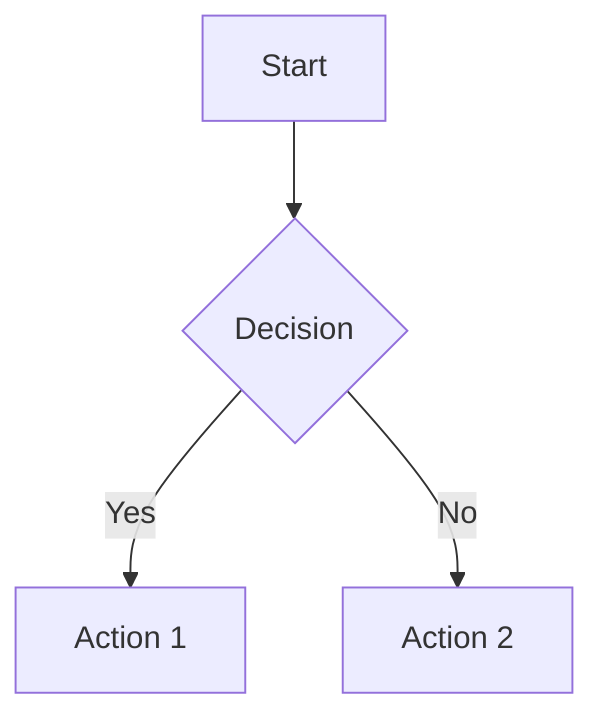

# Lucky Gas Legacy System Blueprint 📋

**Purpose**: Complete technical documentation of the existing Lucky Gas system to serve as the primary reference for new system implementation.

**Coverage**: 100% of system functionality across 102 leaf nodes in 11 major modules

**Documentation Standard**: Enterprise-grade reference documentation with visual, structural, and behavioral specifications

---

## 📚 Documentation Structure

```
LEGACY_SYSTEM_BLUEPRINT/
├── README.md                          # This file - Navigation guide
├── 00_SYSTEM_OVERVIEW/               # Architecture and integration
│   ├── system_architecture.md
│   ├── data_flow_diagram.png
│   └── integration_points.md
│
├── 01_CUSTOMER_MANAGEMENT/           # 會員作業 (11 leaf nodes)
│   ├── module_overview.md
│   ├── data_models/
│   ├── workflows/
│   ├── screenshots/
│   └── api_endpoints.md
│
├── 02_DATA_MAINTENANCE/              # 資料維護 (12 leaf nodes)
│   ├── module_overview.md
│   ├── data_models/
│   ├── workflows/
│   ├── screenshots/
│   └── system_parameters.md
│
├── 03_ORDER_SALES/                   # 訂單銷售 (13 leaf nodes)
│   ├── module_overview.md
│   ├── data_models/
│   ├── workflows/
│   ├── screenshots/
│   └── business_rules.md
│
├── 04_REPORTS/                       # 報表作業 (15 leaf nodes)
│   ├── module_overview.md
│   ├── report_templates/
│   ├── data_queries/
│   ├── screenshots/
│   └── export_formats.md
│
├── 05_HOT_AIR_BALLOON/              # 熱氣球作業 (4 leaf nodes)
│   ├── module_overview.md
│   ├── data_models/
│   ├── workflows/
│   └── screenshots/
│
├── 06_LUCKY_GAS_APP/                # 幸福氣APP (4 leaf nodes)
│   ├── module_overview.md
│   ├── app_management/
│   ├── user_analytics/
│   └── screenshots/
│
├── 07_INVOICE_OPERATIONS/           # 發票作業 (10 leaf nodes)
│   ├── module_overview.md
│   ├── data_models/
│   ├── workflows/
│   ├── screenshots/
│   └── tax_compliance.md
│
├── 08_ACCOUNT_MANAGEMENT/           # 帳務管理 (10 leaf nodes)
│   ├── module_overview.md
│   ├── data_models/
│   ├── workflows/
│   ├── screenshots/
│   └── financial_rules.md
│
├── 09_CSV_EXPORT/                   # CSV匯出 (6 leaf nodes)
│   ├── module_overview.md
│   ├── export_templates/
│   ├── field_mappings/
│   └── screenshots/
│
├── 10_DISPATCH_OPERATIONS/          # 派遣作業 (9 leaf nodes)
│   ├── module_overview.md
│   ├── data_models/
│   ├── workflows/
│   ├── screenshots/
│   └── routing_logic.md
│
├── 11_NOTIFICATION_OPERATIONS/      # 通報作業 (8 leaf nodes)
│   ├── module_overview.md
│   ├── notification_templates/
│   ├── workflows/
│   └── screenshots/
│
└── APPENDICES/
    ├── glossary.md                  # Business terms (Chinese/English)
    ├── validation_rules.md          # All field validations
    ├── error_messages.md            # System error messages
    └── migration_checklist.md       # Feature parity checklist
```

---

## 📋 Documentation Standards

### 1. Module Overview Template
```markdown
# Module Name (Chinese/English)

## Purpose
Brief description of module's business function

## Key Features
- Feature 1
- Feature 2

## User Roles
- Who uses this module
- Permission levels

## Integration Points
- Upstream dependencies
- Downstream consumers
```

### 2. Data Model Documentation
```yaml
entity_name:
  chinese_name: "中文名稱"
  table_name: "database_table"
  fields:
    - name: "field_name"
      chinese_name: "欄位名稱"
      type: "varchar(50)"
      required: true
      validation: "regex pattern or rule"
      default: "default value"
      description: "Business purpose"
```

### 3. Workflow Documentation


### 4. Screenshot Annotations
- Every screenshot must include:
  - Page title and navigation path
  - Numbered annotations for key elements
  - Field labels in both Chinese and English
  - Sample data visible (anonymized)

### 5. API Endpoint Patterns
```
POST /module/action
Request: { field1, field2 }
Response: { success, data, message }
```

---

## 🔍 Analysis Progress Tracking

| Module | Screenshots | Data Models | Workflows | Fields Documented | Status |
|--------|------------|-------------|-----------|-------------------|---------|
| Customer Management | 0/11 | 0/3 | 0/5 | 0/76 | ⏳ Pending |
| Data Maintenance | 0/12 | 0/4 | 0/3 | 0/45 | ⏳ Pending |
| Order Sales | 0/13 | 0/3 | 0/4 | 0/52 | ⏳ Pending |
| Reports | 0/15 | 0/5 | 0/8 | 0/120 | ⏳ Pending |
| Hot Air Balloon | 0/4 | 0/2 | 0/2 | 0/18 | ⏳ Pending |
| Lucky Gas APP | 0/4 | 0/2 | 0/2 | 0/15 | ⏳ Pending |
| Invoice Operations | 0/10 | 0/3 | 0/4 | 0/38 | ⏳ Pending |
| Account Management | 0/10 | 0/4 | 0/5 | 0/42 | ⏳ Pending |
| CSV Export | 0/6 | 0/1 | 0/3 | 0/25 | ⏳ Pending |
| Dispatch Operations | 0/9 | 0/3 | 0/4 | 0/35 | ⏳ Pending |
| Notifications | 0/8 | 0/2 | 0/3 | 0/28 | ⏳ Pending |

**Total Progress**: 0/102 pages documented (0%)

---

## 🚀 Quick Start for Developers

1. **Navigation**: Use this README to find specific documentation
2. **Module Deep Dive**: Start with `module_overview.md` in each folder
3. **Data Structures**: Check `data_models/` for entity relationships
4. **Business Logic**: Review `workflows/` for process flows
5. **UI Reference**: Use `screenshots/` for interface replication
6. **Validation Rules**: See APPENDICES for all field rules

---

## 🏷️ Document Versioning

- **Version**: 1.0.0
- **Last Updated**: 2025-01-25
- **Next Review**: After each module completion
- **Change Log**: See APPENDICES/changelog.md

---

## 🔄 Living Documentation

This documentation is actively maintained during the analysis phase. Each completed module will be marked with ✅ and include:
- Complete screenshot coverage
- Verified data models
- Validated workflows
- Field-level specifications
- Business rule documentation

**Goal**: 100% feature parity between legacy and new system.