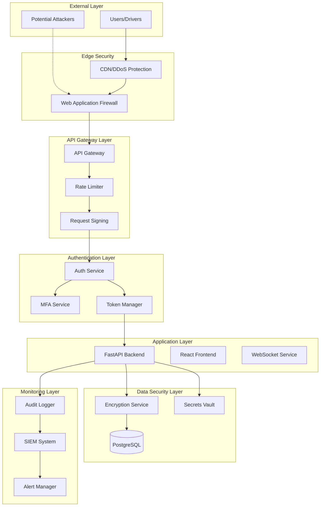
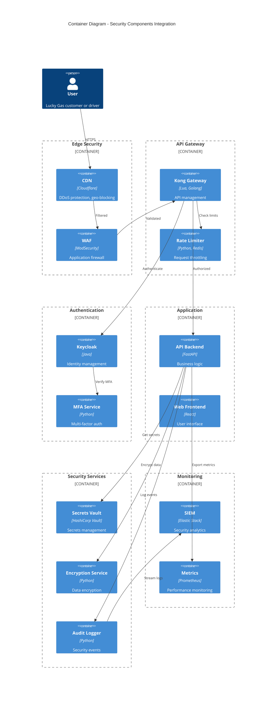
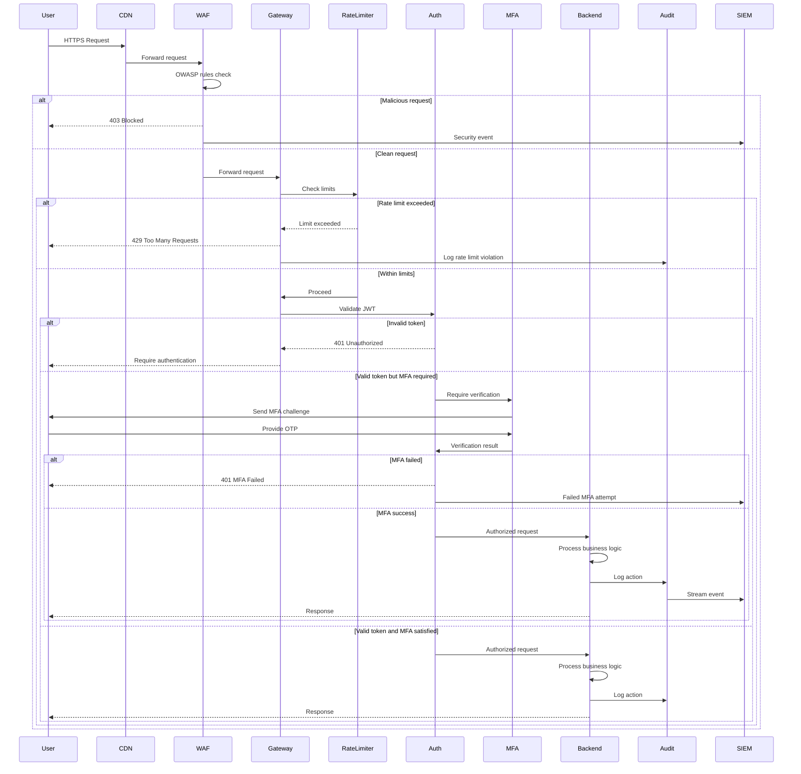
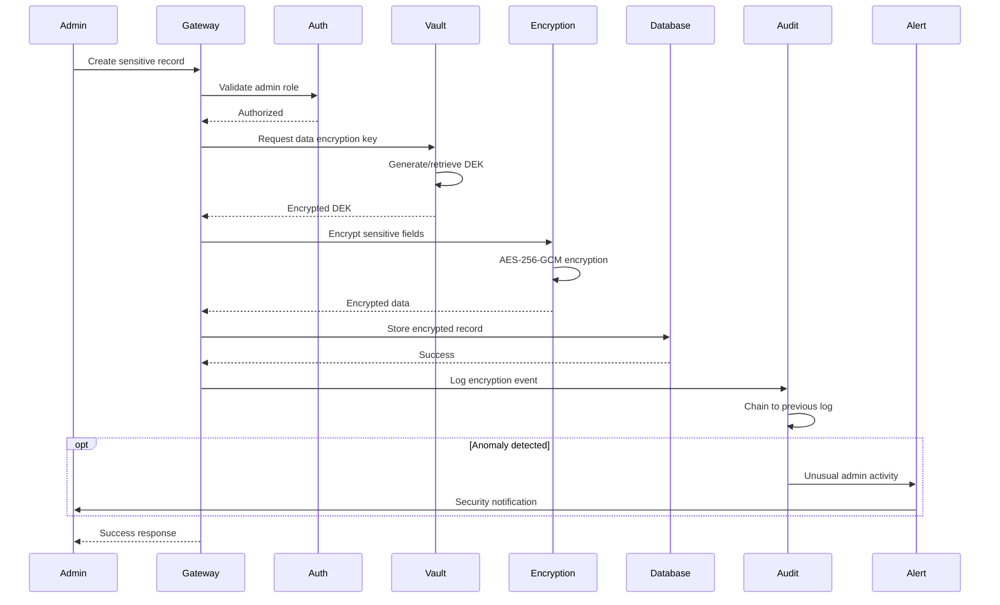

# Lucky Gas v3 Security Architecture Document

## Introduction

This document outlines the comprehensive security architecture for Lucky Gas v3, focusing on transforming the current system (Security Maturity Score: 15/100) into a robust, enterprise-grade secure delivery management platform. Its primary goal is to serve as the guiding security blueprint for immediate implementation, ensuring protection of customer data, business operations, and regulatory compliance.

**Relationship to Main Architecture:**
This security architecture document complements the existing Lucky Gas v3 system architecture and MUST be implemented as an overlay to all existing components. The security controls documented herein are mandatory for all development, deployment, and operational activities.

### Starter Template or Existing Project

**Current State Analysis:**
Lucky Gas v3 is an existing production-ready system built with:
- Backend: FastAPI (Python 3.11) with async/await patterns
- Frontend: React 18 with TypeScript
- Database: PostgreSQL 15
- Infrastructure: Docker, Docker Compose, potential Kubernetes
- Cloud: Google Cloud Platform (Routes API, Vertex AI)

**Security Gaps Identified:**
- No rate limiting or DDoS protection
- Plain text secrets in .env files
- Missing audit logging
- No encryption at rest
- Absence of Multi-Factor Authentication
- No comprehensive security monitoring

**Decision:** This security architecture will be retrofitted to the existing Lucky Gas v3 codebase, requiring careful integration to avoid disrupting current operations while implementing critical security controls.

### Change Log
| Date | Version | Description | Author |
|------|---------|-------------|--------|
| 2025-02-02 | 1.0 | Initial security architecture design | BMad Master |

## High Level Architecture

### Technical Summary

The Lucky Gas v3 security architecture implements a Defense-in-Depth strategy using Zero Trust principles across all system layers. Core components include API Gateway with rate limiting, centralized authentication service with MFA, comprehensive audit logging, and end-to-end encryption. The architecture leverages Google Cloud security services while maintaining cloud-agnostic design patterns. This security overlay supports the PRD goals of protecting customer data, ensuring business continuity, and maintaining regulatory compliance while enabling rapid, secure delivery operations.

### High Level Overview

1. **Architectural Style**: Defense-in-Depth Security Overlay on existing Microservices architecture
2. **Repository Structure**: Security components integrated into existing Monorepo structure
3. **Service Architecture**: Centralized security services (Auth, Audit, Monitoring) with distributed enforcement points
4. **Primary Security Flow**: All requests flow through API Gateway → Authentication → Authorization → Rate Limiting → Business Logic → Audit Logging
5. **Key Architectural Decisions**:
   - Zero Trust: Never trust, always verify at every layer
   - Centralized Authentication with distributed authorization
   - Immutable audit logs with blockchain-style chaining
   - Automated threat detection and response

### High Level Project Diagram



### Architectural and Design Patterns

- **Zero Trust Architecture:** Every request is authenticated and authorized regardless of source - _Rationale:_ Eliminates implicit trust, reduces attack surface, supports remote workforce
- **API Gateway Pattern:** Centralized entry point for all API requests with security controls - _Rationale:_ Single point for rate limiting, authentication, and monitoring
- **Circuit Breaker Pattern:** Prevent cascading failures from security services - _Rationale:_ Ensures security controls don't create availability issues
- **Event Sourcing for Audit:** Immutable event log for all security-relevant actions - _Rationale:_ Provides forensic capability and compliance evidence
- **Secrets Management Pattern:** Centralized vault with dynamic secret rotation - _Rationale:_ Eliminates hardcoded secrets and enables automated rotation
- **Defense in Depth:** Multiple security layers with fail-secure defaults - _Rationale:_ Single control failure doesn't compromise entire system

## Tech Stack

### Cloud Infrastructure
- **Provider:** Google Cloud Platform
- **Key Services:** Cloud Armor (DDoS), Secret Manager, Cloud KMS, Cloud IAM, Security Command Center, Cloud Logging
- **Deployment Regions:** asia-east1 (Primary), asia-southeast1 (DR)

### Technology Stack Table

| Category | Technology | Version | Purpose | Rationale |
|----------|------------|---------|---------|-----------|
| **API Gateway** | Kong Gateway | 3.5.0 | API management and security | Enterprise features, plugin ecosystem, GCP compatible |
| **Rate Limiting** | Redis | 7.2.4 | Distributed rate limit storage | High performance, atomic operations, cluster support |
| **Authentication** | Keycloak | 23.0.4 | Identity and access management | Open source, MFA support, extensive protocols |
| **MFA Provider** | Google Authenticator | - | Time-based OTP | Wide adoption, no SMS costs, offline capable |
| **Secrets Management** | HashiCorp Vault | 1.15.5 | Secrets storage and rotation | Dynamic secrets, encryption as service, audit logs |
| **Encryption Library** | cryptography (Python) | 42.0.2 | Field-level encryption | FIPS compliant, active maintenance, good performance |
| **SIEM** | Elastic Stack | 8.12.0 | Security monitoring and analysis | Open source, powerful analytics, GCP integration |
| **Vulnerability Scanner** | Trivy | 0.48.3 | Container and dependency scanning | CI/CD integration, comprehensive coverage |
| **SAST Tool** | Semgrep | 1.60.0 | Static code analysis | Custom rules, fast, low false positives |
| **Audit Logging** | Fluent Bit | 3.0.0 | Log collection and forwarding | Lightweight, reliable, extensive plugins |
| **Monitoring** | Prometheus + Grafana | 2.48.1 / 10.3.1 | Metrics and visualization | De facto standard, powerful alerting |
| **WAF** | ModSecurity | 3.0.12 | Web application firewall | OWASP Core Rule Set, flexible rules |

## Data Models

### SecurityPrincipal
**Purpose:** Represents authenticated entities (users, services, API clients)

**Key Attributes:**
- principal_id: UUID - Unique identifier
- principal_type: Enum - USER, SERVICE, API_CLIENT
- credentials: JSON - Encrypted credential storage
- mfa_enabled: Boolean - MFA requirement flag
- security_clearance: String - Access level classification
- last_auth: Timestamp - Last successful authentication

**Relationships:**
- Has many Sessions
- Has many AuditLogs
- Has many Permissions through Roles

### Session
**Purpose:** Tracks active authentication sessions with security context

**Key Attributes:**
- session_id: UUID - Unique session identifier
- principal_id: UUID - Associated principal
- token_hash: String - Hashed session token
- ip_address: String - Client IP for geo-blocking
- user_agent: String - Client identification
- expires_at: Timestamp - Absolute expiration
- revoked: Boolean - Manual revocation flag
- risk_score: Integer - Dynamic risk assessment

**Relationships:**
- Belongs to SecurityPrincipal
- Has many AuditLogs
- Has one DeviceFingerprint

### AuditLog
**Purpose:** Immutable record of all security-relevant events

**Key Attributes:**
- event_id: UUID - Unique event identifier
- timestamp: Timestamp - Microsecond precision
- principal_id: UUID - Actor identification
- action: String - Standardized action code
- resource_type: String - Affected resource category
- resource_id: String - Specific resource identifier
- result: Enum - SUCCESS, FAILURE, BLOCKED
- risk_indicators: JSON - Anomaly detection flags
- request_hash: String - Request integrity hash
- previous_hash: String - Blockchain-style chaining

**Relationships:**
- Belongs to SecurityPrincipal
- References previous AuditLog (chain)
- Has many SecurityAlerts

### RateLimitBucket
**Purpose:** Distributed rate limiting with flexible strategies

**Key Attributes:**
- bucket_key: String - Composite key (principal:resource:action)
- window_start: Timestamp - Current window start
- request_count: Integer - Requests in window
- burst_allowance: Float - Token bucket balance
- last_updated: Timestamp - Last modification
- blocked_until: Timestamp - Temporary block expiry

**Relationships:**
- Logs violations to AuditLog
- Triggers SecurityAlerts on limits

### EncryptionKey
**Purpose:** Manages encryption keys with rotation support

**Key Attributes:**
- key_id: UUID - Key identifier
- key_version: Integer - Rotation version
- algorithm: String - Encryption algorithm
- purpose: String - Key usage restriction
- created_at: Timestamp - Generation time
- rotated_at: Timestamp - Last rotation
- expires_at: Timestamp - Key expiration
- status: Enum - ACTIVE, ROTATING, RETIRED

**Relationships:**
- Encrypts multiple DataRecords
- Has many KeyUsageAudits

## Components

### API Gateway Service
**Responsibility:** Single entry point for all external API requests with comprehensive security controls

**Key Interfaces:**
- HTTP/HTTPS endpoints with TLS 1.3 minimum
- WebSocket upgrade with security handshake
- Health check endpoint for load balancers
- Metrics endpoint for Prometheus scraping

**Dependencies:** Rate Limiter, Auth Service, Request Validator, Audit Logger

**Technology Stack:** Kong Gateway 3.5.0 with custom Lua plugins for Lucky Gas specific security rules

### Authentication Service
**Responsibility:** Centralized authentication with multi-factor support and session management

**Key Interfaces:**
- POST /auth/login - Initial authentication
- POST /auth/mfa/verify - MFA verification
- POST /auth/refresh - Token refresh
- POST /auth/logout - Session termination
- GET /auth/sessions - Active session management

**Dependencies:** MFA Provider, Token Manager, User Store, Audit Logger

**Technology Stack:** Keycloak 23.0.4 with custom Lucky Gas realm configuration

### Rate Limiting Service
**Responsibility:** Distributed rate limiting with multiple strategies per resource

**Key Interfaces:**
- CheckLimit(principal, resource, action) - Verify rate limit
- RecordRequest(principal, resource, action) - Update counters
- GetLimitStatus(principal) - Current usage stats
- ResetLimits(principal) - Administrative override

**Dependencies:** Redis Cluster, Configuration Service

**Technology Stack:** Custom Python service with Redis 7.2.4 backend using sliding window + token bucket algorithms

### Audit Logging Service
**Responsibility:** Immutable, tamper-evident logging of all security events

**Key Interfaces:**
- LogEvent(event) - Async event logging
- QueryLogs(criteria) - Forensic investigation
- VerifyChain(start, end) - Integrity verification
- ExportCompliance(format) - Regulatory reports

**Dependencies:** Encryption Service, Time Service, SIEM Connector

**Technology Stack:** Custom Python service with PostgreSQL backend, Fluent Bit forwarder to Elastic Stack

### Secrets Management Service
**Responsibility:** Secure storage, rotation, and access control for all secrets

**Key Interfaces:**
- GetSecret(path, version) - Retrieve specific secret
- RotateSecret(path) - Trigger rotation
- CreateSecret(path, value, policy) - New secret
- AuditAccess(timerange) - Access logs

**Dependencies:** Encryption Service, HSM Integration, Audit Logger

**Technology Stack:** HashiCorp Vault 1.15.5 with GCP KMS auto-unseal

### Encryption Service
**Responsibility:** Field-level encryption for sensitive data with key management

**Key Interfaces:**
- Encrypt(data, context) - Context-aware encryption
- Decrypt(ciphertext, context) - Authorized decryption
- RotateKey(key_id) - Key rotation
- GenerateDataKey() - Envelope encryption

**Dependencies:** KMS Service, Key Cache, Audit Logger

**Technology Stack:** Python cryptography library 42.0.2 with GCP Cloud KMS for master keys

### Security Monitoring Service
**Responsibility:** Real-time threat detection, alerting, and automated response

**Key Interfaces:**
- IngestEvent(event) - Event processing
- DetectAnomaly(pattern) - ML-based detection
- TriggerResponse(threat) - Automated mitigation
- GenerateReport(period) - Security metrics

**Dependencies:** SIEM Platform, Alert Manager, Response Orchestrator

**Technology Stack:** Elastic SIEM with custom detection rules and Prometheus + Grafana dashboards

### Component Diagrams



## External APIs

### Google Cloud KMS API
- **Purpose:** Master key management for encryption service
- **Documentation:** https://cloud.google.com/kms/docs/reference/rest
- **Base URL(s):** https://cloudkms.googleapis.com/v1
- **Authentication:** Service account with JSON key file
- **Rate Limits:** 1,500 requests per minute per project

**Key Endpoints Used:**
- `POST /v1/{name=projects/*/locations/*/keyRings/*/cryptoKeys}:encrypt` - Envelope encryption
- `POST /v1/{name=projects/*/locations/*/keyRings/*/cryptoKeys}:decrypt` - Envelope decryption
- `GET /v1/{name=projects/*/locations/*/keyRings/*/cryptoKeys/*}` - Key metadata

**Integration Notes:** Use client library with exponential backoff, implement caching for encrypted data keys

### Twilio Verify API
- **Purpose:** SMS and voice OTP for MFA fallback
- **Documentation:** https://www.twilio.com/docs/verify/api
- **Base URL(s):** https://verify.twilio.com/v2
- **Authentication:** HTTP Basic Auth with Account SID and Auth Token
- **Rate Limits:** 1 request per second per phone number

**Key Endpoints Used:**
- `POST /Services/{ServiceSid}/Verifications` - Send OTP
- `POST /Services/{ServiceSid}/VerificationCheck` - Verify OTP

**Integration Notes:** Only use as fallback when TOTP unavailable, implement cost controls

### Have I Been Pwned API
- **Purpose:** Password breach checking during registration/change
- **Documentation:** https://haveibeenpwned.com/API/v3
- **Base URL(s):** https://api.pwnedpasswords.com
- **Authentication:** API key in header for authenticated endpoints
- **Rate Limits:** 1 request per 1,500 milliseconds

**Key Endpoints Used:**
- `GET /range/{hashPrefix}` - K-anonymity password check

**Integration Notes:** Use k-anonymity model to protect passwords, cache results for 30 days

## Core Workflows





## REST API Spec

```yaml
openapi: 3.0.0
info:
  title: Lucky Gas Security API
  version: 1.0.0
  description: Security-specific endpoints for Lucky Gas delivery system
servers:
  - url: https://api.luckygas.com.tw/v1
    description: Production server with full security controls
  
paths:
  /auth/login:
    post:
      summary: Initial authentication
      tags: [Authentication]
      requestBody:
        required: true
        content:
          application/json:
            schema:
              $ref: '#/components/schemas/LoginRequest'
      responses:
        '200':
          description: Authentication successful, MFA required
          content:
            application/json:
              schema:
                $ref: '#/components/schemas/MFAChallengeResponse'
        '401':
          description: Invalid credentials
        '429':
          description: Too many failed attempts
      security: []
      
  /auth/mfa/verify:
    post:
      summary: Verify MFA code
      tags: [Authentication]
      requestBody:
        required: true
        content:
          application/json:
            schema:
              $ref: '#/components/schemas/MFAVerifyRequest'
      responses:
        '200':
          description: MFA successful
          content:
            application/json:
              schema:
                $ref: '#/components/schemas/AuthSuccessResponse'
        '401':
          description: Invalid MFA code
          
  /auth/refresh:
    post:
      summary: Refresh access token
      tags: [Authentication]
      requestBody:
        required: true
        content:
          application/json:
            schema:
              $ref: '#/components/schemas/RefreshRequest'
      responses:
        '200':
          description: New tokens issued
          content:
            application/json:
              schema:
                $ref: '#/components/schemas/TokenResponse'
                
  /security/audit-logs:
    get:
      summary: Query audit logs
      tags: [Security]
      parameters:
        - name: start_date
          in: query
          required: true
          schema:
            type: string
            format: date-time
        - name: end_date
          in: query
          required: true
          schema:
            type: string
            format: date-time
        - name: principal_id
          in: query
          schema:
            type: string
        - name: action
          in: query
          schema:
            type: string
        - name: result
          in: query
          schema:
            type: string
            enum: [SUCCESS, FAILURE, BLOCKED]
      responses:
        '200':
          description: Audit logs retrieved
          content:
            application/json:
              schema:
                $ref: '#/components/schemas/AuditLogResponse'
      security:
        - bearerAuth: []
        - apiKey: []
        
  /security/rate-limits:
    get:
      summary: Get current rate limit status
      tags: [Security]
      responses:
        '200':
          description: Rate limit status
          content:
            application/json:
              schema:
                $ref: '#/components/schemas/RateLimitStatus'
      security:
        - bearerAuth: []

components:
  schemas:
    LoginRequest:
      type: object
      required:
        - email
        - password
        - device_fingerprint
      properties:
        email:
          type: string
          format: email
        password:
          type: string
          format: password
        device_fingerprint:
          type: string
          description: Browser/device fingerprint for risk assessment
          
    MFAChallengeResponse:
      type: object
      properties:
        challenge_id:
          type: string
        method:
          type: string
          enum: [TOTP, SMS, EMAIL]
        expires_at:
          type: string
          format: date-time
          
    AuthSuccessResponse:
      type: object
      properties:
        access_token:
          type: string
        refresh_token:
          type: string
        token_type:
          type: string
          default: Bearer
        expires_in:
          type: integer
          description: Seconds until expiration
        user:
          $ref: '#/components/schemas/UserProfile'
          
    AuditLogEntry:
      type: object
      properties:
        event_id:
          type: string
          format: uuid
        timestamp:
          type: string
          format: date-time
        principal_id:
          type: string
        principal_email:
          type: string
        action:
          type: string
        resource_type:
          type: string
        resource_id:
          type: string
        result:
          type: string
          enum: [SUCCESS, FAILURE, BLOCKED]
        ip_address:
          type: string
        user_agent:
          type: string
        risk_indicators:
          type: array
          items:
            type: string
            
  securitySchemes:
    bearerAuth:
      type: http
      scheme: bearer
      bearerFormat: JWT
    apiKey:
      type: apiKey
      in: header
      name: X-API-Key
```

## Database Schema

```sql
-- Security Principal table for all authenticated entities
CREATE TABLE security_principals (
    principal_id UUID PRIMARY KEY DEFAULT gen_random_uuid(),
    principal_type VARCHAR(20) NOT NULL CHECK (principal_type IN ('USER', 'SERVICE', 'API_CLIENT')),
    email VARCHAR(255) UNIQUE,
    credentials JSONB NOT NULL, -- Encrypted credential storage
    mfa_enabled BOOLEAN DEFAULT false,
    mfa_secret BYTEA, -- Encrypted TOTP secret
    security_clearance VARCHAR(50) DEFAULT 'STANDARD',
    failed_login_attempts INT DEFAULT 0,
    locked_until TIMESTAMPTZ,
    last_auth TIMESTAMPTZ,
    password_changed_at TIMESTAMPTZ NOT NULL DEFAULT NOW(),
    created_at TIMESTAMPTZ NOT NULL DEFAULT NOW(),
    updated_at TIMESTAMPTZ NOT NULL DEFAULT NOW()
);

CREATE INDEX idx_principals_email ON security_principals(email);
CREATE INDEX idx_principals_type ON security_principals(principal_type);

-- Session management with security context
CREATE TABLE sessions (
    session_id UUID PRIMARY KEY DEFAULT gen_random_uuid(),
    principal_id UUID NOT NULL REFERENCES security_principals(principal_id),
    token_hash VARCHAR(64) NOT NULL, -- SHA-256 of session token
    refresh_token_hash VARCHAR(64),
    ip_address INET NOT NULL,
    user_agent TEXT,
    device_fingerprint VARCHAR(64),
    created_at TIMESTAMPTZ NOT NULL DEFAULT NOW(),
    last_activity TIMESTAMPTZ NOT NULL DEFAULT NOW(),
    expires_at TIMESTAMPTZ NOT NULL,
    revoked BOOLEAN DEFAULT false,
    revoked_at TIMESTAMPTZ,
    revoked_by UUID REFERENCES security_principals(principal_id),
    risk_score INT DEFAULT 0,
    CONSTRAINT unique_active_token UNIQUE (token_hash, revoked)
);

CREATE INDEX idx_sessions_principal ON sessions(principal_id);
CREATE INDEX idx_sessions_token ON sessions(token_hash);
CREATE INDEX idx_sessions_expires ON sessions(expires_at) WHERE NOT revoked;

-- Immutable audit log with blockchain-style chaining
CREATE TABLE audit_logs (
    event_id UUID PRIMARY KEY DEFAULT gen_random_uuid(),
    timestamp TIMESTAMPTZ NOT NULL DEFAULT NOW(),
    principal_id UUID REFERENCES security_principals(principal_id),
    session_id UUID REFERENCES sessions(session_id),
    action VARCHAR(100) NOT NULL,
    resource_type VARCHAR(50),
    resource_id VARCHAR(255),
    result VARCHAR(20) NOT NULL CHECK (result IN ('SUCCESS', 'FAILURE', 'BLOCKED')),
    ip_address INET,
    user_agent TEXT,
    request_method VARCHAR(10),
    request_path TEXT,
    response_code INT,
    risk_indicators JSONB DEFAULT '[]',
    details JSONB DEFAULT '{}',
    request_hash VARCHAR(64), -- SHA-256 of request for integrity
    previous_hash VARCHAR(64), -- Chain to previous log entry
    created_at TIMESTAMPTZ NOT NULL DEFAULT NOW()
);

-- Indexes for audit log queries
CREATE INDEX idx_audit_timestamp ON audit_logs(timestamp);
CREATE INDEX idx_audit_principal ON audit_logs(principal_id);
CREATE INDEX idx_audit_action ON audit_logs(action);
CREATE INDEX idx_audit_result ON audit_logs(result);
CREATE INDEX idx_audit_resource ON audit_logs(resource_type, resource_id);

-- Prevent audit log modifications
CREATE RULE audit_logs_immutable AS ON UPDATE TO audit_logs DO INSTEAD NOTHING;
CREATE RULE audit_logs_no_delete AS ON DELETE TO audit_logs DO INSTEAD NOTHING;

-- Rate limiting buckets
CREATE TABLE rate_limit_buckets (
    bucket_key VARCHAR(255) PRIMARY KEY,
    window_start TIMESTAMPTZ NOT NULL,
    request_count INT NOT NULL DEFAULT 0,
    burst_allowance FLOAT DEFAULT 10.0,
    last_updated TIMESTAMPTZ NOT NULL DEFAULT NOW(),
    blocked_until TIMESTAMPTZ
);

CREATE INDEX idx_rate_limit_window ON rate_limit_buckets(window_start);
CREATE INDEX idx_rate_limit_blocked ON rate_limit_buckets(blocked_until) WHERE blocked_until IS NOT NULL;

-- Encryption key management
CREATE TABLE encryption_keys (
    key_id UUID PRIMARY KEY DEFAULT gen_random_uuid(),
    key_version INT NOT NULL DEFAULT 1,
    algorithm VARCHAR(50) NOT NULL DEFAULT 'AES-256-GCM',
    purpose VARCHAR(100) NOT NULL,
    key_material BYTEA, -- Encrypted with master key
    created_at TIMESTAMPTZ NOT NULL DEFAULT NOW(),
    rotated_at TIMESTAMPTZ,
    expires_at TIMESTAMPTZ,
    status VARCHAR(20) NOT NULL DEFAULT 'ACTIVE' CHECK (status IN ('ACTIVE', 'ROTATING', 'RETIRED', 'COMPROMISED')),
    created_by UUID NOT NULL REFERENCES security_principals(principal_id)
);

CREATE INDEX idx_encryption_keys_status ON encryption_keys(status);
CREATE INDEX idx_encryption_keys_purpose ON encryption_keys(purpose);

-- API keys for service-to-service auth
CREATE TABLE api_keys (
    key_id UUID PRIMARY KEY DEFAULT gen_random_uuid(),
    principal_id UUID NOT NULL REFERENCES security_principals(principal_id),
    key_hash VARCHAR(64) NOT NULL UNIQUE, -- SHA-256 of API key
    name VARCHAR(100) NOT NULL,
    scopes JSONB NOT NULL DEFAULT '[]',
    rate_limit_override INT,
    allowed_ips INET[] DEFAULT '{}',
    expires_at TIMESTAMPTZ,
    last_used_at TIMESTAMPTZ,
    created_at TIMESTAMPTZ NOT NULL DEFAULT NOW(),
    revoked BOOLEAN DEFAULT false,
    revoked_at TIMESTAMPTZ
);

CREATE INDEX idx_api_keys_hash ON api_keys(key_hash) WHERE NOT revoked;
CREATE INDEX idx_api_keys_principal ON api_keys(principal_id);

-- Security alerts and incidents
CREATE TABLE security_alerts (
    alert_id UUID PRIMARY KEY DEFAULT gen_random_uuid(),
    alert_type VARCHAR(50) NOT NULL,
    severity VARCHAR(20) NOT NULL CHECK (severity IN ('LOW', 'MEDIUM', 'HIGH', 'CRITICAL')),
    title VARCHAR(255) NOT NULL,
    description TEXT,
    source_system VARCHAR(50),
    detection_time TIMESTAMPTZ NOT NULL DEFAULT NOW(),
    principal_id UUID REFERENCES security_principals(principal_id),
    related_events UUID[] DEFAULT '{}', -- Array of audit_log event_ids
    status VARCHAR(20) NOT NULL DEFAULT 'OPEN' CHECK (status IN ('OPEN', 'INVESTIGATING', 'RESOLVED', 'FALSE_POSITIVE')),
    assigned_to UUID REFERENCES security_principals(principal_id),
    resolution_notes TEXT,
    resolved_at TIMESTAMPTZ
);

CREATE INDEX idx_alerts_status ON security_alerts(status);
CREATE INDEX idx_alerts_severity ON security_alerts(severity);
CREATE INDEX idx_alerts_time ON security_alerts(detection_time);

-- RBAC tables
CREATE TABLE roles (
    role_id UUID PRIMARY KEY DEFAULT gen_random_uuid(),
    role_name VARCHAR(50) NOT NULL UNIQUE,
    description TEXT,
    permissions JSONB NOT NULL DEFAULT '[]',
    created_at TIMESTAMPTZ NOT NULL DEFAULT NOW()
);

CREATE TABLE principal_roles (
    principal_id UUID NOT NULL REFERENCES security_principals(principal_id),
    role_id UUID NOT NULL REFERENCES roles(role_id),
    granted_at TIMESTAMPTZ NOT NULL DEFAULT NOW(),
    granted_by UUID NOT NULL REFERENCES security_principals(principal_id),
    expires_at TIMESTAMPTZ,
    PRIMARY KEY (principal_id, role_id)
);

-- Insert default roles
INSERT INTO roles (role_name, description, permissions) VALUES
('SUPER_ADMIN', 'Full system access', '["*"]'),
('SECURITY_ADMIN', 'Security configuration and monitoring', '["security.*", "audit.read"]'),
('MANAGER', 'Business operations management', '["orders.*", "customers.read", "reports.*"]'),
('OFFICE_STAFF', 'Day-to-day operations', '["orders.create", "orders.read", "orders.update", "customers.*"]'),
('DRIVER', 'Delivery operations', '["orders.read", "orders.update_status", "routes.read"]'),
('CUSTOMER', 'Customer self-service', '["orders.read_own", "profile.update_own"]');

-- Function to verify audit log chain integrity
CREATE OR REPLACE FUNCTION verify_audit_chain(start_time TIMESTAMPTZ, end_time TIMESTAMPTZ)
RETURNS TABLE (is_valid BOOLEAN, broken_at UUID, expected_hash VARCHAR, actual_hash VARCHAR) AS $$
DECLARE
    curr_record RECORD;
    prev_hash VARCHAR(64) := NULL;
    expected VARCHAR(64);
BEGIN
    FOR curr_record IN 
        SELECT event_id, previous_hash, 
               encode(sha256(event_id::text || timestamp::text || action || COALESCE(result, '')), 'hex') as computed_hash
        FROM audit_logs 
        WHERE timestamp BETWEEN start_time AND end_time 
        ORDER BY timestamp
    LOOP
        IF prev_hash IS NOT NULL THEN
            IF curr_record.previous_hash != prev_hash THEN
                RETURN QUERY SELECT false, curr_record.event_id, prev_hash, curr_record.previous_hash;
                RETURN;
            END IF;
        END IF;
        prev_hash := curr_record.computed_hash;
    END LOOP;
    
    RETURN QUERY SELECT true, NULL::UUID, NULL::VARCHAR, NULL::VARCHAR;
END;
$$ LANGUAGE plpgsql;

-- Trigger to set previous_hash on audit log insert
CREATE OR REPLACE FUNCTION set_audit_previous_hash()
RETURNS TRIGGER AS $$
DECLARE
    prev_hash VARCHAR(64);
BEGIN
    SELECT encode(sha256(event_id::text || timestamp::text || action || COALESCE(result, '')), 'hex')
    INTO prev_hash
    FROM audit_logs
    ORDER BY timestamp DESC
    LIMIT 1;
    
    NEW.previous_hash := prev_hash;
    RETURN NEW;
END;
$$ LANGUAGE plpgsql;

CREATE TRIGGER audit_chain_trigger
BEFORE INSERT ON audit_logs
FOR EACH ROW EXECUTE FUNCTION set_audit_previous_hash();
```

## Source Tree

```plaintext
lucky-gas-v3/
├── backend/
│   ├── app/
│   │   ├── api/
│   │   │   └── v1/
│   │   │       ├── auth.py              # Enhanced with MFA endpoints
│   │   │       ├── security.py          # New: Security-specific endpoints
│   │   │       └── middleware/
│   │   │           ├── rate_limiter.py  # New: Rate limiting middleware
│   │   │           ├── audit_logger.py  # New: Audit logging middleware
│   │   │           └── request_validator.py # New: Input validation
│   │   ├── core/
│   │   │   ├── security/
│   │   │   │   ├── __init__.py
│   │   │   │   ├── auth_manager.py      # New: Centralized auth logic
│   │   │   │   ├── mfa_service.py       # New: MFA implementation
│   │   │   │   ├── encryption.py        # New: Field-level encryption
│   │   │   │   ├── rate_limiter.py      # New: Rate limiting logic
│   │   │   │   ├── audit_logger.py      # New: Audit logging service
│   │   │   │   └── request_signer.py    # New: HMAC request signing
│   │   │   ├── secrets_manager.py       # New: Vault integration
│   │   │   └── monitoring.py            # Enhanced with security metrics
│   │   ├── models/
│   │   │   ├── security_principal.py    # New: Security entities
│   │   │   ├── session.py               # New: Session management
│   │   │   └── audit_log.py             # New: Audit log model
│   │   └── services/
│   │       └── security/
│   │           ├── threat_detector.py   # New: Anomaly detection
│   │           └── incident_response.py # New: Automated response
│   ├── security/
│   │   ├── policies/                    # New: Security policies
│   │   │   ├── password_policy.yaml
│   │   │   ├── rate_limits.yaml
│   │   │   └── access_control.yaml
│   │   └── rules/                       # New: WAF/SIEM rules
│   │       ├── waf_rules.conf
│   │       └── detection_rules.yaml
│   └── tests/
│       └── security/                    # New: Security tests
│           ├── test_authentication.py
│           ├── test_encryption.py
│           └── test_penetration.py
├── frontend/
│   ├── src/
│   │   ├── components/
│   │   │   └── Security/
│   │   │       ├── MFASetup.tsx        # New: MFA configuration
│   │   │       ├── SecurityDashboard.tsx # New: Security metrics
│   │   │       └── SessionManager.tsx   # New: Active sessions
│   │   ├── services/
│   │   │   ├── auth/
│   │   │   │   ├── mfa.ts              # New: MFA client logic
│   │   │   │   └── session.ts          # Enhanced session handling
│   │   │   └── security/
│   │   │       └── request-signer.ts   # New: Client-side signing
│   │   └── utils/
│   │       └── security/
│   │           ├── sanitizer.ts         # New: Input sanitization
│   │           └── crypto.ts            # New: Client encryption
├── infrastructure/
│   ├── terraform/
│   │   ├── modules/
│   │   │   ├── security/
│   │   │   │   ├── waf.tf              # New: WAF configuration
│   │   │   │   ├── vault.tf            # New: Vault setup
│   │   │   │   ├── monitoring.tf       # New: Security monitoring
│   │   │   │   └── kms.tf              # New: KMS configuration
│   │   │   └── networking/
│   │   │       └── security_groups.tf  # Enhanced security rules
│   │   └── environments/
│   │       └── production/
│   │           └── security.tfvars      # Security-specific vars
│   ├── k8s/
│   │   ├── security/
│   │   │   ├── network-policies.yaml   # New: Network isolation
│   │   │   ├── pod-security.yaml       # New: Pod security policies
│   │   │   └── rbac.yaml               # New: K8s RBAC
│   │   └── monitoring/
│   │       ├── prometheus-security.yaml # Security metrics
│   │       └── elastic-siem.yaml        # SIEM deployment
│   └── docker/
│       ├── security-scanner/
│       │   └── Dockerfile               # New: Vulnerability scanner
│       └── waf/
│           └── Dockerfile               # New: WAF container
├── scripts/
│   └── security/
│       ├── rotate-secrets.sh            # New: Secret rotation
│       ├── security-scan.sh             # New: Security scanning
│       └── incident-response.sh         # New: IR automation
└── docs/
    └── security/
        ├── security-architecture.md     # This document
        ├── incident-response-plan.md    # New: IR procedures
        ├── security-runbook.md          # New: Security operations
        └── compliance-matrix.md         # New: Compliance mapping
```

## Infrastructure and Deployment

### Infrastructure as Code
- **Tool:** Terraform 1.7.0
- **Location:** `infrastructure/terraform/`
- **Approach:** Modular design with separate security module, state encryption, automated drift detection

### Deployment Strategy
- **Strategy:** Blue-Green deployment with security validation gates
- **CI/CD Platform:** GitHub Actions with security scanning
- **Pipeline Configuration:** `.github/workflows/security-deploy.yml`

### Environments
- **Development:** Limited security controls for rapid development - Reduced rate limits, relaxed WAF rules
- **Staging:** Full security stack with synthetic data - Complete security controls, penetration testing allowed
- **Production:** Maximum security with 24/7 monitoring - All controls active, real-time threat response

### Environment Promotion Flow
```
Dev → Security Scan → Staging → Security Validation → Production
     ↓                        ↓                      ↓
   SAST/Deps              Pen Testing            SOC Approval
```

### Rollback Strategy
- **Primary Method:** Blue-Green switch with security validation
- **Trigger Conditions:** Security alert critical, authentication failures >10%, encryption errors
- **Recovery Time Objective:** 5 minutes for security rollback

## Error Handling Strategy

### General Approach
- **Error Model:** Fail-secure with detailed internal logging, generic external messages
- **Exception Hierarchy:** SecurityException → AuthenticationException, AuthorizationException, EncryptionException, ValidationException
- **Error Propagation:** Catch at service boundary, log full context, return safe error to client

### Logging Standards
- **Library:** structlog 24.1.0
- **Format:** JSON with security context fields
- **Levels:** DEBUG (dev only), INFO, WARNING, ERROR, SECURITY (custom)
- **Required Context:**
  - Correlation ID: UUID format for request tracing
  - Service Context: service_name, version, instance_id
  - User Context: principal_id only, no PII in logs

### Error Handling Patterns

#### External API Errors
- **Retry Policy:** Exponential backoff with jitter, max 3 retries
- **Circuit Breaker:** Trip after 5 failures in 60s, half-open after 30s
- **Timeout Configuration:** Connect: 5s, Read: 10s, Total: 30s
- **Error Translation:** Map to internal error codes, never expose external errors

#### Business Logic Errors
- **Custom Exceptions:** InsufficientPrivilegeError, ResourceNotFoundError, ValidationError
- **User-Facing Errors:** {"error": "code", "message": "user-friendly", "request_id": "uuid"}
- **Error Codes:** SECURITY-001 through SECURITY-999 for security domain

#### Data Consistency
- **Transaction Strategy:** Explicit transactions with security context propagation
- **Compensation Logic:** Audit log compensation records for rollback tracking
- **Idempotency:** Request ID based deduplication with 24hr window

## Coding Standards

### Core Standards
- **Languages & Runtimes:** Python 3.11.7, TypeScript 5.3.3, Go 1.21.6 (security tools)
- **Style & Linting:** Black + Flake8 + Bandit (Python), ESLint + Prettier (TS)
- **Test Organization:** tests/unit/test_*.py, tests/integration/test_*.py, tests/security/test_*.py

### Naming Conventions
| Element | Convention | Example |
|---------|------------|---------|
| Security Classes | PascalCase with Security suffix | AuthenticationSecurity |
| Security Methods | snake_case with security context | validate_security_token() |
| Security Constants | UPPER_SNAKE_CASE | MAX_LOGIN_ATTEMPTS |
| Security Config | kebab-case | security-config.yaml |

### Critical Rules
- **No Direct User Input in Queries:** All user input must pass through parameterized queries or ORMs
- **Mandatory Encryption:** All PII fields must use EncryptedType in models
- **Audit Everything:** All state changes must generate audit log entries
- **Fail Secure:** Default deny for all authorization checks
- **No Secrets in Code:** All secrets must come from Vault, never environment variables
- **Security Headers Required:** All API responses must include security headers via middleware
- **Token Expiration:** Access tokens expire in 15 minutes, refresh tokens in 7 days

## Test Strategy and Standards

### Testing Philosophy
- **Approach:** Security-first TDD with threat modeling
- **Coverage Goals:** 90% for security modules, 80% overall, 100% for authentication
- **Test Pyramid:** 60% unit, 30% integration, 10% security/penetration

### Test Types and Organization

#### Unit Tests
- **Framework:** pytest 8.0.0
- **File Convention:** test_{module}_security.py
- **Location:** tests/unit/security/
- **Mocking Library:** pytest-mock 3.12.0
- **Coverage Requirement:** 95% for security modules

**AI Agent Requirements:**
- Generate tests for all public methods
- Cover edge cases and error conditions
- Follow AAA pattern (Arrange, Act, Assert)
- Mock all external dependencies

#### Integration Tests
- **Scope:** API endpoints with security controls, database encryption, external auth services
- **Location:** tests/integration/security/
- **Test Infrastructure:**
  - **Database:** Testcontainers PostgreSQL 15
  - **Cache:** Testcontainers Redis 7.2
  - **Vault:** Testcontainers Vault dev mode
  - **External APIs:** WireMock for OAuth/MFA providers

#### End-to-End Tests
- **Framework:** Playwright 1.41.0
- **Scope:** Complete auth flows, MFA setup, session management
- **Environment:** Isolated security test environment
- **Test Data:** Synthetic security test accounts

### Test Data Management
- **Strategy:** Fixture-based with security context
- **Fixtures:** tests/fixtures/security/
- **Factories:** Security principal factory with role variations
- **Cleanup:** Automatic after each test, audit log retention

### Continuous Testing
- **CI Integration:** Pre-commit hooks → Unit tests → SAST → Integration → DAST → Deployment
- **Performance Tests:** JMeter for auth endpoints, 1000 RPS target
- **Security Tests:** OWASP ZAP for DAST, Trivy for containers, Semgrep for SAST

## Security

### Input Validation
- **Validation Library:** Pydantic 2.5.3 with custom security validators
- **Validation Location:** API layer before any processing
- **Required Rules:**
  - All external inputs MUST be validated
  - Validation at API boundary before processing
  - Whitelist approach preferred over blacklist

### Authentication & Authorization
- **Auth Method:** JWT with RS256 signing, Keycloak as IdP
- **Session Management:** Server-side sessions with Redis, client stores session ID only
- **Required Patterns:**
  - Every endpoint must have @require_auth decorator
  - Role checks use @require_role decorator
  - Resource-level checks in service layer

### Secrets Management
- **Development:** Vault dev server with file backend
- **Production:** HashiCorp Vault with GCP KMS auto-unseal
- **Code Requirements:**
  - NEVER hardcode secrets
  - Access via configuration service only
  - No secrets in logs or error messages

### API Security
- **Rate Limiting:** Kong rate limiting plugin - 100 req/min (user), 1000 req/min (service)
- **CORS Policy:** Strict origin validation, credentials true, max age 86400
- **Security Headers:** X-Frame-Options, X-Content-Type-Options, CSP, HSTS
- **HTTPS Enforcement:** TLS 1.3 minimum, redirect all HTTP

### Data Protection
- **Encryption at Rest:** AES-256-GCM for fields, PostgreSQL TDE for database
- **Encryption in Transit:** TLS 1.3 for all connections
- **PII Handling:** Encrypted storage, masked in logs, retention limits
- **Logging Restrictions:** No passwords, tokens, PII, or encryption keys

### Dependency Security
- **Scanning Tool:** Snyk CLI in CI pipeline
- **Update Policy:** Security patches within 24hr, minor updates weekly
- **Approval Process:** Security team review for new dependencies

### Security Testing
- **SAST Tool:** Semgrep with custom Lucky Gas rules
- **DAST Tool:** OWASP ZAP with authentication scripts
- **Penetration Testing:** Quarterly external assessment

## Next Steps

### For Security Implementation:
1. **Immediate Actions (Week 1)**:
   - Deploy API Gateway with rate limiting
   - Implement audit logging framework
   - Set up Vault for secrets management
   - Enable MFA for admin accounts

2. **Short-term (Weeks 2-4)**:
   - Complete authentication service upgrade
   - Implement field-level encryption
   - Deploy SIEM and monitoring
   - Conduct security training

3. **Medium-term (Months 2-3)**:
   - Full penetration testing
   - Compliance audit
   - Incident response drills
   - Performance optimization

### Handoff Instructions:
- **For DevOps Agent**: Use infrastructure/ configurations to deploy security stack
- **For Developer Agent**: Implement security services in priority order
- **For QA Agent**: Execute security test plans and penetration testing
- **For PM Agent**: Create security implementation epics and track progress

### Success Metrics:
- Security Maturity Score: Target 85/100 within 3 months
- Zero security breaches during implementation
- <100ms latency added by security controls
- 99.9% availability maintained