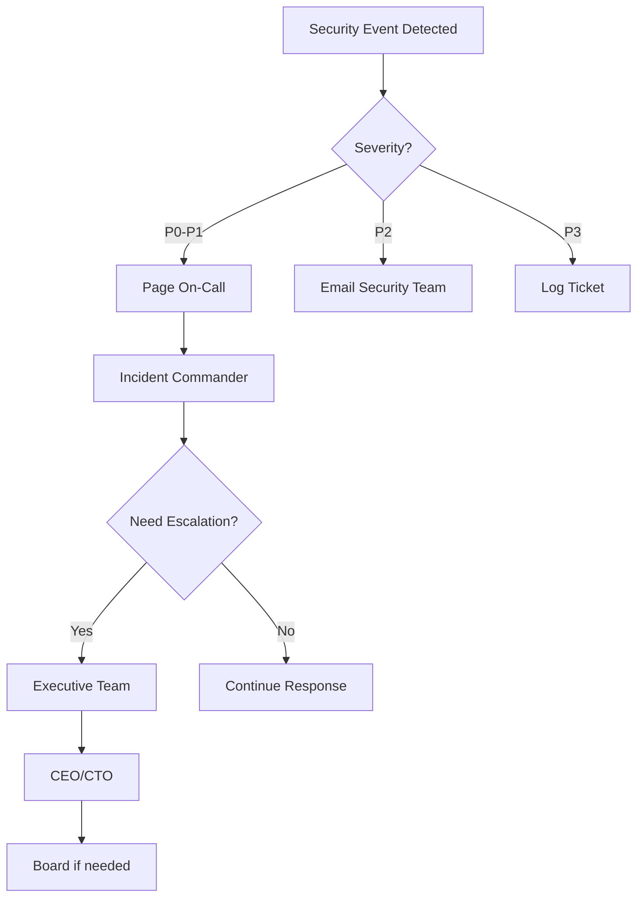

# Lucky Gas V3 Incident Response Plan

## Overview

This document outlines the incident response procedures for Lucky Gas V3. It provides step-by-step guidance for detecting, responding to, and recovering from security incidents.

## 🚨 Incident Classification

### Severity Levels

| Level | Name | Description | Response Time | Examples |
|-------|------|-------------|---------------|----------|
| **P0** | Critical | Business-critical systems compromised or data breach | 15 minutes | Ransomware, customer data breach, complete system outage |
| **P1** | High | Significant security incident with high impact | 1 hour | Authentication bypass, SQL injection exploit, DDoS attack |
| **P2** | Medium | Security incident with moderate impact | 4 hours | Suspicious activity, failed intrusion attempt, policy violation |
| **P3** | Low | Minor security event with minimal impact | 24 hours | Single failed login attempt, low-severity vulnerability |

### Incident Types

1. **Data Breach** - Unauthorized access to sensitive data
2. **System Compromise** - Malware infection or unauthorized system access
3. **Denial of Service** - Service availability attacks
4. **Insider Threat** - Malicious or negligent employee actions
5. **Third-Party Breach** - Vendor or partner security incident
6. **Physical Security** - Unauthorized physical access

## 📞 Incident Response Team

### Core Team Structure

```
┌─────────────────────────────────────────┐
│      Incident Commander (IC)            │
│   - Overall incident coordination       │
│   - Decision making authority           │
│   - External communications             │
└─────────────────────────────────────────┘
                    │
    ┌───────────────┼───────────────┐
    │               │               │
┌─────────┐   ┌─────────┐   ┌─────────┐
│Technical│   │Business │   │External │
│  Lead   │   │  Lead   │   │Relations│
└─────────┘   └─────────┘   └─────────┘
    │               │               │
┌─────────┐   ┌─────────┐   ┌─────────┐
│Security │   │Operations│  │Legal &  │
│Engineers│   │  Team    │  │Compliance│
└─────────┘   └─────────┘   └─────────┘
```

### Contact Information

| Role | Primary Contact | Backup Contact | Phone | Email |
|------|----------------|----------------|-------|-------|
| Incident Commander | [Name] | [Name] | +886-2-XXXX-XXXX | ic@luckygas.com.tw |
| Technical Lead | [Name] | [Name] | +886-2-XXXX-XXXX | tech-lead@luckygas.com.tw |
| Business Lead | [Name] | [Name] | +886-2-XXXX-XXXX | biz-lead@luckygas.com.tw |
| Security Team | - | - | +886-2-XXXX-XXXX | security@luckygas.com.tw |
| Legal Counsel | [Name] | [Name] | +886-2-XXXX-XXXX | legal@luckygas.com.tw |

### Escalation Matrix



## 🔍 Detection & Analysis Phase

### Detection Sources

1. **Automated Alerts**
   - SIEM alerts (Cloud Security Command Center)
   - IDS/IPS notifications
   - Application error logs
   - Performance anomalies
   - Failed authentication spikes

2. **Manual Reports**
   - User complaints
   - Partner notifications
   - Security researcher reports
   - Internal audit findings
   - Threat intelligence feeds

### Initial Analysis Checklist

```markdown
## Incident Initial Assessment

**Incident ID**: INC-[YYYY-MM-DD]-[NUMBER]
**Detected Time**: [Timestamp]
**Reported By**: [Source]

### Initial Questions
- [ ] What type of incident is suspected?
- [ ] What systems/data are affected?
- [ ] Is the incident ongoing?
- [ ] What is the business impact?
- [ ] Are customers affected?
- [ ] Is there evidence of data exfiltration?

### Evidence Collection
- [ ] Preserve system logs
- [ ] Capture network traffic
- [ ] Document timeline
- [ ] Screenshot errors/alerts
- [ ] Identify affected users
- [ ] Note unusual activities

### Initial Classification
- **Severity**: P0 | P1 | P2 | P3
- **Type**: [Incident Type]
- **Scope**: [Affected Systems]
- **Impact**: [Business Impact]
```

### Analysis Tools

```bash
# Network Analysis
tcpdump -i eth0 -w incident.pcap
netstat -an | grep ESTABLISHED
ss -tuln

# Process Analysis
ps aux | grep suspicious
lsof -i
top -b -n 1

# Log Analysis
grep -i "error\|fail\|denied" /var/log/app/*.log
tail -f /var/log/security.log
journalctl -u luckygas-api --since "1 hour ago"

# File System Analysis
find / -mtime -1 -type f 2>/dev/null
ls -la /tmp /var/tmp
md5sum /usr/bin/* > baseline.md5
```

## 🛡️ Containment, Eradication & Recovery

### Containment Strategies

#### Immediate Containment (P0-P1)
```bash
# 1. Isolate affected systems
gcloud compute instances stop compromised-instance-1

# 2. Block malicious IPs
gcloud compute firewall-rules create block-attacker \
  --action DENY \
  --source-ranges "203.0.113.0/24" \
  --priority 1000

# 3. Disable compromised accounts
UPDATE users SET status = 'suspended' WHERE id IN (compromised_list);

# 4. Revoke API keys
python scripts/emergency_security_response.py --revoke-key KEY --reason "Incident"

# 5. Enable emergency mode
kubectl apply -f k8s/emergency-mode.yaml
```

#### Short-term Containment (P2-P3)
- Monitor affected systems closely
- Increase logging verbosity
- Implement temporary access restrictions
- Deploy additional monitoring

### Eradication Procedures

1. **Remove Malicious Artifacts**
   ```bash
   # Remove malware
   rm -rf /path/to/malicious/files
   
   # Clear persistence mechanisms
   crontab -r -u compromised_user
   rm -f /etc/systemd/system/malicious.service
   
   # Reset compromised passwords
   python scripts/force_password_reset.py --user-list affected_users.txt
   ```

2. **Patch Vulnerabilities**
   ```bash
   # Apply security patches
   apt-get update && apt-get upgrade -y
   
   # Update vulnerable packages
   npm audit fix --force
   pip install --upgrade vulnerable-package
   
   # Deploy fixed code
   git checkout hotfix/security-patch
   kubectl rollout restart deployment/api
   ```

3. **Strengthen Security Controls**
   - Update firewall rules
   - Enhance monitoring rules
   - Implement additional validation
   - Review and update access controls

### Recovery Procedures

#### System Recovery Checklist
- [ ] Restore from clean backups
- [ ] Rebuild compromised systems
- [ ] Reset all credentials
- [ ] Verify system integrity
- [ ] Test functionality
- [ ] Monitor for recurrence

#### Data Recovery Process
```bash
# 1. Identify last known good backup
gsutil ls gs://luckygas-backups/

# 2. Restore database
gcloud sql backups restore BACKUP_ID --instance=production-db

# 3. Verify data integrity
python scripts/verify_data_integrity.py

# 4. Sync any missing transactions
python scripts/replay_transactions.py --from "2024-01-20 10:00:00"
```

## 📊 Communication Plan

### Internal Communications

#### Communication Templates

**Initial Notification**
```
Subject: [P0/P1/P2/P3] Security Incident Detected - [Brief Description]

Team,

We have detected a security incident affecting [systems/services].

Incident ID: INC-[ID]
Severity: [P0/P1/P2/P3]
Status: Under Investigation
Impact: [Current impact assessment]

The incident response team has been activated and is investigating.

Updates will be provided every [15/30/60] minutes.

If you have relevant information, please contact the incident commander immediately.
```

**Status Update**
```
Subject: [Incident ID] Status Update #[Number]

Current Status: [Investigating/Contained/Recovering/Resolved]
Time Since Detection: [Duration]

Progress:
- [Completed action 1]
- [Completed action 2]
- [In progress action]

Next Steps:
- [Planned action 1]
- [Planned action 2]

Estimated Resolution: [Time estimate]
```

### External Communications

#### Customer Notification (if required)

**Initial Notice**
```
親愛的 Lucky Gas 客戶：

我們發現一個可能影響您帳戶安全的技術問題。

影響範圍：[受影響的服務]
時間：[事件時間]
您需要採取的行動：[具體步驟]

我們正在積極處理此問題，並會持續更新進度。

如有疑問，請聯繫：support@luckygas.com.tw

Lucky Gas 團隊
```

#### Regulatory Notification

**Taiwan Personal Data Protection Act Compliance**
- Notify within 72 hours of awareness
- Include nature of breach
- Describe affected data categories
- Estimate number of affected individuals
- Outline mitigation measures

## 🔧 Incident Response Runbooks

### Runbook: DDoS Attack Response

```yaml
incident_type: DDoS Attack
severity: P1
auto_response: enabled

steps:
  - step: 1
    action: "Enable DDoS protection"
    command: |
      gcloud compute security-policies rules create 1000 \
        --security-policy dos-protection \
        --expression "rate_limit(1000, 60)" \
        --action "deny-403"
    
  - step: 2
    action: "Scale infrastructure"
    command: |
      kubectl scale deployment frontend --replicas=10
      gcloud compute instance-groups managed resize ig-api --size=20
    
  - step: 3
    action: "Enable CloudFlare Under Attack Mode"
    manual: true
    instructions: "Log into CloudFlare and enable Under Attack mode"
    
  - step: 4
    action: "Monitor and collect evidence"
    command: |
      tcpdump -i any -w ddos-attack-$(date +%Y%m%d-%H%M%S).pcap
      python scripts/analyze_traffic_patterns.py
```

### Runbook: Data Breach Response

```yaml
incident_type: Data Breach
severity: P0
auto_response: disabled

steps:
  - step: 1
    action: "Immediate containment"
    tasks:
      - "Identify compromised systems"
      - "Isolate affected databases"
      - "Revoke all access tokens"
      - "Enable emergency mode"
    
  - step: 2
    action: "Assess scope"
    checklist:
      - "What data was accessed?"
      - "How many records affected?"
      - "Was data exfiltrated?"
      - "Timeline of breach?"
    
  - step: 3
    action: "Legal and compliance"
    tasks:
      - "Notify legal counsel"
      - "Prepare regulatory notifications"
      - "Document for compliance"
      - "Engage forensics team"
    
  - step: 4
    action: "Customer protection"
    tasks:
      - "Force password resets"
      - "Monitor for fraud"
      - "Prepare notifications"
      - "Set up hotline"
```

### Runbook: Ransomware Response

```yaml
incident_type: Ransomware
severity: P0
auto_response: partial

steps:
  - step: 1
    action: "Isolate infected systems"
    priority: immediate
    command: |
      # Disconnect from network
      gcloud compute instances stop $(gcloud compute instances list --filter="tags:production" --format="value(name)")
      
      # Disable VPN access
      gcloud compute vpn-gateways delete production-vpn --region=asia-east1
    
  - step: 2
    action: "Assess damage"
    checklist:
      - "Identify encrypted systems"
      - "Check backup integrity"
      - "Determine infection vector"
      - "Preserve evidence"
    
  - step: 3
    action: "Recovery decision"
    decision_tree:
      - if: "Backups available and clean"
        then: "Restore from backups"
      - elif: "Decryptor available"
        then: "Test in isolated environment"
      - else: "Engage incident response firm"
    
  - step: 4
    action: "Restore operations"
    tasks:
      - "Rebuild from clean images"
      - "Restore data from backups"
      - "Reset all credentials"
      - "Implement additional controls"
```

## 📈 Post-Incident Activities

### Lessons Learned Meeting

**Meeting Agenda Template**
```markdown
# Incident Post-Mortem: [Incident ID]

Date: [Date]
Attendees: [List]

## 1. Incident Summary
- What happened?
- When did it happen?
- How was it detected?
- What was the impact?

## 2. Timeline Review
[Detailed timeline of events]

## 3. What Went Well
- [Positive aspect 1]
- [Positive aspect 2]

## 4. What Went Wrong
- [Issue 1]
- [Issue 2]

## 5. Action Items
| Action | Owner | Due Date | Priority |
|--------|-------|----------|----------|
| [Action 1] | [Name] | [Date] | [High/Medium/Low] |

## 6. Process Improvements
- [Improvement 1]
- [Improvement 2]
```

### Incident Report Template

```markdown
# Security Incident Report

**Report ID**: RPT-[YYYY-MM-DD]-[NUMBER]
**Incident ID**: INC-[YYYY-MM-DD]-[NUMBER]
**Classification**: Confidential

## Executive Summary
[1-2 paragraph summary for executives]

## Incident Details
- **Date/Time**: [Detection through resolution]
- **Severity**: [P0/P1/P2/P3]
- **Type**: [Incident type]
- **Systems Affected**: [List]
- **Data Affected**: [Categories and volume]
- **Business Impact**: [Quantified impact]

## Root Cause Analysis
[Detailed technical analysis]

## Response Actions
1. [Action taken with timestamp]
2. [Action taken with timestamp]

## Remediation Measures
- Immediate: [List]
- Short-term: [List]
- Long-term: [List]

## Recommendations
1. [Strategic recommendation]
2. [Tactical recommendation]

## Appendices
- A. Technical Details
- B. Evidence Files
- C. Communication Logs
```

### Metrics and KPIs

**Incident Response Metrics**
- Mean Time to Detect (MTTD)
- Mean Time to Respond (MTTR)
- Mean Time to Contain (MTTC)
- Mean Time to Recover (MTTR)
- Number of incidents by severity
- Incidents by type
- False positive rate
- Automation effectiveness

**Monthly Dashboard**
```
┌─────────────────────────────────────────┐
│        Incident Response Metrics         │
├─────────────────────────────────────────┤
│ MTTD: 15 minutes      ↓ 25% vs last mo │
│ MTTR: 2.5 hours       ↓ 15% vs last mo │
│ P0 Incidents: 0       → Same           │
│ P1 Incidents: 2       ↑ 1 vs last mo   │
│ P2 Incidents: 8       ↓ 3 vs last mo   │
│ P3 Incidents: 45      ↑ 5 vs last mo   │
│ False Positives: 12%  ↓ 3% vs last mo  │
└─────────────────────────────────────────┘
```

## 🛠️ Tools and Resources

### Incident Response Toolkit

**Essential Tools**
```bash
# Network Analysis
- tcpdump / Wireshark
- nmap
- netstat / ss

# System Analysis
- ps / top / htop
- lsof
- strace / ltrace

# Log Analysis
- grep / awk / sed
- Elasticsearch queries
- Cloud Logging Explorer

# Forensics
- Volatility (memory analysis)
- Sleuth Kit (disk forensics)
- YARA (malware detection)

# Communication
- Slack incident channel
- PagerDuty
- Status page
```

### Quick Commands Reference

```bash
# Block IP immediately
iptables -A INPUT -s ATTACKER_IP -j DROP

# Find recently modified files
find / -type f -mtime -1 -ls 2>/dev/null

# Check for unauthorized SSH keys
find /home -name authorized_keys -exec cat {} \;

# Dump process memory
gcore -o /tmp/suspicious_process PID

# Check network connections
netstat -tulpn | grep ESTABLISHED

# Review user logins
last -f /var/log/wtmp
lastb -f /var/log/btmp

# Check running processes
ps auxww | grep -v "^\[" | awk '{print $1}' | sort | uniq -c | sort -rn

# Find files with SUID bit
find / -perm -4000 -type f 2>/dev/null
```

## 📚 Training and Preparedness

### Training Schedule

| Training Type | Frequency | Participants | Duration |
|--------------|-----------|--------------|----------|
| Tabletop Exercise | Quarterly | IR Team | 2 hours |
| Technical Drill | Monthly | Security Team | 1 hour |
| Executive Briefing | Semi-annually | Leadership | 30 minutes |
| All-hands Training | Annually | All Staff | 1 hour |

### Preparedness Checklist

- [ ] Contact list updated monthly
- [ ] Runbooks tested quarterly
- [ ] Tools and access verified weekly
- [ ] Backup restoration tested monthly
- [ ] Communication templates current
- [ ] Legal counsel on retainer
- [ ] Forensics firm identified
- [ ] Insurance policy reviewed

---

**Document Version**: 1.0  
**Last Updated**: 2024-01-30  
**Next Review**: 2024-02-28  
**Owner**: Security Operations Team  
**Classification**: Confidential

**Emergency Hotline**: +886-2-XXXX-XXXX (24/7)