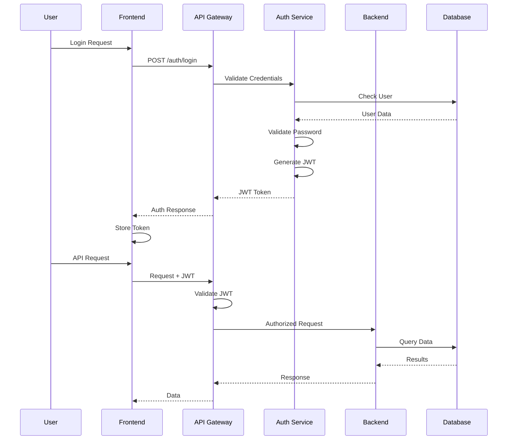
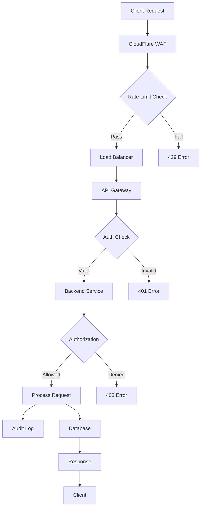
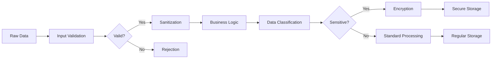

# Lucky Gas V3 Security Architecture Overview

## Executive Summary

The Lucky Gas V3 security architecture implements defense-in-depth principles with multiple layers of security controls. This document provides a comprehensive overview of the security architecture, components, and data flows.

## 🏗️ Security Architecture Principles

### Core Security Principles
1. **Zero Trust Architecture** - Never trust, always verify
2. **Defense in Depth** - Multiple layers of security controls
3. **Least Privilege** - Minimal access rights for all entities
4. **Secure by Default** - Security enabled out of the box
5. **Fail Secure** - System fails to a secure state

### Design Patterns
- **Security Gateway Pattern** - Centralized security enforcement
- **Bulkhead Pattern** - Isolation of critical components
- **Circuit Breaker Pattern** - Prevent cascading failures
- **Proxy Pattern** - Hide internal implementation details

## 🔐 Security Layers

### Layer 1: Network Security

```
Internet
    │
    ├── CloudFlare (DDoS Protection, WAF)
    │
    ├── Google Cloud Armor
    │
    ├── Load Balancer (SSL/TLS Termination)
    │
    ├── VPC Network
    │   ├── Public Subnet (DMZ)
    │   │   ├── API Gateway
    │   │   └── Web Application
    │   │
    │   └── Private Subnet
    │       ├── Application Servers
    │       ├── Database Cluster
    │       └── Internal Services
    │
    └── Egress Firewall
```

**Security Controls**:
- DDoS protection at edge
- Web Application Firewall (WAF)
- Network segmentation with VPC
- Private subnets for sensitive resources
- Egress filtering and monitoring

### Layer 2: Application Security

```
┌─────────────────────────────────────────┐
│          Frontend (React)               │
├─────────────────────────────────────────┤
│   - CSP Headers                         │
│   - XSS Protection                      │
│   - HTTPS Only                          │
│   - Secure Cookie Handling              │
│   - Input Sanitization                  │
└─────────────────────────────────────────┘
                    │
                    ├── HTTPS/WSS
                    │
┌─────────────────────────────────────────┐
│         API Gateway (Kong/Nginx)        │
├─────────────────────────────────────────┤
│   - Rate Limiting                       │
│   - API Key Validation                  │
│   - JWT Verification                    │
│   - Request Validation                  │
│   - CORS Policy                         │
└─────────────────────────────────────────┘
                    │
                    ├── Internal Network
                    │
┌─────────────────────────────────────────┐
│        Backend (FastAPI)                │
├─────────────────────────────────────────┤
│   - Authentication & Authorization      │
│   - Input Validation                    │
│   - SQL Injection Prevention            │
│   - Business Logic Security             │
│   - Audit Logging                       │
└─────────────────────────────────────────┘
```

**Security Controls**:
- Multi-layer authentication
- Comprehensive input validation
- Output encoding
- Security headers
- API security gateway

### Layer 3: Data Security

```
┌─────────────────────────────────────────┐
│           Data Classification           │
├─────────────────────────────────────────┤
│   Public    │ Product catalog           │
│   Internal  │ Order details             │
│   Sensitive │ Customer PII              │
│   Critical  │ Payment information       │
└─────────────────────────────────────────┘
                    │
                    ▼
┌─────────────────────────────────────────┐
│         Encryption Strategy             │
├─────────────────────────────────────────┤
│   Transit   │ TLS 1.3                   │
│   At Rest   │ AES-256-GCM               │
│   Field     │ Format Preserving Enc.    │
│   Backups   │ Customer Managed Keys     │
└─────────────────────────────────────────┘
```

**Security Controls**:
- Data classification and handling
- Encryption at rest and in transit
- Field-level encryption for PII
- Key management with rotation
- Secure backup procedures

## 🛡️ Security Components

### Authentication & Authorization



**Components**:
- **JWT Tokens**: Short-lived access tokens (15 min)
- **Refresh Tokens**: Longer-lived tokens (7 days)
- **2FA Support**: TOTP-based two-factor authentication
- **Session Management**: Redis-based session tracking
- **RBAC**: Role-based access control

### API Security Gateway

```
┌─────────────────────────────────────────┐
│          API Gateway Functions          │
├─────────────────────────────────────────┤
│   1. Authentication                     │
│      - JWT validation                   │
│      - API key verification             │
│      - OAuth2 support                   │
│                                         │
│   2. Authorization                      │
│      - Role-based access               │
│      - Resource-level permissions      │
│      - Scope validation                │
│                                         │
│   3. Rate Limiting                      │
│      - Per-user limits                  │
│      - Per-IP limits                    │
│      - Endpoint-specific limits        │
│                                         │
│   4. Request Validation                 │
│      - Schema validation                │
│      - Input sanitization               │
│      - Size limits                      │
│                                         │
│   5. Security Headers                   │
│      - CORS policy                      │
│      - CSP headers                      │
│      - HSTS enforcement                 │
└─────────────────────────────────────────┘
```

### Secrets Management

```
┌─────────────────────────────────────────┐
│     Google Secret Manager               │
├─────────────────────────────────────────┤
│   - API Keys                            │
│   - Database Credentials                │
│   - Encryption Keys                     │
│   - Third-party Secrets                 │
└─────────────────────────────────────────┘
                    │
                    ├── Secured Access
                    │
┌─────────────────────────────────────────┐
│      Application Integration            │
├─────────────────────────────────────────┤
│   - Workload Identity                   │
│   - Automatic Rotation                  │
│   - Audit Logging                       │
│   - Version Control                     │
└─────────────────────────────────────────┘
```

**Features**:
- Centralized secret storage
- Automatic rotation policies
- Access control and audit
- Integration with GCP services

## 📊 Security Monitoring Architecture

### Monitoring Stack

```
┌─────────────────────────────────────────┐
│         Security Events                 │
├─────────────────────────────────────────┤
│   - Authentication Events               │
│   - Authorization Failures              │
│   - API Abuse Attempts                  │
│   - Data Access Logs                   │
│   - Configuration Changes               │
└─────────────────────────────────────────┘
                    │
                    ▼
┌─────────────────────────────────────────┐
│      Log Collection (Fluentd)           │
└─────────────────────────────────────────┘
                    │
                    ▼
┌─────────────────────────────────────────┐
│     Log Processing & Storage            │
├─────────────────────────────────────────┤
│   - Google Cloud Logging                │
│   - BigQuery (Long-term)                │
│   - Elasticsearch (Search)              │
└─────────────────────────────────────────┘
                    │
                    ▼
┌─────────────────────────────────────────┐
│        Analysis & Alerting              │
├─────────────────────────────────────────┤
│   - Cloud Security Command Center       │
│   - Custom Detection Rules              │
│   - ML-based Anomaly Detection         │
│   - Real-time Alerts                    │
└─────────────────────────────────────────┘
```

### Security Metrics

**Real-time Metrics**:
- Failed authentication attempts
- API rate limit violations
- Suspicious access patterns
- Security rule violations

**Aggregate Metrics**:
- Security incident trends
- Vulnerability statistics
- Patch compliance rates
- Security training completion

## 🔄 Security Data Flows

### Secure API Request Flow



### Secure Data Processing Flow



## 🚨 Incident Response Architecture

### Incident Response Flow

```
┌─────────────────────────────────────────┐
│         Detection Sources               │
├─────────────────────────────────────────┤
│   - SIEM Alerts                         │
│   - User Reports                        │
│   - Automated Monitoring                │
│   - Threat Intelligence                 │
└─────────────────────────────────────────┘
                    │
                    ▼
┌─────────────────────────────────────────┐
│      Incident Classification            │
├─────────────────────────────────────────┤
│   P0: Critical - System Compromise      │
│   P1: High - Data Breach Risk          │
│   P2: Medium - Security Control Failure │
│   P3: Low - Policy Violation            │
└─────────────────────────────────────────┘
                    │
                    ▼
┌─────────────────────────────────────────┐
│       Response Orchestration            │
├─────────────────────────────────────────┤
│   - Automated Containment               │
│   - Team Notification                   │
│   - Evidence Collection                 │
│   - Remediation Execution               │
└─────────────────────────────────────────┘
```

### Automated Response Capabilities

**Immediate Actions**:
- IP blocking for attack sources
- Account lockout for compromised users
- API key revocation
- Service isolation

**Investigation Tools**:
- Log aggregation and search
- Network packet capture
- Memory forensics
- Timeline reconstruction

## 🔒 Compliance & Governance

### Compliance Framework

```
┌─────────────────────────────────────────┐
│       Regulatory Compliance             │
├─────────────────────────────────────────┤
│   Taiwan Personal Data Protection Act   │
│   - Consent Management                  │
│   - Data Subject Rights                 │
│   - Breach Notification                 │
│                                         │
│   Industry Standards                    │
│   - OWASP Top 10                        │
│   - CIS Controls                        │
│   - ISO 27001/27002                    │
│                                         │
│   Payment Standards (if applicable)     │
│   - PCI DSS                             │
└─────────────────────────────────────────┘
```

### Security Governance

**Policies**:
- Information Security Policy
- Access Control Policy
- Incident Response Policy
- Data Classification Policy
- Acceptable Use Policy

**Procedures**:
- Security Assessment Procedures
- Change Management
- Vulnerability Management
- Security Training Program

## 📈 Security Maturity Model

### Current State Assessment

| Domain | Level 1 | Level 2 | Level 3 | Level 4 | Level 5 |
|--------|---------|---------|---------|---------|---------|
| **Access Control** | Basic | Managed | **Defined** ✓ | Quantified | Optimizing |
| **Data Protection** | Basic | Managed | **Defined** ✓ | Quantified | Optimizing |
| **Monitoring** | Basic | **Managed** ✓ | Defined | Quantified | Optimizing |
| **Incident Response** | Basic | **Managed** ✓ | Defined | Quantified | Optimizing |
| **Vulnerability Mgmt** | Basic | Managed | **Defined** ✓ | Quantified | Optimizing |

### Improvement Roadmap

**Q1 2024**:
- Implement advanced threat detection
- Deploy security orchestration
- Enhance monitoring capabilities

**Q2 2024**:
- Zero-trust architecture expansion
- Advanced encryption deployment
- Security automation enhancement

**Q3 2024**:
- ML-based security analytics
- Continuous compliance monitoring
- Advanced incident response

## 🛠️ Security Tools & Technologies

### Security Stack

| Category | Tool/Technology | Purpose |
|----------|----------------|----------|
| **WAF** | CloudFlare, Cloud Armor | Web application protection |
| **SIEM** | Cloud Security Command Center | Security monitoring |
| **Secrets** | Google Secret Manager | Credential management |
| **Scanning** | Cloud Security Scanner | Vulnerability detection |
| **Authentication** | Custom JWT + 2FA | User authentication |
| **Encryption** | Google KMS | Key management |
| **Monitoring** | Prometheus + Grafana | Performance monitoring |
| **Logging** | Cloud Logging + BigQuery | Log management |

## 📋 Security Checklist for Developers

### Pre-Development
- [ ] Review security requirements
- [ ] Threat modeling session
- [ ] Security design review
- [ ] Select secure libraries

### During Development
- [ ] Follow secure coding standards
- [ ] Implement input validation
- [ ] Use parameterized queries
- [ ] Apply output encoding
- [ ] Implement proper error handling

### Pre-Deployment
- [ ] Security code review
- [ ] Run SAST tools
- [ ] Vulnerability scanning
- [ ] Penetration testing
- [ ] Security configuration review

### Post-Deployment
- [ ] Enable monitoring
- [ ] Configure alerts
- [ ] Document security features
- [ ] Schedule security updates

---

**Document Version**: 1.0  
**Last Updated**: 2024-01-30  
**Next Review**: 2024-04-30  
**Owner**: Security Architecture Team  
**Classification**: Confidential